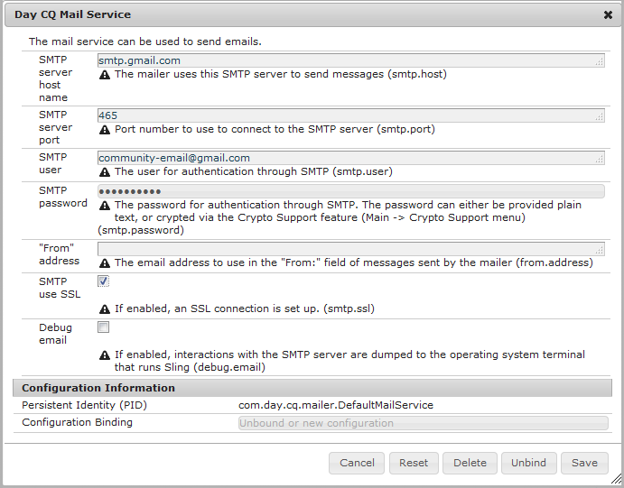
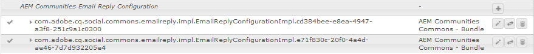
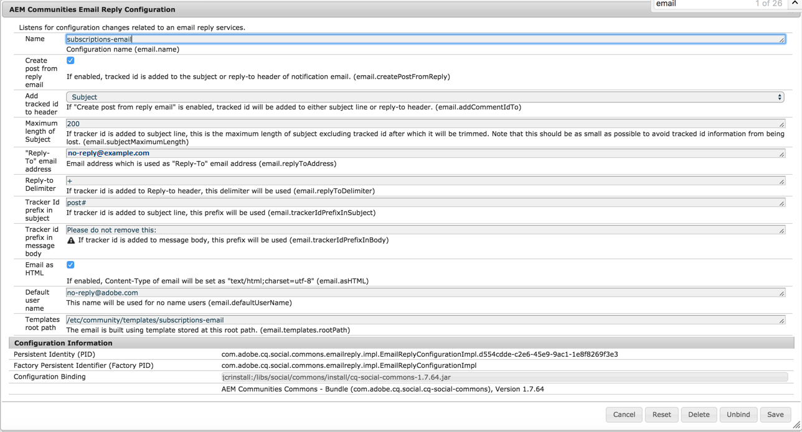

# Configuring Email {#configuring-email}

AEM Communities uses email for:

* [Communities Notifications](notifications.md)
* [Communities Subscriptions](subscriptions.md)

By default, the email feature is not functional as it requires specification of an SMTP server and SMTP user.

>[!CAUTION]
>
>Email for notifications and subscriptions must be configured only on the [primary publisher](deploy-communities.md#primary-publisher).

## Default Mail Service Configuration {#default-mail-service-configuration}

The default mail service is required for both notifications and subscriptions.

* Log in to the primary publisher with administrator privilege and access the [Web Console](../../help/sites-deploying/configuring-osgi.md):

  * For example, [http://localhost:4503/system/console/configMgr](http://localhost:4503/system/console/configMgr)

* Locate the `Day CQ Mail Service`.
* Select the edit icon.

This is based on the documentation for [Configuring Email Notification](../../help/sites-administering/notification.md), but with a difference in that the field `"From" address` is *not* required and should be left empty.

For example (filled in with values for illustrative purposes only):

* **[!UICONTROL SMTP server host name]** 

  *(Required)* The SMTP server to use.

* **[!UICONTROL SMTP server port]** 

  *(Required)* The SMTP server port must be 25 or higher.

* **[!UICONTROL SMTP user]**

  *(Required)* The SMTP user.

* **[!UICONTROL SMTP password]**

  *(Required)* The SMTP user's password.

* **[!UICONTROL "From" address]** 

  Leave empty
* **[!UICONTROL SMTP use SSL]** 

  If checked, will send secure email. Ensure the port is set to 465 or as required for SMTP server.
* **[!UICONTROL Debug email]** 

  If checked, enables logging of SMTP server interactions.

## AEM Communities Email Configuration {#aem-communities-email-configuration}

Once the [default mail service](#default-mail-service-configuration) is configured, the two existing instances of the `AEM Communities Email Reply Configuration` OSGi config, included in the release, become functional.

Only the instance for subscriptions needs to be further configured when allowing reply by email.

1. [Email](#configuration-for-notifications) instance:

   For notifications, which does not support reply email, and should not be altered.

1. [Subscriptions-email](#configuration-for-subscriptions) instance:

   Requires configuration to fully enable creating post from reply email.

To reach the Communities email configuration instances:

* Log in to the primary publisher with administrator privilege and access the [Web Console](../../help/sites-deploying/configuring-osgi.md)

  * For example, [http://localhost:4503/system/console/configMgr](http://localhost:4503/system/console/configMgr)

* Locate `AEM Communities Email Reply Configuration`.

### Configuration for Notifications {#configuration-for-notifications}

The instance of `AEM Communities Email Reply Configuration` OSGi config with the Name email is forthenotifications feature. This feature does not include email reply.

This configuration should not be altered.

* Locate the `AEM Communities Email Reply Configuration`.
* Select the edit icon.
* Verify the **Name** is `email`.

* Verify **Create post from reply email** is `unchecked`.

### Configuration for Subscriptions {#configuration-for-subscriptions}

For Communities subscriptions, it is possible to enable or disable the ability for a member to post content by replying to an email.

* Locate the `AEM Communities Email Reply Configuration`.
* Select the edit icon.
* Verify the **Name** is `subscriptions-email`.

  

* **[!UICONTROL Name]** 

  *(Required)* `subscriptions-email`. Do Not Edit.

* **[!UICONTROL Create post from reply email]**

  If checked, recipient of subscription email may post content by sending a reply. Default is checked.
* **[!UICONTROL Add tracked id to header]** 

  Default is `Reply-To`.

* **[!UICONTROL Maximum length of Subject]**

  If tracker id is added to subject line, this is the maximum length of subject, excluding tracked id, after which it will be trimmed. Note that this should be as small as possible to avoid tracked id information from being lost. Default is 200.

* **[!UICONTROL "Reply-To" email address]**

  Address which is used as "Reply-To" email address. Default is `no-reply@example.com`.

* **[!UICONTROL Reply-to-Delimiter]**

  If tracker id is added to Reply-to header, this delimiter will be used. Default is `+` (plus sign).

* **[!UICONTROL Tracker Id prefix in subject]**

  If tracker id is added to subject line, this prefix will be used. Default is `post#`.

* **[!UICONTROL Tracker id prefix in message body]**

  If tracker id is added to message body, this prefix will be used. Default is `Please do not remove this:`.

* **[!UICONTROL Email as HTML]**: If checked, Content-Type of email will be set as `"text/html;charset=utf-8"`. Default is checked.

* **[!UICONTROL Default user name]**

  This name will be used for no name users. Default is `no-reply@example.com`.

* **[!UICONTROL Templates root path]**

  The email is built using template stored at this root path. Default is `/etc/community/templates/subscriptions-email`.

## Configure Polling Importer {#configure-polling-importer}

In order for the email to be brought into the repository, it is necessary to configure a polling importer and configure its properties in the repository manually.

### Add New Polling Importer {#add-new-polling-importer}

* Log in to the primary publisher with administrator privilege and browse to the polling importer console:
  
  For example, [http://localhost:4503/etc/importers/polling.html](http://localhost:4503/etc/importers/polling.html)

* Select **[!UICONTROL Add]**

  

* **[!UICONTROL Type]**

  *(Required)* Pull down to select `POP3 (over SSL)`.

* **[!UICONTROL URL]**

  *(Required)* The outbound mail server. For example, `pop.gmail.com:995/INBOX?username=community-emailgmail.com&password=****`.

* **[!UICONTROL Import to Path]**&ast;

  *(Required)* Set to `/content/usergenerated/mailFolder/postEmails`
  by browsing to the `postEmails`folder and select **OK**.

* **[!UICONTROL Update Interval in Seconds]**

  *(Optional)* The mail server configured for the default mail service may have requirements regarding the update interval value. For example, Gmail may require an interval of `300`.

* **[!UICONTROL Login]**

  *(Optional)*

* **[!UICONTROL Password]** 

  *(Optional)*

* Select **[!UICONTROL OK]**.

### Adjust Protocol for New Polling Importer {#adjust-protocol-for-new-polling-importer}

Once the new polling configuration is saved, it is necessary to further modify properties of the subscription email importer in order to change the protocol from `POP3` to `emailreply`.

Using [CRXDE Lite](../../help/sites-developing/developing-with-crxde-lite.md):

* Log in to the primary publisher with administrator privilege and browse to [https://&lt;server&gt;:&lt;port&gt;/crx/de/index.jsp#/etc/importers/polling](http://localhost:4503/crx/de/index.jsp#/etc/importers/polling).
* Select the newly created configuration and modify the following properties:

  * **feedType**: Replace `pop3s` with **`emailreply`**
  * **source**: Replace source's protocol `pop3s://` with **`emailreply://`**

The red triangles indicate the modified properties. Be sure to save the changes:

* Select **[!UICONTROL Save All]**.
