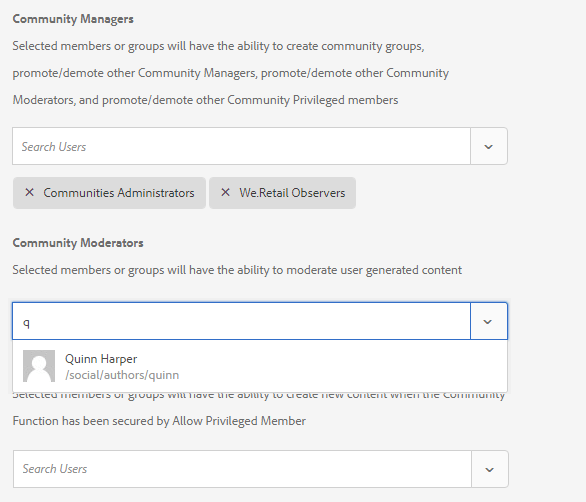
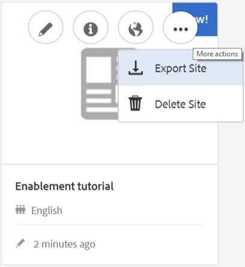

# Author a New Community Site for Enablement {#author-a-new-community-site-for-enablement}

## Create Community Site {#create-community-site}

[Community Site creation](sites-console.md) employs a wizard which guides you through the steps of creating a community site. It is possible to move forward to the `Next`step or `Back`to the previous step before committing the site in the final step.

To get started creating a new community site:

Using the [author instance](http://localhost:4502/)

* Sign in with administrator privileges
* Navigate to **[!UICONTROL Communities > Sites]**

* Select **[!UICONTROL Create]**

### Step 1: Site Template {#step-site-template}

On the **Site Template** step, enter a title, description, the name for the URL, and select a community site template, for example:

* **Community Site Title**: `Enablement Tutorial`

* **Community Site Description**: `A site for enabling the community to learn.`  

* **Community Site Root**: (leave blank for default root `/content/sites`)  

* **Cloud Configurations**: (leave blank if no cloud configurations are specified) provide path to the specified cloud configurations.
* **Community Site Base Language**: (leave untouched for single language: English) use the pull down menu to choose one *or more* base languages from the available languages- German, Italian, French, Japanese, Spanish, Portuguese (Brazil), Chinese (Traditional), and Chinese (Simplified). One community site will be created for each language added, and will exist within the same site folder following the best practice described in [Translating Content for Multilingual Sites](../../help/sites-administering/translation.md). The root page of each site will contain a child page named by the language code of one of the languages selected, such as 'en' for English or 'fr' for French.  

* **[!UICONTROL Community Site Name]**: `enable`

    * the initial URL will be displayed underneath the Community Site Name
    * for a valid URL, append a base language code + ".html"  

      *for example*, http://localhost:4502/content/sites/ `enable/en.html`

* **[!UICONTROL Reference Site Template]**: pull down to choose `Reference Structured Learning Site Template`

Select **[!UICONTROL Next]**

### Step 2: Design {#step-design}

The Design step is presented in two sections for selecing the theme and branding banner:

#### COMMUNITY SITE THEME {#community-site-theme}

Select the desired style to apply to the template. When selected, the theme will be overlayed with a check mark.

#### COMMUNITY SITE BRANDING {#community-site-branding}

(optional) Upload a banner image to display across the site pages. The banner is pinned to the left edge of the browser, between the community site header and menu (navigation links). The banner height is cropped to 120 pixels. There is no resizing of the banner to fit the width of the browser and 120 pixel height.

 

Select **[!UICONTROL Next]**.

### Step 3: Settings {#step-settings}

On the Settings step, before selecting `Next`, notice there are seven sections providing access to configurations involving user management, tagging, roles, moderation, analytics, translation, and enablement.

#### USER MANAGEMENT {#user-management}

It is recommended that [enablement communities](overview.md#enablement-community) be private.

A community site is private when anonymous site visitors are denied access, may not self-register, and may not use social login.

Ensure most checkboxes are unchecked for [User Management](sites-console.md#user-management):

* Do NOT allow site visitors to self-register
* Do NOT allow anonymous site visitors to view the site
* Optional whether or not to allow messaging among community members
* Do NOT allow login with Facebook
* Do NOT allow login with Twitter

#### TAGGING {#tagging}

The tags which may be applied to community content are controlled by selecting AEM namespaces previously defined through the [Tagging Console](../../help/sites-administering/tags.md#tagging-console) (such as the [Tutorial namespace](enablement-setup.md#create-tutorial-tags)).

Further, selecting Tag Namespaces for the community site limits the selection presented when defining catalogs and enablement resources. See [Tagging Enablement Resources](tag-resources.md) for important information.

Finding namespaces is easy using type-ahead search. For example,

* Type 'tut'
* Select `Tutorial`

### ROLES {#roles}

[Community member roles](users.md) are assigned through the settings in the Roles section.

To let a community member (or group of members) experience the site as the community manager, use the type-ahead search and select the member or group name from the options in the drop-down.

For example,

* Type "q"
* Select [Quinn Harper](enablement-setup.md#publishcreateenablementmembers)

>[!NOTE]
>
>[Tunnel service](deploy-communities.md#tunnel-service-on-author) allows selection of members and groups existing only in the publish environment.

#### MODERATION {#moderation}

Accept the default global settings for [moderating](sites-console.md#moderation) user generated content (UGC).

#### ANALYTICS {#analytics}

From the pull-down menu, select the Analytics cloud service framework configured for this community site.

The selection seen in the screenshot, `Communities`, is the framework example from the [configuration documentation.](analytics.md#aem-analytics-framework-configuration)

#### TRANSLATION {#translation}

The [Translation settings](sites-console.md#translation) specify whether or not UGC may be translated and into which language, if so.

* Check **[!UICONTROL Allow Machine Translation]**
* Use the default settings

#### ENABLEMENT {#enablement}

For an enablement community, it is necessary to identify one or more Community Enablement Managers.

* **[!UICONTROL Enablement Managers]** 
  (required) Members of the `Community Enablement Managers` group are available to be selected to manage this community site.

    * Type "s"
    * Select `Sirius Nilson`

* **[!UICONTROL Marketing Cloud Org Id]** 
  (optional) The ID for an Adobe Analytics account which is necessary when including [Video Heartbeat Analytics](analytics.md#video-heartbeat-analytics) in the enablement reporting.

Select **[!UICONTROL Next]**.

### Step 4: Create Community Site {#step-create-community-site}

Select **[!UICONTROL Create]**.

When the process completes, the folder for the new site is displayed in the Communities - Sites console.

### Publish the New Community Site {#publish-the-new-community-site}

The created site should be managed from the Communities - Sites console, the same console from where new sites may be created.

After selecting the community site's folder, hover over the site icon such that four action icons appear:

On selecting the ellipses icon (More Actions icon), Export Site and Delete Site options show up.

From left to right they are:

* **Open Site** 
  Select the pencil icon to open the community site in author edit mode, to add and/or configure page components

* **Edit Site** 
  Select the properties icon to open the community site for modification of properties, such as the title or to change the theme

* **Publish Site** 
  Select the world icon to publish the community site (to localhost:4503 by default)

* **Export Site** 
  Select the export icon to create a package of the community site that is both stored in [package manager](../../help/sites-administering/package-manager.md) and downloaded.  
  
  Note that UGC is not included in the site package.

* **Delete Site** 
  To delete the community site, select the Delete Site icon that appears on hovering the mouse over the site in Communities Site Console. This action removes all the items associated with the site, such as UGC, user groups, assets and database records.

#### Select Publish {#select-publish}

Select the world icon to publish the community site.

There will be an indication the site was published.

## Community Users & User Groups {#community-users-user-groups}

### Notice New Community User Groups {#notice-new-community-user-groups}

Along with the new community site, new user groups are created which have the appropriate permissions set for various administrative functions. For details, visit [User Groups for Community Sites](users.md#usergroupsforcommunitysites).

For this new community site, given the site name "enable" in Step 1, the new user groups that exist in the publish environment may be seen from the [Communities Members & Groups console](members.md#groups-console):

### Assign Members to Community Enable Members Group {#assign-members-to-community-enable-members-group}

On author, with the tunnel service enabled, it is possible to assign the [users created during Initial Setup](enablement-setup.md#publishcreateenablementmembers) to the Community Members group for the newly created community site.

Using the Community Groups console, members can be added individually or added through membership in a group.

In this example, the group `Community Ski Class` is added as a member of the group `Community Enable Members` as well as member `Quinn Harper`.

* Navigate to **[!UICONTROL Communities > Groups]** console
* Select **[!UICONTROL Community Enable Members]** group
* Enter `ski` into the **[!UICONTROL Add Members To Group]** search box
* Select **[!UICONTROL Community Ski Class]** (group of learners)
* Enter `quinn` into the search box
* Select **[!UICONTROL Quinn Harper]** (enablement resource contact)

* Select **[!UICONTROL Save]**

## Configurations on Publish {#configurations-on-publish}

### http://localhost:4503/content/sites/enable/en.html {#http-localhost-content-sites-enable-en-html}

### Configure for Authentication Error {#configure-for-authentication-error}

Once a site has been configured and pushed to publish, [configure login mapping](sites-console.md#configure-for-authentication-error) ( `Adobe Granite Login Selector Authentication Handler`) on the publish instance. The benefit is that when login credientials are not entered correctly, the authentication error will redisplay the community site's login page with an error message.

Add a `Login Page Mapping` as

* /content/sites/enable/en/signin:/content/sites/enable/en

### (Optional) Change the Default Home Page {#optional-change-the-default-home-page}

When working with the publish site for demonstration purposes, it might be useful to change the default home page to the new site.

To do so requires using [CRX|DE](http://localhost:4503/crx/de) Lite to edit the [resource mapping](../../help/sites-deploying/resource-mapping.md) table on publish.

To get started

1. On publish, access CRXDE and sign in with administrator privileges

    * For example, browse to [http://localhost:4503/crx/de](http://localhost:4503/crx/de) and login with `admin/admin`

1. In the project browser, expand `/etc/map`
1. Select the `http` node

    * Select **[!UICONTROL Create Node]**

        * **Name** localhost.4503  

          (Do *not* use `:`)

        * **Type** [sling:Mapping](https://sling.apache.org/documentation/the-sling-engine/mappings-for-resource-resolution.html)

1. With newly created `localhost.4503` node selected

    * Add property

        * **Name** sling:match
        * **Type** String
        * **Value** localhost.4503/\$ 

          (Must end with '$' char)

    * Add property

        * **Name** sling:internalRedirect
        * **Type** String
        * **Value** /content/sites/enable/en.html

1. Select **[!UICONTROL Save All]**
1. (optional) Delete the browsing history
1. Browse to http://localhost:4503/

    * Arrive at http://localhost:4503/content/sites/enable/en.html

>[!NOTE]
>
>To disable, simply prepend the `sling:match` property value with an 'x' - `xlocalhost.4503/$` - and **[!UICONTROL Save All]**.

#### Troubleshooting: Error Saving Map {#troubleshooting-error-saving-map}

If unable to save changes, be sure the node name is `localhost.4503`, with a 'dot' separator, and not `localhost:4503` with a 'colon' separator, as `localhost`is not a valid namespace prefix.

#### Troubleshooting: Fail to Redirect {#troubleshooting-fail-to-redirect}

The '**$**' at the end of the regular expression `sling:match`string is crucial, so that only exactly `http://localhost:4503/` is mapped, else the redirect value is prepended to any path that might exist after the server:port in the URL. Thus, when AEM tries to redirect to the login page, it fails.

## Modifying the Community Site {#modifying-the-community-site}

After the site has been initially created, authors may use the [Open Site icon](sites-console.md#authoring-site-content) to perform standard AEM authoring activities.

In addition, administrators may use the [Edit Site icon](sites-console.md#modifying-site-properties) to modify properties of the site, such as the title.

After any modification, remember to **Save** and re-**Publish** the site.

>[!NOTE]
>
>If not familiar with AEM, view the documentation on [basic handling](../../help/sites-authoring/basic-handling.md) and a [quick guide to authoring pages](../../help/sites-authoring/qg-page-authoring.md).

### Add a Catalog {#add-a-catalog}

The community site template chosen for this community site should contain the catalog feature.

If not, the catalog function can easily be added. This would allow other members of the community, not assigned to enablement resources or a learning path, to select enablement resources from a catalog.

If the site structure does already contain the catalog feature, its Title can be changed.

To modify the site's structure, navigate to the **[!UICONTROL Communities, Sites]** console, open the `enable` folder, and select the **Edit Site** icon to access the properties of `Enablement Tutorial`.

Select the STRUCTURE panel to add a Catalog or modify an existing Catalog:

* **Title**: `Ski Catalog`

* **URL**: `catalog`

* **Select All Namespaces**: leave as default.
* Select **[!UICONTROL Save]**

Use the Position Icon to move the Catalog function to the second position, after Assignments.

Select **[!UICONTROL Save]** in the upper right corner to save the changes to the community site.

Then re-**Publish** the site.