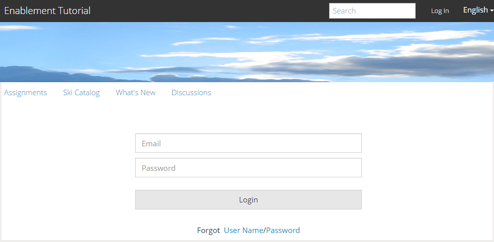

# Experience the Published Site {#experience-the-published-site}

**[⇐ Create and Assign Enablement Resources](resource.md)**

## Browse to New Site on Publish {#browse-to-new-site-on-publish}

Now that the newly created community site and its enablement resources and learning path have been published, it is possible to experience the Enablement Tutorial site.

Begin by browsing to the URL displayed when creating the site, but on the publish server, e.g.

* author URL = [http://localhost:4502/content/sites/enable/en.html](http://localhost:4502/content/sites/enable/en.html)
* publish URL = [http://localhost:4503/content/sites/enable/en.html](http://localhost:4503/content/sites/enable/en.html)

If the [default home page was set](enablement-create-site.md#changethedefaulthomepage), then simply browsing to [http://localhost:4503/](http://localhost:4503/) should launch the site.

When first arriving at the published site, the site visitor would typically not already be signed in and would be anonymous.

**http://localhost:4503/content/sites/enable/en.html** 

 

## Anonymous Site Visitor {#anonymous-site-visitor}

An anonymous site visitor is immediately presented with the login page for this private enablement community site. Note that there is no option to self-register nor login with Facebook or Twitter.

Notice this  home page  shows four menu items: `Assignments, Ski Catalog, What's New` and `Discussions`, but none may be reached without signing in.

>[!NOTE]
>
>It is possible to grant anonymous access to an enablement site without allowing site visitors to self-register.  
>If an enablement resource is set to `show in catalog` and `allow anonymous access`, it will be possible for anonymous site visitors to view resources in the catalog.

### Prevent anonymous access on JCR {#prevent-anonymous-access-on-jcr}

A known limitation exposes the community site content to anonymous visitors through  jcr  content and  json , though **[!UICONTROL allow anonymous access]** is disabled for the site's content. However, this behavior can be controlled using Sling Restrictions as a workaround.

To protect your community site's content from access by anonymous users through  jcr  content and  json , follow these steps:

1. On AEM Author instance, go to https://&lt;host&gt;:&lt;port&gt;/editor.html/content/site/&lt;sitename&gt;.html.

   >[!NOTE]
   >
   >Do not go to the localized site.

1. Go to **[!UICONTROL Page Properties]**.

   

1. Go to **[!UICONTROL Advanced]** tab.
1. Enable **[!UICONTROL Authentication Requirement]**.

   

1. Add the path of the login page. For example, `/content/......./GetStarted`.
1. Publish the page.

## Enrolled Member {#enrolled-member}

This experience relies on users `Riley Taylor` and `Sidney Croft` being [created](enablement-setup.md#publishcreateenablementmembers) and [assigned](resource.md#settings) to the *Ski Lessons* learning path through their membership in the *Community Ski Class* group.

Login with

* `Username: riley`
* `Password: password`

If the user profile was not created through self-registration, the very first time a member signs in, their Profile page is displayed so they may verify and modify it as necessary.

The next time the member signs in, the home page, identified by the first menu item, is displayed.

 

### Assignments {#assignments}

The Assignments page is where the member is shown all of the learning paths and enablement resources assigned specifically to them.

Each assignment provides basic information as to

* The type of Assignment
* Whether it is a new Assignment
* The name
* Details relevant for the type of Assignment
* Assignment contact, expert, and author (if provided)

The type of Assignment is indicated by an icon in the upper left corner of the card. The image of a road is for a learning path with the number of included enablement resources.

Selecting *Ski Lessons* will display the two enablement resources referenced by the learning path.

Selecting *Ski Lesson 1* will open the enablement resource's details page.

From the details page, the member is able to learn, [rate](rating.md) the lesson and add [comments](comments.md). Any member activity will be reflected in the What's New section of the site.

Interactions with the enablement resource will be noted in the Report section accessible in the author environment.

 

### Ski Catalog {#ski-catalog}

The Ski Catalog page is the catalog of enablement resources tagged with tags from the `Tutorial` namespace. The two *Ski Lesson* resources are tagged with the `Skiing` tag, such that if any tags other than `All` or `Tutorial: Sports / Skiing` is selected, nothing is displayed.

When a member has not been assigned enablement resources, either directly or through a learning path, it is possible to interact with enablement resources located within a catalog and provide feedback through comments and ratings.

 

### Discussions {#discussions}

In addition to rating and commenting on enablement resources ([when enabled](enablement-create-site.md#step33asettings)), the community site template from which `Enablement Tutorial` was created includes the [forum function](functions.md#forum-function) (title is `Discussions)`.

Select the `Discussions`link and post a topic.

Log out and Log in as Sidney Croft (sidney / password) and reply to the question, as well as Follow the topic.

Notice, in addition to inline moderation, there are options to share the topic on social media or to email the topic.

 

### What's New {#what-s-new}

The `What's New` menu item is the title given the [activity stream function](functions.md#activity-stream-function) in this community site's structure.

Still signed in as Sidney, select the `What's New` link to show the activity.

 

## Trusted Community Member {#trusted-community-member}

This experience assumes ` [Quinn Harper](enablement-setup.md#publishcreateenablementmembers)` was assigned the roles of [moderator](enablement-create-site.md#moderation) and [resource contact](resource.md#settings).

Login with

* `Username: quinn`
* `Password: password`

Once signed in, notice there is a new menu item, `Administration`, which appears because the member was given the role of moderator. 

The home page is identified by the first menu item, Assignments. Quinn is the moderator and enablement resource contact and was not enrolled in any enablement resources or learning paths, and so there is nothing to display.

### Administration {#administration}

What there is, is activity by the two learners, `Riley Taylor` and `Sidney Croft. By s`electing the `Administration`link to access the Moderation Console, Quinn is able to use the [bulk moderation console](moderation.md) to moderate their posts.

Selecting the side-panel icon toggles open the filters used to search community content.

Hovering over a comment card displays moderation actions.

 

## Reports on Author {#reports-on-author}

There are two ways to access reporting on learners and enablement resources.

On author, navigate to the **Communities, [Resources console](resources.md)**, where the enablement resources are managed, and after selecting a community site, it is possible to generate reports for

* All enablement resources and learning paths
* One specific enablement resource or learning path

Navigate to the **Communities, [Reports console](reports.md)**, and generate reports according to

* Assignments to enablement resources and learning paths
* Posts to a community site over a specific period
* Views (site visits) of a community site over a specific period

* Posts and views may be to all content, or to specific content:

    * Forum
    * Forum Topic
    * QnA
    * QnA Question
    * Blog
    * Blog Article
    * Calendar
    * Calendar Event

### Resources Console {#resources-console}

With a little activity and interaction with the Resources on publish, viewing the reports on author is worth a look.

* On author
* Sign in with administrative privileges
* Navigate from the main menu to **[!UICONTROL Communities > Resources]**
* Select the `Enablement Tutorial` site
* Select the `Report`icon for a summary of all Resources
* Select a Resource and then the `Report`icon for a report on that Resource

Notice that it is likely too soon to show data from Adobe Analytics, which can take from 1 to 12 hours to appear. However, basic SCORM reporting is already available.

#### Ski Lessons Resource Report {#ski-lessons-resource-report}

 

#### Ski Lessons User Report {#ski-lessons-user-report}

* Select **[!UICONTROL Communities > Resources]**

* Open card `Enablement Tutorial`
* Open card `Ski Lessons`
* `select Report, User Report`

 

### Reports Console {#reports-console}

The Reports console allows for generation of reports on

* **Assignments** for any enablement community site
* **Views** for any community site
* **Posts** for any community site

For reports on assignments:

* On author
* Sign in with administrative privileges
* Navigate to **[!UICONTROL Communities > Reports > Assignments Report]**
* Select a **[!UICONTROL Site]** from the pull-down menu (select `Enablement Tutorial`)

* Select **[!UICONTROL Group]** (select `Community Ski Class`)

* Select an **[!UICONTROL Assignment]** (select `Ski Lessons`)

* Select **[!UICONTROL Generate]**

For reports on views:

* On author
* Sign in with administrative privileges
* Navigate to **[!UICONTROL Communities > Reports > Views Report]**
* Select a **[!UICONTROL ]Site** from the pull-down menu (select `Enablement Tutorial`)

* Select **[!UICONTROL Content Type]** (select `all`)

* Select a **[!UICONTROL date range]** (select `Last 7 days`)

* Select **[!UICONTROL Generate]**

**[⇐ Create and Assign Enablement Resources](resource.md)**
