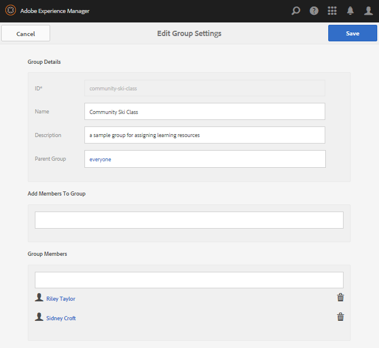

# Initial Setup for Enablement {#initial-setup-for-enablement}

## Start Author and Publish Instances {#start-author-and-publish-instances}

For development and demonstration purposes, it will be necessry to run one author and one publish instance.

Follow the basic AEM [Getting Started](../../help/sites-deploying/deploy.md#getting-started) instructions which will result in

* author environment on [localhost:4502](http://localhost:4502/)
* publish environment on [localhost:4503](http://localhost:4503/)

For AEM Communities,

* The author environment is for

    * Development of sites, templates, components, enablement resources and learning paths
    * Assignment of members and groups of members to enablement resources and learning paths
    * Generating reports on assignments, views, and posts
    * Administrative and configuration tasks

* The publish environment is for

    * Learning/training based on topics managed by the Enablement Manager
    * Commenting and rating enablement resources and learning paths
    * Getting in touch with the resource contacts

>[!NOTE]
>
>If not familiar with AEM, view the documentation on [basic handling](../../help/sites-authoring/basic-handling.md) and a [quick guide to authoring pages](../../help/sites-authoring/qg-page-authoring.md).

## Install Latest Communities Release {#install-latest-communities-release}

This tutorial creates an [enablement community site](overview.md#enablement-community). To ensure the latest feature pack is installed, visit:

* [Latest Releases](deploy-communities.md#latest-releases)

For a tutorial that creates an [engagement community site](overview.md#engagement-community), visit [Getting Started with AEM Communities](getting-started.md).

## Configure Enablement Features {#configure-enablement-features}

To follow this tutorial, it is necessary to correctly install and [configure enablement](enablement.md), which requires third-party products, such as MySQL and FFmpeg.

## Configure Analytics {#configure-analytics}

When [Adobe Analytics is configured for the community site](analytics.md), more information is available in the [reports](reports.md) generated on enablement resources and learning paths assigned to community members (learners).

## Configure Email for Notifications {#configure-email-for-notifications}

The notifications feature, available by default for all sites created using the `Communities Sites` console, provides an email channel for notifications.

What is necessary is for email to be properly configured for the site.

See [Configuring Email](email.md).

## Enable the Tunnel Service {#enable-the-tunnel-service}

When creating a community site in the author environment, the tunnel service makes possible the ability to create and manage users and user groups registered in the publish environment (members), assign roles to trusted community members, and assign content to learners.

For more information see [Managing Users and User Groups](users.md).

For simple instructions to enable the tunnel service, see [Tunnel Service](deploy-communities.md#tunnel-service-on-author).

## Create Tutorial Tags {#create-tutorial-tags}

Create tags to use for the engage and enablement tutorials, using the tag namespace of `Tutorial`.

Use the [Tagging console](../../help/sites-administering/tags.md#tagging-console) to create the following tags:

* `Tutorial: Sports / Baseball`
* `Tutorial: Sports / Gymnastics`
* `Tutorial: Sports / Skiing`
* `Tutorial: Arts / Visual`
* `Tutorial: Arts / Auditory`
* `Tutorial: Arts / History`

Then follow the instructions to

1. [Set the tag permissions](../../help/sites-administering/tags.md#setting-tag-permissions)
1. [Publish the tags](../../help/sites-administering/tags.md#publishing-tags)

Sample package of tags created for the AEM Communities Getting Started Tutorials

[Get File](assets/communities_tutorialtags-10.zip)

## Create Enablement Members and Groups {#create-enablement-members-and-groups}

For an enablement community site, site visitors should not be able to [self-register nor use social login](sites-console.md#user-management).

Instead, with the [tunnel service](#enable-the-tunnel-service) enabled, the [Members console](members.md) is used to register new members in the publish environment.

In this tutorial, three members are created in the publish environment. Two members will be become members of a user group that is assigned to a learning path, while the third member will become an enablement resource contact.

A fourth user is created in the author environment and assigned the roles of Communities Administrator and Community Enablement Manager.

>[!NOTE]
>
>These members are being created prior to creation of the *Enablement Tutorial* community site.
>
>If they were created afterwards, they could be added as members of the *Enablement Tutorial members group* during member creation.
>
>Instead, later, they'll be [assigned to the members group](enablement-create-site.md#assignuserstocommunityenablemembersgroup).

### Riley Taylor - Enrollee {#riley-taylor-enrollee}

[Create a member](members.md#create-new-member) who will be added to a group of Learners - the Community Ski Class group.

* **ID**: riley
* **Email**: riley.taylor@mailinator.com
* **Password**: password
* **Confirm Password**: password
* **First Name**: Riley
* **Last Name**: Taylor

### Sidney Croft - Enrollee {#sidney-croft-enrollee}

[Create a second member](members.md#create-new-member) who will be added to the Community Ski Class group.

* **ID**: sidney
* **Email**: sidney.croft@mailinator.com
* **Password**: password
* **Confirm Password**: password
* **First Name**: Sidney
* **Last Name**: Croft

### Quinn Harper - Enablement Resource Contact and Moderator {#quinn-harper-enablement-resource-contact-and-moderator}

[Create a member](members.md#create-new-member) who will be added to the Community Site's member group once the site has been created. This membership will allow the member to be assigned as the enablement [Resource Contact](resources.md#settings) when an enablement resource is created for the site.

* **ID**: quinn
* **Email**: quinn.harper@mailinator.com
* **Password**: password
* **Confirm Password**: password
* **First Name**: Quinn
* **Last Name**: Harper

### Add a User Group - Community Ski Class {#add-a-user-group-community-ski-class}

[Add a new group](members.md#create-new-group) named Community Ski Class.

* **ID**: community-ski-class
* **Name**: Community Ski Class
* **Description**: a sample group for assigning enablement resources
* **Add Members To Group** 'add':

    * riley
    * sidney

* Select **[!UICONTROL Save]**

### Community Ski Class properties {#community-ski-class-properties}

>[!NOTE]
>
>During creation of the community site, existing members and groups may be added to the community site's members group.

## Community Administrator Role {#community-administrator-role}

Members of the Community Administrators group are able to create community sites, manage sites, manage members (they can ban members from the community), and moderate content.

### Create User {#create-user}

Create a user on *author*, who is assigned the role of Community Administrator:

* On the author instance

    * For example, [http://localhost:4502/](http://localhost:4503/)

* Sign in with administrator privileges

    * For example, username 'admin' / password 'admin'

* From the main console, navigate to **[!UICONTROL Tools, Operations > Security > Users]**
* From the **[!UICONTROL Edit]** menu, select **[!UICONTROL Add User]**

* In the `Create New User` dialog enter

    * **ID&ast;**: sirius
    * **Emai Address**: sirius.nilson@mailinator.com
    * **Password&ast;**: password
    * **Confirm Password&ast;**: password
    * **First Name**: Sirius
    * **Last Name&ast;**: Nilson

### Assign Sirius to Community Administrators Group {#assign-sirius-to-community-administrators-group}

Scroll down to `Add User to Groups`:

* Enter 'C' to search

    * Select `Community Administrators`
    * Select `Community Enablement Managers`

* Select **[!UICONTROL Save]**

