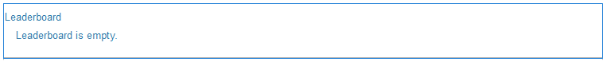
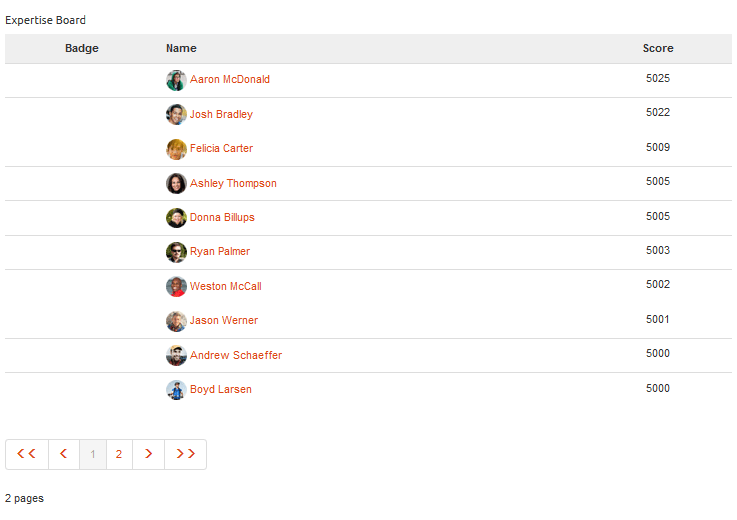

# Leaderboard Feature {#leaderboard-feature}

## Introduction {#introduction}

The `Leaderboard` component helps you get a sense of how members are interacting within the community by ranking members according to points earned (basic scoring) or their expertise (advanced scoring).

Before including the leaderboard component on a page, it is necessary to configure [Communities Scoring and Badges](/help/communities/implementing-scoring.md).

This section of the documentation describes:

* Adding the `Leaderboard` component to a [community site](/help/communities/overview.md#community-sites).
* Configuration settings for the `Leaderboard` component.

### Adding a Leaderboard to a Page {#adding-a-leaderboard-to-a-page}

To add a `Leaderboard` component to a page in author mode, locate the component

* `Communities / Leaderboard`

And drag it into place on a page.

For necessary information, visit [Communities Components Basics](/help/communities/basics.md).

When first placed on a page of a community site, this is how the component appears:

### Configuring Leaderboard {#configuring-leaderboard}

Select the placed `Leaderboard` component so you can access and select the `Configure` icon which opens the edit dialog.

 

#### Settings tab {#settings-tab}

Under the **[!UICONTROL Settings]** tab, specify what information related to the member is displayed :

* **Display Name**

  A descriptive name to display for the board, reflecting the rules selected for displaying badges and scores.
  Default is `Leaderboard` if nothing is entered.

* **Badge**

  If checked, a column for badge icons is included in the leaderboard.
  Default is unchecked.

* **Badge Name**

  If checked, a column for the badge name is included in the leaderboard.
  Default is unchecked.

* **Use Avatar**

  If checked, the member's avatar image is included in the leaderboard, next to their name link to their member profile.
  Default is unchecked.

#### Rules tab {#rules-tab}

Under the **Rules** tab, the community site, and its scoring and badging rules

* **Rule Location**

  (Required) Location where the Scoring / Badging rule is configured.

* **Scoring Rule**

  (Required) Specific rule generating the scores to display.

* **Badging Rule**

  (Required) Specific rule generating the badge to display.

* **Display Limit**

  Number of members to display per page. Default is 10.

### Example: Participants Leaderboard {#example-participants-leaderboard}

This leaderboard reports results from applying basic scoring rules.

Leaderboard component configuration:

* Settings tab:

  * Display Name = `Participation Board`
  * `checked`:

    * Badge
    * Badge Name
    * Use Avatar

* Rules tab:

  * Rule Location = `/content/sites/<site name>/jcr:content`
  * Scoring Rule = `/libs/settings/community/scoring/rules/forums-scoring`
  * Badging Rule = `/libs/settings/community/badging/rules//reference-badging`
  * Display Limit = `10`

### Example: Experts Leaderboard {#example-experts-leaderboard}

This leaderboard reports results from applying advanced scoring rules.

Leaderboard component configuration:

* Settings tab:

  * Display Name = `Expertise Board`
  * `checked`:

    * Badge
    * Use Avatar

* Rules tab:

  * Rule Location = `/content/sites/<site name>/jcr:content`
  * Scoring Rule = `/libs/settings/community/scoring/rules/adv-forums-scoring`
  * Badging Rule = `/libs/settings/community/badging/rules/adv-forums-badging`
  * Display Limit = `10`

### Additional Information {#additional-information}

More information may be found on the [Leaderboard Essentials](/help/communities/leaderboard.md) page for developers.

Instructions for creating rules are provided on the [Communities Scoring and Badges](/help/communities/implementing-scoring.md) page for administrators.
