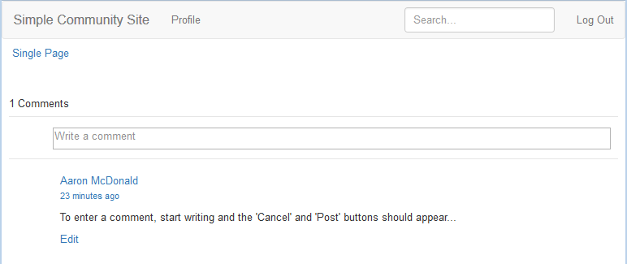

# Alter the Appearance (HBS) {#alter-the-appearance-hbs}

Now that the components for the custom comment system in the application directory (/apps) are in place, with a resourceSuperType referencing the default comment system, and the custom Model/View registered, you can edit the implementation.

For a simple demonstration, a visual feature, the avatar shown of the signed-in user who posts a comment, is removed.

>[!NOTE]
>
>To use the extension, the instance of the comment system in a website to be affected (/content) must set its resourceType to be the custom comment system.

## Modify the HBS Scripts {#modify-the-hbs-scripts}

Using [CRXDE Lite](/help/sites-developing/developing-with-crxde-lite.md):

* Open [/apps/custom/components/comments/comment/**comment.hbs**](https://localhost:4502/crx/de/index.jsp#/apps/custom/components/comments/comment/comment.hbs)

  * Comment out the tag which includes the avatar for a comment post (~ line 21):

    ```
      <!--
       <</img>
       -->
    ```

* Open [/apps/custom/components/comments/**comments.hbs**](https://localhost:4502/crx/de/index.jsp#/apps/custom/components/comments/comments.hbs)

  * Comment out the tag which includes the avatar for the next comment entry (~ line 44):

    ```
      <!--
       </img>
       -->
    ```

* Select **Save All**

### Replicate Custom App {#replicate-custom-app}

After the application has been modified, it is necessary to re-replicate the custom component.

One way to do so is:

* From the main menu

  * Select **[!UICONTROL Tools]** > **[!UICONTROL Operations]** > **[!UICONTROL Replication]**.
  * Select **[!UICONTROL Activate Tree]**.
  * Set `Start Path` to `/apps/custom`.
  * Deselect **[!UICONTROL Only Modified]**.
  * Select **[!UICONTROL Activate]** button.

### View Modified Comment on Published Sample Page {#view-modified-comment-on-published-sample-page}

[Continuing the experience](/help/communities/extend-sample-page.md#publish-sample-page) on the publish instance, still signed in as the same user, it is now possible to refresh the page in the publish environment to view the modification to remove the avatar:



### Sample Comment Extension Package {#sample-comment-extension-package}

Attached is a package of the custom comments application created in this tutorial.

[Get File](assets/sample-comment-extension-6-1-fp3.zip)
