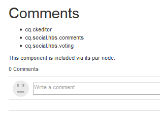
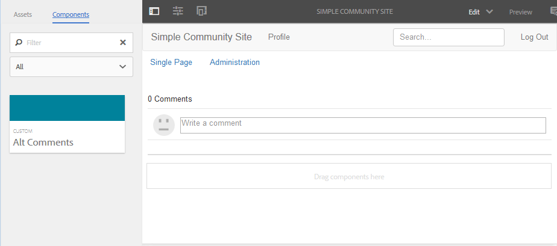

# Add Comment to Sample Page  {#add-comment-to-sample-page}

Now that the components for the custom comment system are in place in the application directory (/apps), it is possible to use the extended component. The instance of the comment system in a website to be affected must set its resourceType to be the custom comment system and include all necessary client libraries.

## Identify Required Clientlibs {#identify-required-clientlibs}

The client libraries necessary for the style and functioning of the default Comments are also necessary for extended Comments.

The [Community Components Guide](/help/communities/components-guide.md) identifies the required client libraries. Browse to the Component Guide and view the Comments component, for example:

[https://localhost:4502/content/community-components/en/comments.html](https://localhost:4502/content/community-components/en/comments.html)

Note the three client libraries required for Comments to render and function properly. These must be included where the extended Comments are referenced, and the [extended Comments' client library](/help/communities/extend-create-components.md#create-a-client-library-folder) ( `apps.custom.comments`).

### Add Custom Comments to a Page {#add-custom-comments-to-a-page}

As there can be only one Comment system per page, it is simpler to create a sample page as described in the brief [create a sample page](/help/communities/create-sample-page.md) tutorial.

Once created, enter Design mode and make available the Custom component group to allow the `Alt Comments` component to be added to the page.

For the Comment to appear and function properly, the client libraries for Comments must be added to the clientlibslist for the page (see [Clientlibs for Communities Components](/help/communities/clientlibs.md)).

#### Comments Clientlibs on Sample Page {#comments-clientlibs-on-sample-page}

#### Author: Alt Comment on Sample Page {#author-alt-comment-on-sample-page}

#### Author: Sample Page Comments Node {#author-sample-page-comments-node}

You can verify the resourceType in CRXDE by viewing the properties of the comments node for the sample page at `/content/sites/sample/en/jcr:content/content/primary/comments`.

#### Publish Sample Page {#publish-sample-page}

After the custom component is added to the page, it is also necessary to (re) [publish the page](/help/communities/sites-console.md#publishing-the-site).

#### Publish: Alt Comment on Sample Page {#publish-alt-comment-on-sample-page}

After publishing both the custom application and the sample page, it is possible to enter a comment. When signed in, either with a [demo user](/help/communities/tutorials.md#demo-users) or admin, it is possible to post a comment.

Here is aaron.mcdonald@mailinator.com posting a comment:

 

Now that it appears the extended component is working correctly with the default appearance, it is time to modify the appearance.
