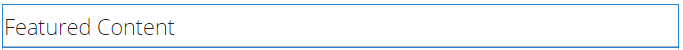
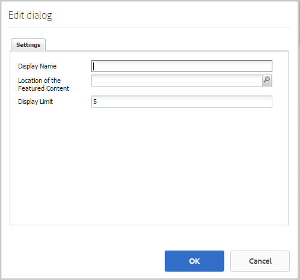

# Featured Content Feature {#featured-content-feature}

## Introduction {#introduction}

The featured content feature provides an area for signed-in site visitors (community members) in the publish environment to highlight content for:

* [Blogs](blog-feature.md)
* [Calendars](calendar.md)
* [Forums](forum.md)
* [Ideas](ideation-feature.md)
* [QnA](working-with-qna.md)

Once content is flagged as featured, it is listed within this component, which may be placed in specific landing pages or areas that easily catch the attention of community members.

The ability to feature content may be allowed or disallowed per component.

This section of the documentation describes:

* Adding featured content to a community site.
* Configuration settings for the `Featured Content` component.

## Adding Featured Content to a Page {#adding-featured-content-to-a-page}

To add a `Featured Content` component to a page in author mode, use the component browser to locate

* `Communities / Featured Content`

And drag it into place on a page where the featured content should appear.

For necessary information, visit [Communities Components Basics](basics.md).

When the [required client-side libraries](essentials-featured.md#essentials-for-client-side) are included, this is how the `Featured Content` component appears:

## Configuring Featured Content {#configuring-featured-content}

Select the placed `Featured Content` component so you can access and select the `Configure` icon which opens the edit dialog.

 

### Settings tab {#settings-tab}

Under the **[!UICONTROL Settings]** tab, identify the content to feature:

* **[!UICONTROL Display Name]**
  
  The title for the list of featured content. For example, `Featured Questions` or `Featured Ideas`. Default is `Featured Content` if left empty.

* **[!UICONTROL Location of the Featured Content]**
  
  *(Required)* Browse to the page containing the content that may be featured (components of that page must be configured to Allow Featured Content). For example, `/content/sites/engage/en/forum`.

* **[!UICONTROL Display Limit]**
  
  The maximum number of featured content to display. The default is 5.

## Site Visitor Experience {#site-visitor-experience}

The ability to flag content as featured content requires moderator privileges.

When a moderator views posted content, they have access to the in-context moderation flags, which includes the new `Feature` flag.

After it is flagged as a feature, the moderation flag becomes `Unfeature`.

The page containing the `Featured Content` component, now includes this post.

The `Read More` links to the actual post.

## Additional Information {#additional-information}

More information may be found on the [Featured Content](essentials-featured.md) page for developers.

For flagging content as featured, see [Moderating User-Generated Content](moderate-ugc.md).
