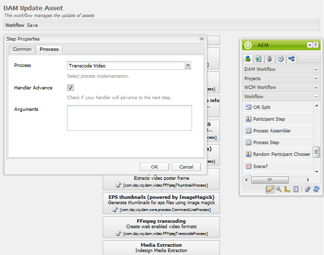

# FFmpeg for Communities {#ffmpeg-for-communities}

## Overview {#overview}

FFmpeg is a solution for converting and streaming audio and video and, when installed, is used for proper transcoding of [video assets](../../help/sites-authoring/default-components-foundation.md#video).

## Installing FFmpeg {#installing-ffmpeg}

FFmpeg should be installed on the server(s) hosting the AEM *author* instance(s).

1. Go to [https://www.ffmpeg.org](https://www.ffmpeg.org/).
1. Download the latest version of FFmpeg for your specific environment (Macintosh, Windows, or Linux).

    * It is important to keep FFmpeg up-to-date due to security vulnerabilities in older versions.

1. Install FFmpeg following instructions for the OS.

1. Make sure the FFmpeg executable is set in your system path.

   You should be able to run FFmpeg from any directory in your system.

    * For example, `ffmpeg -version`.

## Configure FFmpeg Transcoding Service {#configure-ffmpeg-transcoding-service}

By default, when FFmpeg is installed, multiple renditions are configured (transcodings) as per the [!UICONTROL DAM Update Asset] workflow definition.

As the transcodings are CPU intensive, it is recommended to modify the list of target renditions. In most cases, transcoding is not necessary.

To modify the [!UICONTROL DAM Update Asset] workflow, and in this example, to turn off transcoding:

* Sign into the author instance with administrative privileges.
* From global navigation, navigate to **[!UICONTROL Tools]** > **[!UICONTROL Workflow]** > **[!UICONTROL Models]**.
* Locate **[!UICONTROL DAM Update Asset]**.
* Double-click to open the workflow for edit in the Classic UI.

  Resulting location: [http://localhost:4502/cf#/etc/workflow/models/dam/update_asset.html](http://localhost:4502/cf#/etc/workflow/models/dam/update_asset.html)

* Double-click the **[!UICONTROL FFmpeg transcoding]** step to access the Step Properties dialog.
* Under the **[!UICONTROL Process]** tab:

  * **[!UICONTROL Arugments]**: Clear all entries to disable transcoding Default values: `profile:format_ogg,profile:format_aac,profile:format_flv,profile:format_aac_ie`

  

* Select **[!UICONTROL OK]** to close the `Step Properties` dialog.

* Select **[!UICONTROL Save]** to save the `DAM Update Asset` workflow.
