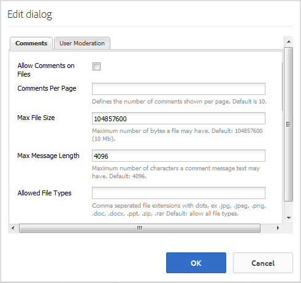

# File Library Feature {#file-library-feature}

## Introduction {#introduction}

The file library feature provides a place for signed-in site visitors (community members) to upload, manage and download files within the community site.

This section of the documentation describes

* Adding the file library feature to an AEM site
* Configuration settings for the `File Library` component

## Adding a File Library to a Page {#adding-a-file-library-to-a-page}

To add a `File Library` component to a page in author mode, locate the component

* `Communities / File Library`

and drag it into place on a page.

For necessary information, visit [Communities Components Basics](basics.md).

When the [required client-side libraries](essentials-file-library.md#essentials-for-client-side) are included, this is how the `File Library` component will appear:

## Configuring File Library {#configuring-file-library}

Select the placed `File Library` component to access and select the `Configure` icon which opens the edit dialog.

 

### Comments tab {#comments-tab}

Under the **[!UICONTROL Comments]** tab, specify if and how comments for uploaded files appear:

* **[!UICONTROL Allow Comments on Files]** 
  If checked, allow comments on uploaded files. Default is unchecked.

* **[!UICONTROL Comments Per Page]** 
  Limits the number of comments shown per page as well as the number of replies shown. Default is **10**.

* **[!UICONTROL Max File Size]** 
  This value will limit the uploaded file size. Default limit is 104857600 (10 Mb).

* **[!UICONTROL Max Message Length]** 
  Maximum number of characters that may be entered into the text box. Default is 4096 characters.

* **[!UICONTROL Allowed File Types]** 
  A comma separated list of file extensions with the "dot" separater. For example: .jpg, .jpeg, .png, .doc, .docx, .pdf. If any file types are specifed, then those not specified will not be allowed. Default is none specified such that all file types are allowed.

* **[!UICONTROL Rich Text Editor]** 
  If checked, comments may be entered with markup. Default is unchecked.

* **[!UICONTROL Delete Comments]** 
  If checked, users are allowed to delete their own comments. Default is checked.

* **[!UICONTROL Allow Tagging]** 
  If checked, the ability to add a tag to the file will be enabled. Default is unchecked.

* **[!UICONTROL Allowed Namespaces]** 
  If Allow Tagging is checked, the tags available will be limited to the namespaces checked. If none are checked, then all are allowed. Default is all namespaces.

* **[!UICONTROL Suggestion Limit]** 
  If Allow Tagging is checked, this setting limits the number of suggested tags to display. If set to -1, there is no limit. Default is -1.

* **[!UICONTROL Allow Voting]** 
  If checked, the ability to voter for a file will be enabled. Default is unchecked.

* **[!UICONTROL Allow Following]** 
  If checked, include the following feature for blog articles, which allows members to be [notified](notifications.md) of new posts. Default is unchecked.

* **[!UICONTROL Allow Threaded Replies]** 
  If checked, allow replies to posted comments. Default is unchecked.

### User Moderation tab {#user-moderation-tab}

Under the **[!UICONTROL User Moderation]** tab, configure moderation of comments, if comments are allowed:

* **[!UICONTROL Pre-Moderation]** 
  If checked, comments must be approved before they will appear on a publish site. Default is unchecked.

* **[!UICONTROL Delete Comments]** 
  If checked, the visitor who posted the comment is provided the ability to delete it. Default is checked.

* **[!UICONTROL Deny Comments]** 
  If checked, allow trusted member moderators to deny comments. Default is unchecked.

* **[!UICONTROL Close / Reopen Comments]** 
  If checked, allow trusted member moderators to close and reopen comments. Default is unchecked.

* **[!UICONTROL Flag Comments]** 
  If checked, allow visitors to flag comments as inappropriate. Default is unchecked.

* **[!UICONTROL Flag Reason List]** 
  If checked, allow visitors to choose, from a drop-down list, their reason for flagging a comment as inappropriate. Default is unchecked.

* **[!UICONTROL Custom Flag Reason]** 
  If checked, allow visitors to enter their own reason for flagging a comment as inappropriate. Default is unchecked.

* **[!UICONTROL Moderation Threshold]** 
  Enter the number of times a comment has to be flagged by visitors before moderators are notified. Default is one time (**1**).

* **[!UICONTROL Flagging Limit]** 
  Enter the number of times a comment has to be flagged before it is hidden from public view. This number must be greater than or equal to the **Moderation Threshold**. Default is 5.

## Additional Information {#additional-information}

More information may be found on the [File Library Essentials](essentials-file-library.md) page for developers.

For moderation of posted topics and comments, see [Moderating User Generated Content](moderate-ugc.md).

For tagging posted topics and comments, see [Tagging User Generated Content](tag-ugc.md).
