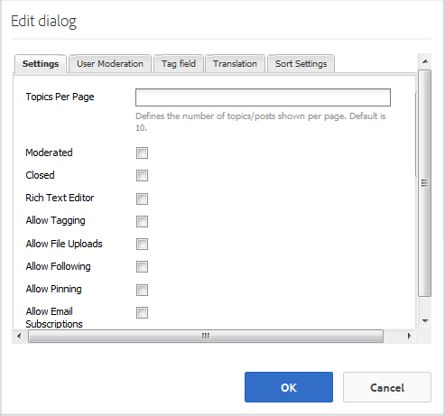

# Forum Feature {#forum-feature}

## Introduction {#introduction}

The forum feature provides an area for signed-in site visitors (community members) in the publish environment to:

* Create new topics
* View and reply to topics
* Follow a topic
* Search a forum
* Help moderate the forum content
* Move forum topics from one page to another

This section of the documentation describes

* Adding the forum feature to an AEM site
* Configuration settings for the `Forum`component

## Adding a Forum to a Page {#adding-a-forum-to-a-page}

To add a `Forum` component to a page in author mode, use the component browser to locate

* `Communities / Forum`

And drag it into place on a page where the forum should appear.

For necessary information, visit [Communities Components Basics](basics.md).

When the [required client-side libraries](essentials-forum.md#essentials-for-client-side) are included, this is how the `Forum`component will appear:

## Configuring a Forum {#configuring-a-forum}

Select the placed `Forum` component to access and select the `Configure` icon which opens the edit dialog.

 

### Settings tab {#settings-tab}

Under the **[!UICONTROL Settings]** tab, specify settings for topics and replies:

* **[!UICONTROL Topics Per Page]** 
  Defines the number of topics/posts shown per page. Default is 10.

* **[!UICONTROL Moderated]** 
  If checked, posting of topics and comments must be approved before they will appear on a publish site. Default is unchecked.

* **[!UICONTROL Closed]** 
  If checked, the forum is closed to new topics and comments. Default is unchecked.

* **[!UICONTROL Rich Text Editor]** 
  If checked, topics and comments may be entered with markup. Default is unchecked.

* **[!UICONTROL Allow Tagging]** 
  If checked, allow members to add tag labels to their post (see **[!UICONTROL Tag field]** tab). Default is unchecked.

* **[!UICONTROL Allow File Uploads]** 
  If checked, allow file attachments to be added to the topic or comment. Default is unchecked.

* **[!UICONTROL Allow Following]** 
  If checked, include the following feature for forum posts, which allows members to be [notified](notifications.md) of new posts. Default is unchecked.

* **[!UICONTROL Allow Pinning]** 
  If checked, forum topics may be pinned to the top of the list of topics. Default is unchecked.

* **[!UICONTROL Allow Featured Content]** 
  if checked, the idea is able to be identified as [featured content](featured.md). Default is unchecked.

* **[!UICONTROL Allow Email Subscriptions]** 
  If checked, allow members to be notified of new posts by email ([subscription](subscriptions.md)). Requires `Allow Following` to be checked and [email configured](email.md). Default is unchecked.

* **[!UICONTROL Max File Size]** 
  Relevant only if `Allow File Uploads` is checked. This field will limit the size (in bytes) of an uploaded file. Default is 104857600 (10 Mb).

* **[!UICONTROL Allowed File Types]** 
  Relevant only if `Allow File Uploads` is checked. A comma separated list of file extensions with the "dot" separater. For example: .jpg, .jpeg, .png, .doc, .docx, .pdf. If any file types are specifed, then those not specified will not be allowed to be uploaded. Default is none specified such that all file types are allowed.

* **[!UICONTROL Max Attach Image File Size]** 
  Relevant only if Allow File Uploads is checked. Maximum number of bytes an uploaded image file may have. Default is 2097152 (2 Mb).

* **[!UICONTROL Allow Threaded Replies]** 
  If checked, allow replies to comments posted to the topic. Default is unchecked.

* **[!UICONTROL Allow Users to Delete Comments and Topics]** 
  If checked, allow members to delete the comments and topics they posted. Default is unchecked.

* **[!UICONTROL Allow Voting]** 
  If checked, include the Voting feature with a topic. Default is unchecked.

* **[!UICONTROL Show Breadcrumbs]** 
  If checked, show navigational breadcrumbs on topic pages. Default is checked.

* **[!UICONTROL Display Badges]** 
  If checked, display earned and assigned [badges](implementing-scoring.md) with a member's blog entry. Default is unchecked.

>[!NOTE]
>
>It may be necessary to check both `AllowThreaded Replies` and `Allow users to Delete Comments and Topics` to enable comments on a topic.

### User Moderation tab {#user-moderation-tab}

Under the **[!UICONTROL User Moderation]** tab, specify how the posted topics and replies (user generated content) are managed. For more information, see [Moderating User Generated Content](moderate-ugc.md).

* **[!UICONTROL Deny Posts]** 
  If checked, trusted member moderators will be allowed to deny posts and prevent the post from appearing on the public forum. Default is unchecked.

* **[!UICONTROL Close / Reopen Topics]** 
  If checked, trusted member moderators may close a topic to further edits and comments, and may also reopen a topic. Default is unchecked.

* **[!UICONTROL Move Topics]** 
  If checked, allow publish-side moderators to move topics. Default is checked.

* **[!UICONTROL Flag Posts]** 
  If checked, allow members to flag others' topics or comments as inappropriate. Default is unchecked.

* **[!UICONTROL Flag Reason List]** 
  If checked, allow members to choose, from a drop-down list, their reason for flagging a topic or comment as inappropriate. Default is unchecked.

* **[!UICONTROL Custom Flag Reason]** 
  If checked, allow members to enter their own reason for flagging a topic or comment as inappropriate. Default is unchecked.

* **[!UICONTROL Moderation Threshold]** 
  Enter the number of times a topic or comment has to be flagged by members before moderators are notified. Default is 1 ( one time).

* **[!UICONTROL Flagging Limit]** 
  Enter the number of times a topic or comment has to be flagged before it is hidden from public view. If set to -1, the flagged topic or comment is never hidden from public view. Else, this number must be greater than or equal to the Moderation Threshold. Default is 5.

### Tag field tab {#tag-field-tab}

Under the **[!UICONTROL Tag field]** tab, the tags which may be applied, if allowed under the **[!UICONTROL Settings]** tab, are limited according to namespaces chosen.

* **[!UICONTROL Allowed Namespaces]** 
  Relevant if `Allow Tagging` is checked under the **[!UICONTROL Settings]** tab. The tags which may be applied are limited to those within the namespace categories checked. The list of namespaces includes "Standard Tags" (the default namespace) as well as "Include All Tags". Default is none checked, which means all namespaces are allowed.

* **[!UICONTROL Suggestion Limit]** 
  Enter the number of tags to be displayed as a suggestion to the member posting to the forum. Default is **-** 1 (no limits).

### Translation tab {#translation-tab}

Under the **[!UICONTROL Translation]** tab, if translation is enabled for the community site, translation may be set to translate the entire topic or selected posts.

* **[!UICONTROL Translate All]** 
  If checked, the forum thread is translated into the user's preferred language. Default is unchecked.

### Sort Settings tab {#sort-settings-tab}

Under the **[!UICONTROL Sort Settings]** tab, specify how the posted comments are sorted when displayed.

* **[!UICONTROL Sort By]** 
  Check all allowed sort selections: `Newest, Oldest, Last Updated, Most Viewed, Most Active, Most Followed and Most Liked`. Default is `Newest, Oldest, Last Updated`.

* **[!UICONTROL Set as Default]** 
  Pull down to select one of the checked sort options to appear as the default. Default is `Newest`.

* **[!UICONTROL Select Time Options for Analytics Sorting]** 
  Pull down to select one of `All, Last 24 Hours, Last 7 Days, Last 30 Days`. Default is `All`.

## Additional Information {#additional-information}

More information may be found on the [Forum Essentials](essentials-forum.md) page for developers.

For moderation of posted topics and comments, see [Moderating User Generated Content](moderate-ugc.md).

For tagging posted topics and comments, see [Tagging User Generated Content](tag-ugc.md).

For translation of posted topics and comments, see [Translating User Generated Content](translate-ugc.md).
