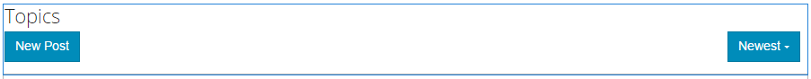

# Forum Feature{#forum-feature}

## Introduction {#introduction}

The forum feature provides an area for signed-in site visitors (community members) in the Publish environment to:

* Create topics
* View and reply to topics
* Follow a topic
* Search a forum
* Help moderate the forum content
* Move forum topics from one page to another

This section of the documentation describes:

* Adding the forum feature to an AEM site.
* Configuration settings for the `Forum` component.

### Adding a Forum to a Page {#adding-a-forum-to-a-page}

To add a `Forum` component to a page in author mode, use the component browser to locate

* `Communities / Forum`

And drag it into place on a page where the forum should appear.

For necessary information, visit [Communities Components Basics](/help/communities/basics.md).

When the [required client-side libraries](/help/communities/essentials-forum.md#essentials-for-client-side) are included, this is how the `Forum` component appears:

### Configuring a Forum {#configuring-a-forum}

Select the placed `Forum` component so you can access and select the `Configure` icon which opens the edit dialog.

 

#### Settings tab {#settings-tab}

Under the **Settings** tab, specify settings for topics and replies:

* **Allow Attachment Thumbnail**
  
  If checked, a thumbnail of the attached image is created.

* **Max Attach Thumbnail Size**
  
  Maximum size (in pixels) of the attachment thumbnail image. The default value is 800 x 800.

* **Min Image size for Thumbnail**
* **Max Thumbnail Size**
  
  Maximum size (in pixels) of the thumbnail image for inline image. The default value is 800 x 800.

* **Topics Per Page**
  
  Defines the number of topics/posts shown per page. Default is 10.

* **Moderated**
  
  If checked, posting of topics and comments must be approved before they can appear on a publish site. Default is unchecked.

* **Closed**
  
  If checked, the forum is closed to new topics and comments. Default is unchecked.

* **Rich Text Editor**
  
  If checked, topics and comments may be entered with markup. Default is unchecked.

* **Allow Tagging**
  
  If checked, allow members to add tag labels to their posts (see **Tag field** tab). Default is unchecked.

* **Allow File Uploads**
  
  If checked, allow file attachments to be added to the topic or comment. Default is unchecked.

* **Allow Following**
  
  If checked, include the following feature for forum posts, which allows members to be [notified](/help/communities/notifications.md) of new posts. Default is unchecked.

* **Allow Pinning**
  
  If checked, forum topics may be pinned to the top of the list of topics. Default is unchecked.

* **Allow Featured Content**
  
  If checked, the idea is identifiable as [featured content](/help/communities/featured.md). Default is unchecked.

* **Allow Email Subscriptions**
  
  If checked, allow members to be notified of new posts by email ([subscription](/help/communities/subscriptions.md)). Requires `Allow Following` to be checked and [email configured](/help/communities/email.md). Default is unchecked.

* **Max File Size**
  
  Relevant only if `Allow File Uploads` is checked. This field limits the size (in bytes) of an uploaded file. Default is 104857600 (10 Mb).

* **Allowed File Types**
  
  Relevant only if `Allow File Uploads` is checked. A comma-separated list of file extensions with the "dot" separator. For example, .jpg, .jpeg, .png, .doc, .docx, .pdf. If any file types are specified, then those not specified cannot be uploaded. Default is none specified such that all file types are allowed.

* **Max Attach Image File Size**
  Relevant only if Allow File Uploads is checked. Maximum number of bytes an uploaded image file may have. Default is 2097152 (2 Mb).

* **Allow Threaded Replies**
  
  If checked, allow replies to comments posted to the topic. Default is unchecked.

* **Allow Voting**
  
  If checked, include the Voting feature with a topic. Default is unchecked.

* **Allow Users to Delete Comments and Topics**
  
  If checked, allow members to delete the comments and topics that they posted. Default is unchecked.

* **Show Breadcrumbs**
  
  If checked, show navigational breadcrumbs on topic pages. Default is checked.

* **Display Badges**
  
  If checked, display earned and assigned [badges](/help/communities/implementing-scoring.md) with a member's blog entry. Default is unchecked.

* **Allow Privileged Members**
  
  If checked, only Privileged members are allowed to create content.

* **Allowed Privileged Members**
  
  Add the privileged members allowed to create content.

* **Block User-Generated Content in Author Edit Mode**
  
  If enabled, blocks User-Generated Content while editing in Author Mode.

* **Enable Mention**
  
  If enabled, allows registered community users to identify other registered members (using first name, last name, user name) and tag them using the common @user-name syntax. The tagged users receive notifications about their mentions.

* **Max Mentions**
  
  Restrict the maximum number of mentions allowed in a post. Default is 10.

* **UI Mention Pattern**
  
  Specify the allowed pattern string to tag (@mention) the registered user in a post. For example, `~{{familyName}}{{givenName}}`.

>[!NOTE]
>
>It may be necessary to check both `AllowThreaded Replies` and `Allow users to Delete Comments and Topics` to enable comments on a topic.

#### User Moderation tab {#user-moderation-tab}

Under the **User Moderation** tab, specify how the posted topics and replies (user-generated content) are managed. For more information, see [Moderating User-Generated Content](/help/communities/moderate-ugc.md).

* **Deny Posts**
  
  If checked, trusted member moderators are allowed to deny posts and prevent the post from appearing on the public forum. Default is unchecked.

* **Close / Reopen Topics**
  
  If checked, trusted member moderators may close a topic to further edits and comments, and may also reopen a topic. Default is unchecked.

* **Move Topics**
  
  If checked, allow moderators on the publish side to move topics. Default is checked.

* **Flag Posts**
  
  If checked, allow members to flag others' topics or comments as inappropriate. Default is unchecked.

* **Flag Reason List**
  
  If checked, allow members to choose, from a drop-down list, their reason for flagging a topic or comment as inappropriate. Default is unchecked.

* **Custom Flag Reason**
  
  If checked, allow members to enter their own reason for flagging a topic or comment as inappropriate. Default is unchecked.

* **Moderation Threshold**
  
  Enter the number of times a topic or comment has to be flagged by members before moderators are notified. Default is 1 (one time).

* **Flagging Limit**
  
  Enter the number of times a topic or comment has to be flagged before it is hidden from public view. If set to -1, the flagged topic or comment is never hidden from public view. Else, this number must be greater than or equal to the Moderation Threshold. Default is 5.

#### Tag field tab {#tag-field-tab}

Under the **Tag field** tab, the tags which may be applied, if allowed under the **Settings** tab, are limited according to namespaces chosen.

* **Allowed Namespaces**
  
  Relevant if `Allow Tagging` is checked under the **Settings** tab. The tags which may be applied are limited to those within the namespace categories checked. The list of namespaces includes "Standard Tags" (the default namespace) and "Include All Tags". Default is none checked, which means all namespaces are allowed.

* **Suggestion Limit**
  
  Enter the number of tags to be displayed as a suggestion to the member posting to the forum. Default is **-**1 (no limits).

#### Translation tab {#translation-tab}

Under the **Translation** tab, if translation is enabled for the community site, translation may be set to translate the entire topic or selected posts.

* **Translate All**
  
  If checked, the forum thread is translated into the user's preferred language. Default is unchecked.

#### Sort Settings tab {#sort-settings-tab}

Under the **Sort Settings** tab, specify how the posted comments are sorted when displayed.

* **Sort By**
  
  Check all allowed sort selections : `Newest, Oldest, Last Updated, Most Viewed, Most Active, Most Followed and Most Liked`. Default is `Newest, Oldest, Last Updated`.

* **Set as Default**
  
  Pull down to select one of the checked sort options to appear as the default. Default is `Newest`.

* **Select Time Options for Analytics Sorting**
  
  Pull down to select one of the following options: `All, Last 24 Hours, Last 7 Days, Last 30 Days`. 
  
  Default is `All`.

### Additional Information {#additional-information}

More information may be found on the [Forum Essentials](/help/communities/essentials-forum.md) page for developers.

For moderation of posted topics and comments, see [Moderating User-Generated Content](/help/communities/moderate-ugc.md).

For tagging posted topics and comments, see [Tagging User-Generated Content](/help/communities/tag-ugc.md).

For translation of posted topics and comments, see [Translating User-Generated Content](/help/communities/translate-ugc.md).
