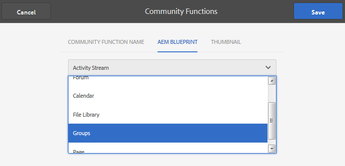
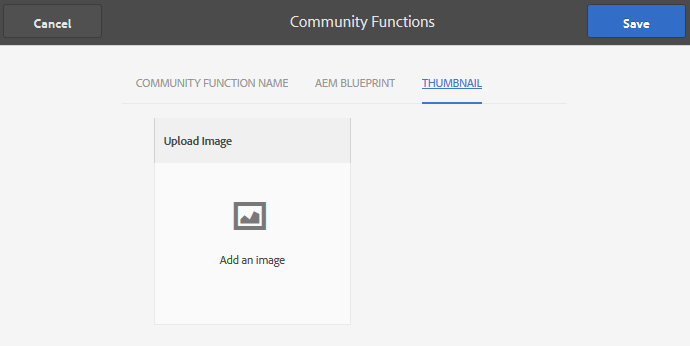

# Community Functions {#community-functions}

The type of features expected from a community experience are well known. Community features are available as community functions. Essentially, they are one or more pages pre-wired to implement a community feature which requires more than simply adding a component to a page in author mode. They are the building blocks used to define the structure of a [community site template](sites.md) from which community sites are [created](sites-console.md).

Once a community site is created, content may be added to the resulting pages using the standard [AEM authoring mode](../../help/sites-authoring/editing-content.md).

A number of community functions are immediately available as seen in the community functions console. More community functions will be delivered in future releases and custom functions may also be created.

>[!NOTE]
>
>The consoles for the creation of [community sites](sites-console.md), [community site templates](sites.md), [community group templates](tools-groups.md) and [community functions](functions.md) are for use only in the author environment.

## Community Functions Console {#community-functions-console}

In the author environment, to reach the community functions console

* From global navigation: **[!UICONTROL Tools > Communities > Community Functions]**

## Pre-built Functions {#pre-built-functions}

Following is a brief description of the functions delivered with AEM Communities. Each function is comprised of one or more AEM pages containing Communities components wired together into a feature that is easily incorporated into a [community site template](sites.md).

A community site template provides the structure for a community site including login, user profiles, notifications, messaging, site menu, search, theming, and branding features.

### Title and URL Settings {#title-and-url-settings}

**Title** and **URL** are properties common to all community functions.

When a community function is added to a community site template or added when [modifying](sites-console.md#modifying-site-properties) the structure of a community site, the function's dialog opens so that the Title and URL may be configured.

#### Configuration Function Details {#configuration-function-details}

* **[!UICONTROL Title]** 
  (*required*) The text which appears in the menu of features for the site

* **[!UICONTROL URL]** 
  (*required*) The name used to generate the URI. The name must conform to the [naming conventions](../../help/sites-developing/naming-conventions.md) imposed by AEM and JCR.

For example, using the site created from following the [Getting Started](getting-started.md) tutorial, if

* Title = Web Page
* URL = page

Then the URL to the page is http://local_host:4503/content/sites/engage/en/page.html and the menu link for the page appears as:

### Activity Stream Function {#activity-stream-function}

The activity stream function is a page with an [Activity Streams component](activities.md) with all views selected (all activities, user activities, and following). See also [Activity Stream Essentials](essentials-activities.md) for developers.

When added to a template, the following dialog opens:

#### Configuration Function Details {#configuration-function-details-1}

* See [Title and URL Settings](#title-and-url-settings)
* **[!UICONTROL Show "My Activities" view]** 
  If checked, the Activities page will include a tab which filters activities based on those generated within the community by the current member. Default is checked.

* **[!UICONTROL Show "All Activities" view]** 
  If checked, the Activities page will include a tab which includes all activities generated within the community to which the current member has access. Default is checked.

* **[!UICONTROL Show "News Feed" view]** 
  If checked, the Activities page will include a tab which filters activities based on those the current member is following. Default is checked.

### Assignments Function {#assignments-function}

The assignments function is the basic feature which defines a [community site for enablement](overview.md#enablement-community). It allows for the assignment of enablement resources to community members. See also [Assignments Essentials](essentials-assignments.md) for developers.

This function is available as a feature of the [enablement add-on](enablement.md). The enablement add-on requires additional licensing for use in a production environment.

When added to a template, the only configuration is for the [Title and URL Settings](#title-and-url-settings).

### Blog Function {#blog-function}

The blog function is a page with a [Blog component](blog-feature.md) configured for tagging, file uploads, following, members to self-edit, voting, and moderation. See also [Blog Essentials](blog-developer-basics.md) for developers.

When added to a template, the following dialog opens:

* See [Title and URL Settings](#title-and-url-settings)
* **[!UICONTROL Allow Privileged Members]** 
  If checked, the blog will only allow privileged members to create articles by allowing selection of a [privileged members group](users.md#privileged-members-group). If not checked, all community members are allowed to create. Default is unchecked.

* **[!UICONTROL Allow File Uploads]** 
  If checked, the blog will include the ability for members to upload files. Default is checked.

* **[!UICONTROL Allow Threaded Replies]** 
  If not checked, the blog will allow replies (comments) to an article, but replies to comments are not allowed. Default is checked.

* **[!UICONTROL Allow Featured Content]** 
  If checked, the idea is able to be identified as [featured content](featured.md). Default is checked.

### Calendar Function {#calendar-function}

The calendar function is a page with a [Calendar component](calendar.md) configured to allow tagging. See also [Calendar Essentials](calendar-basics-for-developers.md) for developers.

When added to a template, the following dialog opens:

* See [Title and URL Settings](#title-and-url-settings)
* **[!UICONTROL Allow Pinning]** 
  If checked, the forum will allow topic replies to be pinned to the beginning of the list of comments. Default is checked.

* **[!UICONTROL Allow Privileged Members]** 
  If checked, the blog will only allow privileged members to create articles by allowing selection of a [privileged members group](users.md#privileged-members-group). If not checked, all community members are allowed to create. Default is unchecked.

* **[!UICONTROL Allow File Uploads]** 
  If checked, the blog will include the ability for members to upload files. Default is checked.

* **[!UICONTROL Allow Threaded Replies]** 
  If not checked, the blog will allow replies (comments) to an article, but replies to comments are not allowed. Default is checked.

* **[!UICONTROL Allow Featured Content]** 
  If checked, the idea is able to be identified as [featured content](featured.md). Default is checked.

### Catalog Function {#catalog-function}

The catalog function provides the ability for [enablement community](overview.md#enablement-community) members to browse enablement resources which are not assigned to them. See [Tagging Enablement Resources](tag-resources.md) and [Catalog Essentials](catalog-developer-essentials.md) for developers.

All enablement resources and learning paths for the community site will show in all catalogs if their property, ` [Show in Catalog](resources.md)`, is set to true. To explicitly include resources and learning paths, it is necessary to apply a [pre-filter](catalog-developer-essentials.md#pre-filters) to the catalog.

When added to a template, the configuration allows specifying tag namespace(s) used to configure the tag filter presented to site visitors:

* See [Title and URL Settings](#title-and-url-settings)
* **[!UICONTROL Select All Namespaces]**

  * The selected tag namespaces define which tags are selectable by visitors for filtering the list of enablement resources listed in the catalog.
  * If checked, all tag namespaces allowed for the community site are available. 
  * If unchecked, it is possible to select one or more namespaces allowed for the community site. 
  * Default is checked.

### Featured Content Function {#featured-content-function}

The featured content function is a page with a [Featured Content component](featured.md) configured to allow comments to be added and deleted.

The ability to feature content may be allowed or disallowed per component (see [Blog Function](#blog-function), [Calendar Function](#calendar-function), [Forum Function](#forum-function), [Ideation Function](#ideation-function), and [QnA Function](#qna-function)).

When added to a template, the only configuration is for the [Title and URL Settings](#title-and-url-settings).

### File Library Function {#file-library-function}

The file library function is a page with a [File Library component](file-library.md) configured to allow comments to be added and deleted.

When added to a template, the only configuration is for the [Title and URL Settings](#title-and-url-settings).

### Forum Function {#forum-function}

The forum function is a page with a [Forum component](forum.md) configured for tagging, file uploads, following, members to self-edit, voting, and moderation.

When added to a template, the following dialog opens:

#### Configuration Function Details {#configuration-function-details-2}

* See [Title and URL Settings](#title-and-url-settings)
* **[!UICONTROL Allow Pinning]** 
  If checked, the forum will allow topic replies to be pinned to the beginning of the list of comments. Default is checked.

* **[!UICONTROL Allow Privileged Members]** 
  If checked, the forum will only allow privileged members to post topics by allowing selection of a [privileged members group](users.md#privileged-members-group). If not checked, all community members are allowed to post. Default is unchecked.

* **[!UICONTROL Allow File Uploads]** 
  If checked, the forum will include the ability for members to upload files. Default is checked.

* **[!UICONTROL Allow Threaded Replies]** 
  If not checked, the forum will allow comments on a topic, but replies to those comments are not allowed. Default is checked.

* **[!UICONTROL Allow Featured Content]** 
  If checked, the idea is able to be identified as [featured content](featured.md). Default is checked.

### Groups Function {#groups-function}

>[!CAUTION]
>
>The groups function must *not* be the *first nor the only* function in a site's structure or in a community site template.
>
>Any other function, such as the [page function](#page-function), must be included and listed first.

The groups function provides the ability for community members to create sub-communities within the community site in the publish environment.

Depending on [settings](sites-console.md#groupmanagement) when the Groups function is included in a [community site template](sites.md), the groups can be public or private and one or more community group templates may be configured to provide a choice of templates when the community group is actually created (such as from the publish environment). A [community group template](tools-groups.md) specifies which Communities features are created for the group pages, such as forums and calendars.

When a community group is created, a member group is dynamically created for the new group, to which members can be assigned or join. For more information, see [Managing Users and User Groups](users.md).

As of Communities [feature pack 1](deploy-communities.md#latestfeaturepack), community groups are created in the author environment using the [Communities Sites' Groups console](groups.md), and may be created in the publish environment when enabled.

When added to a template, the following dialog opens:

* See [Title and URL Settings](#title-and-url-settings)
* **[!UICONTROL Select Group Templates]** 
  A pull-down menu that allows selection of one or more enabled group templates from which the future creator of a new community group (in the publish environment) may choose.

* **[!UICONTROL Allow Privileged Members]** 
  If checked, the forum will only allow privileged members to post topics by allowing selection of a [privileged members security group](users.md#privileged-members-group). If not checked, all community members are allowed to post. Default is unchecked.

* **[!UICONTROL Allow Publish Creation]** 
  If checked, it is possible for authorized community members to create a group in the publish environment. If unchecked, new groups (sub-communities) may only be created in the author environment from the Communities Sites' Groups console. 

  Default is `checked`.

### Ideation Function {#ideation-function}

The ideation function is a page with one [Ideation component](ideation-feature.md).

When added to a template, the following dialog opens, which specifies the default Title and URL names, as well as default display settings for the template:

* See [Title and URL Settings](#title-and-url-settings)
* **[!UICONTROL Allow Privileged Members]** 
  If checked, the forum will only allow privileged members to post topics by allowing selection of a [privileged members security group](users.md#privileged-members-group). If not checked, all community members are allowed to post. Default is unchecked.

* **[!UICONTROL Allow File Uploads]** 
  If checked, the idea will include the ability for members to upload files. Default is checked.

* **[!UICONTROL Allow Threaded Replies]** 
  If not checked, the idea will allow replies (comments) to a topic, but replies to comments are not allowed. Default is checked.

* **[!UICONTROL Allow Featured Content]** 
  If checked, the idea is able to be identified as [featured content](featured.md). Default is checked.

### Leaderboard Function {#leaderboard-function}

The leaderboard function is a page with one [Leaderboard component](enabling-leaderboard.md).

**NOTE**: the Leaderboard component will need further configuration *after* a community site is created from a community template which includes the Leaderboard funciton. The Leaderboard component's [rules](enabling-leaderboard.md#rules-tab) will need to be specified, which depend on configuration of [scoring and badges](implementing-scoring.md) for the community site.

When added to a template, the following dialog opens, which specifies the default Title and URL names, as well as default display settings for the template:

* See [Title and URL Settings](#title-and-url-settings)
* **[!UICONTROL Display Badge]** 
  If checked, a column for badge icons is included in the leaderboard. 

  Default is unchecked.

* **[!UICONTROL Display Badge Name]** 
  If checked, a column for the badge name is included in the leaderboard.  

  Default is unchecked.

* **[!UICONTROL Display Avatar]** 
  If checked, the member's avatar image is included in the leaderboard, next to their name link to their member profile.  
  
  Default is unchecked.

### Page Function {#page-function}

The page function adds a blank page to the community site that it is wired into the features of the community site: login, menu, notifications, messaging, theming and branding. Content may be added to the page using the [standard AEM authoring mode](../../help/sites-authoring/editing-content.md).

When added to a template, the only configuration is for the [Title and URL Settings](#title-and-url-settings).

### QnA Function {#qna-function}

The QnA function is a page with a [QnA component](working-with-qna.md) configured for tagging, file uploads, following, members to self-edit, voting, and moderation.

When added to a template, the configuration allows restriction to privileged members:

* See [Title and URL Settings](#title-and-url-settings)
* **[!UICONTROL Allow Pinning]** 
  If checked, the forum will allow topic replies to be pinned to the beginning of the list of comments. Default is checked.

* **[!UICONTROL Allow Privileged Members]** 
  If checked, the QnA forum will only allow privileged members to post questions by allowing selection of a [privileged members group](users.md#privileged-members-group). If not checked, all community members are allowed to post. Default is unchecked.

* **[!UICONTROL Allow File Uploads]** 
  If checked, the QnA forum will include the ability for members to upload files. Default is checked.

* **[!UICONTROL Allow Threaded Replies]** 
  If not checked, the QnA forum will allow for a comments (answers) to a posted question, but replies to answers are not allowed. Default is checked.

* **[!UICONTROL Allow Featured Content]** 
  If checked, the idea is able to be identified as [featured content](featured.md). Default is checked.

## Create Community Function {#create-community-function}

The ability to create a community function is reached by selecting the `Create Community Function` icon located at the top of the Community Functions console. Multiple functions based on the same AEM Blueprint may be created and then uniquely customized by opening in author edit mode.

### Community Function Name {#community-function-name}

On the Community Function Name panel, a name, description and whether the function is enabled or disabled are configured:

* **[!UICONTROL Community Function Name]** 
  The function name used for display and storage

* **[!UICONTROL Community Function Description]** 
  The function description for display

* **[!UICONTROL Disabled/Enabled]** 
  A toggle switch controlling whether the function is referenceable

### AEM Blueprint {#aem-blueprint}

On the `AEM Blueprint` panel, it is possible to select the blueprint which is the underlying implementation of the community function.

The community function is a mini site comprised of one or more pages, pre-wired for inclusion into a community site including login, user profiles, notifications, messaging, site menu, search, theming, and branding features. Once the function is created, it is possible to [open the function](#open-community-function) in author edit mode and customize the page and/or component settings.

Since the community function is implemented as a [live copy](../../help/sites-administering/msm.md#live-copies) of a [blueprint](../../help/sites-administering/msm-livecopy.md#creatingablueprint), it is possible to rollout changes made to a function which affects all community site pages created from the [community site template](sites.md) or [community group template](tools-groups.md) that included the function. It is also possible to disassociate a page from its parent blueprint in order to make page-level modifications.

See also [Multi Site Manager](../../help/sites-administering/msm.md).

### Thumbnail {#thumbnail}

On the Thumbnail panel, an image may be uploaded to display in the [Community Functions console](#community-functions-console).

## Open Community Function {#open-community-function}

Select the `Open Community Function` icon to enter author edit mode for authoring the page content and modifying the configuration of the feature component(s).

### Configuring Components {#configuring-components}

A community function is implemented as a Live Copy of an AEM Blueprint, details of which are documented under [Multi Site Manager](../../help/sites-administering/msm.md).

It is possible to not only author page content, but to configure components.

If configuring a component on a page of a created community site, it may be necessary to cancel [inheritance](../../help/sites-administering/msm-livecopy.md#changing-live-copy-content) in order to configure the component. Inheritance should be re-established when configuration is completed.

For configuration details, visit [Communities Components](author-communities.md) for authors.

## Edit Community Function {#edit-community-function}

Select the `Edit Community Function` icon to edit the function's properties using the same panels as [creating a community function](#create-community-function), including enabling or disabling the function.
