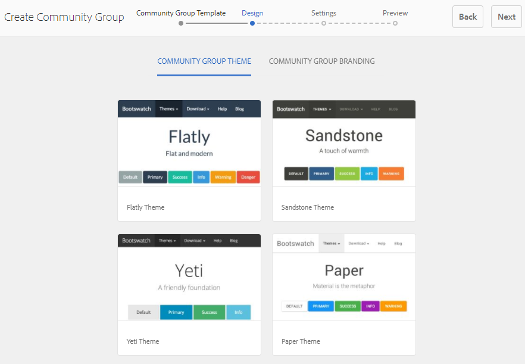
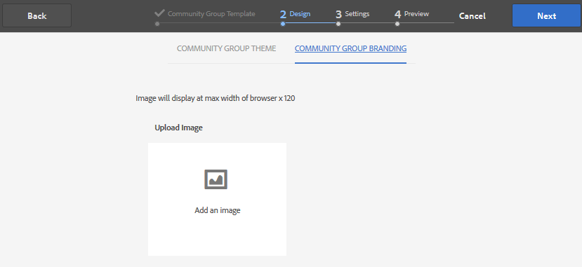
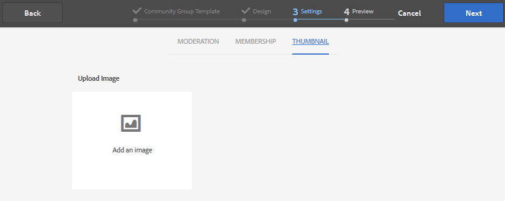
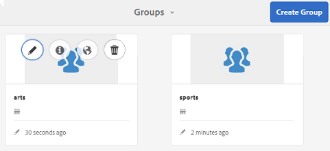

# Community Groups Console {#community-groups-console}

The Groups console provides access to creating community groups when a community site's [template structure](/help/communities/sites-console.md#step1) includes the [groups function](/help/communities/functions.md#groups-function).

* AEM Communities support nesting of groups within other groups. Group nesting is possible when the [structure of the new group](/help/communities/tools-groups.md) contains the groups function.
* For the author environment only, there is a group creation wizard similar to the site creation wizard.
* Whether (or not) members can create groups in publish environment it is configurable when adding a Groups function to a community site structure or community group structure.

Of the three group templates that are included, only the `Reference Group` template includes a groups function in its structure.

The different facets of community groups are:

* **Creation**: new group can be created on author and optionally on publish instance.
* **Control**: group can be open or secret.
* **Nesting**: group can contain zero or more groups.

<!-- This is a 404 on helpx. Please update or remove.
>[!NOTE]
>
>Community groups, created in the publish environment before the [existence of the Community Groups console](/help/communities/version-history.md#featurepack1fp1), is not listed in the Community Groups console, and thus, are not modifiable using the console.
-->

>[!NOTE]
>
>This Groups console, only accessible from the Communities Sites console, is not to be confused with the member [Groups console](/help/communities/members.md) for managing member groups.
>
>Member groups are user groups registered in the publish environment and accessed from the author environment using the [tunnel service](/help/communities/deploy-communities.md#tunnel-service-on-author).

## Group Creation {#group-creation}

To access the Groups console:

* On Author, sign in with administrator privileges.
* From global navigation: **[!UICONTROL Communities]** > **[!UICONTROL Sites]**.
* Select an existing community site folder so you can open it.
* Select an instance of a community site within the folder.

  * The structure of the community site must include a groups function.
  * These screenshots are from the Getting Started tutorial after [creating groups on publish](/help/communities/published-site.md).

  

* Select the **Groups folder** so you can open it.

  When opened, all existing groups, whether created on Author or Publish, are displayed.

  From this Groups console, it is possible to author new groups.

  

* Select the **Create Group** button.

### Step 1: Community Group Template {#step-community-group-template}

* **Community Group Title** 

  A display title for the group.
  The title appears on the published site for the group.

* **Community Group Description** 

  A description of the group.

* **Community Group Root** 

  The root path to the group.
  The default root is the parent site, but the root can be moved to any location within the website. It is not recommended to change it.

* **Additional Available Community Group Languages(s)** menu

  Use the drop-down to select the available community group languages. The menu displays all the languages in which the parent community site is created. Users can select among these languages to create groups in multiple locales in this single step. Same group gets created in multiple specified languages in the Groups console of the respective community sites.

* **Community Group Name** 

  The name of the group's root page which appears in the URL. Avoid using underscore characters (_) and keywords such as resources and configuration in group name.

  * Double-check the name as it is not easily changed after the group is created.
  * The base URL is displayed underneath the `Community Group Name`.
  * For a valid URL, append ".html"
      *for example*, `https://localhost:4502/content/sites/mysight/en/mygroup.html`.

* **Community Group Template** menu

  Use the drop-down to choose an available [community group template](/help/communities/tools.md).

### Step 2: Design {#step-design}

### COMMUNITY GROUP THEME {#community-group-theme}

The framework uses `Twitter Bootstrap` to bring a responsive, flexible design to the site. One of the many preloaded Bootstrap themes can be selected to style the selected community group template, or a Bootstrap theme can be uploaded.

When selected, the theme is overlaid with an opaque blue check mark.

It is possible to select a theme which differs from the parent site's theme.

After the community site is published, it is possible to [edit the properties](#modifyinggroupproperties) and select a different theme.

### COMMUNITY GROUP BRANDING {#community-group-branding}

Community site branding is an image displayed as a header across the top of each page. It is possible to display a banner for the group which differs from other site pages.

The image should be sized to be as wide as the expected display of the page in the browser and 120 pixels in height.

When creating or selecting an image, keep in mind:

* The image height is cropped to 120 pixels measured from the top edge of the image
* The image is pinned to the left edge of the browser window
* There is no resizing of the image, such that when the image width is:

  * Less than the browser's width, the image is repeated horizontally.
  * Greater than the browser's width, the image appears cropped.

### Step 3: Settings {#step-settings}

**MODERATION**

**Community Group Moderators**

By default, the parent community site's list of moderators is inherited.

It is possible to add moderators specifically to the group. Search for members (from publish environment) to add them as moderators

**Group Administrators**

By default, the parent community site administrator is the administrator for groups too.

However, it is possible to assign independent group administrators. Group administrators can manage their group (for example G1), and create a subgroup nested under G1. They can further assign different administrators for the subgroup.

A user U1, therefore, can be an administrator in a group G1 and a regular user in its nested group G2.

**MEMBERSHIP**

The membership setting allows for selection of one of the three ways to secure a community group.

* **Optional Membership**
  
  If selected, the community group is a public group. Site members can participate in the group and post without explicitly joining the group. Default is selected.

* **Required Membership**
  
  If selected, the community group is an open group. Community site members can view the contents of the group, but must join the group to post content. Members join by selecting the `Join` button in the publish environment. Default is not selected.

* **Restricted Membership**
  
  If selected, the community group is a secret group. Community members must be explicitly invited. Invited members are entered in the search box. Members can be added later using the [Members and Groups consoles](/help/communities/members.md) the author environment. Default is not selected.

**THUMBNAIL**

The thumbnail is an image to display for the group on author and publish.

The optimal size for a group image is 170 x 90 pixels in a supported image format (such as JPG or PNG).

If no image is added, a default image is displayed.

### Step 4: Create Group {#step-create-group}

If any adjustments are needed, use the **Back** button to make them.

Once **Create** is selected and started, the process of creating the group cannot be interrupted.

When the process completes, the card for the new subcommunity site (group) is displayed in the Communities Sites Groups console, from where authors can add page content, or administrators can modify the properties of the site.

>[!NOTE]
>
>The group gets created in all the languages, as specified in [Step 1: Community Group Template](/help/communities/groups.md#step-community-group-template) in Additional Available Community Group Languages, in the Community Groups console of the respective community sites.

## Author Group Content {#author-group-content}

The page content of a group can be authored with the same tools as any other AEM page. To open the group for authoring, select the Open Site icon which appears when hovering over the group card.

## Modify Group Properties {#modify-group-properties}

The properties of an existing subcommunity site, specified during the community group creation process, can be modified by selecting the Edit Site icon which appears when hovering over the group card:

Details of the following properties match the descriptions provided in the [Group Creation](#group-creation) section. Any nested group can be modified, whether created in the publish environment or author environment.

### Modify Basic {#modify-basic}

The BASIC panel allows the modification of

* Community Group Title
* Community Group Description

The Community Group Name may not be modified.

Choosing a different community group template would have no effect on an existing community group site as no connection remains between templates and sites.

Instead, the [STRUCTURE](#modify-structure) of the subcommunity may be modified.

### Modify Structure {#modify-structure}

The STRUCTURE panel allows the modification of the structure initially created from the community group template selected when creating the subcommunity site from either the author or publish environment. From the panel, it is possible to:

* Drag-and-drop additional [community functions](/help/communities/functions.md) into the site structure.
* On an instance of a community function in the site structure:

  * **`Gear icon`**
    Edit settings, including the display title, URL, and [privileged members groups](/help/communities/users.md#privilegedmembersgroups).

  * **`Trashcan icon`**
    Remove (delete) functions from the site structure.

  * **`Grid icon`**
    Modify the order of functions as displayed in the site's top-level navigation bar.

>[!CAUTION]
>
>While the display title can be changed without side-effects, it is not recommended to edit the URL name of a community function belonging to a community site.
>
>For example, renaming the URL does not move existing UGC, therefore it has the effect of 'losing' UGC.

>[!CAUTION]
>
>The groups function must *not* be the *first nor the only* function in the site structure.
>
>Any other function, such as the [page function](/help/communities/functions.md#page-function), must be included and listed first.

**Example: Adding a Calendar Function to a Sub-Community (Group) Structure**

### Modify Design {#modify-design}

The DESIGN panel allows the modification of the theme:

* [Community Group Theme](#community-group-theme)
* [Community Group Branding](#community-group-branding)

  * Scroll to the bottom of the panel so you can change the brand image.

### Modify Settings {#modify-settings}

The SETTINGS panel allows the ability to add community [moderators](#moderation).

### Modify Membership {#modify-membership}

The [MEMBERSHIP](#membership) panel is informational only. It is not possible to alter the type of group membership established, whether it is optional, required, or restricted.

### Modify Thumbnail {#modify-thumbnail}

The [THUMBNAIL](#thumbnail) panel allows for an image to be uploaded to represent the community group to site visitors in the Publish environment and in the Communities Site's Groups console in the author environment.

## Publish the Group {#publish-the-group}

After a community group has been newly created or modified, it is possible to publish (activate) the group by selecting the `Publish Site` icon.

After the group is successfully published, the following message appears:

>[!CAUTION]
>
>The parent community site and parent groups should already have been published.
>
>The community site and nested groups should be published in a top-down fashion.

## Delete the Group {#delete-the-group}

Delete a group from within the community Groups console by selecting the Delete Group icon, which appears on hovering mouse over the group.

This removes all the items associated with the group, for example all the content of the group is permanently deleted and user memberships are removed from the system.
