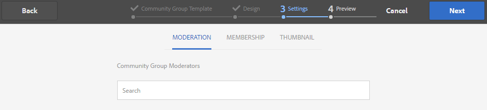
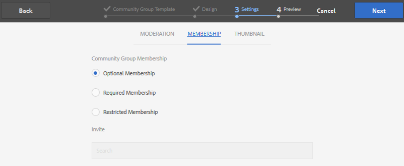
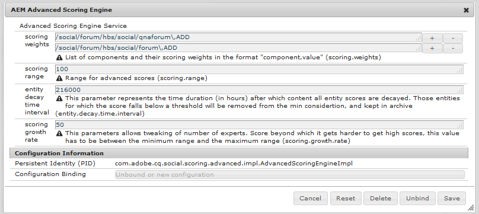
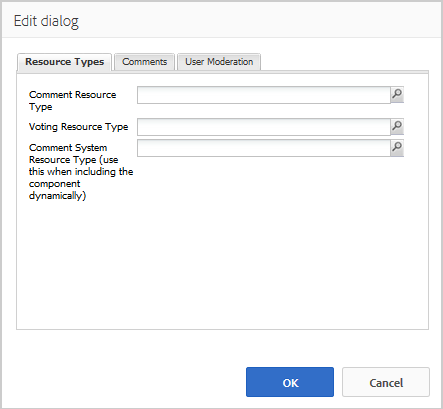

# Community Groups Console {#community-groups-console}

The Groups console provides access to creating community groups when a community site's [template structure](sites-console.md#step1) includes the [groups function](functions.md#groups-function).

* Groups may be nested within other groups. This happens when the [structure of the new group](tools-groups.md) contains the groups function.
* For the author environment only, there is a group creation wizard similar to the site creation wizard.
* Whether or not members may create groups from the publish environment is configurable when adding a Groups function to a community site structure or community group structure.

Of the three group templates included, only the `Reference Group` template includes a groups function in its structure.

Several facets of community groups are:

* Creation: new group can be created on author and optionally on publish
* Control: group may be open or secret
* Nesting: a group may contain zero or more groups

>[!NOTE]
>
>Community groups, created in the publish environment prior to the [existence of the Community Groups console](https://helpx.adobe.com/in/experience-manager/6-3/communities/using/version-history.html#FeaturePack1FP1), will not be listed in the Community Groups console, and thus, are not modifiable using the console.

>[!NOTE]
>
>This Groups console, only accessible from the Communities Sites console, is not to be confused with the member [Groups console](members.md) for managing member groups. 
>
>Member groups are user groups registered in the publish environment and accessed from the author environment using the [tunnel service](deploy-communities.md#tunnel-service-on-author).

## Group Creation {#group-creation}

To access the Groups console:

* On author, sign in with administrator privileges
* From global navigation: **[!UICONTROL Communities > Sites]**
* Select an existing community site folder to open it
* Select an instance of a community site within the folder

    * The structure of the community site must include a groups function
    * These screen shots are from the Getting Started tutorial after [creating groups on publish](published-site.md)

Select the **[!UICONTROL Groups folder]** to open it.

When opened, all existing groups, whether created on author or publish, are displayed.

From this Groups console, it is possible to author new groups.

* Select **[!UICONTROL Create Group]** button

### Step 1: Community Group Template {#step-community-group-template}

* **[!UICONTROL Community Group Title]**: A display title for the group.

  The title appears on the published site for the group.

* **[!UICONTROL Community Group Description]**: A description of the group.
* **[!UICONTROL Community Group Root]**: The root path to the group. 

  The default root is the parent site, but the root may be moved to any location within the web site. It is not recommended to change it.

* **[!UICONTROL Additional Available Community Group Languages(s)]** menu: Use the pull down menu to select the available community group language(s). The menu displays all the language(s) in which the parent community site is created. Users can select among these languages to create groups in multiple locales in this single step. Same group gets created in multiple specified languages in the Groups console of the respective community sites.  

* **[!UICONTROL Community Group Name]**: The name of the group's root page which appears in the URL

    * Double-check the name as it is not easily changed after the group is created
    * The base URL will be displayed underneath the `Community Group Name`
    * For a valid URL, append ".html"  

      *For example*, `http://localhost:4502/content/sites/mysight/en/mygroup.html`

* **[!UICONTROL Community Group Template]** menu: use the pull down menu to choose an available [community group template](tools.md).

### Step 2: Design {#step-design}

#### COMMUNITY GROUP THEME {#community-group-theme}

The framework uses [Twitter Bootstrap](https://twitterbootstrap.org/) to bring a responsive, flexible design to the site. One of the many preloaded Bootstrap themes may be selected to style the selected community group template, or a Bootstrap theme may be uploaded.

When selected, the theme will be overlayed with an opaque blue checkmark.

It is possible to select a theme which differs from the parent site's theme.

After the community site is published, it is possible to [edit the properties](#modifying-group-properties) and select a different theme.

#### COMMUNITY GROUP BRANDING {#community-group-branding}

Community site branding is an image displayed as a header across the top of each page. It is possible to display a banner for the group which differs from other site pages.

The image should be sized to be as wide as the expected display of the page in the browser and 120 pixels in height.

When creating or selecting an image, keep in mind:

* The image height will be cropped to 120 pixels measured from the top edge of the image
* The image is pinned to the left edge of the browser window
* There is no resizing of the image, such that when the image width is...

    * Less than the browser's width, the image will repeat horizontally
    * Greater than the browser's width, the image will appear to be cropped

### Step 3: Settings {#step-settings}

#### MODERATION {#moderation}

By default, the parent community site's list of moderators is inherited.

It is possible to add moderators specific to the group:

* Search for members (from publish environment) to add them as moderators

#### MEMBERSHIP {#membership}

The membership setting allows for selection of one of the three ways to secure a community group.

* Optional Membership 

  If selected, the community group is a public group. Site members may participate in the group and post without explicitly joining the group. Default is selected.
* Required Membership  

  if selected, the community group is an open group. Community site members may view the contents of the group, but must join the group before being able to post content. Members join by selecting the `Join` button in the publish environment. Default is not selected.

* Restricted Membership 

  if selected, the community group is a secret group. Community members must be explicitly invited. Invited members are entered in the search box. Members may be added later using the [Members and Groups consoles](members.md) the author environment. Default is not selected.

#### THUMBNAIL {#thumbnail}

The thumbnail is an image to display for the group on author and publish.

The optimal size for a group image is 170 x 90 pixels in a supported image format (such as JPG or PNG).

If no image is added, a default image is displayed.

### Step 4: Create Group {#step-create-group}

If any adjustments are needed, use the **Back** button to make them.

Once **Create** is selected and started, the process of creating the group cannot be interrupted.

When the process completes, the card for the new sub-community site (group) is displayed in the Communities Sites Groups console, from where authors may add page content or administrators may modify the properties of the site.

>[!NOTE]
>
>The group gets created in all the languages, as specified in [Step 1: Community Group Template](groups.md#step1communitygrouptemplate) in Additional Available Community Group Languages, in the Community Groups console of the respective community sites.

## Authoring Group Content {#authoring-group-content}

The page content of a group may be authored with the same tools as any other AEM page. To open the group for authoring, select the Open Site icon which appears when hovering over the group card.

## Modifying Group Properties {#modifying-group-properties}

The properties of an exisitng sub-community site, specified during the community group creation process, may be modified by selecting the Edit Site icon which appears when hovering over the group card:

Details of the following properties match the descriptions provided in the [Group Creation](#group-creation) section. Any nested group may be modified, whether created in the publish environment or author environment.

### Modify Basic {#modify-basic}

The BASIC panel allows the modification of

* Community Group Title
* Community Group Description

The Community Group Name may not be modified.

Choosing a different community group template would have no affect on an existing community group site as no connection remains between templates and sites.

Instead, the [STRUCTURE](#modify-structure) of the sub-community may be modified.

### Modify Structure {#modify-structure}

The STRUCTURE panel allows the modification of the structure initially created from the community group template selected when creating the sub-community site from either the author or publish environment. From the panel, it is possible to

* Drag-and-drop additional [community functions](functions.md) into the site structure
* On an instance of a community function in the site structure:

    * **`gear icon`** 

      Edit settings, including the display title and URL name as well as [privileged members groups](users.md#privilegedmembersgroups)
  
    * **`trashcan icon`** 

      Remove (delete) functions from the site structure
  
    * **`grid icon`** 

      Modify the order of functions as displayed in the site's top level navigation bar

>[!CAUTION]
>
>While the display title may be changed without side-effects, it is not recommended to edit the URL name of a community function belonging to a community site.
>
>For example, renaming the URL will not move existing UGC, thus having the effect of 'losing' UGC.

>[!CAUTION]
>
>The groups function must *not* be the *first nor the only* function in the site structure.
>
>Any other function, such as the [page function](functions.md#page-function), must be included and listed first.

#### Example: Adding a Calendar Function to a Sub-Community (Group) Structure {#example-adding-a-calendar-function-to-a-sub-community-group-structure}

### Modify Design {#modify-design}

The DESIGN panel allows the modification of the theme:

* [Community Group Theme](#community-group-theme)
* [Community Group Branding](#community-group-branding)

    * Scroll to the bottom of the panel to change the brand image

### Modify Settings {#modify-settings}

The SETTINGS panel allows the ability to add community [moderators](#moderation).

### Modify Membership {#modify-membership}

The [MEMBERSHIP](#membership) panel is informational only. It is not possible to alter the type of group membership established, whether it is optional, required or restricted.

### Modify Thumbnail {#modify-thumbnail}

The [THUMBNAIL](#thumbnail) panel allows for an image to be uploaded to represent the community group to site visitors in the publish environment as well as in the Communities Site's Groups console in the author environment.

## Publishing the Group {#publishing-the-group}

After a community group has been newly created or modified, it is possible to publish (activate) the group by selecting the `Publish Site` icon.

Once the group is successfully published, a message will appear:

>[!CAUTION]
>
>The parent community site and parent groups should already have been published.
>
>The community site and nested groups should be published in a top down fashion.

## Deleting the Group {#deleting-the-group}

Delete a group from within the community Groups console by selecting the Delete Group icon, which appears on hovering mouse over the group.

This removes all the items associated with the group, for example all the content of the group is permanently deleted and user memberships are removed from the system.
