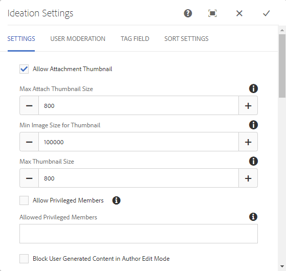
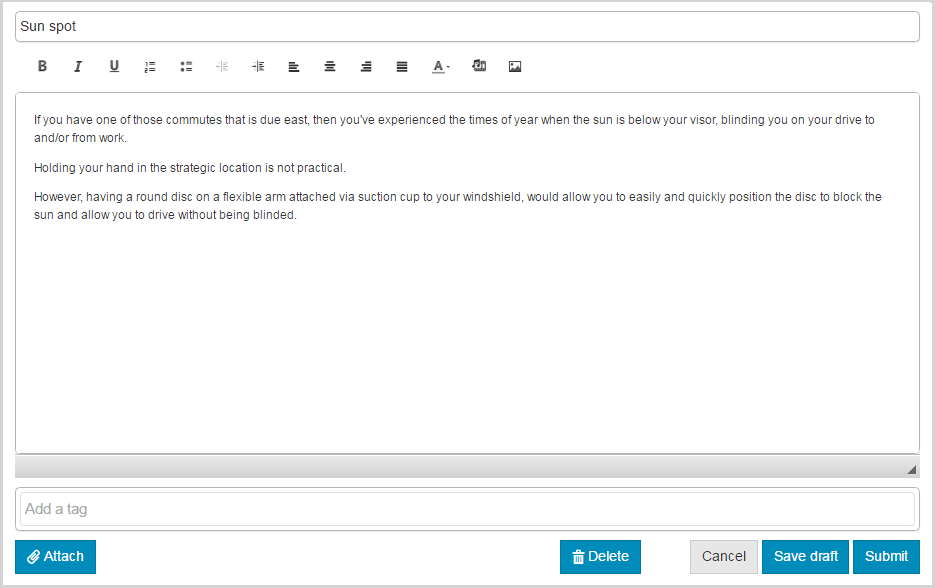
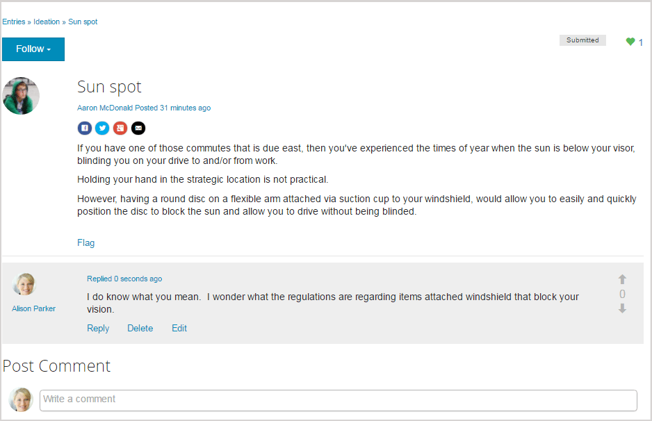

# Ideation Feature {#ideation-feature}

## Introduction {#introduction}

The ideation feature provides an area for signed-in site visitors (community members) in the Publish environment to:

* Create ideas to share with the community.
* View and comment on ideas.
* Follow an idea.
* Vote on an idea.

This section of the documentation describes:

* Adding the ideation feature to an AEM site.
* Configuration settings for the Ideation component.

### Adding an Ideation to a Page {#adding-a-ideation-to-a-page}

To add a `Ideation` component to a page in author mode, use the component browser to locate

* `Communities / Ideation`

And drag it into place on a page where the idea should appear.

For necessary information, visit [Communities Components Basics](/help/communities/basics.md).

When the [required client-side libraries](/help/communities/ideation.md#essentials-for-client-side) are included, this is how the `Ideation` component appears:

### Configuring an Ideation {#configuring-an-ideation}

Select the placed `Ideation` component so you can access and select the `Configure` icon which opens the edit dialog.

 

#### Settings tab {#settings-tab}

Under the **[!UICONTROL Settings]** tab, specify settings for ideas and comments:

* **Allow Attachment Thumbnail**
* **Max Attach Thumbnail Size**
* **Min Image Size for Thumbnail**
* **Max Thumbnail Size**
* **Allow Privileged Members**
* **Allowed Privileged Members**
* **Block User Generated Content in Author Edit Mode**
* **Ideation Title**

* The display title for the idea. Default is `Ideation`.
* **Ideation Description**

  A description to display as a subtitle for the idea. Default is no description.

* **Topics Per Page**

  Defines the number of ideas/posts shown per page. Default is 10.

* **Moderated**

  If checked, posting of ideas and comments must be approved before they can appear on a publish site. Default is unchecked.

* **Closed**

  If checked, the ideation forum is closed to new ideas and comments. Default is unchecked.

* **Rich Text Editor**

  If checked, ideas and comments may be entered with markup. Default is unchecked.

* **Allow Tagging**

  If checked, allow members to add tag labels to their posts (see **[!UICONTROL Tag field]** tab). Default is unchecked.

* **Allow File Uploads**

  If checked, allow file attachments to be added to the idea or comment. Default is unchecked.

* **Max File Size**

  Relevant only if `Allow File Uploads` is checked. This field limits the size (in bytes) of an uploaded file. Default is 104857600 (10 Mb).

* **Allowed File Types**

  Relevant only if `Allow File Uploads` is checked. A comma-separated list of file extensions with the "dot" separator. For example, .jpg, .jpeg, .png, .doc, .docx, .pdf. If any file types are specified, then those not specified cannot be uploaded. Default is none specified such that all file types are allowed.

* **Max Attach Image File Size**

  Relevant only if Allow File Uploads is checked. Maximum number of bytes an uploaded image file may have. Default is 2097152 (2 Mb).

* **Allow Replies**

  If checked, allow replies to comments posted to the idea. Default is unchecked.

* **Allow Voting**

  If checked, allow voting on the comments of an idea. Default is unchecked.

* **Allow Users to Delete Comments and Topics**

  If checked, allow members to delete the comments and ideas that they posted. Default is unchecked.

* **Allow Following**

  If checked, include the following feature for idea posts, which allows members to be [notified](/help/communities/notifications.md) of new posts. Default is unchecked.

* **Allow Email Subscriptions**

  If checked, allow members to be notified of new posts by email ([subscription](/help/communities/subscriptions.md)). Requires `Allow Following` to be checked and [email configured](/help/communities/email.md). Default is unchecked.

* **Allow Voting**

  If checked, allow voting on the comments of an idea. Default is unchecked.

* **Display Badges**

  If checked, display earned and assigned [badges](/help/communities/implementing-scoring.md) with a member's idea. Default is unchecked.

* **Do not Get Replies on Listing Page**

* **Allow Featured Content**

  If checked, the idea is identifiable as [featured content](/help/communities/featured.md). Default is unchecked.

* **Enable Mention**
* **Max Mentions**
* **UI Mention Pattern**

#### User Moderation tab {#user-moderation-tab}

Under the **[!UICONTROL User Moderation]** tab, specify how the posted ideas and comments (user generated content) are managed. For more information, see [Moderating User Generated Content](/help/communities/moderate-ugc.md).

* **Deny Posts**

  If checked, trusted member moderators can deny posts and prevent the post from appearing on the public forum. Default is unchecked.

* **Close/Reopen Topics**

  If checked, trusted member moderators may close a topic to further edits and comments, and may also reopen a topic. Default is unchecked.

* **Flag Posts**

  If checked, allow members to flag others' topics or comments as inappropriate. Default is unchecked.

* **Flag Reason List**

  If checked, allow members to choose, from a drop-down list, their reason for flagging a topic or comment as inappropriate. Default is unchecked.

* **Custom Flag Reason**

  If checked, allow members to enter their own reason for flagging a topic or comment as inappropriate. Default is unchecked.

* **Moderation Threshold**

  Enter the number of times a topic or comment has to be flagged by members before moderators are notified. Default is 1 ( one time).

* **Flagging Limit**

  Enter the number of times a topic or comment has to be flagged before it is hidden from public view. If set to -1, the flagged topic or comment is never hidden from public view. Else, this number must be greater than or equal to the Moderation Threshold. Default is 5.

#### Tag field tab {#tag-field-tab}

Under the **[!UICONTROL Tag field]** tab, the tags which may be applied, if allowed under the **[!UICONTROL Settings]** tab, are limited according to namespaces chosen.

* **Allowed Namespaces**

  Relevant if `Allow Tagging` is checked under the **[!UICONTROL Settings]** tab. The tags which may be applied are limited to those within the namespace categories checked. The list of namespaces includes "Standard Tags" (the default namespace) and "Include All Tags". Default is none checked, which means all namespaces are allowed.

* **Suggestion Limit**

  Enter the number of tags to be displayed as a suggestion to the member posting to the forum. A value of **-1** means no limit. Default is 0.

#### Sort Settings tab {#sort-settings-tab}

Under the **[!UICONTROL Sort Settings]** tab, specify how the posted comments are sorted when displayed.

* **Sort By**

  Check all allowed sort selections: `Newest, Oldest, Last Updated, Most Viewed, Most Active, Most Followed and Most Liked`. Default is `Newest, Oldest, Last Updated`.

* **Set as Default**

  Pull down to select one of the checked sort options to appear as the default. Default is `Newest`.

* **Select Time Options for Analytics Sorting**

  Pull down to select one of `All, Last 24 Hours, Last 7 Days, Last 30 Days`. Default is `All`.

## Site Visitor Experience {#site-visitor-experience}

### Creating Idea {#creating-idea}

As with all Communities features, if not signed in, a site visitor may only read ideas and view others opinions (through comments and voting/liking).

Once signed in, a member may create an idea.

Before submitting the idea, it is possible for the member to save a draft.

By selecting the `Save as Draft` button, a draft is saved.

When viewing saved drafts in the `My Drafts` tab, select `Read More` to reenter edit mode:

#### Providing Feedback {#providing-feedback}

Once the idea is published, other members can sign in, open the idea ( `Read More`) and like the idea, thus adding to the vote count, and make comments.

### Additional Information {#additional-information}

More information may be found on the [Ideation Essentials](/help/communities/ideation.md) page for developers.

For moderation of posted topics and comments, see [Moderating User Generated Content](/help/communities/moderate-ugc.md).

For tagging posted topics and comments, see [Tagging User Generated Content](/help/communities/tag-ugc.md).
