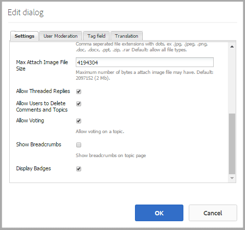

# Communities Scoring and Badges {#communities-scoring-and-badges}

## Overview {#overview}

The AEM Communities scoring and badges feature provides the ability to identify and reward community members.

The main aspects of scoring and badges are:

* [Assign badges](#assign-and-revoke-badges) to identify the role of a member  in  the community.

* [Basic awarding of badges](#enable-scoring) to members to encourage their participation (quantity of content created).

* [Advanced awarding of badges](/help/communities/advanced.md) to identify members as experts (quality of content created).

**Note** that awarding of badges is [not enabled by default](/help/communities/implementing-scoring.md#main-pars-text-237875536).

>[!CAUTION]
>
>The implementation structure visible in CRXDE Lite is subject to change once the UI becomes available.

## Badges {#badges}

Badges are placed under a member's name to indicate either their role or their standing in the community. Badges may either be displayed as an image or as a name. When displayed as an image, the name is included as alternate text for accessibility.

By default, badges are located in the repository at

* `/libs/settings/community/badging/images`

If stored in a different location, they should be read accessible by everyone.

Badges are differentiated in UGC as to whether they were assigned or were earned according to the rules. Presently, assigned badges appear as text and earned badges appear as an image.

### Badge Management UI {#badge-management-ui}

The Communities [Badges console](/help/communities/badges.md) provides the ability to add custom badges which can be displayed for a member when earned (awarded) or when they take on a specific role in the community (assigned).

### Assigned Badges {#assigned-badges}

Role-based badges are assigned by an administrator to community members based on their role in the community.

Assigned (and awared) badges are stored in the selected [SRP](/help/communities/srp.md) and are not directly accessible. Until a GUI is available, the only means for assigning role-based badges is to do so with code or cURL. For cURL instructions, see the section titled [Assign and Revoke Badges](#assign-and-revoke-badges).

Included in the release are three role-based badges:

* **moderator**
  `/libs/settings/community/badging/images/moderator/jcr:content/moderator.png`

* **group manager**
  `/libs/settings/community/badging/images/group-manager/jcr:content/group-manager.png`

* **privileged member**
  `/libs/settings/community/badging/images/privileged-member/jcr:content/privileged-member.png`

  

### Awarded Badges {#awarded-badges}

Reward-based badges are awarded by the scoring service to community members based on rules applied to their activity in the community.

In order for badges to appear as a reward for activity, there are two things that must happen:

* Badging must be [enabled](#enableforcomponent) for the feature component.
* Scoring and badging rules must be [applied](#applytopage) to the page (or ancestor) on which the component is placed.

Included in the release are three reward-based badges:

* **gold**
  `/libs/settings/community/badging/images/gold-badge/jcr:content/gold.png`

* **silver**
  `/libs/settings/community/badging/images/silver-badge/jcr:content/silver.png`

* **bronze**
  `/libs/settings/community/badging/images/bronze-badge/jcr:content/bronze.png`

  

>[!NOTE]
>
>Scoring rules may be configured to assign negative points for posts flagged as inappropriate and thus affect the score value. However, once a badge is earned, it will not be automatically removed due to scoring point reduction or scoring rule changes.
>
>Awarded badges may be revoked in the same manner as assigned badges. See the [Assign and Revoke Badges](#assign-and-revoke-badges) section. Future improvements will include an UI to manage members’ badges.

### Custom Badges {#custom-badges}

Custom badges can be installed using the [Badges console](/help/communities/badges.md) and either assigned or specified in badging rules.

When installed from the Badges console, custom badges are automatically replicated to the publish environment.

## Enable Scoring {#enable-scoring}

Scoring is not enabled by default. The basic steps for setting up and enabling scoring and awarding of badges are:

* Identify rules for earning points ([scoring rules](#scoring-rules)).
* For points accumulated per scoring rules, assign [badges](#badges) ([badging rules](#badging-rules)).

* [Apply the scoring and badging rules to a community site](#apply-rules-to-content).
* [Enable badging for community features](#enable-badges-for-component).

See the [Quick Test](#quick-test) section to enable scoring for a community site using the default scoring and badging rules for forums and comments.

### Apply Rules to Content {#apply-rules-to-content}

To enable scoring and badges, add the properties `scoringRules` and `badgingRules` to any node in the content tree for the site.

If the site is already published, after applying all rules and enabling components, re-publish the site.

The rules that apply to a badging-enabled component are those for the current node or its ancestor.

If the node is of type `cq:Page` (recommended), then, using CRXDE|Lite, add the properties to its `jcr:content` node.

| **Property** |**Type** |**Description** |
|---|---|---|
| badgingRules |String |an array list of [badging rules](#badging-rules) |
| scoringRules |String |an array list of [scoring rules](#scoring-rules) |

>[!NOTE]
>
>If a scoring rule appears to have no effect on awarding badges, ensure the scoring rule has not been blocked by the badging rule's scoringRules property. See the section titled [Badging Rules](#badging-rules).

### Enable Badges for Component {#enable-badges-for-component}

The scoring and bading rules are in effect only for instances of components that have enabled badging by editing the component configuration in [authoring mode](/help/communities/author-communities.md).

A boolean property, `allowBadges`, enables/disables the display of badges for a component instance. It is configurable in the [component edit dialog](/help/communities/author-communities.md) for forum, QnA and comment components through a checkbox labeled **Display Badges**.

#### Example : allowBadges for Forum component instance {#example-allowbadges-for-forum-component-instance}



>[!NOTE]
>
>Any component can be overlaid to display badges using the HBS code found in forums, QnA, and comments as an example.

## Scoring Rules {#scoring-rules}

Scoring rules are the foundation of scoring for the purpose of awarding badges.

Very simply, each scoring rule is a list of one or more sub-rules. Scoring rules are applied to the community site content to identify the rules to apply when badges are enabled.

Scoring rules are inherited but not additive. For example:

* If page2 contains scoring rule2 and its ancestor page1 contains scoring rule1.
* An action on a page2 component will invoke both rule1 and rule2.
* If both rules contain applicable sub-rules for the same `topic/verb`:

  * Only the sub-rule from rule2 will affect the score.
  * The scores from both sub-rules are not added together.

When there is more than one scoring rule, the scores are maintained separately for each rule.

Scoring rules are nodes of type `cq:Page` with properties on its `jcr:content` node that specify the list of sub-rules that define it.

Scores are stored in SRP.

>[!NOTE]
>
>Best Practice: uniquely name each scoring rule.
>
>Scoring rule names should be globally unique; they should not end with the same name.
>
>An example of what *not* to do:
>
>/libs/settings/community/scoring/rules/site1/forums-scoring
>/libs/settings/community/scoring/rules/site2/forums-scoring

### Scoring Sub-Rules {#scoring-sub-rules}

The scoring sub-rules contain the properties which detail the values for participating in the community.

Each scoring sub-rule identifies:

* What activities are being tracked?
* Which specific community function is involved?
* How many points are awarded?

By default, points are awarded to the member taking action unless the sub-rule specifies the owner of the content as receiving the points ( `forOwner`).

Each sub-rule may be included in one or more scoring rules.

The name of the sub-rule typically follows the pattern of using a *subject* , *object* and *verb*. For example:

* member-comment-create
* member-receive-vote

Sub-rules are nodes of type `cq:Page` with properties on its `jcr:content`node that specify the [verbs and topics](#topics-and-verbs) .

<table>
 <tbody>
  <tr>
   <th>Property</th>
   <th>Type</th>
   <th> Value Description</th>
  </tr>
  <tr>
   <td><i><code>VERB</code></i></td>
   <td>Long</td>
   <td>
    <ul>
     <li>required; the verb corresponds to an event action</li>
     <li>there must be at least one verb property</li>
     <li>the verb must be entered all UPPERCASE</li>
     <li>there can be multiple verb properties, but no duplicates</li>
     <li>the value is the score to apply for this event</li>
     <li>the value can be positive or negative</li>
     <li>a list of verbs supported in the release is in the <a href="#topics-and-verbs">Topics and Verbs</a> section</li>
    </ul> </td>
  </tr>
  <tr>
   <td><code>topics</code></td>
   <td>String</td>
   <td>
    <ul>
     <li>optional; restricts sub-rule to community components identified by event topics</li>
     <li>if specified : value is multi-value string of event topics</li>
     <li>a list of topics in the release is in the <a href="#topics-and-verbs">Topics and Verbs</a> section</li>
     <li>default is to apply to all topics associated with the verb(s)</li>
    </ul> </td>
  </tr>
  <tr>
   <td><code>forOwner</code></td>
   <td>Boolean</td>
   <td>
    <ul>
     <li>optional; not relevant when member is acting on content they own</li>
     <li>if true, apply score to owner of content being acted upon</li>
     <li>if false, apply score to member taking action</li>
     <li>default is false</li>
    </ul> </td>
  </tr>
  <tr>
   <td><code>scoringType</code></td>
   <td>String</td>
   <td>
    <ul>
     <li>optional; identifies the scoring engine</li>
     <li>if "basic", specifies the scoring engine based on quantity
      <ul>
       <li>included in the release</li>
      </ul> </li>
     <li>if "advanced", specifies the scoring engine based on quality and quantity
      <ul>
       <li>requires an <a href="/help/communities/advanced.md">additional package</a></li>
      </ul> </li>
     <li>default is "basic"</li>
    </ul> </td>
  </tr>
 </tbody>
</table>

### Included Scoring Rules and Sub-Rules {#included-scoring-rules-and-sub-rules}

Included in the release are two scoring rules for the [Forum Function](/help/communities/functions.md#forum-function) (one each for the Forum and Comments components of the Forum feature) :

1. /libs/settings/community/scoring/rules/comments-scoring

   * subRules[] =
      /libs/settings/community/scoring/rules/sub-rules/member-comment-create
      /libs/settings/community/scoring/rules/sub-rules/member-receive-vote
      /libs/settings/community/scoring/rules/sub-rules/member-give-vote
      /libs/settings/community/scoring/rules/sub-rules/member-is-moderated

1. /libs/settings/community/scoring/rules/forums-scoring

   * subRules[] =
      /libs/settings/community/scoring/rules/sub-rules/member-forum-create
      /libs/settings/community/scoring/rules/sub-rules/member-receive-vote
      /libs/settings/community/scoring/rules/sub-rules/member-give-vote
      /libs/settings/community/scoring/rules/sub-rules/member-is-moderated

**Notes:**

* Both `rules` and `sub-rules` nodes are of type cq:Page.

* `subRules` is an attribute of type String[] on the rule's `jcr:content` node.

* `sub-rules` may be shared among various scoring rules.
* `rules` should be located in a repository location with read permission for everyone.

  * Rule names must be unique regardless of the location.

### Activating Custom Scoring Rules {#activating-custom-scoring-rules}

Any changes or additions made to scoring rules or sub-rules made in the author environment need to be installed on publish.

## Badging Rules {#badging-rules}

Badging rules link scoring rules to badges by specifying:

* Scoring rule
* Score necessary to be awared a specific badge

Badging rules are nodes of type `cq:Page` with properties on its `jcr:content` node that correlate scoring rules to scores and badges.

The rules for badging consist of a mandatory `thresholds` property that is an ordered list of scores mapped to badges. The scores must be ordered in increasing value. For example:

* `1|/libs/settings/community/badging/images/bronze-badge/jcr:content/bronze.png`

  * A bronze badge is awared for earning 1 point.

* `60|/libs/settings/community/badging/images/silver-badge/jcr:content/silver.png`

  * A silver badge is awarded when 60 points have been accumulated.

* `80|/libs/settings/community/badging/images/gold-badge/jcr:content/gold.png`

  * A gold badge is awared when 80 points have been accumulated.

Badging rules are paired with scoring rules, which determine how points accumulate. See the section titled [Apply Rules to Content](#apply-rules-to-content).

The `scoringRules` property on a badging rule simply restricts which scoring rules can be paired with that particular badging rule.

>[!NOTE]
>
>Best practice : create badge images unique to each AEM site.


<table>
 <tbody>
  <tr>
   <th>Property</th>
   <th>Type</th>
   <th>Value Description</th>
  </tr>
  <tr>
   <td>thresholds</td>
   <td>String</td>
   <td><em>(required)</em> A multi-value string of the form 'number|path'
    <ul>
     <li>number = score</li>
     <li>| = the vertical line char (U+007C)</li>
     <li>path = full path to badge image resource</li>
    </ul> The strings must be ordered so that the numbers are increasing in value and no blank space should appear between the number and path.<br /> Example entry :<br /> <code>80|/libs/settings/community/badging/images/gold-badge/jcr:content/gold.png</code></td>
  </tr>
  <tr>
   <td>badgingType</td>
   <td>String</td>
   <td><em>(optional)</em> Identifies the scoring engine as either "basic" or "advanced". If the advanced scoring engine is desired, see <a href="/help/communities/advanced.md">Advanced Scoring and Badges</a>. The default is "basic".</td>
  </tr>
  <tr>
   <td>scoringRules</td>
   <td>String</td>
   <td>(<em>optional</em>) A multi-value string to restrict the badging rule to scoring events identified by the scoring rules</td>
  </tr>
 </tbody>
</table>

### Included Badging Rules {#included-badging-rules}

Included in the release are two Badging Rules that correspond to the [Forums and Comments Scoring Rules](#includedscoringrules).

* `/libs/settings/community/badging/rules/comments-badging`

* `/libs/settings/community/badging/rules/forums-badging`

**Notes:**

* `rules` nodes are of type cq:Page.
* `rules` should be located in a repository location with read permission for everyone.

  * Rule names must be unique regardless of location.

### Activating Custom Badging Rules {#activating-custom-badging-rules}

Any changes or additions made to badging rules or images made in the author environment need to be installed on publish.

## Assign and Revoke Badges {#assign-and-revoke-badges}

Badges may be assigned to members either using the [members console](/help/communities/members.md#badges-tab) or programmatically using cURL commands.

The following cURL commands show what is necessary for an HTTP request for assigning and revoking badges. The basic format is:

cURL -i -X POST -H *header* -u *signin* -F *operation* -F *badge* *member-profile-url*

*header* = "Accept:application/json"
custom header to pass to server (required)

*signin* = administrator-id:password
for example : admin:admin

*operation* = ":operation=social:assignBadge" OR ":operation=social:deleteBadge"

*badge* = "badgeContentPath=*badge-image-file*"

*badge-image-file* = the location of the badge image file in the repository
for example : /libs/settings/community/badging/images/moderator/jcr:content/moderator.png

*member-profile-url* = the endpoint for the member's profile on publish
for example : https://&lt;server&gt;:&lt;port&gt;/home/users/community/riley/profile.social.json

>[!NOTE]
>
>The *member-profile-url*:
>
>* May refer to an author instance if the [Tunnel Service](/help/communities/users.md#tunnel-service) is enabled.
>* May be an obscure, random name - see [Security Checklist](/help/sites-administering/security-checklist.md#verify-that-you-are-not-disclosing-personally-identifiable-information-in-the-users-home-path) regarding authorizable ID.

### Examples: {#examples}

#### Assign a moderator badge {#assign-a-moderator-badge}

```shell
curl -i -X POST -H "Accept:application/json" -u admin:admin -F ":operation=social:assignBadge" -F "badgeContentPath=/libs/settings/community/badging/images/moderator/jcr:content/moderator.png" /home/users/community/updcs9DndLEI74DB9zsB/profile.social.json
```

#### Revoke an assigned silver badge {#revoke-an-assigned-silver-badge}

```shell
curl -i -X POST -H "Accept:application/json" -u admin:admin -F ":operation=social:deleteBadge" -F "badgeContentPath=/libs/settings/community/badging/images/silver/jcr:content/silver.png" /home/users/community/updcs9DndLEI74DB9zsB/profile.social.json
```

>[!NOTE]
>
>Using cURL to assign and revoke badges works for any badge image, but when assigned instead of earned, they are marked as assigned badges and handled accordingly.

## Scoring and Badges for Custom Components {#scoring-and-badges-for-custom-components}

Scoring and badging rules may be created for custom components by associating the event topics created for the component with verbs.

## Topics and Verbs {#topics-and-verbs}

When members interact with communities features, events are sent that can trigger asynchronous listeners, like notifications and scoring.

A component's SocialEvent instance records the events as `actions` that occur for a `topic`. The SocialEvent includes a method to return a `verb` associated with the action. There is an *n-1* relationship between `actions` and `verbs`.

For the communities components delivered, the following tables describe the `verbs` defined for each `topic` available for use in [scoring sub-rules](#scoring-sub-rules).

>[!NOTE]
>
>A new boolean property, `allowBadges`, enables/disables the display of badges for a component instance. It will be configurable in updated [component edit dialogs](/help/communities/author-communities.md) through a checkbox labeled **Display Badges**.

**[Calendar Component](/help/communities/calendar.md)**
SocialEvent `topic`= com/adobe/cq/social/calendar

| **Verb** |**Description** |
|---|---|
| POST |member creates a calendar event |
| ADD |member comments on a calendar event |
| UPDATE |member's calendar event or comment is edited |
| DELETE |member's calendar event or comment is deleted |

**[Comments Component](/help/communities/comments.md)**
SocialEvent `topic`= com/adobe/cq/social/comment

| **Verb** |**Description** |
|---|---|
| POST |member creates a comment |
| ADD |member replies to comment |
| UPDATE |member's comment is edited |
| DELETE |member's comment is deleted |

**[File Library Component](/help/communities/file-library.md)**
SocialEvent `topic`= com/adobe/cq/social/fileLibrary

| **Verb** |**Description** |
|---|---|
| POST |member creates a folder |
| ATTACH |member uploads a file |
| UPDATE |member updates a folder or file |
| DELETE |member deletes a folder or file |

**[Forum Component](/help/communities/forum.md)**
SocialEvent `topic`= com/adobe/cq/social/forum

| **Verb** |**Description** |
|---|---|
| POST |member creates forum topic |
| ADD |member replies to forum topic |
| UPDATE |member's forum topic or reply is edited |
| DELETE |member's forum topic or reply is deleted |

**[Journal Component](/help/communities/blog-feature.md)**
SocialEvent `topic`= com/adobe/cq/social/journal

| **Verb** |**Description** |
|---|---|
| POST |member creates a blog article |
| ADD |member comments on a blog article |
| UPDATE |member's blog article or comment is edited |
| DELETE |member's blog article or comment is deleted |

**[QnA Component](/help/communities/working-with-qna.md)**
SocialEvent `topic` = com/adobe/cq/social/qna

| **Verb** |**Description** |
|---|---|
| POST |member creates a QnA question |
| ADD |member creates a QnA answer |
| UPDATE |member's QnA question or answer is edited |
| SELECT |member's answer is selected |
| UNSELECT |member's answer is de-selected |
| DELETE |member's QnA question or answer is deleted |

**[Reviews Component](/help/communities/reviews.md)**
SocialEvent `topic`= com/adobe/cq/social/review

| **Verb** |**Description** |
|---|---|
| POST |member creates review |
| UPDATE |member's review is edited |
| DELETE |member's review is deleted |

**[Rating Component](/help/communities/rating.md)**
SocialEvent `topic`= com/adobe/cq/social/tally/rating

| **Verb** |**Description** |
|---|---|
| ADD RATING |member's content has been up rated |
| REMOVE RATING |member's content has been down rated |

**[Voting Component](/help/communities/voting.md)**
SocialEvent `topic`= com/adobe/cq/social/tally/voting

| **Verb** |**Description** |
|---|---|
| ADD VOTING |member's content has been up voted |
| REMOVE VOTING |member's content has been down voted |

**Moderation-enabled Components**
SocialEvent `topic`= com/adobe/cq/social/moderation

| **Verb** |**Description** |
|---|---|
| DENY |member's content is denied |
| FLAG-AS-INAPPROPRIATE |member's content is flagged |
| UNFLAG-AS-INAPPROPRIATE |member's content is unflagged |
| ACCEPT |member's content is approved by moderator |
| CLOSE |member closes comment to edits and replies |
| OPEN |member re-opens comment |

### Custom Component Events {#custom-component-events}

For a custom component, a SocialEvent is instantiated to record the component's events as `actions` that occur for a `topic`.

To support scoring, the SocialEvent would need to override the method `getVerb()` so that an appropriate `verb` is returned for each `action`. The `verb` returned for an action may be one commonly used (such as `POST`) or one specialized for the component (such as `ADD RATING`). There is an *n-1* relationship between `actions` and `verbs`.

## Troubleshooting {#troubleshooting}

### Badges are not appearing {#badges-are-not-appearing}

If scoring and badging rules have been applied to the web site's content, but badges are not being awared for any activity, ensure badges have been enabled for that component's instance.

See [Enable Badges for Component](#enable-badges-for-component).

### Scoring rule has no effect {#scoring-rule-has-no-effect}

If scoring and badging rules have been applied to the web site's content, and badges are being awarded for some actions, but not others, check that the badging rule has not restricted the scoring rules to which it applies.

See the `scoringRules` property of [Badging Rules](#badging-rules).

### Case Sensitive Typo {#case-sensitive-typo}

Most of the properties and values, especially the verbs, are case-sensitive. Verbs must be all UPPERCASE when used in a scoring sub-rule.

If the feature is not working as expected, ensure the data has been correctly entered.

## Quick Test {#quick-test}

It is possible to quickly try scoring and badging using the [Getting Started Tutorial](/help/communities/getting-started.md) (engage) site :

* Access CRXDE Lite on author.
* Browse to the base page:

  * /content/sites/engage/en/jcr:content

* Add the badgingRules property:

  * **Name**: `badgingRules`
  * **Type**: `String`
  * Select **Multi**
  * Select **Add**
  * Enter `/libs/settings/community/badging/rules/forums-badging`
  * Select **+**
  * Enter `/libs/settings/community/badging/rules/comments-badging`
  * Select **OK**

* Add the scoringRules property:

  * **Name**: `scoringRules`
  * **Type**: `String`
  * Select **Multi**
  * Select **Add**
  * Enter `/libs/settings/community/scoring/rules/forums-scoring`
  * Select **+**
  * Enter `/libs/settings/community/scoring/rules/comments-scoring`
  * Select **OK**

* Select **Save All**.


Next ensure the forum and comments components allow badges to be displayed:

* Again using CRXDE Lite.
* Browse to the forum component

  * `/content/sites/engage/en/forum/jcr:content/content/primary/forum`

* Add allowBadges boolean property, if necessary, and ensure it is true.

  * **Name**: `allowBadges`
  * **Type**: `Boolean`
  * **Value**: `true`


Next, [republish](/help/communities/sites-console.md#publishing-the-site) the community site.

Finally,

* Browse to the component on the publish instance.
* Sign in as a community member (for example : weston.mccall@dodgit.com / password).
* Post a new forum topic.
* The page must be refreshed for the badge to show.

  * Logout and login as a different community member (for example: aaron.mcdonald@mailinator.com/password).

* Select the Forum.

This should earn the community member a bronze badge visible with their forum post due to the first forums-badging rule's first threshold being a score of 1.


## Additional Information {#additional-information}

More information may be found on the [Scoring and Badges Essentials](/help/communities/configure-scoring.md) page for developers.

For information on the advanced scoring engine, see [Advanced Scoring and Badges](/help/communities/advanced.md).

The configurable Leaderboard [component](/help/communities/enabling-leaderboard.md) and [function](/help/communities/functions.md#leaderboard-function) simplifies the display of members and their scores on a community site.
