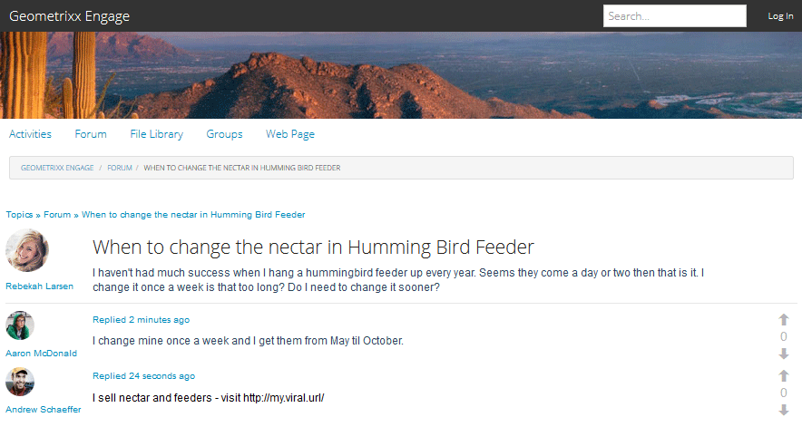
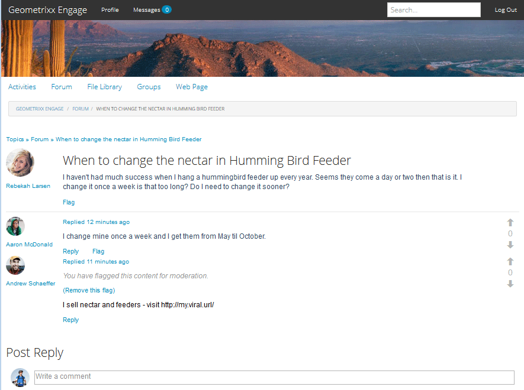
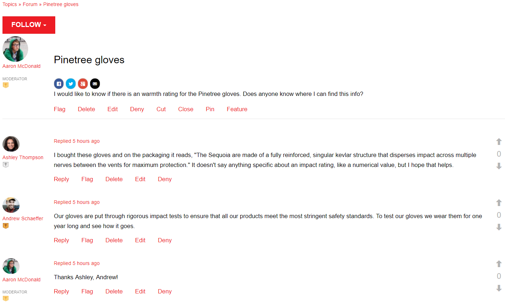
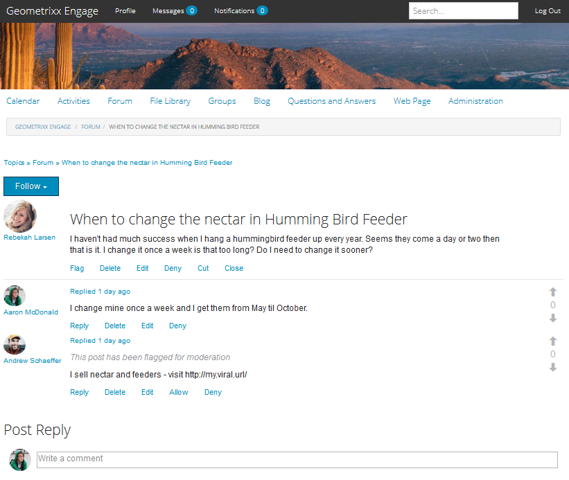
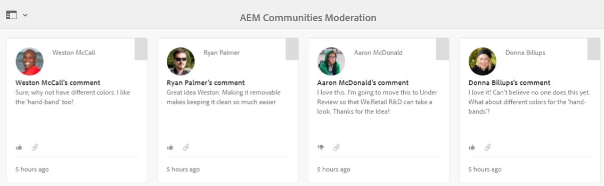

# In-Context Moderation {#in-context-moderation}

For AEM Communities, moderation may be performed by administrators and trusted community members directly on the published page where the community content was posted.

When using a [moderation console](moderation.md), the information displayed for the content includes a link to the published page to allow access to additional moderation actions available when moderating in-context.

## Moderation Actions {#moderation-actions}

Visit the moderation overview for a description of [moderation actions](moderate-ugc.md#moderation-actions).

## Moderation UI {#moderation-ui}

The UI presented to the moderator on the publish instance is contained within the dialog for posting and managing user generated content (UGC). The elements of the UI are determined by the status of the site visitor - whether they are...

1. The member who posted the content.
1. A trusted member moderator.
1. An administrator.
1. Signed in, but neither an administrator, moderator, nor author of the content.
1. Not signed in.

## Example {#example}

Using the [Geometrixx Engage](http://localhost:4503/content/sites/engage/en.html) site created when [Getting Started with AEM Communities](getting-started.md), it is possible to quickly setup a thread in a forum on which to experience various moderation activites in the publish environment, as seen below.

Aaron McDonald (aaron.mcdonald@mailinator.com) was identified as a trusted community member by adding him to the community-engage-moderators group when creating the site.

Rebekah Larsen (rebekah.larsen@trashymail.com) can be added as a member of community-engage-members group using the [Members console](members.md).

For more on community user groups, visit [Managing Users and User Groups](users.md).

### Create the Forum Posts {#create-the-forum-posts}

* Log In as Rebekah Larsen (rebekah.larsen@trashymail.com)

  * Select Forum
  * Select New Post
  * Enter the Subject

    When to change the nectar in Humming Bird Feeder

  * Enter the body text

    I haven't had much success when I hang a hummingbird feeder up every year. Seems they come a day or two then that is it. I change it once a week is that too long? Do I need to change it sooner?

  * Select Post
  * Select Log Out

* Log In as Aaron McDonald (aaron.mcdonald@mailinator.com)

  * Select Forum
  * For the Hummingbird Topic, select Read More
  * Enter the comment for Post Reply

    I change mine once a week and I get them from May til October.

  * Select Reply
  * Select Log Out

* Log In as Andrew Schaeffer (andrew.schaeffer@trashymail.com)

  * Select Forum
  * For the Hummingbird Topic, select Read More
  * Enter the comment for Post Reply

    I sell nectar and feeders - visit https://my.viral.url/

  * Select Reply
  * Select Log Out

### Anonymous Site Visitor (#5) {#anonymous-site-visitor}

Following is a view of the forum seen by a site visitor who is not signed in (5).

An anonymous site visitor may only view the forum, but my not post any content nor perform any moderation actions.

### New Member (#4) {#new-member}

On author, log in as admin and add Boyd Larsen (boyd.larsen@dodgit.com) as a new member of community-engage-members group using the [Members console](members.md), then Log Out.

On publish, log in as Boyd Larsen and access the thread by selecting `Forum`, and then `Read more` for the hummingbird post.

Notice:

* Boyd has not participated in the forum.
* Boyd cannot Delete anything.
* Boyd is signed in and can Reply or Flag content.

Have Boyd select Flag to flag the content posted by Andrew.

Log Out

### Administrator (#3) {#administrator}

Log In as an Administrator (admin) and access the thread by selecting Forum, and then Read more for a post.

Notice:

* Admin can Flag, Delete, Edit, Deny, Cut, Close, Pin, Feature.
* Admin may select Administration to access the moderation console.

Select Administration menu item to access the [moderation console](moderation.md) from the publish environment.

Notice that, for an administrator, all moderatable content is visible, not just content from the Geometrixx Engage community site.

The search filter is a sidepanel that toggles open or closed.

Log Out.

### Community Moderator (#2) {#community-moderator}

Log In as Aaron McDonald (aaron.mcdonal@mailinator.com), a community moderator, and access the thread by selecting Forum, and then Read more for the hummingbird post.

Notice:

* Aaron can Reply, Delete, Edit, or Deny his own post.
* Aaron can also Flag/Allow, Reply, Delete, Edit, Deny other content.
* Aaron can Cut the forum topic to move it to another forum for which he moderates.
* Aaron may select Administration to access the moderation console.

Select Administration menu item to access the [moderation console](moderation.md) from the publish environment.

Notice that, for a community moderator, only moderatable content from the Geometrixx Engage community site is visible.

Notice the community moderator has the same options as the administrator (image is with search sidebar toggled closed), but no access to other AEM consoles.

Log Out.

### Content Author (#1) {#content-author}

Log In as Rebekah Larsen (rebekah.larsen@mailinator.com), a community member who started the thread, and access the thread by selecting Forum, and then Read more for the hummingbird post.

Notice:

* Rebekah can Delete or Edit her own post.
* Rebekah can also Reply to or Flag other content.
* Rebekah cannot access the moderation console.

