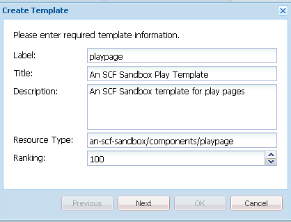

# Initial Sandbox Application {#initial-sandbox-application}

In this section, you will create the following:

* The **[template](#createthepagetemplate)** that will be used to create content pages in the example website
* The **[component and script](#create-the-template-s-rendering-component)** that will be used to render the website pages

## Create the Content Template {#create-the-content-template}

A template defines the default content of a new page. Complex websites may use several templates for creating the different types of pages in the site. Further, the set of templates may become a blueprint used to rollout changes to a cluster of servers.

In this exercise, all pages are based on one simple template.

1. In the explorer pane of CRXDE Lite

    * select `/apps/an-scf-sandbox/templates` 
    * **[!UICONTROL Create > Create Template]**

1. In the Create Template dialog, type the following values and then click **[!UICONTROL Next]**:

    * Label: `playpage`
    * Title: `An SCF Sandbox Play Template`
    * Description: `An SCF Sandbox template for play pages` 
    * Resource Type: `an-scf-sandbox/components/playpage`
    * Ranking: &lt;leave as default&gt;

   The Label is used for the node name.

   The Resource Type appears on the `playpage`'s jcr:content node as the property `sling:resourceType`. It identifies the component (resource) that renders the content when requested by a browser.

   In this case, all pages created using the `playpage`template are rendered by the `an-scf-sandbox/components/playpage` component. By convention, the path to the component is relative, allowing Sling to search for the resource first in the `/apps` folder and, if not found, in the `/libs` folder.

   

1. If using copy/paste, ensure the Resource Type value has no leading or trailing spaces.

   Click **[!UICONTROL Next]**.

1. "Allowed Paths" refers to the paths of pages which use this template, such that the template is listed for the **[!UICONTROL New Page]** dialog.

   To add a path, click the plus button `+` and type `/content(/.&ast;)?` in the text box that appears. If using copy/paste, ensure there are no leading or trailing spaces.

   Note: The value of the allowed path property is a *regular expression.* Content pages that have a path that matches the expression can use the template. In this case, the regular expression matches the path of the **/content** folder and all its subpages.

   When an author creates a page below `/content`, the `playpage`template titled "An SCF Sandbox Page Template" appears in a list of available templates to use.

   After the root page is created from the template, access to the template could be restricted to this website by modifying the property to include the root path in the regular expression, i.e..

   `/content/an-scf-sandbox(/.&ast;)?`

   

1. Click **[!UICONTROL Next]**.

   Click **[!UICONTROL Next]** in the **[!UICONTROL Allowed Parents]** panel.

   Click **[!UICONTROL Next]** in the **[!UICONTROL Allowed Children]** panels.

   Click **[!UICONTROL OK]**.

1. Once you click OK and finish creating the template, you will notice red triangles showing in the corners of the Properties tab values for the new `playpage`template. These red triangles indicate edits which have not been saved.

   Click **[!UICONTROL Save All]** to save the new template to the repository.

   

### Create the Template's Rendering Component {#create-the-template-s-rendering-component}

Create the *component* that defines the content and renders any pages created based on the [playpage template](#createthepagetemplate).

1. In CRXDE Lite, right-click **`/apps/an-scf-sandbox/components`** and click **[!UICONTROL Create > Component]**.
1. By setting the node's name (Label) to *playpage*, the path to the component is  

   `/apps/an-scf-sandbox/components/playpage` 

   which corresponds to the Resource Type of the playpage template (optionally minus the initial **`/apps/`** part of the path).

   In the **[!UICONTROL Create Component]** dialog, type the following property values:

    * Label: **playpage**
    * Title: **An SCF Sandbox Play Component**
    * Description: **This is the component which renders content for An SCF Sandbox page.**
    * Super Type: *&lt;leave blank&gt;*
    * Group:

   

1. Click **[!UICONTROL Next]** until the **[!UICONTROL Allowed Children]** panel of the dialog appears

    * Click **[!UICONTROL OK]**
    * Click **[!UICONTROL Save All]**

1. Verify that the path to the component and the resourceType for the template match.

   >[!CAUTION]
   >
   >The correspondence between the path to the playpage component and the sling:resourceType property of the playpage template is crucial to the correct functioning of the website.

   