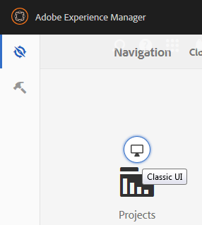
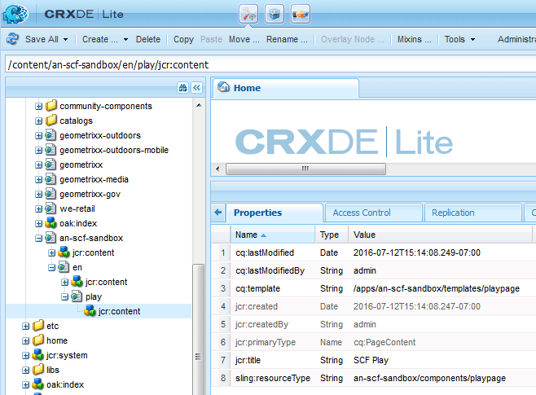

# Initial Sandbox Content {#initial-sandbox-content}

In this section, you create the following pages which all use the [page template](initial-app.md#createthepagetemplate):

* SCF Sandbox Site, which will redirect to the English version of the main page

    * SCF Sandbox - The main page for the English version of the site

        * SCF Play - Child of the main page on which to play

Although this tutorial does not delve into [language copies](../../help/sites-administering/tc-prep.md), it is designed so the root page may implement detection of the preferred language for the user through the HTML header, and redirect to the appropriate main page for the language. The convention is to use the two-letter country code for the node name of the page, e.g., "en" for English, "fr" for French, and so on.

## Create First Pages {#create-first-pages}

Now that there is a [page template](initial-app.md#createthepagetemplate), we can establish the root page of the website in the /content directory.

1. The standard UI currently provides blueprints for creating sites. As this tutorial is creating a simple site, the classic UI is useful.

   To switch to the classic UI, select global navigation and hover over the right side of the Projects icon. Select the *Switch to Classic UI* icon which appears:

   

   The ability to switch to the classic UI must be [enabled by an administrator](../../help/sites-administering/enable-classic-ui.md).

1. From the [classic UI Welcome page](http://localhost:4502/welcome.html), select **[!UICONTROL Websites]**.

   

   Alternatively, access the classic UI for Websites directly by browsing to [/siteadmin.](http://localhost:4502/siteadmin)

1. In the explorer pane, select **[!UICONTROL Websites]** and then in the toolbar select **[!UICONTROL New > New Page]**.

   In the **[!UICONTROL Create Page]** dialog, enter the following:

    * Title: `SCF Sandbox Site`
    * Name: `an-scf-sandbox`
    * Select **[!UICONTROL An SCF Sandbox Play Template]**
    * Click **[!UICONTROL Create]**

   

1. In the explorer pane, select the page you just created, `/Websites/SCF Sandbox Site`, and click **[!UICONTROL New > New Page]**:

    * Title: `SCF Sandbox`
    * Name: `en`
    * Select **[!UICONTROL ]An SCF Sandbox Play Template**
    * Click **[!UICONTROL ]Create**

1. In the explorer pane, select the page you just created, `/Websites/SCF Sandbox Site/SCF Sandbox`, and click **[!UICONTROL New > New Page]**

    * Title: `SCF Play`
    * Name: `play`
    * Select **[!UICONTROL An SCF Sandbox Play Template]**
    * Click **[!UICONTROL Create]**

1. This is how the website now appears in the Websites console. Notice that child pages of the item selected in the explorer pane are displayed in the right pane where they can be managed.

   

   This is the repository view of what was created using the Website tool and the template:

   

## Add the Design Path {#add-the-design-path}

When ` [/etc/designs/an-scf-sandbox](setup-website.md#setupthedesigntreeetcdesigns)` was created using the designs section of the Tools console, the property ``

* `cq:template="/libs/wcm/core/templates/designpage"`

was defined, which provides the optional ability to reference design assets in a script using `currentDesign.getPath()`. For example

* &lt;% String favIcon = currentDesign.getPath() + "/favicon.ico"; %&gt;

    * Name: `cq:designPath`
    * Type: `String`
    * Value: `/etc/designs/an-scf-sandbox`

* Click the green `[+] Add`

The respository should appear as follows:  

* Click **[!UICONTROL Save All]**

[ Trouble saving? Re-login! ]

>[!NOTE]
>
>The use of cq:designPath is optional and is unrelated to the [use of clientlibs](develop-app.md#includeclientlibsintemplate), which are essentially required as the SCF components use [clientlibs](client-customize.md#clientlibs-for-scf) to manage their JS and CSS.

