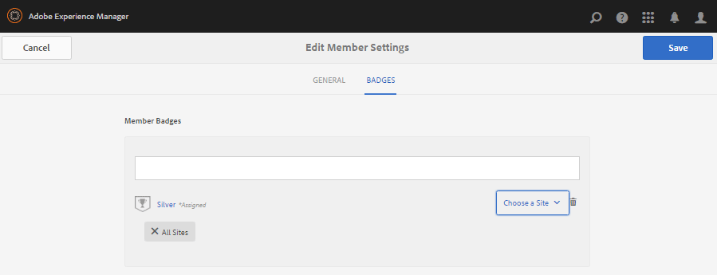

# Members & Groups Management Consoles {#members-groups-management-consoles}

## Overview {#overview}

AEM Communities features often require site visitors to be registered and signed-in before participating in a community in the publish environment. Their user registration need only exist in the publish environment and they are commonly referred to as *members* to distinguish them from *users* registered in the author environment.

### Members (Users) on Publish {#members-users-on-publish}

Using the Communities Members and Groups consoles, members and member groups registered in the *publish* environment may be created and managed from the *author* environment. This is only possible when the [tunnel service](deploy-communities.md#tunnel-service-on-author) is enabled.

### Users on Author {#users-on-author}

For managing users and groups registered in the *author* environment, is is necessary to use the platform's security console:

* From global navigation, select **[!UICONTROL Tools]** > **[!UICONTROL Security]** > **[!UICONTROL Users]**.
* From global navigation, select **[!UICONTROL Tools]** > **[!UICONTROL Security]** > **[!UICONTROL Groups]**.

>[!NOTE]
>
>With sample content deployed and enabled, many sample users exist in both the author and publish environments. These users will not be present when running with [nosamplecontent runmode](../../help/sites-administering/production-ready.md).

## Members Console {#members-console}

In the author environment, to reach the Members console for managing members registered in the publish environment:

* From global navigation, select **[!UICONTROL Navigation]** > **[!UICONTROL Communities]** > **[!UICONTROL Members]**

>[!CAUTION]
>
>It will not be possible to use the Members console if the [tunnel service](deploy-communities.md#tunnel-service-on-author) is not enabled.

### Search {#search-features}

Select the side panel icon on the left side of the `Members` header to toggle open the search side panel.

 

Select the search icon on the left side of the `Members` header to toggle the search side panel closed.

### Member Statistics {#member-statistics}

The columns displaying `Views`, `Posts`, `Follows` and `Likes` are updated when the user is a member of one or more community sites with Adobe Analytics [enabled](sites-console.md#analytics).

### Export CSV {#export-csv}

Selecting the `Export CSV` link results in downloading all members as a list of comma-separated values, suitable for importing into a spreadsheet.

The column headers are

`| Screen Name |Last Name |First Name |Status |Views |Posts |Follows |Likes |`

## Create New Member {#create-new-member}

Select `Create Member` to create a user in the publish environment.

### GENERAL - Member Details {#general-member-details}

Most fields are optional fields the member can later fill-in on their profile.

* **[!UICONTROL ID]**

(*Required*) The authorizable ID is the member's sign-in ID.
By default, the ID is set to the value of the required email address.
*Once created, the ID may not be modified*.

* **[!UICONTROL Email Address]**

(*Required*) The member's email address.
The member may change their email address when updating their profile.I
If the ID defaulted to the email address, the ID will *not* change when the email address is changed.

* **[!UICONTROL Password]**

  (*Required*) The sign-in password.

* **[!UICONTROL Retype Password]**

  (*Required*) Re-enter the password for verification.

* **[!UICONTROL Add Member to Sites]**

  (*Optional*) Select from existing community sites to add the member to the community site's members group.

* **[!UICONTROL Add Member to Groups]**
 
  (*Optional*) Select from existing member groups to add the member to that group.

* Select **[!UICONTROL Save]**

### GENERAL - Account settings {#general-account-settings}

Under Account settings it is possible for a community administrator to:

* **[!UICONTROL Status]**
  * Banned
    A member is unable to sign in, preventing them from viewing pages or participating in activities which require sign in. They may still anonymously visit an open community site.

  * Not Banned
    A member has full access to the community site.

  Default is `Not Banned`.

* **[!UICONTROL Contribution Limits]**
  
  If checked, the member's ability to post content is limited.
  Default depends on the configuration of contribution limits.
  See [Member Contribution Limits](limits.md).

* **[!UICONTROL Change Password]**
  
  A link that is present when modifying an existing member. Provides the ability for a community administrator to reset a password for a member.

### GENERAL - Photo {#general-photo}

To provide an avatar for the member, begin by selecting **[!UICONTROL Upload Image]** and choose an image of type .jpg, .png, .tif, or .gif. The preferred size for an image is 240 x 240 pixels at 72 dpi.

### GENERAL - Add Member to Sites {#general-add-member-to-sites}

The member may be added to one or more community sites' members groups. Begin by entering text in the text box.

### GENERAL - Add Member to Groups {#general-add-member-to-groups}

The member may be added to one or more members groups. Begin by entering text in the text box.

### BADGES tab {#badges-tab}

The `BADGES` panel provides the ability to manually assign badges as well as revoke them. The badges may be for assigned roles as well as badges typically earned.

See also [Scoring and Badges](implementing-scoring.md).

* **[!UICONTROL Add badges]**
  * Begin typing to select from [available badges](badges.md). Once a badge is selected, choose each site, or all sites, on which the badge should be displayed along with the member's avatar.
  * Multiple badges and sites may be chosen.
* **[!UICONTROL Remove badges]**
  * Select the trash can icon next to a badge to remove it.

## Groups Console {#groups-console}

The Groups console, available from the author environment, allows for the creation and management of member groups registered in the publish environment. It is particularly useful for [Privileged member groups](users.md#privilegedmembersgroups).

To access the Groups console:
* From global navigation, select **[!UICONTROL Navigation]** > **[!UICONTROL Communities]** > **[!UICONTROL Groups]**.

>[!CAUTION]
>
>It will not be possible to use the Groups console if the [tunnel service](deploy-communities.md#tunnel-service-on-author) is not enabled.

### Create New Group {#create-new-group}

Select `Add Group` to create a group in the publish environment.

The required fields for creating a new publish-side member group are:

* **[!UICONTROL ID]**
  
  (*Required*) The group unique ID. 
  
  *Once created, the ID may not be modified.*

* **[!UICONTROL Name]**
  
  (*Optional*) The display name for the group.

  The default value is the ID.

* **[!UICONTROL Description]**
  
  (*Optional*) A description of the group's purpose and permissions.

* **[!UICONTROL Add Members To Group]**
  
  (*Optional*) Select publish-side members to be included as initial members of the group.

* Select **[!UICONTROL Save]**

## Authorized Administrators {#authorized-administrators}

When working with members in the Communities members console, it is necessary to be signed in as a user with appropriate permissions, and for the replication agent used by the [tunnel service](deploy-communities.md#tunnel-service-on-author) to be correctly configured.

If not signed in as `admin`, then the signed in user must be a member of the `administrators` user group.

See also [Replication Agents on Author](deploy-communities.md#replication-agents-on-author).
