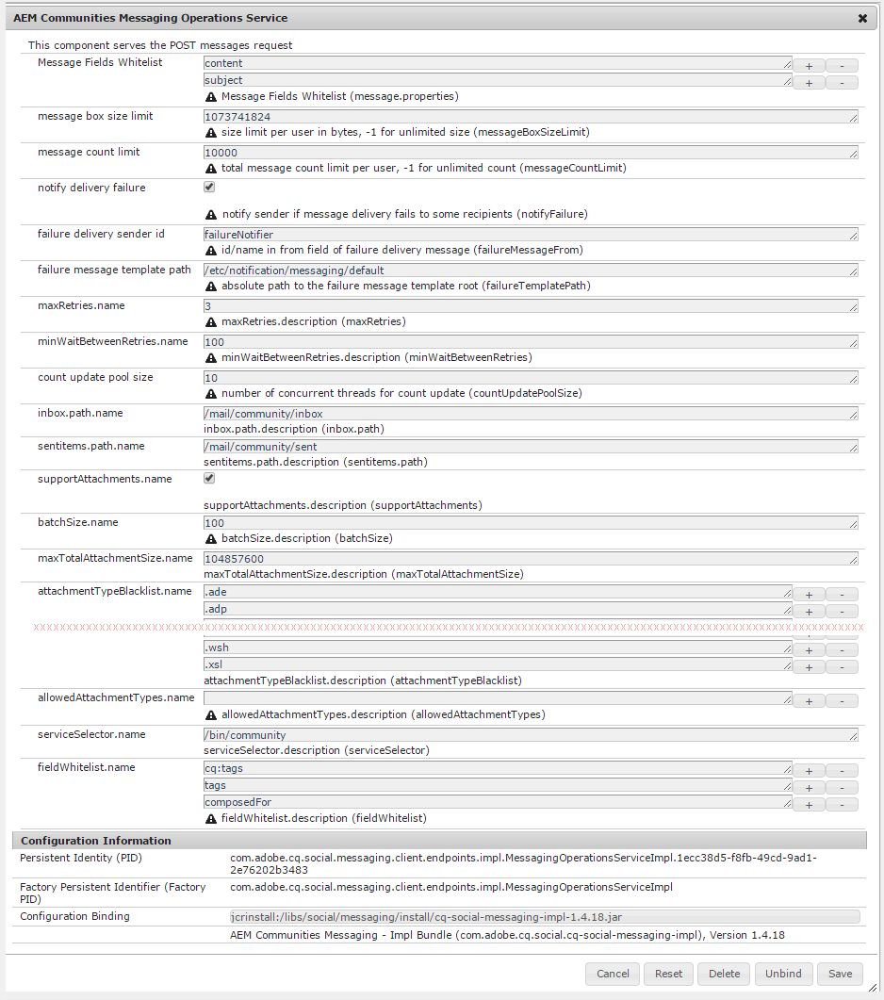
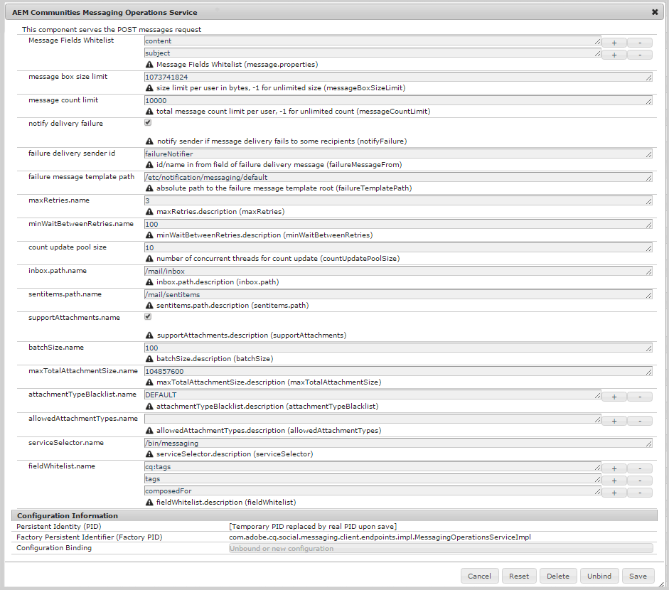

# Configuring Messaging {#configuring-messaging}

## Overview {#overview}

The messaging feature for AEM Communities provides the ability for signed-in site visitors (members) to send messages to one another that are accessible when signed into the site.

Messaging is enabled for a community site by checking a box during [community site creation](sites-console.md).

On this page is information on the default configuration and possible adjustments.

For additional information for developers, see [Messaging Essentials](essentials-messaging.md).

## Messaging Operations Service {#messaging-operations-service}

The [AEM Communities Messaging Operations Service](http://localhost:4502/system/console/configMgr/com.adobe.cq.social.messaging.client.endpoints.impl.MessagingOperationsServiceImpl) identifies the endpoint which handles messaging related requests, the folders the service should use for storing messages, and if messages may include file attachments, what file types are allowed.

For community sites created using the [Communities Sites console](sites-console.md), an instance of the service already exists, with the inbox set to `/mail/community/inbox`.

### Community Messaging Operations Service {#community-messaging-operations-service}

As shown below, a configuration of the service exists for sites created with the [site creation wizard](sites-console.md). The configuration can be viewed or edited by selecting the pencil icon next to the configuration:

### New Configuration {#new-configuration}

To add a new configuration, select the plus '**+**' icon next to the service's name:

* **[!UICONTROL Message Fields Whitelist]** 
  Specifies the properties of the Compose Message component users can edit and persist. If new form elements are added, then the element id would need to be added if desired to be stored in SRP. Default is two entries: *subject* and *content*.

* **[!UICONTROL Message box size limit]** 
  The maximum number of bytes in each user's message box. Default is *1073741824* (1 GB).

* **[!UICONTROL Message count limit]** 
  The total number of messages allowed per user. A value of -1 indicates an unlimited number of messages is allowed, subject to the message box size limit. Default is *10000* (10k).

* **[!UICONTROL Notify delivery failure]** 
  If checked, notify sender if message delivery fails to some recipients. Default is *checked*.

* **[!UICONTROL Failure delivery sender id]** 
  Name of sender which appears in delivery failed message. Default is *failureNotifier*.

* **[!UICONTROL Failure message template path]** 
  Absolute path to the delivery failed message template root. Default is */etc/notification/messaging/default*.

* **[!UICONTROL maxRetries.name]** 
  Number of times to try resending message which fails to be delivered. Default is *3*.

* **[!UICONTROL minWaitBetweenRetries.name]** 
  Number of seconds to wait between attempts to resend message upon failure to send. Default is *100 *(seconds).

* **[!UICONTROL Count update pool size]** 
  Number of concurrent threads used for count update. Default is *10*.

* **[!UICONTROL inbox.path.name]** 
  (*Required*) The path, relative to the user's node (/home/users/*username*), to use for the **`inbox`** folder. The path must NOT end with a trailing forward slash '/'. Default is */mail/inbox* .

* **[!UICONTROL sentitems.path.name]** 
  (*Required*) The path, relative to the user's node (/home/users/*username*), to use for the **`senditems`** folder. The path must NOT end with a trailing forward slash '/'. Default is */mail/sentitems* .

* **[!UICONTROL supportAttachments.name]** 
  If checked, users are able to add attachments to their messages. Default is *checked*.

* **[!UICONTROL batchSize.name]** 
  Number of messages to batch together for a send when sending to a large group of recipients. Default is *100*.

* **[!UICONTROL maxTotalAttachmentSize.name]** 
  If supportAttachments is checked, this value specifies the maximum allowed total size (in bytes) of all attachments. Default is *104857600* (100 MB).

* **[!UICONTROL attachmentTypeBlacklist.name]** 
  A blacklist of file extensions, prefixed with '**.**', that will be rejected by the system. If not blacklisted, then the extension is allowed. Extensions may be added or removed using the '**+**' and '**-**' icons. Default is *DEFAULT*.

* **[!UICONTROL allowedAttachmentTypes.name]** 
  **(*Action Required*)** A whitelist of file extensions, the opposite of the blacklist. To allow all file extensions, except for those blacklisted, use the '**-**' icon to remove the single empty entry.

* **[!UICONTROL serviceSelector.name]**
  (*Required*) An absolute path (endpoint) through which the service is invoked (a virtual resource). The root of the path chosen must be one included in the *Execution Paths* configuration setting of OSGi config [ `Apache Sling Servlet/Script Resolver and Error Handler`](http://localhost:4502/system/console/configMgr/org.apache.sling.servlets.resolver.SlingServletResolver), such as `/bin/`, `/apps/`, and `/services/`. To select this configuration for a site's messaging feature, this endpoint is provided as the **`Service selector`** value for the `Message List and Compose Message components` (see [Message Feature](configure-messaging.md)). The default is */bin/messaging* .

* **[!UICONTROL fieldWhitelist.name]**
  Use **Message Fields Whitelist**.

>[!CAUTION]
>
>Each time a `Messaging Operations Service` configuration is opened for edit, if `allowedAttachmentTypes.name` had been removed, an empty entry is re-added to make the property configurable. A single empty entry effectively disables file attachments.
>
>To allow all file extensions, except for those blacklisted, use the '**-**' icon to (again) remove the single empty entry before clicking **[!UICONTROL Save]**.

## Troubleshooting {#troubleshooting}

One way to troubleshoot problems is to enable [debugging messages in the log.](../../help/sites-administering/troubleshooting.md)

See also [Loggers and Writers for Individual Services](../../help/sites-deploying/configure-logging.md#loggers-and-writers-for-individual-services).

The package to monitor is `com.adobe.cq.social.messaging`.
