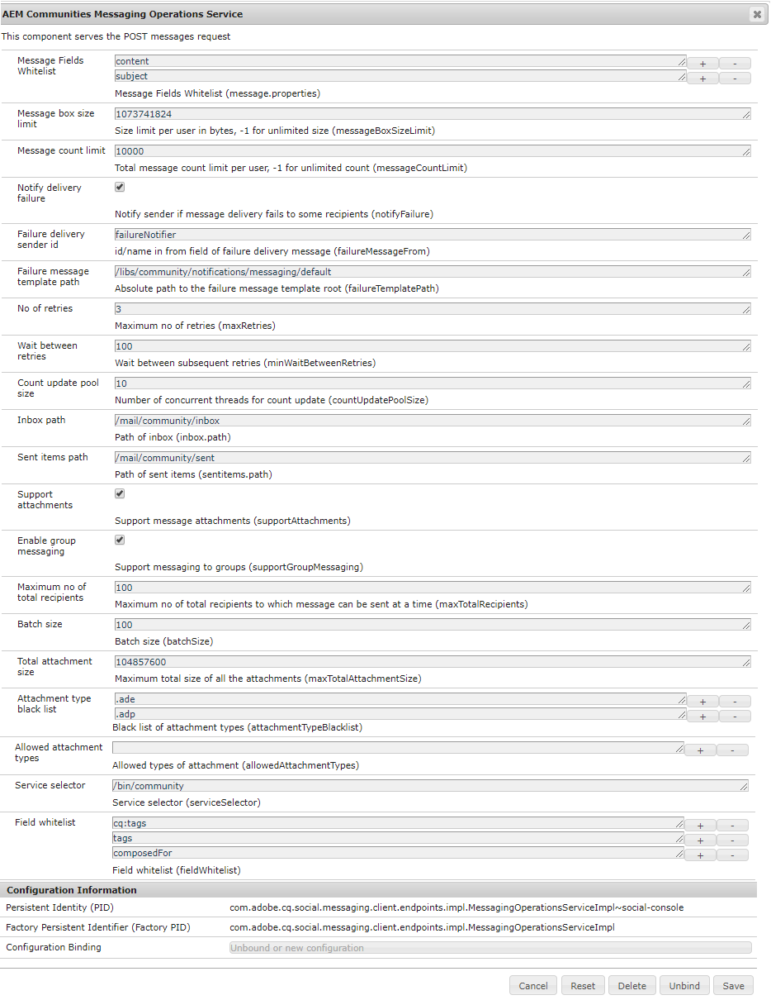
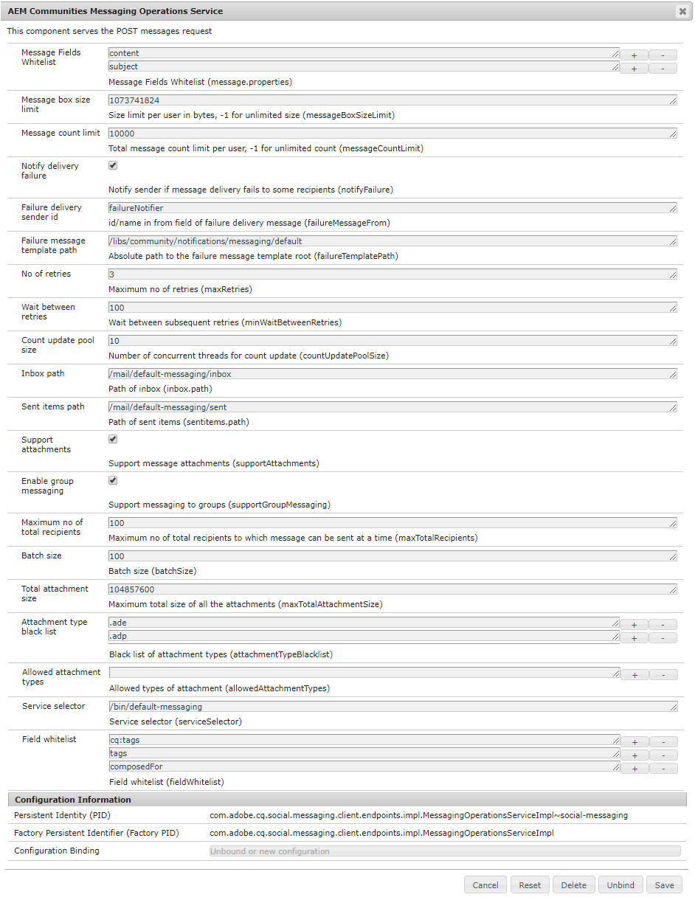

# Configure Messaging {#configure-messaging}

## Overview {#overview}

The messaging feature for AEM Communities provides the ability for signed-in site visitors (members) to send messages to one another that are accessible when signed into the site.

Messaging is enabled for a community site by checking a box during [community site creation](/help/communities/sites-console.md).

This page has information on the default configuration and possible adjustments.

For additional information for developers, see [Messaging Essentials](/help/communities/essentials-messaging.md).

## Messaging Operations Service {#messaging-operations-service}

The configuration [AEM Communities Messaging Operations Service](https://localhost:4502/system/console/configMgr/com.adobe.cq.social.messaging.client.endpoints.impl.MessagingOperationsServiceImpl) identifies the endpoint which handles messaging related requests, the folders the service should use for storing messages, and if messages may include file attachments, what file types are allowed.

For community sites created using the `Communities Sites console`, an instance of the service already exists, with the inbox set to `/mail/inbox`.

### Community Messaging Operations Service {#community-messaging-operations-service}

As shown below, a configuration of the service exists for sites created with the [site creation wizard](/help/communities/sites-console.md). The configuration can be viewed or edited by selecting the pencil icon next to the configuration.

### Add new configuration {#add-new-configuration}

To add a new configuration, select the plus '**+**' icon next to the service's name :

* **Message Fields Allowlist**
  
  Specifies the properties of the Compose Message component users can edit and persist. If new form elements are added, then the element id would need to be added if desired to be stored in SRP. Default is two entries: *subject* and *content*.

* **Message box size limit**
  
  The maximum number of bytes in each user's message box. Default is *1073741824* (1 GB).

* **Message count limit**
  
  The total number of messages allowed per user. A value of -1 indicates an unlimited number of messages is allowed, subject to the message box size limit. Default is *10000* (10k).

* **Notify delivery failure**
  
  If checked, notify sender if message delivery fails to some recipients. Default is *checked*.

* **Failure delivery sender id**
  
  Name of sender which appears in delivery failed message. Default is *failureNotifier*.

* **Failure message template path**
  
  Absolute path to the delivery failed message template root. Default is */etc/notification/messaging/default*.

* **No of retries**
  
  Number of times to try resending message which fails to be delivered. Default is *3*.

* **Wait between retries**
  
  Number of seconds to wait between attempts to resend message upon failure to send. Default is *100* (seconds).

* **Count update pool size**
  
  Number of concurrent threads used for count update. Default is *10*.

* **Inbox path**
  
  (*Required*) The path, relative to the user's node (/home/users/*username*), to use for the `inbox` folder. The path must NOT end with a trailing forward slash '/'. Default is */mail/inbox*.

* **Sent items path**
  
  (*Required*) The path, relative to the user's node (/home/users/*username*), to use for the `sent items` folder. The path must NOT end with a trailing forward slash '/'. Default is */mail/sentitems* .

* **Support attachments**
  
  If checked, users are able to add attachments to their messages. Default is *checked*.

* **Enable group messaging**
  
  If selected, registered users can send bulk message to a group of members. Default is *deselected*.

* **Maximum no. of total recipients**
  
  If group messaging is enabled, specify the maximum number of recipients to which group message can be sent at a time. Default is *100*.

* **Batch size**
  
  Number of messages to batch together for a send when sending to a large group of recipients. Default is *100*.

* **Total attachment size**
  
  If supportAttachments is checked, this value specifies the maximum allowed total size (in bytes) of all attachments. Default is *104857600* (100 MB).

* **Attachment type blocklist**
  
  A blocklist of filename extensions, prefixed with '**.**', that will be rejected by the system. If not blocklisted, then the extension is allowed. Extensions may be added or removed using the '**+**' and '**-**' icons.

* **Allowed attachment types**
  
  **(*Action Required*)** An allowlist of filename extensions, the opposite of the blocklist. To allow all filename extensions, except for those blocklisted, use the '**-**' icon to remove the single empty entry.

* **Service selector**
  
  (*Required*) An absolute path (endpoint) through which the service is called (a virtual resource). The root of the path chosen must be one included in the *Execution Paths* configuration setting of OSGi config [ `Apache Sling Servlet/Script Resolver and Error Handler`](https://localhost:4502/system/console/configMgr/org.apache.sling.servlets.resolver.SlingServletResolver), such as `/bin/`, `/apps/`, and `/services/`. To select this configuration for a site's messaging feature, this endpoint is provided as the **`Service selector`** value for the `Message List and Compose Message components` (see [Message Feature](/help/communities/configure-messaging.md)).
  
  The default is */bin/messaging* .

* **Field Allowlist**
  
  Use **Message Fields Allowlist**.

>[!CAUTION]
>
>Each time a `Messaging Operations Service` configuration is opened for edit, if `allowedAttachmentTypes.name` had been removed, an empty entry is re-added to make the property configurable. A single empty entry effectively disables file attachments.
>
>To allow all filename extensions, except for those blocklisted, use the '**-**' icon to (again) remove the single empty entry before clicking **Save**.

## Group Messaging {#group-messaging}

To allow registered users to send direct messages in bulk to user groups, make sure to **Enable group messaging** in the following two instances of **Messaging Operation Services** configuration:

* `com.adobe.cq.social.messaging.client.endpoints.impl.MessagingOperationsServiceImpl~social-console`
* `com.adobe.cq.social.messaging.client.endpoints.impl.MessagingOperationsServiceImpl~social-messaging`

**Messaging Operations Service: social console**

**Messaging Operations Service: social messaging**

## Troubleshooting {#troubleshooting}

One way to troubleshoot problems is to enable [debugging messages in the log.](/help/sites-administering/troubleshooting.md)

See also [Loggers and Writers for Individual Services](/help/sites-deploying/configure-logging.md#loggers-and-writers-for-individual-services).

The package to monitor is `com.adobe.cq.social.messaging`.
