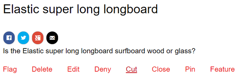
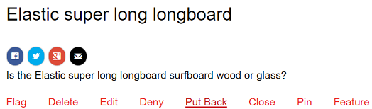
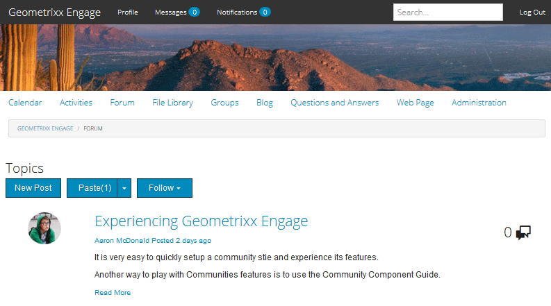
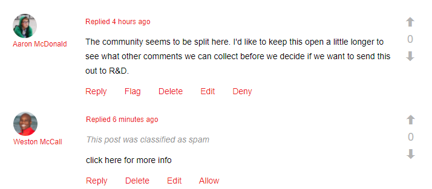
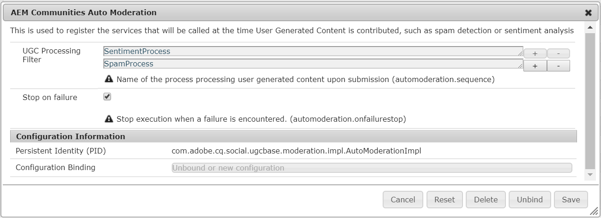

# Moderating Community Content {#moderating-community-content}

## Overview {#overview}

Community content, also known as user generated content (UGC), is created when a member (signed in site visitor) posts content from a published community site through interaction with one of the following community components :

* [Blog](/help/communities/blog-feature.md): members post a blog article or comment.
* [Calendar](/help/communities/calendar.md): members post a calendar event or comment.
* [Comments](/help/communities/comments.md): members post a comment or reply to a comment.

* [Forum](/help/communities/forum.md): members post a new topic or reply to a topic.
* [Ideation](/help/communities/ideation-feature.md): members post an idea or comment.
* [QnA](/help/communities/working-with-qna.md): members create a question or answer a question.
* [Reviews](/help/communities/reviews.md): members post a comment when rating an item.

Moderation of UGC is useful for recognizing positive contributions as well as limiting negative ones (such as spam and abusive language). UGC can be moderated from several environments: 

* [Community content storage](working-with-srp.md)

* [Bulk moderation console](moderation.md)

  The Moderation console is accessible by administrators and [community moderators](/help/communities/users.md) in the public environment as well as by administrators in the author environment. This is possible when community content is stored in a [common store](/help/communities/working-with-srp.md).

* [In-context moderation](in-context.md)

  Moderation in the publish environment may be performed by administrators and community moderators directly on the page where the content was posted.

## Moderation Actions {#moderation-actions}

The actions which can be performed on posted content (UGC) varies depending on the user identity and the environment. The table below uses the following terminology to describe the various roles according to user identity :

* `Admin`
  
  A user who is a member of [community-administrators](users.md) group.

* `Moderator`
  
  A member of a [community moderators](users.md#publishenvironmentusersandgroups) group (has [moderator permissions](in-context.md#moderatorpermissions)).

* `Creator`
  
  The user who posted the content.

* `Member`
  
  A signed-in user without special permissions.

* `Visitor`
  
  An anonymous user.

<table>
 <tbody>
  <tr>
   <td> </td>
   <td><strong>Admin</strong></td>
   <td><strong>Moderator</strong></td>
   <td><strong>Creator</strong></td>
   <td><strong>Member</strong></td>
   <td><strong>Visitor</strong></td>
   <td><strong>Event  Triggered</strong></td>
   <td><strong>Premoderated</strong></td>
  </tr>
  <tr>
   <td><strong>Edit/  Delete</strong></td>
   <td>X</td>
   <td>X</td>
   <td>X</td>
   <td> </td>
   <td> </td>
   <td> </td>
   <td> </td>
  </tr>
  <tr>
   <td><strong>Cut</strong></td>
   <td>X</td>
   <td>X</td>
   <td> </td>
   <td> </td>
   <td> </td>
   <td> </td>
   <td> </td>
  </tr>
  <tr>
   <td><strong>Deny</strong></td>
   <td>X</td>
   <td>X</td>
   <td> </td>
   <td> </td>
   <td> </td>
   <td>X</td>
   <td> </td>
  </tr>
  <tr>
   <td><strong>Close/  Reopen</strong></td>
   <td>X</td>
   <td>X</td>
   <td> </td>
   <td> </td>
   <td> </td>
   <td>X</td>
   <td>X  </td>
  </tr>
  <tr>
   <td><strong>Flag/  Unflag</strong></td>
   <td>X</td>
   <td>X</td>
   <td> </td>
   <td>X</td>
   <td> </td>
   <td>X</td>
   <td> </td>
  </tr>
  <tr>
   <td><strong>Allow</strong></td>
   <td>X</td>
   <td>X</td>
   <td> </td>
   <td> </td>
   <td> </td>
   <td>X</td>
   <td>X</td>
  </tr>
 </tbody>
</table>

### Edit / Delete {#edit-delete}

After a post has been made, it may be edited or deleted by the creator, an administrator or community moderator.

When UGC is deleted, it is removed from the repository and may not be recovered.

### Cut {#cut}

It is possible for an administrator or community moderator to move one or more forum topics or QnA questions from one location to another. This includes from one community site to another community site, provided the same member has moderation privileges on both sites.

By selecting the Cut action, the content is copied to a clipboard. Multiple posts may be copied and moved as a group to the new location.

 

At the other location, when content is present in the clipboard, a Paste button is visible next to New Post with a number identifying the number of posts that will be pasted. The Paste button includes an option to clear the clipboard instead of pasting.

 

### Deny {#deny}

A moderator may disallow UGC to remain visible on the published site. To administrators and community moderators, the post is still available and is annotated as spam.

### Close / Reopen {#close-reopen}

The Close action operates on the entire thread of conversation (a forum topic or the initial comment) and it includes all subsequent posts or replies.

When closed, not only are no further replies possible, no moderation actions are allowed either.

To perform any operations, the topic or comment must be Reopened.

The Close/Reopen action may be taken by administrators or community moderators.

### Flag / Unflag {#flag-unflag}

Flagging is a means for any signed-in member, except for the creator of the content, to indicate there is an issue with the content of a post. Once flagged, an unflag icon appears, allowing the same member to unflag the content.

In-context moderation can be configured to allow members to select a reason when flagging a post. The list of selectable flag reasons is configurable including whether or not a custom reason can be entered. The flag reason is saved with the UGC but the reason does not trigger any particular action. Only the number of flags triggers a notification. Flagged content is annotated as such, so that moderators may act on it.

The system keeps track of all the flags, who flagged, and the flag reason and sends an event when the threshhold has been reached. If the UGC is Allowed by a community moderator, these flags are archived. After allowing and archiving, if there are subsequent flaggings, they would be archived as if there had been no previous flaggings.

### Allow {#allow}

The Allow action is an option for UGC that has been Flagged, Denied or has not been approved in a pre-moderated system. The Allow action will clear any flagged or denied/spam status present and archives any flagged data.

## Common Moderation Concepts {#common-moderation-concepts}

### Premoderation {#premoderation}

When UGC is premoderated, the post will not appear on the published site until approved by a moderation action. During creation of a [community site](/help/communities/sites-console.md), checking the box [Content is Premoderated](sites-console.md#moderation) will enable premoderation for the entire site. Once components are placed on a page, components which support moderation can be configured for premoderation using a setting in their edit dialog:

* [Comments](comments.md) and [reviews](reviews.md)
  in **[!UICONTROL User Moderation]** > **[!UICONTROL Pre-Moderation]**.

* [Forum](/help/communities/forum.md), [ideation](/help/communities/ideation-feature.md), [QnA](/help/communities/working-with-qna.md), and [calendar](/help/communities/calendar.md)
  in **[!UICONTROL Settings]** > **[!UICONTROL Moderated]**.

### Spam Detection {#spam-detection}

Spam detection is an auto-moderation functionality, which filters out undesireable pieces of submitted user generated content by marking them as spam. Once enabled, it identifies whether a user generated content is spam or not based on a pre-configured collection of spam words. The default spam words are provided at

`/libs/settings/community/sites/moderation/spamdetector-conf/profiles/spam_words.txt`.

However, to customize or extend the default spam words create a set of words in the /apps directory following the structure of the default spam words by means of [overlay](/help/communities/overlay-comments.md).

A user generated post (across all the content types, for example blogs, forums, and comments) containing spam word(s) is marked with the text "This post was classified as spam" above the post.

Moderator can see such a post and mark the same to allow or deny from appearing on the site. Moderation actions on these posts can be performed either in-context or through bulk moderation UI.

To enable spam detection engine, follow these steps:

1. Open [Web Console](https://localhost:4502/system/console/configMgr), by going to `/system/console/configMgr`.

1. Locate **AEM Communities Auto Moderation** configuration, and edit it.
1. Add the **[!UICONTROL SpamProcess]** entry.

>[!NOTE]
>
>Spam detection is only implemented for English locale.

### Sentiment {#sentiment}

Sentiment is calculated based on the number of positive and negative keywords ([watchwords](#configuringwatchwords)) present in a post (UGC).

The sentiment analysis uses a set of pre-configured rules and calculates the sentiment of the UGC. The default rules are located at: `/libs/cq/workflow/components/workflow/social/sentiments/rules.`

The value the rules generate are from 1 (all negative, no positive words) to 10 (all positive, no negative words). A sentiment value of 5 is a neutral sentiment and is the default.

The rules defined in the /libs component are:

* Rule 1: set value to 1 if there are no positive words and at least one negative word.
* Rule 2: set value to 10 if there are no negative words and at least one positive word.
* Rule 3: set value to 3 if there are more negative words than positive words.
* Rule 4: set value to 8 if there are more positive words than negative words.

To overwrite or add rules, create a set of rules in the /apps directory following the structure of the default rules. Edit the sentiment configuration to identify the location of the rules.

Once analyzed, the sentiment is stored with the UGC.

From the [bulk moderation console](/help/communities/moderation.md), it is possible to filter and view UGC based on whether the sentiment is negative, neutral, or positive.

#### Watchwords {#watchwords}

AEM communities provides a *watchword analyzer* as a step in the process to evalute [sentiment](#sentiment). The contribution to the sentiment value provided by watchwords is due to a comparison of negative and positive watchwords used in the posted content, as well as forbidden words.

#### Configure Sentiment and Watchwords {#configure-sentiment-and-watchwords}

The list of positive and negative watchwords can be customized as can be the sentiment rules.

The default list of watchwords may be entered as properties of a node in the respository, similar to the default or by overriding the default by configuring the OSGi service `sentimentprocess.name` with the list of words.

The **sentimentprocess.name** may also be modified to reference the location of a custom set of sentiment rules.

To configure sentiment and watchwords:

* Log in to your author instance as an administrator.
* Open [Web Console](https://localhost:4502/system/console/configMgr).
* Locate `sentimentprocess.name`.
* Select the configuration to open in edit mode.

* **Positive Watchwords**
  
  A comma separated list of words contributing to a positive sentiment that override the defaults. Default is an empty list.

* **Negative Watchwords**
  
  A comma separated list of words contributing to a negative sentiment that override the defaults. Default is an empty list.

* **Explicit Path to Watchwords Node**
  
  The repository location of a node containing default `positive` and `negative` properties specifying default watchwords. Default is `/libs/settings/community/watchwords/default`.

* **Sentiment Rules**
  
  The repository location of the rules for calculating sentiment based on positive and negative watchwords. Default is `/libs/cq/workflow/components/workflow/social/sentiments/rules` (however, there is no longer any workflow involved).

Following is an example of a custom entry for the default watchwords, when `Explicit Path to Watchwords Node` is set to `/libs/settings/community/watchwords/default`.

### Moderator Permissions {#moderator-permissions}

The following permissions, when assigned to the same resource, are collectively referred to as `moderator permissions`:

* `Read`
* `Modify`
* `Create`
* `Delete`
* `Replicate`
