# Moderation Console {#moderation-console}

In AEM Communities, bulk [moderation of community content](/help/communities/moderate-ugc.md) is possible from both the author and publish environments by administrators and community moderators (trusted community members assigned as moderators).

Administrators and community moderators may also perform [in-context moderation](/help/communities/in-context.md) in the publish environment.

A feature of all [community sites](/help/communities/sites-console.md) is an `Administration` menu item available to users who sign in with administrative privileges. The `Administration` link provides access to the Moderation console.

From the Moderation console, administrators and community moderators will have access to all user generated content (UGC) for which they have permission to moderate. If permitted to moderate multiple sites, it is possible to view posts across all sites or filter by selected communities sites.

For more detailed information visit [Managing Users and User Groups](/help/communities/users.md).

The Moderation console supports:

* Performing moderation tasks in bulk.
* Searching UGC.
* Viewing UGC details.
* Viewing UGC author details.

Only when signed in as an administrator, or a member with ` [moderator permissions](/help/communities/in-context.md#identifyingtrustedmembers)`, may moderation tasks be performed.

## Publish Environment Access {#publish-environment-access}

Access to the Moderation console from a published community site is through an Administration link which appears when a community moderator is signed in.

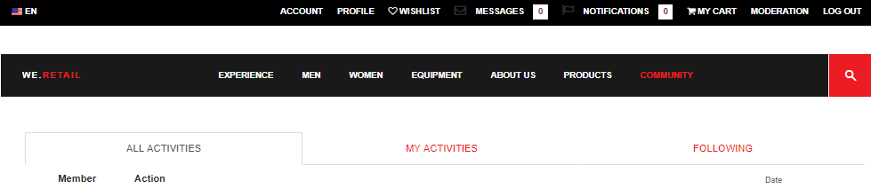

By selecting the Administration link, the Moderation console appears:

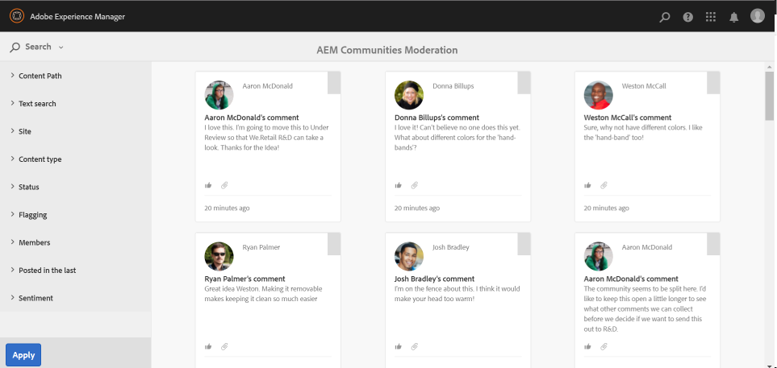

## Author Environment Access {#author-environment-access}

In the author environment, to reach the Moderation console

* From global navigation, select **[!UICONTROL Communities]** > **[!UICONTROL Moderation]**.

Only when signed in as an administrator, or as a member with [moderator permissions](/help/communities/in-context.md#identifyingtrustedmembers), moderation tasks can be performed. The only community content displayed is that which the signed in member is permitted to moderate.

>[!NOTE]
>
>UGC from the publish environment will only be visible on author if the chosen SRP implements a common store. For example, by default the storage is JSRP, which is not a common store for author and publish. See [Community Content Storage](/help/communities/working-with-srp.md).

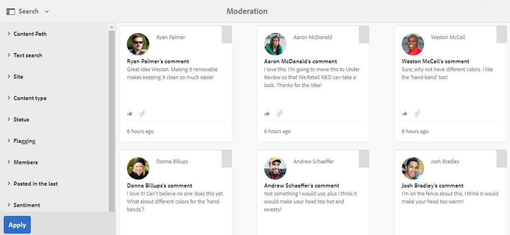

## Moderation Console UI {#moderation-console-ui}

Setting aside the left navigation rail (which appears on author, but not on publish), the moderation UI has following main areas:

* **[Top navigation bar](#top-navigation-bar)**
* **[Toolbar](#toolbar)**
* **[Content area](#content-area)**

### Top Navigation Bar {#top-navigation-bar}

The top navigation bar is constant for all consoles. For more information, see [Basic Handling](/help/sites-authoring/basic-handling.md).

### Toolbar {#toolbar}

The toolbar, located beneath the top navigation bar, provides the following toggle switch on the left side:

* [Filter rail](/help/communities/moderation.md#filterrail)
  opens a rail which allows a choice of properties on which to filter the content.

The toolbar, located beneath the top navigation bar, provides the following toggle switch on the left side:

[Filter rail](/help/communities/moderation.md#filterrail)
opens a rail, on selecting Search, which allows a choice of properties on which to filter the content.

### Content Area {#content-area}

The content area contains information for posted UGC:

* UGC posted
* Member name
* Member avatar
* Location of the post.
* When it was posted.
* Number of replies to the post.
* [Sentiment](/help/communities/moderate-ugc.md#sentiment) associated with the post
* If approved, a checkmark is displayed.
* If there is an attachment, a paperclip is displayed.

>[!NOTE]
> 
>The content area features an *infinite scroll*, which means that it will allow you to continue scrolling until you have reached the end of the content. The toolbar remains in a fixed, visible position above the content area even while scrolling.

### Filter Rail {#ootbfilters}

The side-panel icon opens the filter rail. The filter rail, which appears to the left of the content area, provides different filters, each having an immediate effect on the referenced UGC that appears in the content area.

The filters within each category are **OR**'d together, and the filters in different categories are **AND**'d together.

For example, if you check both **Question** and **Answer**, you will see content that is either a **Question** *or* an **Answer**.

However if you check **Question** and **Pending**, you will only see content that is a **Question** and is **Pending**.

>[!NOTE]
>
>Community moderators can bookmark the pre-defined filters on moderation console UI. As these filters are appended toward the end of the URL (as query string parameters), moderators can get back to the bookmarked filters later and also share these links.

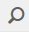

When the filter rail is open, the Search icon toggles the side-panel closed. However to close the filter rail and only view the user generated content, click the Search icon and select the Content Only option.

#### Content Path {#content-path}

Content Path limits the reference UGC displayed to the posts placed in specified content repository.

#### Text search {#text-search}

Text search limits the referenced UGC displayed to posts to which contain the text entered.

#### Site {#site}

Site limits the referenced UGC displayed to posts to selected community sites. If no sites are checked, then all references to UGC are displayed.

>[!NOTE]
>
>When the bulk moderation console is accessed by an administrator, all references to UGC are shown, including sites not created with the [site creation wizard](/help/communities/sites-console.md), such as the Geometrixx samples.
>
>When the bulk moderation console is accessed on publish by a trusted community member, then only references to UGC created for community sites the member is authorized to moderate are shown, and may be filtered with the Site filter.

#### Content Type {#content-type}

Content Type limits the referenced UGC displayed to posts of the selected resource type. One or more of the following types may be selected. All types are shown if none selected.

* **Comment**
* **Forum Topic**
* **Forum Reply**
* **QnA Question**
* **QnA Answer**
* **Blog Article**
* **Blog Comment**
* **Calendar Event**
* **Calendar Comment**
* **File Library Folder**
* **File Library Document**
* **Idea**
* **Ideation Comment**

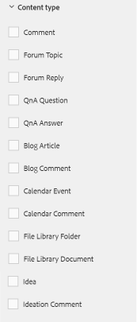

#### Additional Content Types {#additional-content-types}

To add additional resources on which to filter:

* Login to your author instance as administrator.
* Open [Web Console](https://localhost:4502/system/console/configMgr).
* Locate `AEM Communities Moderation Dashboard Filters`.
* Select the configuration to open in edit mode.
* Enter the ResourceType of a component on which to filter:

  * For example, to filter on included Voting components, enter: 
  
    `Voting=social/tally/components/hbs/voting`

  

* Select Save.
* Refresh the Communities - Moderation console.

The result is a new selectable filter for `Voting` under the `Content Type` filter group.

When that filter is seleted the content of the dashboard will show UGC that matches any of the ResourceTypes entered.

#### Status {#status}

Status limits the referenced UGC displayed to posts of the selected status, which may be one or more of Pending, Approved, Denied, or Closed, as well as Draft or Scheduled for Blog Articles, and Answered or Not Answered for QnA Questions. If none are selected, then all are shown.

>[!NOTE]
>
>If only the Not Answered status is selected, then the moderator will see all the content (for all content types) except the answered questions. It is so because the property responsible for the Answered Question does not exist in the case of not-answered questions and other content such as forum topic, blog article, or comments.

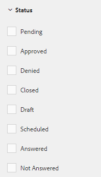

#### Flagging {#flagging}

Flagging limits the referenced UGC displayed to posts which are flagged or hidden.

Once a piece of content is flagged, it remains flagged until you unflag that single piece of content by selecting the **Flag** button once again. Note that there are no flagging levels, such as important or followup.

#### Members {#members}

Members limits the referenced UGC displayed to UGC posted by the member name entered.

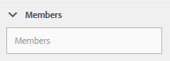

#### Posted in the last {#posted-in-the-last}

Posted In The Last limits the referenced UGC displayed to posts made in the last hour, day, week, month, or year.

#### Sentiment {#sentiment}

[Sentiment](/help/communities/moderate-ugc.md#sentiment) limits the referenced UGC displayed to posts with a sentiment value that is either positive, negative or neutral.

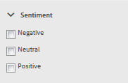

## Custom Filters {#custom-filters}

Apart from the out of the box filters in [Filter Rail](/help/communities/moderation.md#ootbfilters), additional custom filters on metadata can be added to moderation UI. Developers can use the sample code in Github to extend the existing moderation UI filters.

The [sample project](https://github.com/Adobe-Marketing-Cloud/aem-communities-extensions/tree/main/aem-communities-moderation-filter) on Github implements Tag filter, to filter the UGC list based on whether the specific tags are applied on user-generated content. You can follow the sample code and build analogous filters for other similar UGC metadata fields.

To install the sample for the Tags filter:

1. Open the package manager on AEM Author (`https://[aem-author]:4502/crx/packmgr/index.jsp`) instance and AEM Publish (`https://[aem-publish]:4503/crx/packmgr/index.jsp`) instance.
1. Build the package `com.adobe.social.sample.moderation.filter.ui.apps-1.0-SNAPSHOT.zip` from Github code, and install and enable the same.
1. Open the bundles console on AEM Author ( `https://[aem-author]:4502/system/console/bundles`) instance and AEM Publish ( `https://[aem-publish]:4503/system/console/bundles`) instance.
1. Build the package (`[com](https://sample-moderation-filter.com/).adobe.social.sample.moderation.filter.core-1.0-SNAPSHOT.jar`) from Github, and install and enable the same.
1. Go to **/apps/social/moderation/facets** node on AEM Author (`https://[aem-author]:4502/crx/de/index.jsp#/apps/social/moderation/facets`) and AEM Publish (`https://[aem-publish]:4502/crx/de/index.jsp#/apps/social/moderation/facets`) instance.
1. Add a technical user **communities-utility-reader** with `jcr:read` permissions.

To expose the custom filters on existing Community sites:

1. Edit `Clientlibs` of existing moderation page `/content/we-retail/us/en/community/moderation/shell3/jcr:content/head/clientlibs.`

   * Add new category `cq.social.hbs.moderation.v2.`

1. Go to `/content/we-retail/us/en/community/moderation/shell3/jcr:content/rails/searchWell/items/filters.`

   * Set to new component `sling:resourceType = social/moderation/v2/filters.`

1. Go to `/content/we-retail/us/en/community/moderation/shell3/jcr:content/views/content/items/modcontainer`.

   * Set to new component `sling:resourceType = social/moderation/v2/modcontainer`.

## Moderation Actions {#moderation-actions}

[Moderation actions](/help/communities/moderate-ugc.md#moderation-actions) can be performed on one or more selections made in the content area or when viewing content detail.

To bulk-moderate the posts, in the content area click the Select () icon on a post, which appears on hovering over it with the mouse (desktop) or pressing and holding a finger on the post (mobile). By doing this, you enter the multi-select mode and can now select the subsequent posts to be bulk moderated by simply clicking them. Use the buttons displayed on the toolbar to perform moderation actions on the selected posts. All the actions will prompt for confirmation.

To moderate a single post in the content area, hover over it with the mouse (desktop) or press and hold a finger on the post (mobile) such that buttons appear on the post. When operating on a single content detail, only a delete action will prompt for confirmation.

### Moderating multiple posts {#moderating-multiple-posts}

Enter the bulk selection mode by clicking the `Select` icon on a post:

To exit the bulk selection mode, select the cancel (x) icon on the toolbar:

The moderation actions that can be performed on multiple posts are:

* Deny
* Delete
* Close/Reopen the posts

The icons allowing these actions only appear on the toolbar when multiple posts are selected.

### Moderating a single post {#moderating-a-single-post}

In single selection mode, it is possible to:

* View user details by selecting the user's name.
* View the post in-context by selecting the link to the post.
* [Reply](#reply)
* [Allow](#allow)
* [Deny](#deny)
* [Delete](#delete)
* [Close](#close)
* View [Moderation History](#moderation-history)
* [View Details](#viewdetails)

Present on the card view above the moderation action icons is the text of the post and below is data indicating:

* If it has replies, and if so, preceded by the number of replies.
* If it has been flagged.
* If it has been approved.
* When the UGC was posted.

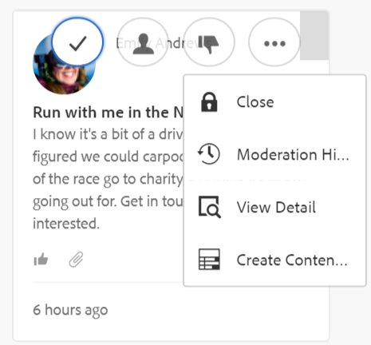

#### Reply {#reply}

When working with a single post, a Reply icon will appear if the UGC type supports replies and is configured to allow replies.

#### Allow {#allow}

When working with a single post, the Allow icon will appear when the post has been either flagged or denied. If flagged, selecting Allow will clear all flags.

#### Deny {#deny}

The **Deny** moderation action is only available for content that is moderated, and does not appear on unmoderated content except in multi-selection mode.

Content that is not moderated is always approved.

Content that is moderated initially enters a Pending state, and can later be modified to be approved or denied.

Content that leaves the pending state can never return to a pending state. Content that is marked as approved or denied can be changed to a different state at any time.

#### Delete {#delete}

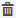

In single selection or bulk mode, you can select items and delete them. The delete action results in a confirmation dialog. Once deleted, those items immediately disappear from the content area. **Once UGC is deleted, it is permanently removed from the repository and cannot later be retrieved**.

#### Close {#close}

When working with a single post, a Close icon will appear if the UGC type supports the ability to prevent further posts for that resource.

#### Moderation History {#moderation-history}

When working with a single post, a Moderation History icon will appear when hovering over it. Selecting the icon will display a pane containing a history of actions taken regarding the UGC post.

To return to the content area display of multiple UGC posts, select the X in the top right corner of the view detail pane.

For example:

#### View Detail {#view-detail}

When working wtih a single post, more details can be viewed by opening up the UGC in detail mode.

To do so, hover over the post to display the `View Detail` icon and select it to display a panel containing more details of the post.

To return to the content area display of multiple UGC posts, select the X in the top right corner of the view detail pane.

For example:

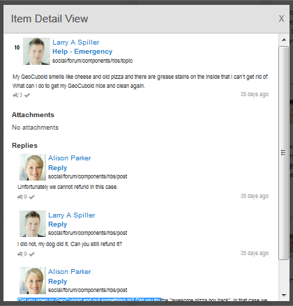
