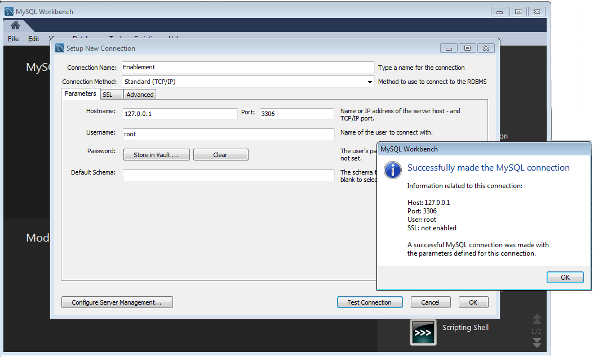
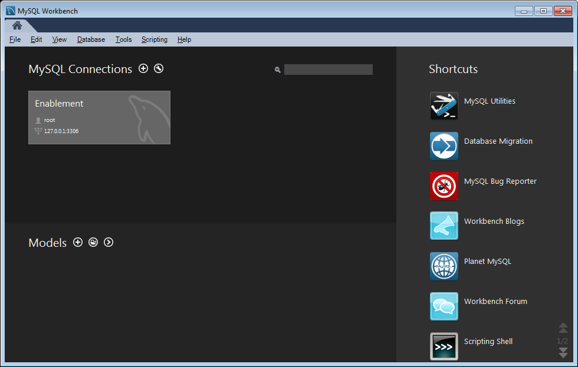
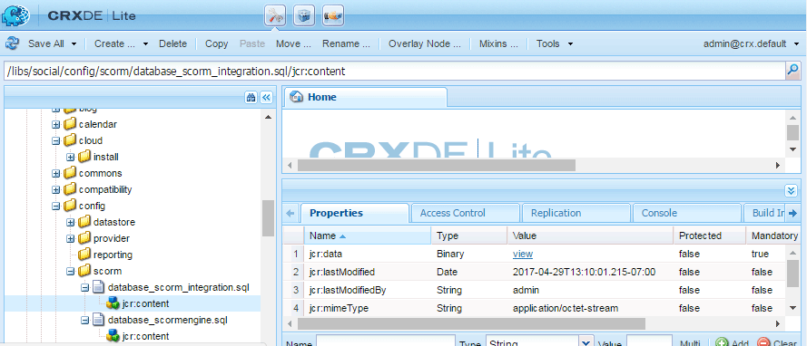
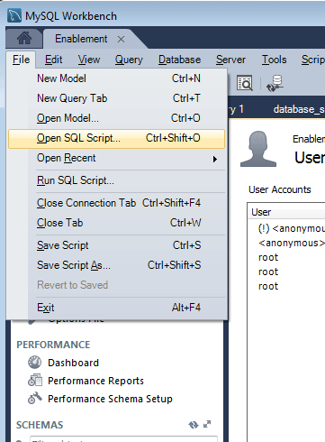
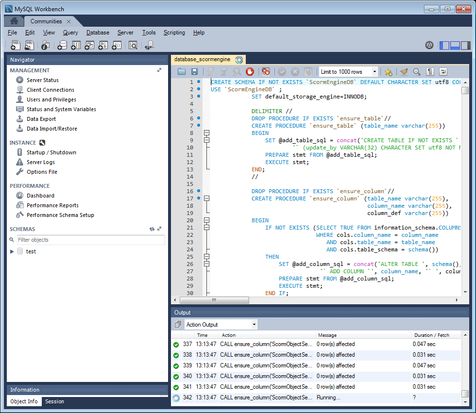
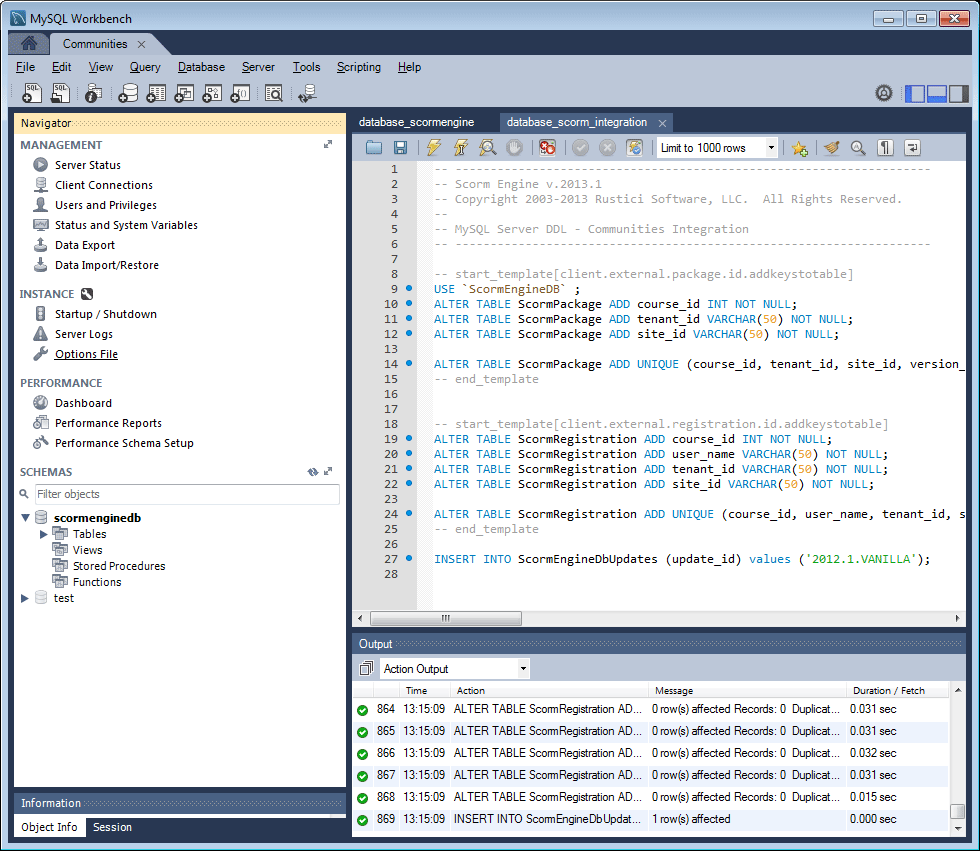
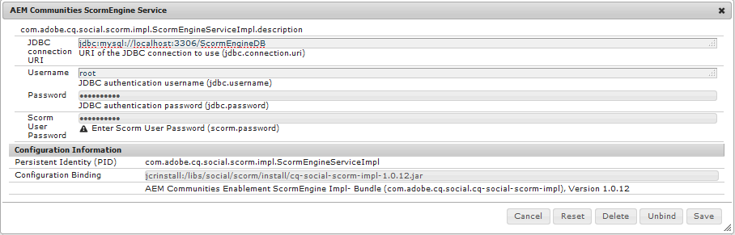

# MySQL Configuration for Enablement Features {#mysql-configuration-for-enablement-features}

MySQL is a relational database primarily used for SCORM tracking and reporting data for enablement resources. Included are tables for other features such as tracking video pause/resume.

These instructions describe how to connect to the MySQL server, establish the enablement database, and populate the database with initial data.

## Requirements {#requirements}

Before configuring MySQL for Communities' enablement feature, be sure to

* Install [MySQL server](https://dev.mysql.com/downloads/mysql/) Community Server version 5.6:
  * Version 5.7 is not supported for SCORM.
  * May be same server as author AEM instance.
* On all AEM instances, install the official [JDBC driver for MySQL](deploy-communities.md#jdbc-driver-for-mysql).
* Install [MySQL workbench](https://dev.mysql.com/downloads/tools/workbench/).
* On all AEM instances, install the [SCORM package](enablement.md#scorm).

## Installing MySQL {#installing-mysql}

MySQL should be downloaded and installed following the instructions for the target OS.

### Lower case table names {#lower-case-table-names}

As SQL is case insensitive, for case sensitive operating systems, it is necessary to include a setting to lower case all table names.

For example, to specify all lower case table names on a Linux OS:

* Edit file `/etc/my.cnf`
* In the `[mysqld]` section, add the following line: `lower_case_table_names = 1`

### UTF8 character set {#utf-character-set}

To provide better multilingual support, it is necessary to use the UTF8 character set.

Change MySQL to have UTF8 as its character set:
* mysql > SET NAMES 'utf8';

Change the MySQL database to default to UTF8:
* Edit file `/etc/my.cnf`
* In the `[client]` section, add: `default-character-set=utf8`
* In the `[mysqld]` section, add: `character-set-server=utf8`

## Installing MySQL Workbench {#installing-mysql-workbench}

MySQL Workbench provides an UI for executing SQL scripts which install the schema and initial data.

MySQL Workbench should be downloaded and installed following the instructions for the target OS.

## Enablement Connection {#enablement-connection}

When the MySQL Workbench is first launched, unless already in use for other purposes, it will not yet show any connections:

### New Connection Settings {#new-connection-settings}

1. Select the '+' icon to the right of `MySQL Connections`.
1. In the dialog `Setup New Connection`, enter values appropriate for your platform for demonstration purposes, with the author AEM instance and MySQL on the same server:
   * Connection Name: `Enablement`
   * Connection Method: `Standard (TCP/IP)`
   * Hostname: `127.0.0.1`
   * Username: `root`
   * Password: `no password by default`
   * Default Schema: `leave blank`
1. Select `Test Connection` to verify the connection to the running MySQL service.

**Notes**:
* The default port is `3306`.
* The `Connection Name` chosen is entered as the `datasource` name in [JDBC OSGi configuration](#configure-jdbc-connections).

#### Successful Connection {#successful-connection}

#### New Enablement Connection {#new-enablement-connection}

## Database Setup {#database-setup}

Upon opening the new Enablement connection, notice there is a test schema and default user accounts.

### Obtain SQL Scripts {#obtain-sql-scripts}

The SQL scripts are obtained using CRXDE Lite on the author instance. The [SCORM package](deploy-communities.md#scorm) must be installed:

1. Browse to CRXDE Lite:
   * For example, [http://localhost:4502/crx/de](http://localhost:4502/crx/de)
1. Expand the `/libs/social/config/scorm/` folder
1. Download `database_scormengine.sql`
1. Download `database_scorm_integration.sql`

One method for downloading the schema is to:

* Select the `jcr:content` node for the sql file.
* Notice the value for the `jcr:data` property is a view link.
* Select the view link to save the data to a local file.

### Create SCORM Database {#create-scorm-database}

The Enablement SCORM Database to be created is:

* name: `ScormEngineDB`
* created from scripts:
  * schema: `database_scormengine.sql`
  * data: `database_scorm_integration.sql`
Follow the steps below ([open](#step-open-sql-file), [execute](#step-execute-sql-script)) to install each [SQL script](#obtain-sql-scripts) . [Refresh](#refresh) when necessary to see the results of the script execution.

Be sure to install the schema before installing the data.

>[!CAUTION]
>
>If the database name is changed, be sure to specify it correctly in:
>
>* [JDBC config](#configure-jdbc-connections)
>* [SCORM config](#configure-scorm)

#### Step 1: open SQL file {#step-open-sql-file}

In the MySQL Workbench

* From the File pulldown menu
* Select `Open SQL Script ...`
* In this order, select one of:
  1. `database_scormengine.sql`
  1. `database_scorm_integration.sql`

#### Step 2: execute SQL Script {#step-execute-sql-script}

In the Workbench window for the file opened in Step 1, select the `lightening (flash) icon` to execute the script.

Note that the execution of the `database_scormengine.sql` script to create the SCORM database may take a minute to complete.

#### Refresh {#refresh}

Once the scripts are executed, it is necessary to refresh the `SCHEMAS` section of the `Navigator` in order to see the new database. Use the refresh icon to the right of 'SCHEMAS':

#### Result: scormenginedb {#result-scormenginedb}

After installing and refreshing SCHEMAS, the `scormenginedb` will be visible.

## Configure JDBC Connections {#configure-jdbc-connections}

The OSGi configuration for **Day Commons JDBC Connections Pool** configures the MySQL JDBC Driver.

All publish and author AEM instances should point to the same MySQL server.

When MySQL runs on a server different from AEM, the server hostname must be specified in place of 'localhost' in the JDBC connector (which populates the [ScormEngine](#configurescormengineservice) config).

* On each author and publish AEM instance
* Signed in with administrator privileges
* Access the [web console](../../help/sites-deploying/configuring-osgi.md)
  * For example, [http://localhost:4502/system/console/configMgr](http://localhost:4502/system/console/configMgr)
* Locate the `Day Commons JDBC Connections Pool`
* Select the `+` icon to create a new configuration

  

* Enter the following values:
  * **[!UICONTROL JDBC driver class]**: `com.mysql.jdbc.Driver`
  * **[!UICONTROL ]DBC connection URIJ**: `jdbc:mysql://localhost:3306/aem63reporting` specify server in place of localhost if MySQL server is not the same as 'this' AEM server.
  * **[!UICONTROL Username]**: Root or enter the configured Username for the MySQL server, if not 'root'.
  * **[!UICONTROL Password]**: Clear this field if no password set for MySQL, else enter the configured password for the MySQL Username.
  * **[!UICONTROL Datasource name]**: Name entered for the [MySQL connection](#new-connection-settings), for example, 'enablement'.
* Select **[!UICONTROL Save]**.

## Configure Scorm {#configure-scorm}

### AEM Communities ScormEngine Service {#aem-communities-scormengine-service}

The OSGi configuration for **AEM Communities ScormEngine Service** configures SCORM for an enablement community's use of the MySQL server.

This configuration is present when the [SCORM package](deploy-communities.md#scorm-package) is installed.

All publish and author instances point to the same MySQL server.

When MySQL runs on a server different from AEM, the server hostname must be specified in place of 'localhost' in the ScormEngine Serivce, which is typically populated from the [JDBC Connection](#configure-jdbc-connections) config.

* On each author and publish AEM instance
* Signed in with administrator privileges
* Access the [web console](../../help/sites-deploying/configuring-osgi.md)
  * For example, [http://localhost:4502/system/console/configMgr](http://localhost:4502/system/console/configMgr)
* Locate the `AEM Communities ScormEngine Service`
* Select the edit icon

  

* Verify the following parameter values are consistent with the [JDBC Connection](#configurejdbcconnectionspool) config:
  * **[!UICONTROL JDBC connection URI]**: `jdbc:mysql://localhost:3306/ScormEngineDB` *ScormEngineDB* is the default database name in the SQL scripts
  * **[!UICONTROL Username]**: Root or enter the configured Username for the MySQL server, if not 'root'
  * **[!UICONTROL Password]**: Clear this field if no password set for MySQL, else enter the configured password for the MySQL Username
* Regarding the following parameter:
  * **[!UICONTROL Scorm User Password]**: DO NOT EDIT
    
    For internal use only: It is for a special service user used by AEM Communities to communicate with the scorm engine.
* Select **[!UICONTROL Save]**

### Adobe Granite CSRF Filter {#adobe-granite-csrf-filter}

To ensure enablement courses work correctly in all browsers, it is necessary to add Mozilla as a User Agent that is not checked by the CSRF filter.

* Login to the AEM publish instance with administrator privileges.
* Access the [web console](../../help/sites-deploying/configuring-osgi.md)
  * For example, [http://localhost:4503/system/console/configMgr](http://localhost:4503/system/console/configMgr)
* Locate `Adobe Granite CSRF Filter`.
* Select the edit icon.
 
  
  
* Select the `[+]` icon to add a Safe User Agent.
* Enter `Mozilla/*`.
* Select **[!UICONTROL Save]**.
