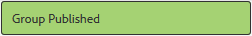
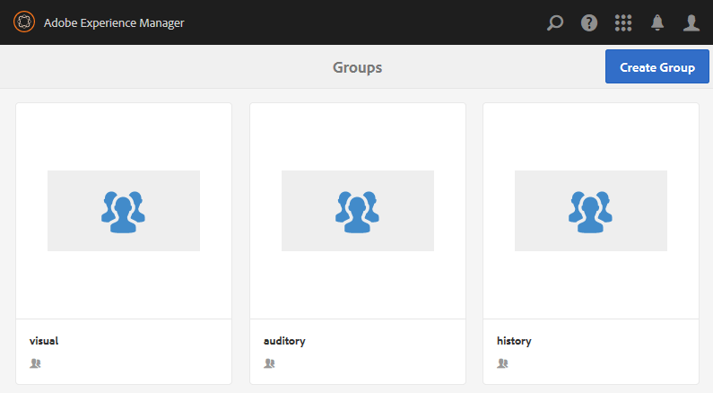

# Authoring Nested Groups {#authoring-nested-groups}

## Creating Groups on Author {#creating-groups-on-author}

On author, from global navigation

* Select **[!UICONTROL Communities > Sites]**
* Select **[!UICONTROL engage folder]** to open it
* Select the card for the **[!UICONTROL Getting Started Tutorial]**  English site
    * Select the card image
    * Do *not* select an icon

The result is to reach the [Groups console](groups.md):

The groups function will display as a folder in which instances of groups are created. Select the Groups folder to open it. The group created on publish is visible.

## Create Main Arts Group {#create-main-arts-group}

This group can be created because the site structure for engage includes a groups function. The configuration of the function in the site's `Reference Template` defaults to allowing the selection of any enabled group template. Thus, the template chosen for this new group will be the `Reference Group`.

These consoles are very similar to the Communities Sites console.

* Select **[!UICONTROL Create Group]**
* `1 Community Group Template`:
    * Community Group Title: Arts
    * Community Group Description: A parent group for various arts groups.
    * Community Group Root: *leave as default*
    * Additional Available Community Group Language(s):use the pull down menu to select the available community group language(s). The menu displays all the language(s) in which the parent community site is created. Users can select among these languages to create groups in multiple locales in this single step. Same group gets created in multiple specified languages in the Groups console of the respective community sites.
    * Community Group Name: arts
    * Template: pull down to select `Reference Group`
    * Select `Next`

Continue through the other panels with these settings:

* **2 Design**
    * You can change the design or allow to default to parent site's design
    * Select **[!UICONTROL Next]**
* **3 Settings**
    * **Moderation**
        * Leave empty (inherit from parent site)
    * **Membership**
        * use default `Optional Membership`
    * **Thumbnail**
        * `optional`
    * Select `Next`
* Select **[!UICONTROL Create]**

### Nesting Groups within Arts Group {#nesting-groups-within-arts-group}

The `groups` folder should now contain two groups (it may be necessary to refresh the page).

#### Publish Group {#publish-group}

Before creating groups nested within the `arts`group, hover over the `arts` card and select the publish icon to publish it.

Wait for confirmation that the group was published.

The `arts` group should also contain a `groups` folder, but one that is empty and in which new groups can be created. Navigate to the arts group folder and create 3 nested groups, each with a different membership setting:

1. Visiual
    * Title: `Visual Arts`
    * Name: `visual`
    * Template: `Reference Group`
    * Membership: select `Optional Membership` 
    A public group, open to all members
1. Auditory
    * Title: `Auditory Arts`
    * Name: `auditory`
    * Template: `Reference Group`
    * Membership: select `Required Membership` 
    An open group, available for members to join

1. History

    * Title: `Art History`
    * Name: `history`
    * Template: `Reference Group`
    * Membership: select `Restricted Membership`
      A secret group, visible only to invited members as an example, invite [demo user](tutorials.md#demo-users) `emily.andrews@mailinator.com`

Refresh the page to see all three nested groups (sub-communities).

If necessary, to navigate to the nested groups from the Communities Sites console:

* Select **[!UICONTROL engage folder]**
* Select **[!UICONTROL Getting Started Tutorial]** card
* Select **[!UICONTROL Groups folder]**
* Select **[!UICONTROL arts card]**
* Select **[!UICONTROL Groups folder]**

## Publishing Groups {#publishing-groups}

After publishing the main community site, it is necessary to

* Publish each group individually
    * Waiting for confirmation that the group was published
* Publish parent group before publishing any groups nested within
    * All groups must be published in a top-down fashion.

## Experience on Publish {#experience-on-publish}

It is possible to experience the different groups when signed in, for example with the [demo users](tutorials.md#demo-users) used for

* Art/History group member: emily.andrews@mailinator.com/password
    * The restricted (secret) group, arts/history, will be visible
    * Can see optional (public) groups
    * Can join restricted (open) groups
* Group manager: aaron.mcdonald@mailinator.com/password
    * Can see optional (public) groups
    * can join restricted (open) groups
    * Will not see retricted (secret) groups

Access the Communities [Members and Groups consoles](members.md) on author to add other users to various member groups that correspond to the community groups.
