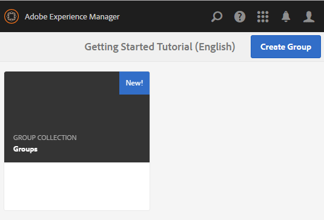

# Authoring Nested Groups{#authoring-nested-groups}

## Creating Groups on Author {#creating-groups-on-author}

On AEM Author instance, from global navigation:

* Select **[!UICONTROL Communities]** > **[!UICONTROL Sites]**.
* Select **[!UICONTROL engage folder]** to open it.
* Select the card for the **[!UICONTROL Getting Started Tutorial]** English site.

  * Select the card image.
  * Do *not* select an icon.

The result is to reach the [Groups console](/help/communities/groups.md):

The groups function will display as a folder in which instances of groups are created. Select the Groups folder to open it. The group created on publish is visible.

## Create Main Arts Group {#create-main-arts-group}

This group can be created because the site structure for engage includes a groups function. The configuration of the function in the site's `Reference Template` defaults to allowing the selection of any enabled group template. Thus, the template chosen for this new group is the `Reference Group`.

These consoles are similar to the Communities Sites console.

* Select **[!UICONTROL Create Group]**

* **Community Group Template**:

  * **[!UICONTROL Community Group Title]**: Arts
  * **[!UICONTROL Community Group Description]**: A parent group for various arts groups
  * **[!UICONTROL Community Group Root]**: *leave as default*
  * **[!UICONTROL Additional Available Community Group Language(s)]**: use the drop-down menu to select the available community group language(s). The menu displays all the languages in which the parent community site is created. Users can select among these languages to create groups in multiple locales in this single step. Same group gets created in multiple specified languages in the Groups console of the respective community sites.
  * **[!UICONTROL Community Group Name]**: arts
  * **[!UICONTROL Template]**: drop down to select `Reference Group`
  * Select **[!UICONTROL Next]**

Continue through the other panels with these settings:

* **[!UICONTROL Design]**

  * Change the design or allow default parent site's design.
  * Select **[!UICONTROL Next]**.

* **[!UICONTROL Settings]**

  * **[!UICONTROL Moderation]**

    * Leave empty (inherit from parent site).

  * **[!UICONTROL Membership]**

    * Use default `Optional Membership.`

    * **[!UICONTROL Thumbnail]**
      * `optional.*`

    * **[!UICONTROL Select Next]**.

* Select **[!UICONTROL Create]**.

### Nesting Groups within Arts Group {#nesting-groups-within-arts-group}

The `groups` folder now contains two groups (refresh the page).

#### Publish Group {#publish-group}

Before creating groups nested within the `arts` group, hover over the `arts` card and select the publish icon to publish it.

Wait for confirmation that the group was published.

The `arts` group should also contain a `groups` folder, but one that is empty and in which new groups can be created. Navigate to the arts group folder and create 3 nested groups, each with a different membership setting:

1. **[!UICONTROL Visual]**

   * Title: `Visual Arts`
   * Name: `visual`
   * Template: `Reference Group`
   * Membership: select `Optional Membership`, a public group, open to all members.

1. **[!UICONTROL Auditory]**

   * Title: `Auditory Arts`
   * Name: `auditory`
   * Template: `Reference Group`
   * Membership: select `Required Membership`, an open group, available for members to join.

1. **[!UICONTROL History]**

   * Title: `Art History`
   * Name: `history`
   * Template: `Reference Group`
   * Membership: select `Restricted Membership`, a secret group, visible only to invited members. As an example, invite [demo user](/help/communities/tutorials.md#demo-users) `emily.andrews@mailinator.com`.

Refresh the page to see all three nested groups (sub-communities).

To navigate to the nested groups from the Communities Sites console:

* Select **[!UICONTROL engage folder]**
* Select **[!UICONTROL Getting Started Tutorial card]**
* Select **[!UICONTROL Groups]** folder
* Select **[!UICONTROL arts card]**
* Select **[!UICONTROL Groups]** folder

## Publishing Groups {#publishing-groups}

After publishing the main community site:

* Publish each group individually:

  * Waiting for confirmation that the group was published.

* Publish parent group before publishing any groups nested within:

  * All groups must be published in a top-down fashion.

## Experience on Publish {#experience-on-publish}

It is possible to experience the different groups when signed in, for example with the [demo users](/help/communities/tutorials.md#demo-users) used for:

* Art/History group member: emily.andrews@mailinator.com/password
  * The restricted (secret) group, arts/history, is visible:
  * Can see optional (public) groups.
  * Can join restricted (open) groups.

* Group manager: aaron.mcdonald@mailinator.com/password

  * Can see optional (public) groups.
  * Can join restricted (open) groups.
  * Can not see restricted (secret) groups.

Access the Communities [Members and Groups consoles](/help/communities/members.md) on author to add other users to various member groups that correspond to the community groups.
