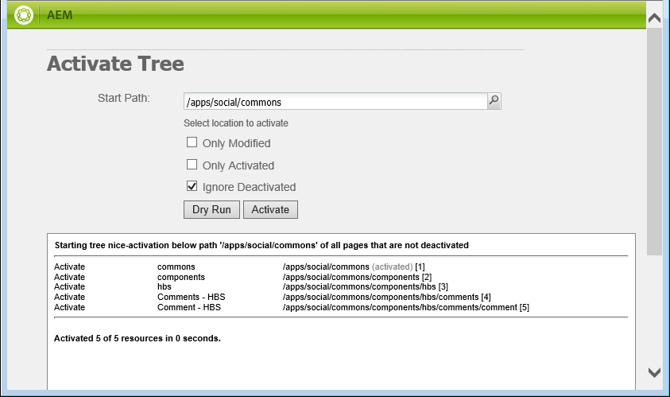
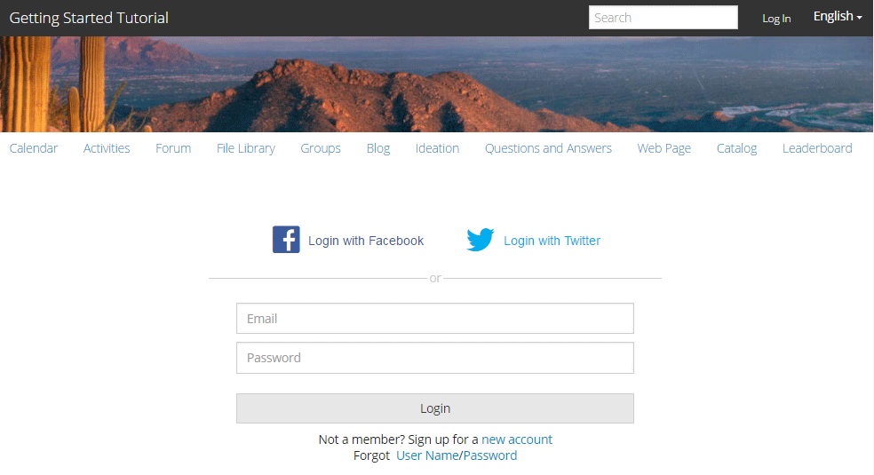

# Alter the Appearance {#alter-the-appearance}

## Modify the Script {#modify-the-script}

The comment.hbs script is responsible for creating the overall HTML for each comment.

To not display the avatar next to each posted comment:

1. Copy `comment.hbs`from `libs`to `apps`
    1. Select `/libs/social/commons/components/hbs/comments/comment/comment.hbs`
    1. Select **[!UICONTROL Copy]**
    1. Select `/apps/social/commons/components/hbs/comments/comment`
    1. Select **[!UICONTROL Paste]**
1. Open the overlaid `comment.hbs`
    * Double-click on node  `comment.hbs`in `/apps/social/commons/components/hbs/comments/comment folder`
1. Find the following lines and either delete or comment them out:
`xml <aside class="scf-comment-author">
        </img>`

Either delete the lines, or surround them with '&lt;!--' and '--&gt;' to comment them out. Also, the characters 'xxx' are being added as a visual indicator of where the avatar would have been.
`xml <!-- do not display avatar with comment
    <aside class="scf-comment-author">
        </img>`

## Replicate the Overlay {#replicate-the-overlay}

Push the overlaid comments component to the publish instance using the Replication Tool.

>[!NOTE]
>
>A more robust form of replication would be to create a package in Package Manager and [activate](../../help/sites-administering/package-manager.md#replicating-packages) it. A package can be exported and archived.

From the global navigation, select **[!UICONTROL Tools > Deployment > Replication]** and then **[!UICONTROL Activate Tree]**.

For the Start Path enter `/apps/social/commons` and select **[!UICONTROL Activate]**.

 

## View Results {#view-results}

If you login to the publish instance as an administrator, e.g., http://localhost:4503/crx/de as admin/admin, you can verify the overlaid components are there.

If you logout and re-login as `aaron.mcdonald@mailinator.com/password` and refresh the page, you will observe that the posted comment no longer displays with an avatar, instead a simple 'xxx' is displayed.

 

