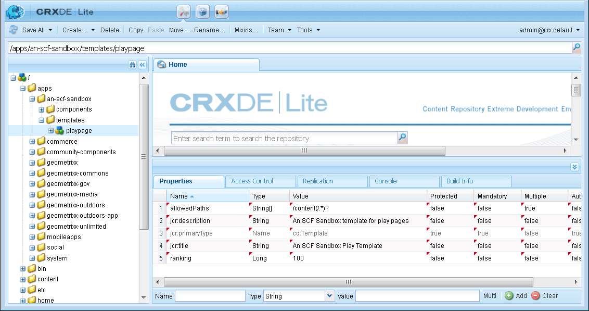
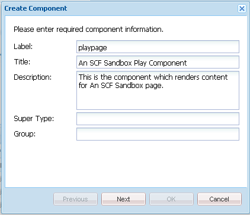

# Alter the Appearance {#alter-the-appearance}

## Modify the Script {#modify-the-script}

The comment.hbs script is responsible for creating the overall HTML for each comment.

To not display the avatar next to each posted comment:

1. Copy `comment.hbs`from `libs`to `apps`

   1. Select `/libs/social/commons/components/hbs/comments/comment/comment.hbs`
   1. Select **[!UICONTROL Copy]**
   1. Select `/apps/social/commons/components/hbs/comments/comment`
   1. Select **[!UICONTROL Paste]**

1. Open the overlaid `comment.hbs`

   * Double-click node `comment.hbs` in `/apps/social/commons/components/hbs/comments/comment folder`

1. Find the following lines and either delete or comment them out:

```xml
  <aside class="scf-comment-author">
        </img>

```

Either delete the lines, or surround them with `<!--` and `-->` so you comment them out. Also, the characters 'xxx' are being added as a visual indicator of where the avatar would have been.

```xml
   xxx
   <!-- do not display avatar with comment
    <aside class="scf-comment-author">
        </img>

```

### Replicate the Overlay {#replicate-the-overlay}

Push the overlaid comments component to the publish instance using the Replication Tool.

>[!NOTE]
>
>A more robust form of replication would be to create a package in Package Manager and [activate](/help/sites-administering/package-manager.md#replicating-packages) it. A package can be exported and archived.

From the global navigation, select **[!UICONTROL Tools]** > **[!UICONTROL Deployment]** > **[!UICONTROL Replication]** and click **[!UICONTROL Activate Tree]**.

For the Start Path, enter `/apps/social/commons` and select **[!UICONTROL Activate]**.

 

### View Results {#view-results}

If you log on to the publish instance as an administrator, for example, https://localhost:4503/crx/de as admin/admin, you can verify that the overlaid components are there.

If you log off and then log on as `aaron.mcdonald@mailinator.com/password` and refresh the page, you observe that an avatar is not display with the posted comment. Instead, a simple 'xxx' is displayed.


