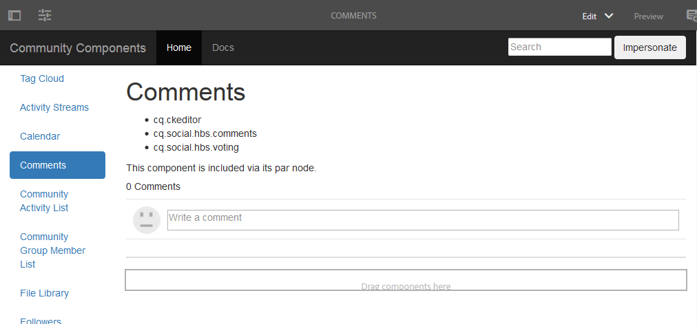

# Create Comments Page {#create-comments-page}

**[⇐ Overlay Comments Component](overlay-comments.md) [Create Nodes ⇒](overlay-create-nodes.md)**

## Comments Page {#comments-page}

The [Community Components guide](components-guide.md) provides the ability to easily experience overlaying the comments component.

View the page on the author instance:

* [http://localhost:4502/editor.html/content/community-components/en/comments.html](http://localhost:4502/editor.html/content/community-components/en/comments.html)

**[⇐ Overlay Comments Component](overlay-comments.md) [Create Nodes ⇒](overlay-create-nodes.md)**