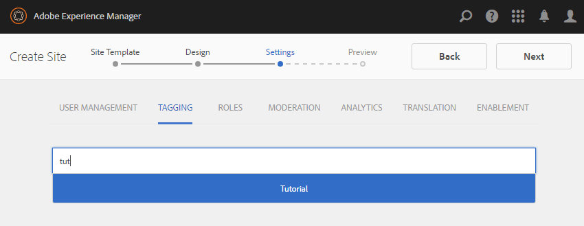

# Create Nodes {#create-nodes}

Overlay the comment system with a custom version by copying the minimal number of files necessary from /libs into /apps and modifying them in /apps.

>[!CAUTION]
>
>The contents of the /libs folder are never edited because any re-install or upgrade may delete or replace the /libs folder while the contents of the /apps folder is left untouched.

Using [CRXDE Lite](../../help/sites-developing/developing-with-crxde-lite.md) on an author instance, begin by creating a path in the /apps folder which is identical to the path to the overlaid components in the /libs folder.

The path being duplicated is

* `/libs/social/commons/components/hbs/comments/comment`

Some nodes in the path are folders and some are components.

1. Browse to [http://localhost:4502/crx/de/index.jsp](http://localhost:4502/crx/de/index.jsp)
1. Create `/apps/social` (if it does not already exist)
    * Select `/apps` node
    * **[!UICONTROL Create > Folder ...]**
        * Enter Name: `social`
1. Select `social` node
    * **[!UICONTROL Create > Folder...]**
        * Enter Name: `commons`
1. Select `commons` node
    * **[!UICONTROL Create > Folder...]**
        * Enter Name: `components`
1. Select `components` node
    * **[!UICONTROL Create > Folder..]**.
        * Enter Name: `hbs`
1. Select `hbs` node
    * **[!UICONTROL Create > Create Component...]**
        * Enter Label: `comments`
        * Enter Title: `Comments`
        * Enter Description: `List of comments without showing avatars`
        * Super Type: `social/commons/components/comments`
        * Enter Group: `Communities`
        * Click **[!UICONTROL Next]** until **[!UICONTROL OK]**
1. Select `comments` node

    * **[!UICONTROL Create > Create Component...]**

        * Enter Label: `comment`
        * Enter Title: `Comment`
        * Enter Description: `A comment instance without avatars`
        * Super Type: `social/commons/components/comments/comment`
        * Enter Group: `.hidden`
        * Click **[!UICONTROL Next]** until **[!UICONTROL OK]**
    * Select **[!UICONTROL Save All]**
1. Delete the default `comments.jsp`
    * Select node `/apps/social/commons/components/hbs/comments/comments.jsp`
    * Select **[!UICONTROL Delete]**
1. Delete the default comment.jsp
    * select node `/apps/social/commons/components/hbs/comments/comment/comment.jsp`
    * Select **[!UICONTROL Delete]**
    * Select **[!UICONTROL Save All]**

>[!NOTE]
>
>In order to preserve the inheritance chain, the `Super Type` (property `sling:resourceSuperType`) of the overlay components are set to the same value as the `Super Type` of the components being overlaid, in this case
>
>* `social/commons/components/comments`
>* `social/commons/components/comments/comment`
>

The overlay's own `Type`(property `sling:resourceType`) must be a relative self-reference so that any content not found in /apps is then looked for in /libs.
* Name: `sling:resourceType`
* Type: `String`
* Value: `social/commons/components/hbs/comments`

1. Select the green `[+] Add`
    * Name: `sling:resourceType`
    * Type: `String`
    * Value: `social/commons/components/hbs/comments/comment`
1. Select the green `[+] Add`
   * Select **[!UICONTROL Save All]**

 

