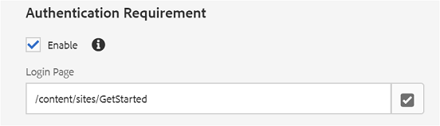
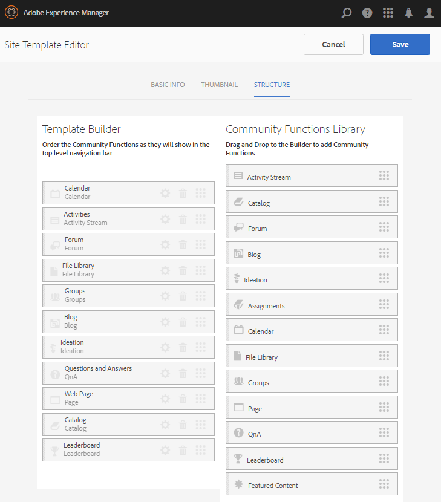
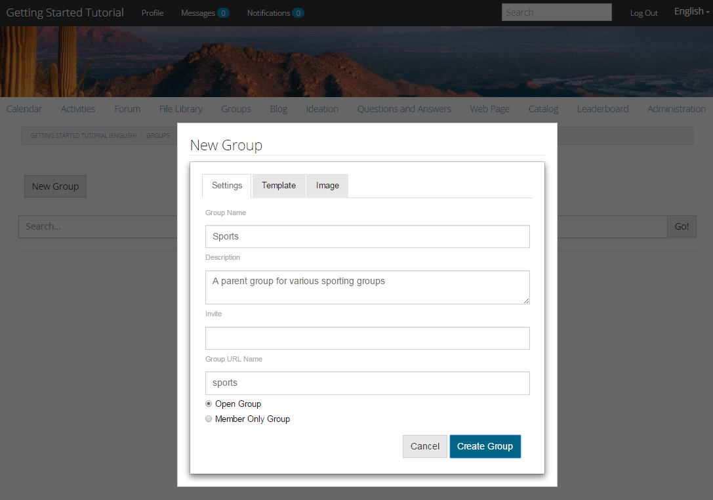
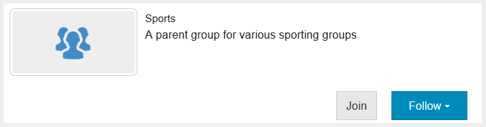
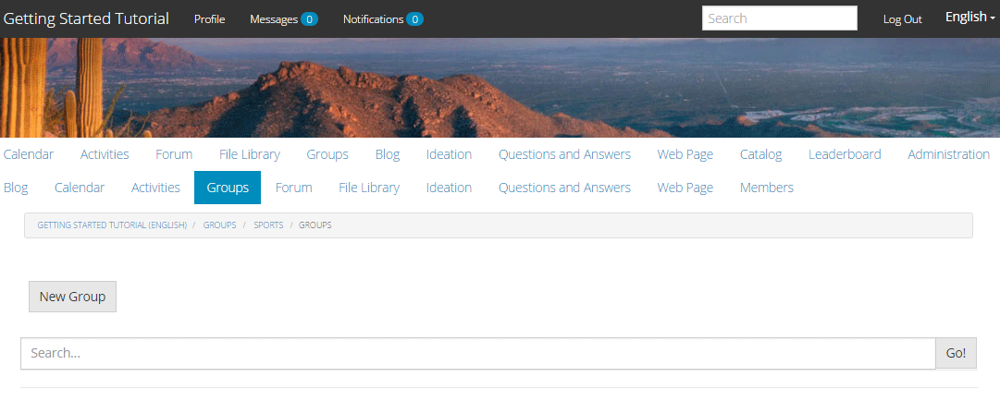
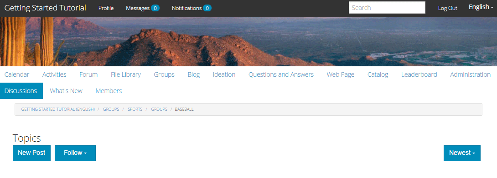
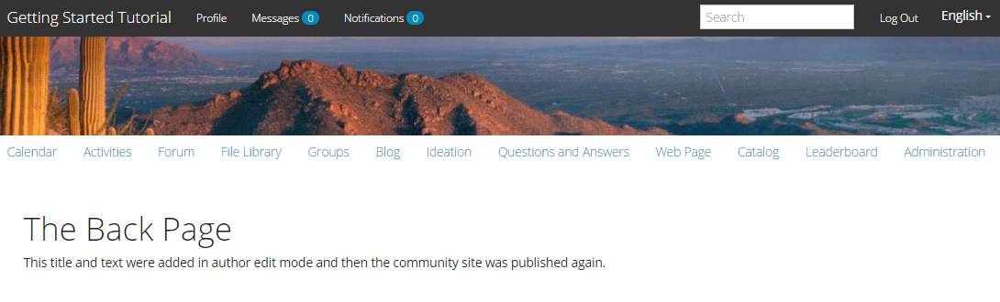
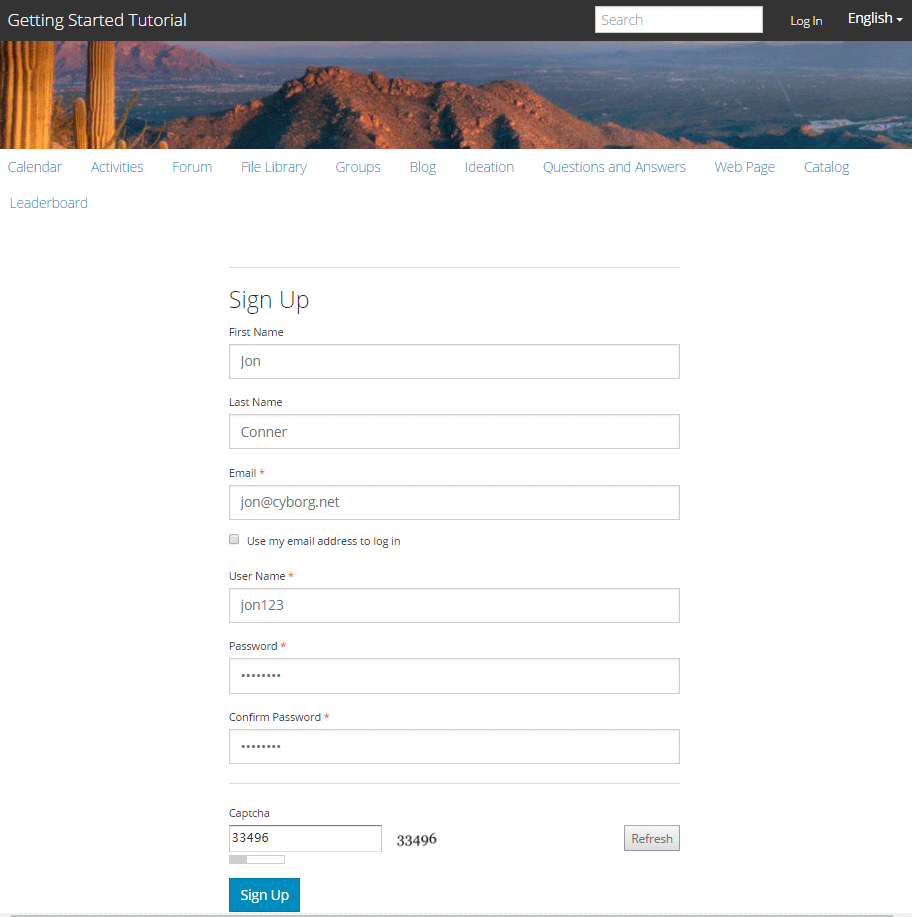
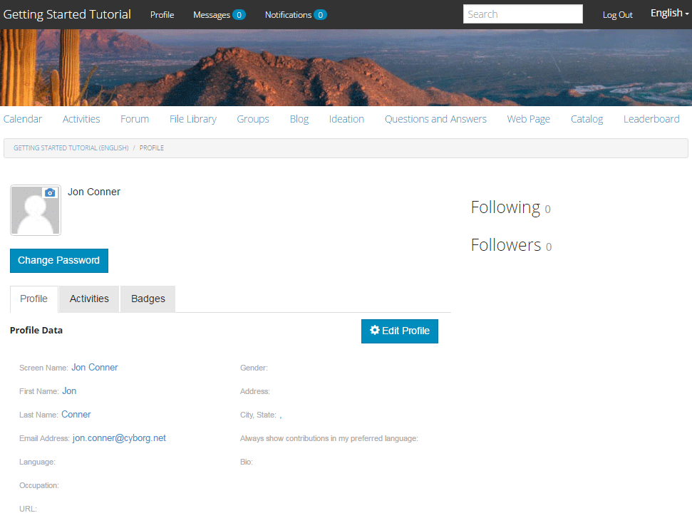

# Experience the Published Site {#experience-the-published-site}

## Browse to New Site on Publish {#browse-to-new-site-on-publish}

Now that the newly created communities site is published, browse to the URL displayed when creating the site, but on the publish server, for example:

* Author URL = https://localhost:4502/content/sites/engage/en.html
* Publish URL = https://localhost:4503/content/sites/engage/en.html

To minimize confusion as to which member is signed in on author and publish, it is suggested to use different browsers for each instance.

When first arriving at the published site, the site visitor would typically not be signed in already and would be anonymous.

`https://localhost:4503/content/sites/engage/en.html {#http-localhost-content-sites-engage-en-html}`

## Anonymous Site Visitor {#anonymous-site-visitor}

An anonymous site visitor sees the following in the UI:

* Title of the site (Getting Started Tutorial)
* No profile link
* No messages link
* No notifications link
* Search field
* Login link
* The brand banner
* Menu links for the components included in the Reference Site Template.

If you select various links, you find that they are in read-only mode.

### Prevent anonymous access on JCR {#prevent-anonymous-access-on-jcr}

A known limitation exposes the community site content to anonymous visitors through  jcr  content and  json , though **allow anonymous access** is disabled for the site's content. However, this behavior can be controlled using Sling Restrictions as a workaround.

To protect your community site's content from access by anonymous users through  jcr  content and  json , follow these steps:

1. On AEM Author instance, go to https:// hostname:port/editor.html/content/site/sitename.html.

   >[!NOTE]
   >
   >Do not go to the localized site.

1. Go to **Page Properties**.

   

1. Go to **Advanced** tab.

1. Enable **Authentication Requirement**.

   

1. Add the path of the login page. For example, **/content/......./GetStarted**.
1. Publish the page.

## Trusted Community Member {#trusted-community-member}

This experience assumes [Aaron McDonald](/help/communities/tutorials.md#demo-users) was assigned the roles of [community manager and moderator](/help/communities/create-site.md#roles). If not, return to the author environment to [modify the site settings](/help/communities/sites-console.md#modifying-site-properties) and select Aaron McDonald as both community manager and moderator.

In the upper right corner, select `Log in`, and sign with username (aaron.mcdonald@mailinator.com) and password (password). Notice the ability to sign in with Twitter or Facebook credentials.

Once signed in as the registered community member, notice the following menu items to click and explore your community site:

* **Profile** option lets you view and edit your profile.
* [Messages](/help/communities/configure-messaging.md) option directs you to direct messaging section, where you can do the following:

  1. View the direct messages that you have received (Inbox), sent (Sent Items), and deleted (Trash).
  1. Compose new direct messages so you can send to individuals and groups.

* [Notifications](/help/communities/notifications.md) option directs you to notifications section, where you can view your events of interest and edit notification settings.
* [Administration](/help/communities/published-site.md#moderationlink) directs you to AEM Communities Moderation Page, if you have moderation privileges.

Notice that the Calendar page is the home page because the chosen Reference Site Template included the Calendar function first, followed by Activity Stream function, Forum function, and so on. This structure is visible from the [Site Template](/help/communities/sites.md#edit-site-template) console or when modifying site properties in the author environment:

>[!NOTE]
>
>For more information on Communities components and functions, visit:
>
>* [Communities Components](/help/communities/author-communities.md) (for authors)
>* [Component, Function, and Feature Essentials](/help/communities/essentials.md) (for developers)

### Forum link {#forum-link}

View the basic forum feature by selecting the Forum link.

Members are able to post a new topic or follow a topic.

Site visitors are able to view posts and sort them in various ways.

### Groups link {#groups-link}

Since Aaron is a group administrator, selecting the Groups link lets Aaron create a community group by selecting a group template, image, whether the group is open or secret, and inviting members.

This is an example where a group is created in the publish environment.

Groups may also be created in the author environment and managed within the community site in the author environment ([Community Groups console](/help/communities/groups.md)). The experience of [creating groups on author](/help/communities/nested-groups.md) is next in this tutorial.

Create a Reference Group:

1. Select **New Group**
1. **Settings tab**

   * Group Name : `Sports`
   * Description : `A parent group for various sporting groups`.
   * Group URL Name : `sports`
   * Select `Open Group` (allow any community member to participate by joining)

1. **Template tab**

   * Select `Reference Group` (contains a groups function in its structure to allow nested groups)

1. Select **Create Group**

   

After new group is created, **select the new Sports group** to create two groups (nested) within it. As a site structure cannot begin with the groups function, after opening the Sports group, it is necessary to select the Groups link:

The second set of links, beginning with `Blog`, belong to the currently selected group, the `Sports` group. By selecting the Sports' `Groups` link, it is possible to nest two groups within the Sports group.

As an example, add two `new groups`.

* One named `Baseball`

  * Leave it set as an `Open Group` (required membership).
  * On Templates tab, select `Conversational Group`.

* One named `Gymnastics`

  * Change its setting to `Member Only Group` (restricted membership).
  * On Templates tab, select `Conversational Group`.

**Notice**:

* A refresh of the page may be necessary before both groups are displayed.
* This template does *not* include the groups function, so no further nesting of groups is possible.
* On author, the [Groups console](/help/communities/groups.md) provides a third choice - a `Public Group` (optional membership).

Once both groups are created, select the Baseball group, an open group, and notice its links:

`Discussions` `What's New` `Members`

The group's links are displayed below the main site's links and results in the following display:

On author - with administrative privileges, navigate to the [Communities Groups console](/help/communities/members.md) and add Weston McCall to the `Community Engage Gymnastics <uid> Members` group.

Continuing on publish, log out as Aaron McDonald, and view the groups in the Sports Group as an anonymous site visitor:

* From home page
* Select `Groups` link
* Select `Sports` link
* Select the Sports' `Groups` link

Only the Baseball group is visible.

Log in as Weston McCall (weston.mccall@dodgit.com / password), and navigate to the same location. Notice that Weston is able to `Join` the open `Baseball` group and either `enter or Leave` the private `Gymnastics` group.

### Web Page link {#web-page-link}

View the basic web page included in the site by selecting the Web Page link. The standard AEM authoring tools may be used to add content to this page in the author environment.

For example, go to **author** instance, open the `engage` folder in the [Communities Sites console](/help/communities/sites-console.md), select the **Open Site** icon to enter author edit mode. Then select preview mode so you can select the `Web Page` link, then select edit mode to add Title and Text components. Last, republish either just the page or the entire site.

### Moderation Link {#moderationlink}

When the community member has moderation privileges, then the Moderation link is visible. Selecting the link displays the community content that is posted, and lets it be [moderated](/help/communities/moderate-ugc.md) in a manner similar to the [moderation console](/help/communities/moderation.md) in the author environment.

Use the browser's back button to return to the published site. Most consoles are not accessible from global navigation in the publish environment.

## Self-Registration {#self-registration}

After logging out, it is possible to create a user registration.

* Select `Log In`
* Select `Sign up for a new account`

 

By default, the email address is the login id. If unchecked, the visitor is able to enter their own login id (user name). The user name must be unique in the publish environment.

After specifying the user's name, email, and password, selecting `Sign Up` creates the user and enable them to sign.

After signing in, the first page presented is their `Profile` page, which they can personalize.

If the member forgets their login id, it is possible to recover is using their email address.

