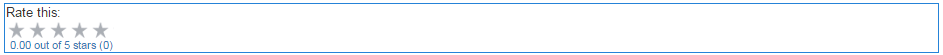
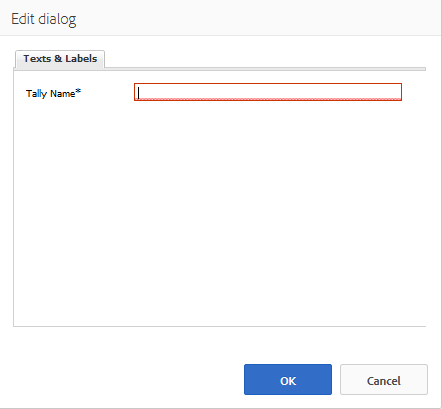

# Using Ratings {#using-ratings}

The `Rating` component is used standalone or with other Communities features. This component allows signed-in community members to express their opinions by rating content.

## Adding a Rating to a Page {#adding-a-rating-to-a-page}

To add a `Rating` component to a page in author mode, locate the component `Communities / Rating` and drag it into place on a page, such as a position relative to the feature for members to rate.

For necessary information, visit [Communities Components Basics](basics.md).

When the [required client-side libraries](rating-basics.md#essentials-for-client-side) are included, this is how the `Rating` component appears.

## Configuring Rating {#configuring-rating}

Select the placed `Rating` component so you can access and select the `Configure` icon which opens the edit dialog.

Under the **[!UICONTROL Texts & Labels]** tab, you specify the internal identifier for the Rating.

**[!UICONTROL Tally Name]**
  (*Required*) A simple name for the `Rating` which uniquely identifies this instance. Must be a valid node name for the repository.

## Site Visitor Experience {#site-visitor-experience}

### Members {#members}

Only one rating per member is allowed. The member may change their rating at any time.

### Anonymous {#anonymous}

Anonymous posting of a rating is not supported. Site visitors must register (become a member) and sign in to participate.

## Additional Information {#additional-information}

More information may be found on the [Rating Essentials](rating-basics.md) page for developers.
