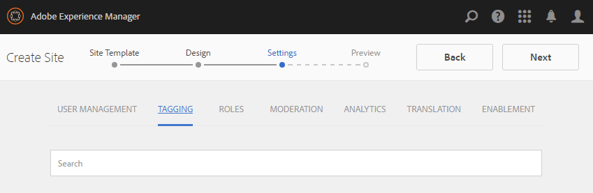
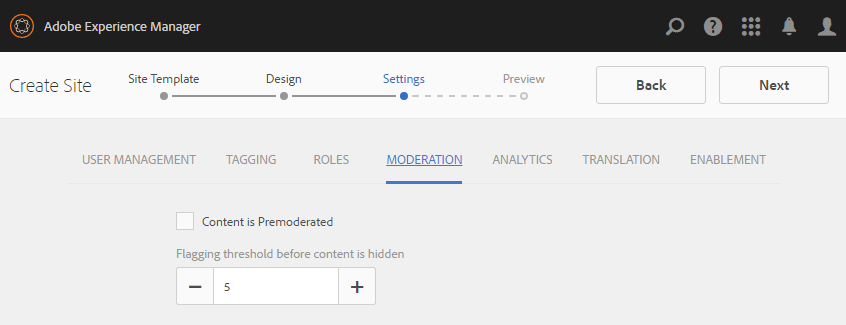
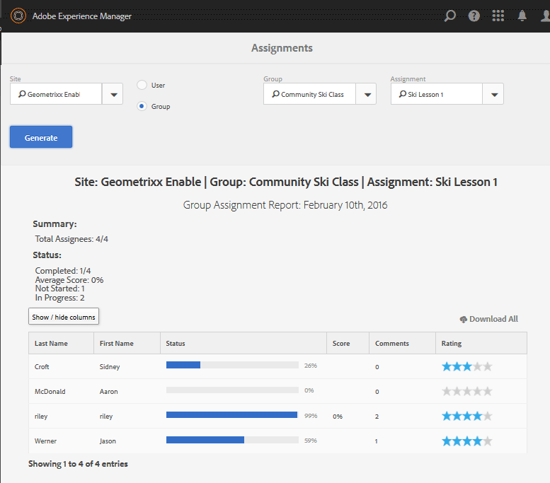
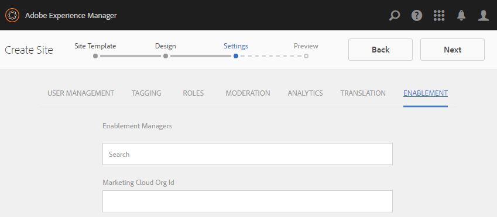

# Reports Console {#reports-console}

## Overview {#overview}

For AEM Communities, there are various reports that may be accessed in several ways from the author environment.

In general, the various reports are:

* [Assignments Report](#assignments-report) - for an [enablement community](overview.md#enablement-community), provides an overview of learners' progress on their assignments, including an associated score if implementing the SCORM standard
* [Views Report](#views-report) - provides a chart of views of content by community members and site visitors for any community site
* [Posts Report](#posts-report) - provides a chart of various types of posts by community members to any community site

When [Adobe Analytics is enabled](sites-console.md#analytics), reports will include the number of views, plays, comments and ratings for each enablement resource over time

Tabular reports can be exported in .csv format for subsequent processing.

## Reporting Consoles {#reporting-consoles}

### Reports for Community Sites {#reports-for-community-sites}

* From global navigation: **[!UICONTROL Navigation > Communities > Reports]**
* Choose from
    * **[!UICONTROL Assignments Report]**
        * Generate a report for selected Community Site, User or Group, and Assignment
    * **[!UICONTROL Posts Report]**
        * Generate a report for selected Community Site, Content Type, and Time Period
    * **[!UICONTROL Views Report]**
        * Generate a report for selected Community Site, Content Type, and Time Period

### Reports for Enablement Resources and Learning Paths {#reports-for-enablement-resources-and-learning-paths}

* From global navigation: **[!UICONTROL Navigation > Communities > Resources]**
* Select an existing enablement community site
    * Select **[!UICONTROL Report]** icon to generate reports which cover all enablement resources
    * Select an enablement learning path
    * Select **[!UICONTROL Report]** icon to generate reports for
        * The included enablement resources
        * The learners assigned to the learning path
* These reports provide:
    * Table data, downloadable as CSV
        * Identifying learner
        * Their status
        * Whether assigned or accessed through catalog
        * Number of comments made
        * Star rating given

For more details, see [Reports section](resources.md#report) of the Resources console.

## Assignments Report {#assignments-report}

The Assignments console allows reports to be filtered by enablement community site, users or groups, and assignment.

The report provides information on their progress as well as any comments or ratings provided.

Select the criteria for the report:

* **[!UICONTROL Site]** 
  Select an enablement community site
* **[!UICONTROL User or Group]** 
  * Select User to generate a report for one learner
  * Select Group to generate a report for a group of learners
  The tunnel service will access members and member groups from the publish environment
* **[!UICONTROL Assignment]** 
  Choose from among the enablement resources assigned to the selected learner(s)

Select **[!UICONTROL Generate]** to create the report:

## Views Report {#views-report}

The Views console allows reports to be generated on page views by community feature(s) for a given time period.

Select the criteria for the report:

* **[!UICONTROL Site]** 
  Select a community site
* **[!UICONTROL Content Type]** 
  May choose All content or select one of the features present on the site
* Time frame 
  Select one of:
    * Last 7 days
    * Last 30 days
    * Last 90 days
    * Last year

Select **[!UICONTROL Generate]** to create the report:

## Posts Report {#posts-report}

The Posts console allows reports to be generate on number of posts to community feature(s) for a given time period.

Select the criteria for the report:

* **[!UICONTROL Site]** 
  Select a community site
* **[!UICONTROL Content Type]** 
  May choose All content or select one of the features present on the site
* Time frame 
  Select one of:
    * Last 7 days
    * Last 30 days
    * Last 90 days
    * Last year

Select **[!UICONTROL Generate]** to create the report:

## Troubleshooting {#troubleshooting}

### No community sites listed {#no-community-sites-listed}

If no community sites are listed, ensure Adobe Analytics has been enabled for a site. If choosing reports on assignments, ensure the assignments function is in the community site's structure.
