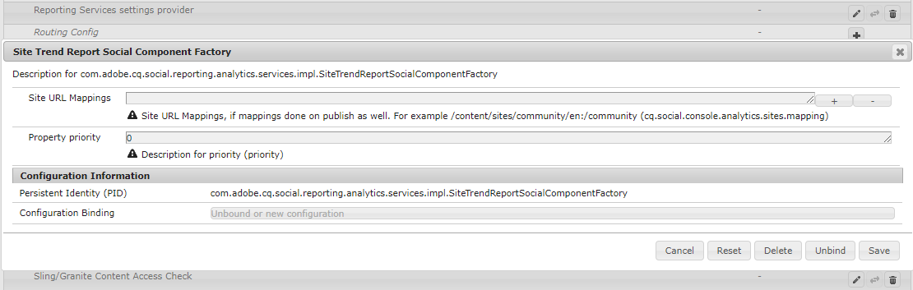

# Reports Console {#reports-console}

## Overview {#overview}

For AEM Communities, there are various reports that may be accessed in several ways from the author environment.

In general, the various reports are:

* [Views Report](#views-report) 

  Provides a chart of views of content by community members and site visitors for any community site.

* [Posts Report](#posts-report) 

  Provides a chart of various types of posts by community members to any community site.

Tabular reports can be exported in .csv format for subsequent processing.

## Reporting Consoles {#reporting-consoles}

### Reports for Community Sites {#reports-for-community-sites}

* From global navigation: **[!UICONTROL Navigation]** > **[!UICONTROL Communities]** >  **[!UICONTROL Reports]**

* Choose from:

  * **[!UICONTROL Assignments Report]**

    * Generate a report for selected Community Site, User or Group, and Assignment.

  * **[!UICONTROL Posts Report]**

    * Generate a report for selected Community Site, Content Type, and Time Period.

  * **[!UICONTROL Views Report]**

    * generate a report for selected Community Site, Content Type, and Time Period.

## Views Report {#views-report}

The Views console allows reports to be generated on page views by community feature(s) for a given time period.

Select the criteria for the report:

* **[!UICONTROL Site]**

  Select a community site.

* **[!UICONTROL Content Type]**

  May choose All content or select one of the features present on the site.

* **[!UICONTROL Time frame]**

  Select one of:

  * Last 7 days
  * Last 30 days
  * Last 90 days
  * Last year

Select **[!UICONTROL Generate]** to create the report.

## Posts Report {#posts-report}

The Posts console allows reports to be generate on number of posts to community feature(s) for a given time period.

Select the criteria for the report:

* **[!UICONTROL Site]**

  Select a community site.

* **[!UICONTROL Content Type]**

  May choose All content or select one of the features present on the site.

* **[!UICONTROL Time frame]**

  Select one of:

  * Last 7 days
  * Last 30 days
  * Last 90 days
  * Last year

Select **[!UICONTROL Generate]** to create the report.

## Troubleshooting {#troubleshooting}

### No community sites listed {#no-community-sites-listed}

If no community sites are listed, ensure Adobe Analytics has been enabled for a site. If choosing reports on assignments, ensure the assignments function is in the community site's structure.

### Reports do not show in AEM Author instance {#reports-do-not-show-in-aem-author-instance}

If reports do not show up in AEM Author instance check for the customizations, such as URL mapping on Publish instance. If URL mapping is done only on AEM Publish instance of the communities site, ensure that the same has been configured in AEM Author instance in **Site Trend Report Social Component Factory** configuration.

