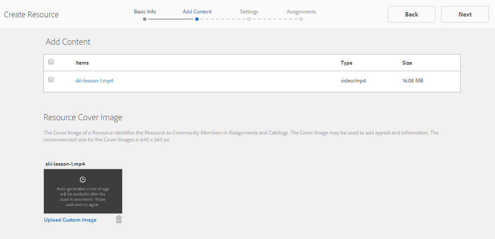
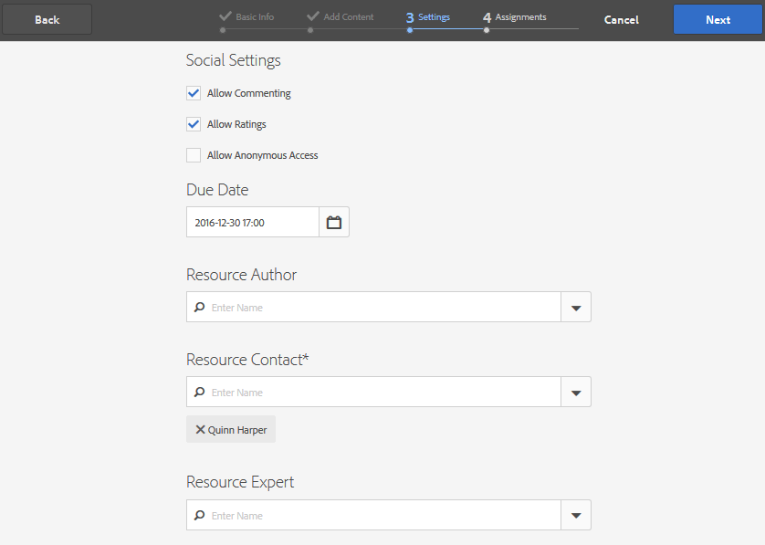
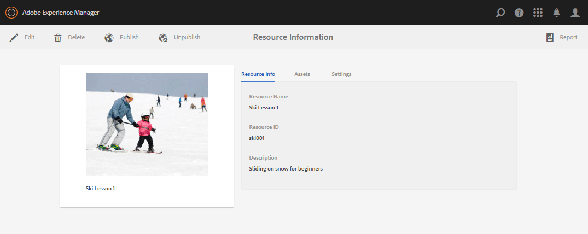
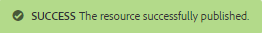
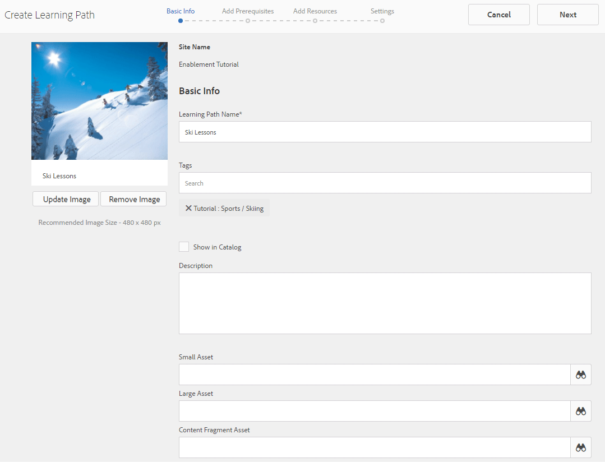
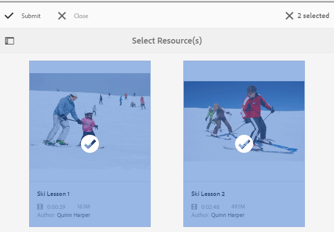
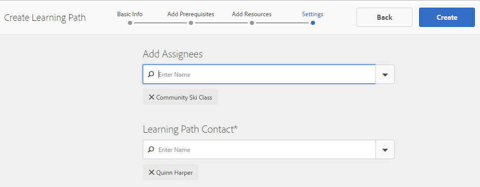
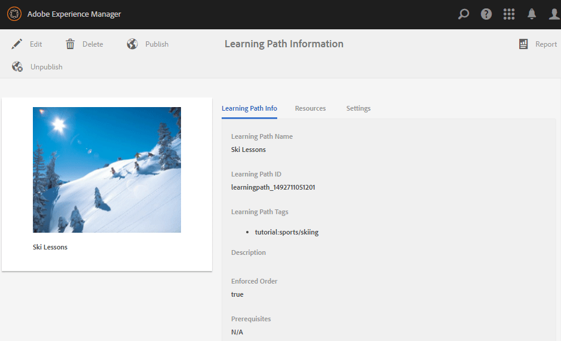

# Create and Assign Enablement Resources {#create-and-assign-enablement-resources}

## Add an Enablement Resource {#add-an-enablement-resource}

To add an enablement resource to the new community site:

* Login as a system administrator on the author instance:
    * For example, [http://localhost:4502/](http://localhost:4503/)
* From global navigation, select **[!UICONTROL Communities]** > **[!UICONTROL Resources]**

  

  
* Select the community site to which enablement resources are being added:
  * Select **[!UICONTROL Enablement Tutorial]**.
* From the menu, select **[!UICONTROL Create]**.
* Select **[!UICONTROL Resource]**.

### Basic Info {#basic-info}

Fill in the basic information for the Resource:

* **[!UICONTROL Site Name]**
  
  Set to the name of the selected community site: Enablement Tutorial

* **[!UICONTROL Resource Name&ast;]**

  Ski Lesson 1

* **[!UICONTROL Tags]**

  Tutorial: Sports / Skiing

* **[!UICONTROL Show in Catalog]**

  Set it to **On**.

* **[!UICONTROL Description]**
  
  Sliding on snow for beginners.

* **[!UICONTROL Add Image]**

  Add an image to represent the Resource to the member in their Assignments view.

  

* Select **[!UICONTROL Next]**

### Add Content {#add-content}

While it appears as if multiple Resources might be selected, only one is allowed.

Select the `'+' icon`, in the upper right corner, to begin the process of choosing the Resource by identifying the source.

 

Upload a Resource. If a video resource, either upload a custom image to display before the video starts playing, or allow a thumbnail to be generated from the video (may take a few minutes - it's not necessary to wait).

* Select **[!UICONTROL Next]**.

### Settings {#settings}

* **[!UICONTROL Social Settings]**
  
  Leave default settings to experience commenting and rating of enablement resources by learners.

* **[!UICONTROL Due Date]**
  
  *(Optional)* A date by which the assignment should be completed may be selected.

* **[!UICONTROL Resource Author]**
  
  *(Optional)* Leave blank.

* **[!UICONTROL Resource Contact&ast;]**
  
  *(Required)* Use the pulldown menu to select member `Quinn Harper`.

* **[!UICONTROL Resource Expert]**
  
  *(Optional)* Leave blank.

  **Note**: If users or groups are not visible, check that they were added to the `Community Enable Members` group and *Saved* on the publish instance.

  

* Select **[!UICONTROL Next]**

### Assignments {#assignments}

* **[!UICONTROL Add Assignees]**
  
  Leave unset as this enablement resource will be added to a learning path. If a learner is assigned to the individual enablement resource as well as a learningpPath containing the enablement resource, the learner will be assigned to the enablement resource twice.

  

* Select **[!UICONTROL Create]**

  

Successful creation of the Resource returns to the Resources console with the newly created Resource selected. From this console, it is possible to publish, add learners and change other settings.

To upload a new version of the enablement resource, it is recommended to create a new Resource, and then unenroll members from the old version and enroll them in the new version.

### Publish the Resource {#publish-the-resource}

Before Enrollees are able to see the assigned Resourse, it must be published:

* Select the world `Publish` icon

Activation is confirmed with a success message:

## Add a Second Enablement Resource {#add-a-second-enablement-resource}

Repeat the steps above to create and publish a second related enablement resource from which a learning path will be created.

**Publish** the second Resource.

Return to the Enablement Tutorial listing of it's Resources.

*Hint: If both Resources are not visible, refresh the page.*

## Add a Learning Path {#add-a-learning-path}

A learning path is a logical grouping of enablement resources which form a course.

* From the Resources console, select `+ Create`
* Select **[!UICONTROL Learning Path]**

Add the **[!UICONTROL Basic Info]**:

* **[!UICONTROL Learning Path Name]** 

  Ski Lessons

* **[!UICONTROL Tags]**
  
  Tutorial: Skiing

* **[!UICONTROL Show in Catalog]**

  Leave unchecked

* **[!UICONTROL Upload an image]** 

  To represent the learning path in the Resources console.

  

* Select **[!UICONTROL Next]**.

Skip the next panel as there are no prerequisite learning paths to add.

* Select **[!UICONTROL Next]**

On the Add Resources panel:

* Select `+ Add Resources` to select the 2 ski lessions resources to add to the learning path.

  Note: Only **published** Resources will be selectable.

>[!NOTE]
>
>You can only select the resources available at the same level as the learning path. For example, for a learning path created in a group only the group level resources are available; for a learning path created in a community site the resources in that site are available for adding to the learning path.

* Select **[!UICONTROL Submit]**.

   
  
  

* Select **[!UICONTROL Next]**

  

* **[!UICONTROL Add Assignees]**
 
  Use the pulldown menu to select the `Community Ski Class` group, which should included members `Riley Taylor` and `Sidney Croft.`

* **[!UICONTROL Learning Path Contact&ast;]**
  
  *(Required)* Use the pulldown menu to select member `Quinn Harper`.

* Select **[!UICONTROL Create]**.

  

Successful creation of the learning path returns to the Resources console with the newly created learning path selected. From this console, it is possible to publish, add learners and change other settings.

**Publish** the learning path.
