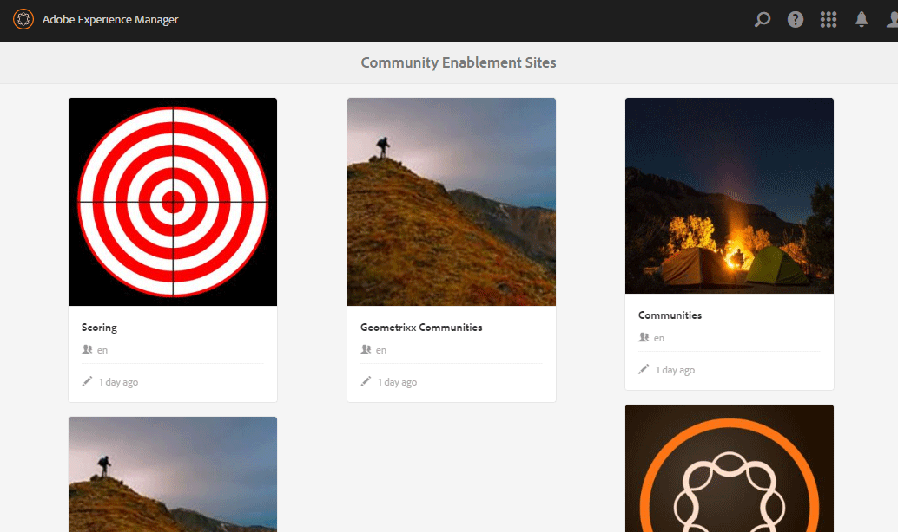
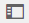
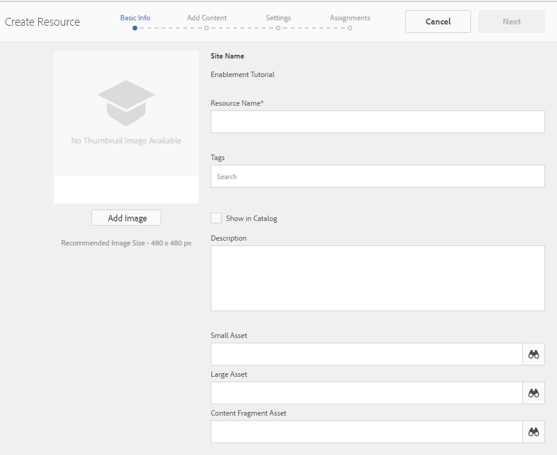
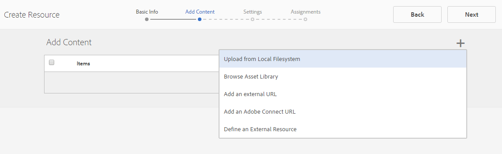
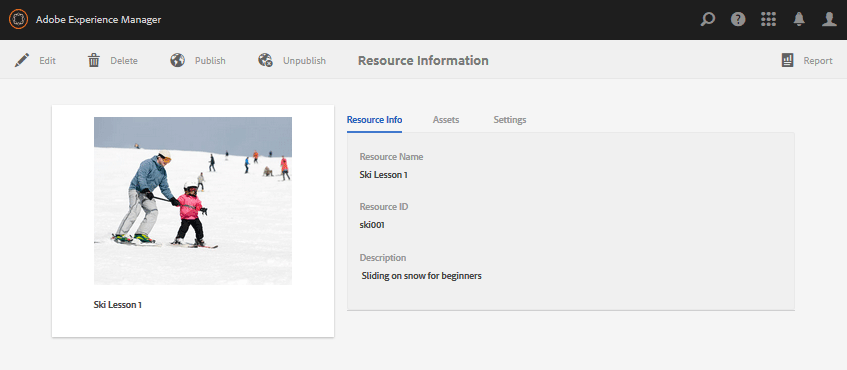
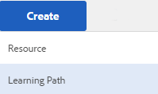
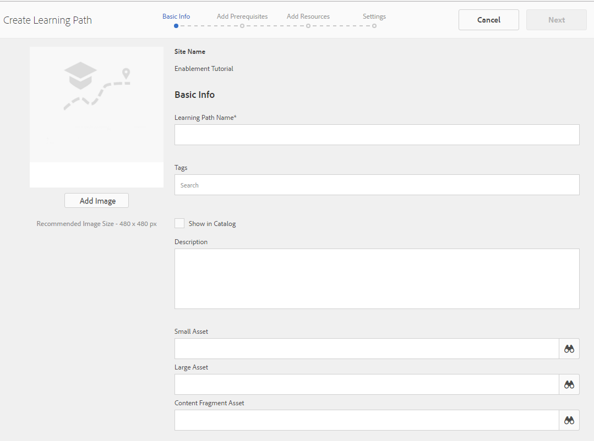
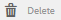
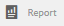

# Enablement Resources Console {#enablement-resources-console}

For AEM Communities, the Resources console is where [Enablement Managers](users.md) create, manage and assign resources to members of an enablement community site.

## Requirements {#requirements}

Before adding enablement resources for a community site, the AEM instances must be properly configured, including:

* SCORM
* FFmpeg

For details, see [Configuring Enablement](enablement.md).

>[!CAUTION]
>
>If SCORM is installed after community site creation, any enablement resources present before SCORM is installed must be recreated.

>[!NOTE]
>
>With the release of [AEM 6.3](deploy-communities.md#latestfeaturepack) and the equivalent Communities feature packs [AEM 6.2 FP3](deploy-communities.md#latestfeaturepack) and [AEM 6.1 FP7](https://docs.adobe.com/content/docs/en/aem/6-1/deploy/communities.html#Latest Feature Pack), the enablement feature no longer requires a [MySQL database](mysql.md).

## Terminology {#terminology}

### Resource {#resource}

Resources are essential to an [enablement community](overview.md#enablement-community). They are the materials assigned to members that enable them to improve their skills.

Characteristics of a Resource:

* May be of type:
  * Image (JPG, PNG, GIF, BMP)
  * Video (MP4)
  * Flash (SWF)
  * Document (PDF)
  * Quiz (SCORM)
* May be referenced from one or more learning paths.

### Learning Path {#learning-path}

A learning path is a logical set of enablement resources grouped together for ease of assigning to members.

### Members Group {#members-group}

When a community site is created, the name given to the site for the URL is used in the creation of the [site specific user groups](users.md) configured with various permissions for various roles. All of these automatically created groups are prefixed with `Community <site-name>`.

One such user group is `Community <site-name> Members` group, which identifies registered users in the publish environment as community members. See the tutorial [Getting Started with AEM Communities for Enablement](getting-started-enablement.md) for an example.

For [engagement communities](overview.md#egagementcommunity), it is reasonable to allow site visitors to self-register or use social login, at which point they are automatically added to the members group.

For [enablement communities](overview.md#enablement-community), it is recommended to make the site private which then requires an administrator to add users to the members group.

## Accessing a Community Site's Enablement Resources {#accessing-a-community-site-s-enablement-resources}

### Navigate to Communities Resources {#navigate-to-communities-resources}

In the author environment, to reach the Resources console

* From global navigation: **[!UICONTROL Navigation]** > **[!UICONTROL Communities]** > **[!UICONTROL Resources]**

  

### Select a Community Site {#select-a-community-site}

The Communities Resources console will display all community sites.

Enablement resources are created for a specific community site after selecting the site from the Resources console.

Once a specific community site is selected, any existing enablement resources and learning paths are accessible for managing and modifying, and new enablement resources and learning paths may be created.

#### Search {#search-features}

Select the side-panel toggle icon in order to search for an enablement resource or learning path. When selected, a search panel opens up on the left side of the console and provides a text box into which search terms may be entered.

#### Selection Mode {#selection-mode}

To select multiple enablement resources, select the first by hovering over the card and selecting the checkmark icon. Once selected, selecting any other card will add it to the selection group. Selecting a second time de-selects the card.

## Create a Resource {#create-a-resource}

To add a new enablement resource to the community site

* Select the `Create` icon.
* From the sub-menu which displays, select **[!UICONTROL Resource]**.

This launches a step-by-step process of:

* Describing the resource (name, card image and text).
* Selecting the resource content.
* Selecting a cover image for the resource.
* Identifying resource contacts.
* Assigning resources to members.

When the resource is part of a course, a learning path, members should only be assigned to the learning path. Assignments may be added after the enablement resource has been created.

### 1 Basic Info {#basic-info}

* **[!UICONTROL Add Image]**

  (*Optional*) An image to display on the card for the enablement resource in the member's assignments page as well as the Resources console. The image is selected from the server's local file system. If an image is not provided, a thumbnail will be generated for the uploaded resource.

  ***Note***: The recommended image size is not simply 480 x 480 pixels. Due to the responsive design of the cards to various browser dimensions, the display size will vary from 220 X 165 pixels to 400 x 165 pixels.

* **[!UICONTROL Site Name]**

  (*readonly*) The community site to which the resource is being added.

* **[!UICONTROL Resource Name]**

  (*Required*) The display name for the resource. A valid node name is created from the display name.

* **[!UICONTROL Tags]**

  (*Optional*) One or more tags may be chosen which associate the enablement resource with one or more catalogs. See [Tagging Enablement Resources](tag-resources.md).

* **[!UICONTROL Show in Catalog]**

  When unchecked, the enablement resource will not appear in any catalog. If checked, the enablement resource will appear in all catalogs unless [pre-filtered](catalog-developer-essentials.md#pre-filters) or the member filters from the UI. Default is unchecked.

* **[!UICONTROL Description]**

  (*Optional*) The description to display for the enablement resource.

* **[!UICONTROL Small Asset]**

  (*Optional*) Selected from AEM Assets. A thumbnail image to represent the resource in the publish environment, such as in a catalog.

* **[!UICONTROL Large Asset]**

  (*Optional*) Selected from AEM Assets. A large image to represent the resource in the publish environment, such as on the main page for a resource.

* **[!UICONTROL Content Fragment Asset]**

  (*Optional*) Selected from AEM Assets. A content fragment that may be referenced in the publish environment, but is not in use by default.

* Select **[!UICONTROL Next]**

### 2 Add Content {#add-content}

While it appears as if multiple enablement resources might be selected, only one is allowed.

Select the `'+' icon`, in the upper right corner, to begin the process of choosing the resource by identifying the source.

* **[!UICONTROL Upload from my local files]**
  
  Uploading from the local file system will use the native file browser to select and upload a file. Supported file types are SCORM.zip (HTML5 or SWF), MP4 video, SWF, PDF, and image types (JPG, PNG, GIF, BMP). The filename becomes the name of the asset, which is added to the asset library.

* **[!UICONTROL Browse Asset Library]**
  
  Select from Assets Library. Selection is limited to those that are visible within the community site.

* **[!UICONTROL Add an external URL]**

  Enter a link to learning content.

  In the dialog which opens, enter:

  * **[!UICONTROL Title]**

    The name of the asset for the enablement resource.

  * **[!UICONTROL URL]**

    The URL to an asset.

* **[!UICONTROL Add an Adobe Connect URL]**

  Enter a link to an Adobe Connect session.

  In the dialog which opens, enter:

  * **[!UICONTROL Title]**

    The name of the asset for the enablement resource.

  * **[!UICONTROL URL]**

    The URL to an Adobe Connect session.

* **[!UICONTROL Define an External Resource]**

  Enter the location where the material is to be presented. The values for the success status and score are entered manually (see [Reports](reports.md)). An uploaded cover image can be used to provide additional information.

  In the dialog which opens, enter:

  * **[!UICONTROL Title]**

    The name of the asset for the enablement resource.

  * **[!UICONTROL Location]**

    The location of a physical site, such as a classroom..

#### Example of an added video resource {#example-of-an-added-video-resource}

* **[!UICONTROL Resource Cover Image]**

  The cover image is an image to be displayed when the enablement resource is first viewed. For example, the cover image is displayed when a video resource is not yet playing. If a custom image is not uploaded, a default image is displayed. For video resources, it may be possible to [generate a thumbnail](enablement.md#ffmpeg), but only when uploaded and not when the video is referenced as an URL. For location resources, the image can be used to provide additional information.

  The recommended size for the cover image is 640 x 360 px.

* Select **[!UICONTROL Next]**.

### 3 Settings {#settings}

>[!NOTE]
>
>Learners should not be enrolled direclty in enablement resources that are to be referenced from a learning path. Learners need only be enrolled in the learning path.
>
>If a member is enrolled in both a resource and a learning path which references that resource, their assignments will show both the single resource and the resource within the learning path.

* **[!UICONTROL Social Settings]**

  These settings control whether or not learners are able to provide input regarding the enablement resource. The [moderation settings](sites-console.md#moderation) are those of the parent community site.

  * **[!UICONTROL Allow Commenting]**

    If checked, members are allowed to comment on the resource. Default is checked.

  * **[!UICONTROL Allow Ratings]**

    If checked, members are allowed to rate the resource. Default is checked.

  * **[!UICONTROL Allow Anonymous Access]**

    If checked, anonymous site visitors are allowed to view the resource in a catalog when the community site also allows anonymous access. Default is unchecked.

* **[!UICONTROL Due Date]**
  
  *(Optional)* A date by which the assignment should be completed may be selected.

* **[!UICONTROL Resource Author]**
  
  *(Optional)* The author of the enablement resource. Use the pulldown menu to select from the users who are members of the [members group](#members-group).

* **[!UICONTROL Resource Contact&ast;]**
  
  *(Required)* A person the member can contact regarding the enablement resource. Use the pulldown menu to select from the users who are members of the [members group](#members-group).

* **[!UICONTROL Resource Expert]**
  
  *(Optional)* A person the member can contact who has expertise regarding the enablement resource. Use the pulldown menu to select from users who are members of the [members group](#members-group).

### 4 Assignments {#assignments}

* **[!UICONTROL Add Assignees]**
  
  Use the pulldown menu to select from [members](#members-group) - The users and user groups (listed in bold face) - who are to be enrolled as Learners. When members sign into the community site, the enablement resources (and learning paths) in which they are enrolled will appear on their [Assignments](functions.md#assignments-function) page.

* Select **[!UICONTROL Create]**.

  

Successful creation of the enablement resource returns to the Resources console with the newly created resource selected. From this console, it is possible to [manage the resource](#managing-a-resource).

## Create a Learning Path {#create-a-learning-path}

To add a new learning path to the community site

* Select the `Create` icon
* From the sub-menu which displays, select **[!UICONTROL Learning Path]**.

This launches a step-by-step process of:

* Identifying the learning path.
* Providing a card image to represent the learning path to the learners.
* Referencing the enablement resources to include in the learning path.
* Optionally ordering the resources.
* Optionally identifying prerequisite learning paths.
* Identifying a learning path contact.
* Enrolling members.

For enablement resources included in a learning path, the assignments should only be made for the learning path and not for the individual resources.

### Basic Info {#basic-info-1}

* **[!UICONTROL Add Image]**

  (*Optional*) An image to display on the card for the learning path in the member's assignments page as well as the Resources console. The image is selected from the server's local file system. If an image is not provided, a thumbnail will be generated for the uploaded resource.

  ***Note***: The recommended image size is no longer simply 480 x 480 pixels. Due to the responsive design of the cards to various browser dimensions, the display size will vary from 220 X 165 pixels to 400 x 165 pixels.

* **[!UICONTROL Site Name]**

  (*Readonly*) The community site to which the resource is being added.

* **[!UICONTROL Learning Path Name]**

  (*Required*) The display name for the learning path. A valid node name is created from the display name.

* **[!UICONTROL Tags]**

  (*Optional*) One or more tags may be chosen which associate the learning path with one or more catalogs. See [Tagging Enablement Resources](tag-resources.md).

* **[!UICONTROL Show in Catalog]**

  When unchecked, the learning path will not appear in any catalog. If checked, the learning path will appear in all catalogs unless [pre-filtered](catalog-developer-essentials.md#pre-filters) or the member filters from the UI. Showing the learning path in a catalog will indirectly grant READ access to all its contained resources. Default is unchecked.

* **[!UICONTROL Description]**

  (*Optional*) The description to display for the enablement resource.

* **[!UICONTROL Small Asset]**

  (*Optional*) Selected from AEM Assets. A thumbnail image to represent the resource in the publish environment, such as in a catalog.

* **[!UICONTROL Large Asset]**

  (*Optional*) Selected from AEM Assets. A large image to represent the resource in the publish environment, such as on the main page for a resource.

* **[!UICONTROL Content Fragment Asset]**

  (*Optional*) Selected from AEM Assets. A content fragment that may be referenced in the publish environment, but is not in use by default.

* Select **[!UICONTROL Next]**.

### Add Prerequisites {#add-prerequisites}

* **[!UICONTROL Prerequisite Learning Paths]**
  
  (*Optional*) When other published learning paths are selected, they must be completed before a learner can select this learning path.

* Select **[!UICONTROL Next]**.

### Add Resources {#add-resources}

* **[!UICONTROL Enforce Order in Learning Path]**

  (*Optional*) If set to On, then the order in which the enablement resources are added is the order in which learners are required to proceed through the learning path. Default is Off.

* **[!UICONTROL Resources]**

  One or more Resources chosen from among the *published* enablement resources created for the current community site.

>[!NOTE]
>
>You can only select the resources available at the same level as the learning path. For example, for a learning path created in a group only the group level resources are available; for a learning path created in a community site the resources in that site are available for adding to the learning path.

* Select **[!UICONTROL Next]**.

### Settings {#settings-1}

* **[!UICONTROL Add Enrollments]**

  Use the pulldown menu to select from the members and member groups (listed in bold face) who are members of the community site's [members group](#members-group). It is not necessary to add assignments when first creating the learning path. The learning path properties can be modified to add learners at a later time.

* **[!UICONTROL Learning Path Contact&ast;]**

  *(Required)* A person the member can contact regarding the learning path. Use the pulldown menu to select from the users who are members of the community site's [members group](#members-group).

* Select **[!UICONTROL Create]**

>[!NOTE]
>
>Enablement resources referenced from the learning path should not list the same Assignees (learners), if any.
>
>If a member is enrolled in both an enablement resource and a learning path which references that rresource, their assignments will show both the single resource and the resource within the learning path.

## Managing a Resource {#managing-a-resource}

To manage a single enablement resource:

* From the **[!UICONTROL Resources]** console, select the community site which contains the resource.
* Select the resource.

For the selected enablement resource, it is possible to:

* View properties (default)
* Edit properties
* Delete
* Publish
* Unpublish

To upload a new version of the enablement resource, it is recommended to create a new resource, and then unenroll members from the old version and enroll them in the new version.

### Edit Resource {#edit-resource}

By selecting the pencil icon, the steps shown for creating a an enablement resource are made available so that any of the information provided may be modified.

If the only change is to modify assignments on the Settings step, then saving the changes results in the modifications being published. If any other changes are made, the resource must be explicitly published afting saving.

### Delete Resource {#delete-resource}

By selecting the trashcan icon, the enablement resource will be `Deleted` after confirmation.

### Publish {#publish}

Before learners are able to see an assigned enablement resourse, it must be published:

* Select the world icon to `Publish`.
* In the dialog which pops up, select **[!UICONTROL Publish]** again.
* Select **[!UICONTROL Close]**.

Even though the dialog states the action is queued, it often is published immediately.

### Unpublish {#unpublish}

To temporarily make the enablement resources unaccessible to members in the publish environment without deleting it, use the world icon to `Unpublish` the resource.

### Report {#report}

The Report icon provides access to the reports generated when learners interact with their assigned enablement resources in the publish environment. The report varies depending on the type of resource.

For all learning paths, it is possible to view a report based either on resources or learners ( `User Report`.)

This Report is specifically for the current enablement resource or learning path. The depth of reporting provided depends on whether or not [Adobe Analytics](analytics.md) is licensed and enabled for the community site. The [Timeline](#timeline), [Viewer Engagement](#viewer-engagement), and [Engagement by Device](#engagement-by-device) reports are imported from Adobe Analytics based on the [polling interval](analytics.md#report-importer).

For all enablement resources, regardless of whether or not Adobe Analytics is enabled, there are reports on [Assignee Status](#assignee-status) and [Ratings](#ratings) as well as a [Report Summary](#report-summary) table.

#### Timeline {#timeline}

The Analytics Timeline report shows when events occur over time for this enablement resource:

* **Views**

  A view is when a learner visits the resource details page.

* **Plays**

  A play is when alLearner interacts with the resource, such as playing a video or opening a PDF.

* **Ratings**

  A rating is when a learner assigns a star rating to a resource.

* **Comments**

  A comment is when alLearner adds a comment.

The vertical axis is the number of events.

The horizontal axis is calendar time.

[Adobe Analytics required](sites-console.md#analytics).

#### Viewer Engagement {#viewer-engagement}

The Analytics Viewer Engagement report shows, for video resources, the number of learners who have viewed the resource and, if not played to the end, at what point learners stopped playing it.

The vertical axis is the number of learners who have viewed this resource.

The horizontal axis is the duration of this resource.

[Marketing Cloud Org ID required](sites-console.md#enablement).

#### Engagement by Device {#engagement-by-device}

The Analytics Engagement by Device report, for video resources, describes the percentage of views that were played from desktop and from mobile.

[Marketing Cloud Org ID required](sites-console.md#enablement).

#### Assignee Status {#assignee-status}

The Assignee Status report, based on the number of learners, describes how many have

* **Not started**
* **In progress**
* **Completed**

#### Ratings {#ratings}

The Ratings report is based on the number of learners who have rated the enablement resource, showing the number of each star rating followed by a summary of the total number of ratings and the average rating.

#### Report Summary {#report-summary}

For an enablement resource, the Report Summary is a table listing.

* Each learner who has interacted with the resource
  * Their status
  * Whether they were assigned the resource
    * As opposed to their finding the resource in a catalog
    * Number of comments posted
    * The rating given, if any

For a learning path Resource Report, the Report Summary is a table listing

* Each resource included in the learning path
  * Publish status
  * Number of views
  * Number of plays
  * Average rating
  * Format
  * Size
  * Community site name

For a learning path User Report, the Report Summary is a table listing.

* Each learner who is assigned to the learning path:
  * Number of Resources completed.
  * Their status.

It is possible to adjust the display of the table by selecting columns using the `Show / hide columns` selector.

#### Download Report as CSV {#download-report-as-csv}

The Reports Summary table may be downloaded in CSV format using a button at the top of the console.

* For an enablement resource: `Download Resource Report as CSV` button.
* For a learning path: `Download Learning Path Report as CSV` button.

The complete Reports Summary is downloaded regardless of columns chosen for display.
