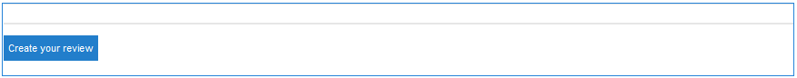
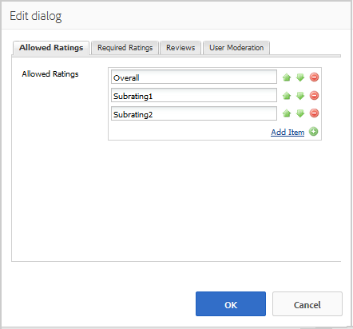
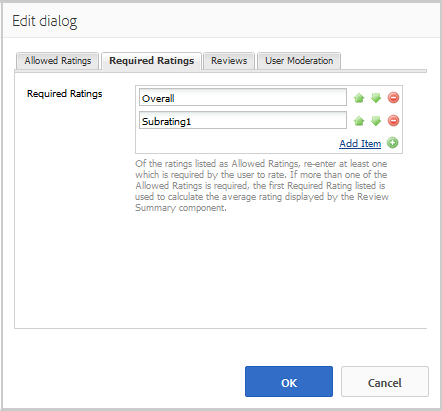
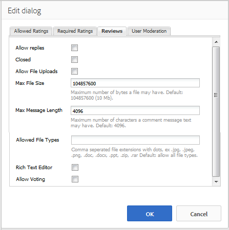
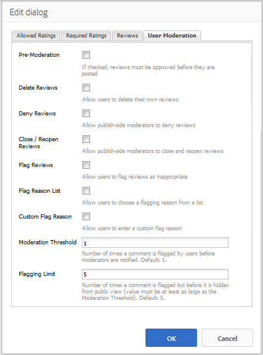
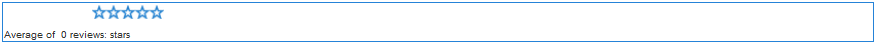
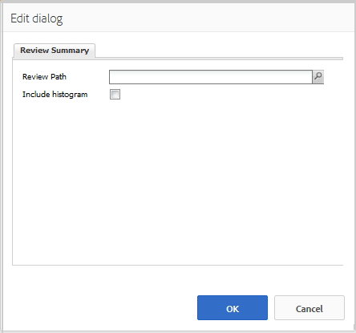

# Using Reviews and Reviews Summary (Display) {#using-reviews-and-reviews-summary-display}

The `Reviews` component is a composite of [Comments](comments.md) and [Rating](rating.md) components ready for use.

The `Reviews Summary (Display)` component provides a summary of an active or closed instance of a `Reviews` component for display elsewhere on the site.

>[!NOTE]
>
>Anonymous posting of a review is not supported. Site visitors must register (become a member) and sign in to participate. The signed-in visitor may update their review at any time.

## Adding a Review to a Page {#adding-a-review-to-a-page}

To add a `Reviews` component to a page in author mode, use the component browser to locate `Communities / Reviews` and drag it into place on a page, such as a position relative to the feature for users to review.

For necessary information, visit [Communities Components Basics](basics.md).

When the [required client-side libraries](reviews-basics.md#essentials-for-client-side) are included, this is how the `Reviews` component appears.

## Configuring Reviews {#configuring-reviews}

Select the placed `Reviews` component so you can access and select the `Configure` icon which opens the edit dialog.

Under the **[!UICONTROL Allowed Ratings]** tab, specify the complete list of ratings to be shown to members. The first rating should be an overall/general rating, as it is the rating which provides the average rating for the `Review Summary (Display)` component. The next two ratings in the default configuration should be given a different title, other than "Subrating 1" or "Subrating 2".

* **[!UICONTROL Allowed Ratings]**

  A list of ratings from which a member can choose.

  Use the up arrow, down arrow and delete buttons to modify the visible selections.

  Click **[!UICONTROL Add Item]** to add another rating choice.

Under the **[!UICONTROL Required Ratings]** tab, reenter items from the list of **[!UICONTROL Allowed Ratings]** that are required for rating. If an item is only specified on the Allowed Ratings tab, it may be left unmarked when submitted by the member.

On the website, required ratings are marked with an asterisk. If an item is required and left unmarked, a message is displayed to the member, and the submission is denied until all required ratings are marked.

* **[!UICONTROL Required Ratings]**

  A subset of allowed ratings, indicating which ratings are required.

  Use the up arrow, down arrow and delete buttons to modify the visible selections.

  Click **[!UICONTROL Add Item]** to add another response choice.

>[!NOTE]
>
>If an item is entered on the **[!UICONTROL Required Ratings]** tab that is not specified on the **[!UICONTROL Allowed Ratings]** tab, then it is not included in the items to rate.

Under the **[!UICONTROL Reviews]** tab, specify how reviews are handled.

* **[!UICONTROL Allow Replies]**
  
  If checked, allow replies to reviews. Default is unchecked.

* **[!UICONTROL Closed]**
  
  If checked, the review is closed to new reviews and replies. Default is unchecked.

* **[!UICONTROL Allow File Uploads]**
  
  If checked, allow file attachments to be uploaded for the review. Default is unchecked.

* **[!UICONTROL ]Max File Size**
  
  Relevant only if **[!UICONTROL Allow File Uploads]** is checked. This field limits the size (in bytes) of an uploaded file. Default is 10 MB.

* **[!UICONTROL Max Message Length]**
  
  Maximum number of characters that may be entered into the text box. Default is 4096 characters.

* **[!UICONTROL Allowed File Types]**
  
  Relevant only if **[!UICONTROL Allow File Uploads]** is checked. A comma-separated list of file extensions with the "dot" separator. For example, .jpg, .jpeg, .png, .doc, .docx, .pdf. If any file types are specified, then those not specified are not allowed. Default is none specified such that all file types are allowed.

* **[!UICONTROL Rich Text Editor]**
  
  If checked, posts may be entered with markup. Default is unchecked.

* **[!UICONTROL Allow Voting]**
  
  If checked, include the Voting feature for a topic. Default is unchecked.

Under the **[!UICONTROL User Moderation]** tab, specify how the posted reviews are managed. For more information, see [Moderating User Generated Content](moderate-ugc.md).

* **[!UICONTROL Pre-Moderation]**
  
  If checked, reviews must be approved before they appear on a publish site. Default is unchecked.

* **[!UICONTROL Delete Reviews]**
  
  If checked, the member who posted the review can delete it. Default is unchecked.

* **[!UICONTROL Deny Reviews]**
  
  If checked, allow moderators to deny reviews. Default is unchecked.

* **[!UICONTROL Close / Reopen Reviews]**
  
  If checked, allow moderators to close and reopen reviews. Default is unchecked.

* **[!UICONTROL Flag Reviews]**
  
  If checked, allow members to flag reviews as inappropriate. Default is unchecked.

* **[!UICONTROL Flag Reason List]**
  
  If checked, allow members to choose, from a drop-down list, their reason for flagging a review as inappropriate. Default is unchecked.

* **[!UICONTROL Custom Flag Reason]**
  
  If checked, allow members to enter their own reason for flagging a review as inappropriate. Default is unchecked.

* **[!UICONTROL Moderation Threshold]**
  
  Enter the number of times a review has to be flagged by members before moderators are notified. Default is one time (1).

* **[!UICONTROL Flagging Limit]**
  
  Enter the number of times a review has to be flagged before it is hidden from public view. This number must be greater than or equal to the **[!UICONTROL Moderation Threshold]**. Default is 5.

### Adding a Review Summary (Display) to a Page {#adding-a-review-summary-display-to-a-page}

To add a `Reviews Summary (Display)` component to a page in author mode, locate the component

* `Communities / Reviews Summary (Display)`

And drag it into place on a page where a summary of an active or closed review is to be displayed.

For necessary information, visit [Communities Components Basics](basics.md).

When the [required client-side libraries](reviews-basics.md#essentials-for-client-side) are included, this is how the `Reviews Summary (Display)`component appears.

>[!NOTE]
>
>The "Average" reflects the votes for the first item listed on the Allowed Ratings tabs of the review being summarized.

### Configuring Reviews Summary (Display) {#configuring-reviews-summary-display}

Select the placed `Reviews Summary (Display)` component so you can access and select the `Configure` icon which opens the edit dialog.

Under the **[!UICONTROL Review Summary]** tab

* `Review Path`

  Enter or browse to the placed instance of the `reviews` component so you can summarize, for example, if added to the Web Page of the [Geometrixx Engage site,](getting-started.md) the path would be:

  `/content/sites/engage/en/page/jcr:content/content/primary/reviews`

* `Include histogram`

  If checked, include the display of a bar graph indicating how many star ratings there are in the reviews being summarized. Default is unchecked.

### Changing to a Custom Review Type {#changing-to-a-custom-review-type}

The Reviews component uses the Comment System.

By changing the Comment Resource Type, the comment system no longer generates an instance of a comment using the default, but rather one that has been customized (extended) by developers.

When the custom resource types are known, enter [Design Mode](../../help/sites-authoring/default-components-designmode.md) and double-click the placed `Comments` component to open a dialog with an additional tab.

Under the **[!UICONTROL Resource Types]** tab, specify the custom resourceType for new instances of the `Comments or Voting` components:

* **[!UICONTROL Comment Resource Type]**

  Navigate to the resourceType of an extended `comment`component (single comment) in /apps. For example, `/apps/social/commons/components/hbs/comments/comment`.

  This resource identifies the resourceType of the UGC created when a visitor posts a comment.

* **[!UICONTROL Voting Resource Type]**

  Navigate to the resourceType of an extended `voting`component in /apps. For example, `/apps/social/components/hbs/voting`.

  This resource identifies the resource type of the UGC created when a visitor posts a vote.

* **[!UICONTROL Comment System Resource Type]**

  Navigate to the resourceType of an extended `comments`component (Comment System) in /apps. Leave blank unless the page template [dynamically includes](scf.md#add-or-include-a-communities-component) the Comment System in the underlying script instead of being added to the page as a resource (comments node). Learn more by reading about the [`{{include}}` helper](handlebars-helpers.md#include).

## Site Visitor Experience {#site-visitor-experience}

### Moderators and Administrators {#moderators-and-administrators}

When the signed in user has moderator or administrator privileges, they are able to perform the moderation tasks permitted by the configuration of the component, regardless of who authored the review.

### Members {#members}

When the site visitor is signed in, depending on the configuration, they may:

* Post a new review
* Edit their own review
* Delete their own review
* Flag others' review comments

Only one rating per member is allowed. The member may change their rating at any time.

### Anonymous {#anonymous}

Site visitors who are not signed in may only read posted reviews, translate them if supported, but may not add a rating or a review, nor flag others' review comments.

## Additional Information {#additional-information}

More information may be found on the [Review Essentials](reviews-basics.md) page for developers.

For moderation of posted comments, see [Moderating User Generated Content](moderate-ugc.md).

For translation of posted comments, see [Translating User Generated Content](translate-ugc.md).
