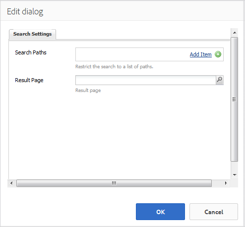
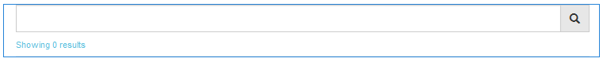
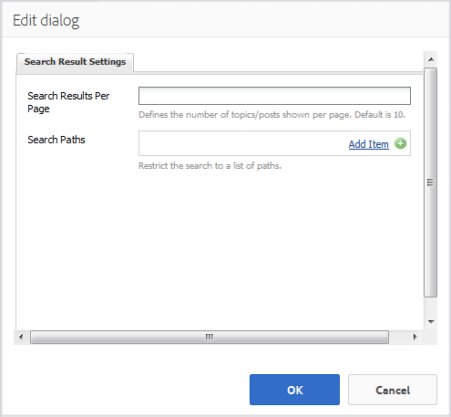

# Search Feature {#search-feature}

The search feature works with various other features, such as forums, to provide the ability to search for content.

When adding the ability to search posts entered by community members, referred to as user generated content (UGC), there are two components: [Search](#search) and [Search Results](#search-results).

The page that includes the `Search Results` component supports both searching and the display of results.

The page that includes the `Search` component provides a place to launch a search with results appearing on the `Search Results` page.

The search feature may be used with any other feature which allows site visitors and members to view content.

## Search {#search-features}

### Add Search to a Page {#add-search-to-a-page}

To add a `Search` component to a page in author mode, use the component browser to locate `Communities / Search` and drag it into place on a page. Use of `Search` requires a second page for the `Search Results.`

For necessary information, visit [Communities Components Basics](basics.md).

When the required client-side library, `cq.social.hbs.search`, is included, this is how the `Search` component will appear.

### Configure the Added Search {#configure-the-added-search}

Select the placed `Search` component to access and select the `Configure` icon which opens the edit dialog.

Under the **[!UICONTROL Search Settings]** tab, specify how what paths are search when a query is entered by a visitor.

* **[!UICONTROL Search Paths]**
  By adding search paths using the Add Item button, the content search is limited. As an example, to limit the search to a specific forum, select a forum component placed within a page:

  * `/content/community-components/en/forum/jcr:content/content/forum`

* **[!UICONTROL Result Page]**
  The results will appear on a separate page specified by using the browser to select a page containing the `Search Results` component.

## Search Results {#search-results}

### Add Search Results to a Page {#add-search-results-to-a-page}

To add a `Search Results` component to a page in author mode, use the component browser to locate

* `Communities / Search Results`

and drag it into place on a page. Unlike the Search component, no second page is needed as the results will be displayed on the same page.

If using Search elsewhere within the website, this one page with `Search Results` may be configured to be the `Result Page` for any or all instances of `Search`.

For necessary information, visit [Communities Components Basics](basics.md).

When the required client-side library, `cq.social.hbs.search`, is included, this is how the `Search Result` component will appear:

### Configure the Added Search Result {#configure-the-added-search-result}

Select the placed `Search Results` component to access and select the `Configure` icon which opens the edit dialog.

Under the **[!UICONTROL Search Result Settings]** tab, it is possible to specify what paths are included in the search when a query is entered by a visitor.

* **[!UICONTROL Search Results Per Page]**
  
  Define the number of topics/posts shown per page. Default is 10.

* **[!UICONTROL Search Paths]**
  
  By adding search paths using the Add Item button, the content search is limited.

## Additional Information {#additional-information}

More information may be found on the [Search Essentials](search-implementation.md) page for developers.
