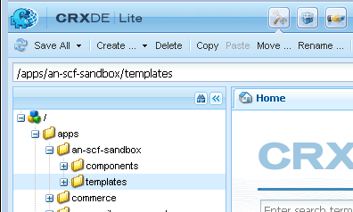

# Setup Website Structure {#setup-website-structure}

To set up your website, the instructions below describe the folders to create in the following locations:

* `/apps/an-scf-sandbox`
  
  This is where custom applications and templates reside.

* `/etc/designs/an-scf-sandbox`
  
  This is where downloadable design elements reside.

* `/content/an-scf-sandbox`
  
  This is where the downloadable web pages reside.

The code in this tutorial relies on the main folder name being the same for the application, design, and content. If you choose some other name for your website, then always replace `an-scf-sandbox` with the name you have chosen.

>[!NOTE]
>
>About names:
>
>* The names seen in CRXDE are node names which form the path to addressable content.
>* Node names may contain spaces, but when used in an URI, the space must be encoded either as '%20' or '+'.
>* Node names may contain hyphens and underscores, but they must be encoded when referenced as a package name within a Java&trade; file. Both hyphens and underscores are escaped with underscore followed by their Unicode value:
>
>   * hyphen becomes '_002d'
>   * underscore becomes '_005f'

## Set up the Application Directory (/apps) {#setup-the-application-directory-apps}

The /apps directory in the repository contains the code with implements the behavior and rendering of the pages served from the /content directory.

The /apps directory is protected and not publicly accessible as are the /content and /etc/designs directories.

1. Create `/apps/an-scf-sandbox` folder.

   Using **[!UICONTROL CRXDE Lite]**, in the explorer pane

   1. Select the `/apps` folder.
   1. Right-click **[!UICONTROL Create]**... or pull down the **[!UICONTROL Create...]** menu.
   1. Select **[!UICONTROL Create Folder...]**.
   1. In the **[!UICONTROL Create Folder]** dialog, enter `an-scf-sandbox`.
   1. Click **[!UICONTROL OK]**.

1. Create **[!UICONTROL components]** subfolder.

   1. Select the `/apps/an-scf-sandbox` folder.
   1. Click **[!UICONTROL Create > Create Folder]**.
   1. In the **[!UICONTROL Create Folder]** dialog, enter **[!UICONTROL components]**.
   1. Click **[!UICONTROL OK]**.

1. Create **[!UICONTROL templates]** subfolder.

   1. Select the `/apps/an-scf-sandbox` folder.
   1. Click **[!UICONTROL Create > Create Folder]**.
   1. In the **[!UICONTROL Create Folder]** dialog, enter **[!UICONTROL templates]**.
   1. Click **[!UICONTROL OK]**.
   1. Reselect `/apps/an-scf-sandbox`.
   1. Select **[!UICONTROL Save All]**.

   As with any editing process, you should save often. If you run into problems with entering data, it may be either because your login has timed out, or you must save previous edits.

1. The structure in the explorer pane of CRXDE Lite should now look something like this:

   

## Set up the Design Directory (/etc/designs) {#setup-the-design-directory-etc-designs}

The /etc/designs directory contains the images, scripts, and style sheets to be downloaded along with the page content.

1. To use the Designer tool in the Classic UI, browse to [https://&lt;server&gt;:&lt;port&gt;/miscadmin](http://localhost:4502/miscadmin).

   Note: If you use CRXDE Lite to create a Node of type `cq:Page`, the Access Control and Replication would not be set to default settings for a page.

1. In the explorer pane, select the **[!UICONTROL Designs]** folder and then click **[!UICONTROL New]** > **[!UICONTROL New Page]**.

   Enter:

   * Title: **[!UICONTROL An SCF Sandbox]**
   * Name: **[!UICONTROL an-scf-sandbox]**
   * Select **[!UICONTROL Design Page Template]**

   Click **[!UICONTROL Create]**.

   

1. Refresh the explorer pane if "An SCF Sandbox" folder does not appear.

1. Return to CRXDE Lite (http:// localhost:4502/crx/de) and expand /etc/designs to see the node named "an-scf-sandbox".

   In the right, lower pane of CRXDE, you can view the Properties tab, Access Control tab, and Replication tab to see what was defined using the Design Page Template.

   

## Set up the Content Directory (/content) {#setup-the-content-directory-content}

The /content directory in the repository is where the website content resides. The paths under /content comprise the paths of the URL for browser requests.

*After* the [page template](initial-app.md#createthepagetemplate) is created as part of the initial application, the initial page content can be created based on the template.... [**⇒**](initial-app.md)
