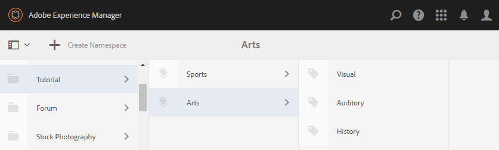

# Initial Setup {#initial-setup}

## Start Author and Publish Instances {#start-author-and-publish-instances}

For development and demonstration purposes, it will be necessary to run one author and one publish instance.

To do so, follow the basic AEM [Getting Started](../../help/sites-deploying/deploy.md#getting-started) instructions, which will result in:

* Author environment on [localhost:4502](http://localhost:4502/)
* Publish environment on [localhost:4503](http://localhost:4503/)

For AEM Communities,

* The author environment is for:

  * Development of sites, templates and components.
  * Administrative and configuration tasks.

* The publish environment is for:

  * The community experience of posting and moderating content.
  * Creating community groups, members and member groups.

>[!NOTE]
>
>If not familiar with AEM, view the documentation on [basic handling](../../help/sites-authoring/basic-handling.md) and a [quick guide to authoring pages](../../help/sites-authoring/qg-page-authoring.md).

## Install Latest Communities Release {#install-latest-communities-release}

This tutorial creates an [engagement community site](overview.md#engagement-community) and is based on AEM Communities 6.2 feature pack version 1.10.

To ensure the latest feature pack is installed, visit:

* [Latest Releases](deploy-communities.md#latest-releases)

## Configure Analytics {#configure-analytics}

When [Adobe Analytics is configured for the community site](analytics.md), information on community activity is available that enhances the community member's experience as well as provides feedback to administrators of the site.

Integration with Adobe Analytics is optional.

## Configure Email for Notifications {#configure-email-for-notifications}

The notifications feature, available by default for all sites created using the `Communities Sites` console, provides an email channel for notifications.

What is necessary is for email to be properly configured for the site.

See [Configuring Email](email.md).

## Enable the Tunnel Service {#enable-the-tunnel-service}

When creating a community site in the author environment, the tunnel service makes possible the ability to assign roles to trusted community members registered in the publish environment. The tunnel service also allows access to community members from the [Members and Groups consoles](members.md) in the author environment.

The convention is for members and member groups created in the publish environment to *not* be recreated in the author environment. For more information see [Managing Users and User Groups](users.md).

For simple instructions to enable the tunnel service on an **author** instance, see [Tunnel Service](deploy-communities.md#tunnel-service-on-author).

## Community Administrator Role {#community-administrator-role}

Members of the Community Administrators group are able to create community sites, manage sites, manage members (they can ban members from the community), and moderate content.

### Create User {#create-user}

Create a user on *author*, who is assigned the role of Community Administrator:

* On the author instance

  * For example, [http://localhost:4502/](http://localhost:4503/)

* Sign in with administrator privileges

  * For example, username 'admin' / password 'admin'

* From the main console, navigate to **[!UICONTROL Tools]** > **[!UICONTROL Operations]** > **[!UICONTROL Security]** > **[!UICONTROL Users]**.
* From the **[!UICONTROL ]Edit** menu, select **[!UICONTROL Add User]**

* In the `Create New User` dialog enter:

  * **[!UICONTROL ID]**: sirius
  * **[!UICONTROL Emai Address]**: sirius.nilson@mailinator.com
  * **[!UICONTROL Password]**: password
  * **[!UICONTROL Confirm Password&ast;]**: password
  * **[!UICONTROL First Name]**: Sirius
  * **[!UICONTROL Last Name]**: Nilson

### Assign Sirius to Community Administrators Group {#assign-sirius-to-community-administrators-group}

Scroll down to `Add User to Groups`:

* Enter 'C' to search

  * Select `Community Administrators`
  * Select `Community Enablement Managers`

* Select **[!UICONTROL Save]**.

## Enable Social Login {#enable-social-login}

Before the demonstration versions of social login with Facebook and Twitter may be used, it is necessary to

1. Install a fix pack or [latest feature pack](deploy-communities.md#latestfeaturepack) (for March 2017 Facebook API changes).
1. [Enable the OAuth provider](social-login.md#adobe-granite-oauth-authentication-handler) in the publish environment.

For production servers, it is necessary to create the cloud services necessary to provide social login.

See [Social Login with Facebook and Twitter](social-login.md).

## Create Tutorial Tags {#create-tutorial-tags}

Create tags to use for the engage tutorials, using the tag namespace of `Tutorial`.

Use the [Tagging console](../../help/sites-administering/tags.md#tagging-console) to create the following tags:

* `Tutorial: Sports / Baseball`
* `Tutorial: Sports / Gymnastics`
* `Tutorial: Sports / Skiing`
* `Tutorial: Arts / Visual`
* `Tutorial: Arts / Auditory`
* `Tutorial: Arts / History`

Then follow the instructions to:

1. [Set the tag permissions](../../help/sites-administering/tags.md#setting-tag-permissions).
1. [Publish the tags](../../help/sites-administering/tags.md#publishing-tags).

Sample package of tags created for the AEM Communities Getting Started Tutorials

[Get File](assets/tutorial_tags-v63.zip)

## MongoDB for UGC Common Store {#mongodb-for-ugc-common-store}

It is recommended, but optional, to set [MSRP](msrp.md) (MongoDB) as the [common store](working-with-srp.md) to experience the flexibility of moderating all UGC from either publish and/or author environments.

For instructions visit [How to Setup MongoDB for Demo](demo-mongo.md).

By default, the installation of the author and publish AEM instances result in user generated content (UGC) being stored in [JCR Tar storage](../../help/sites-deploying/platform.md) which is accessed using [JSRP](jsrp.md). JSRP is not a common store, which means UGC is visible only on the instance on which it was entered. Typically, UGC is entered on a publish instance and would not be visible in the author environment, resulting in all moderation tasks needing to use the publish instance.
