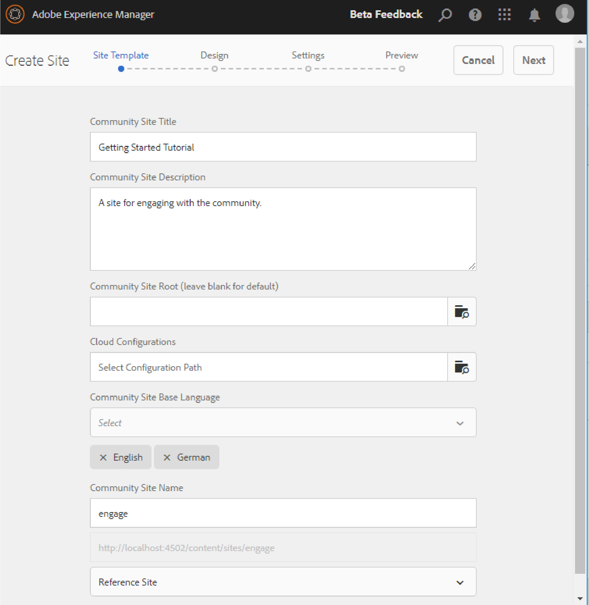
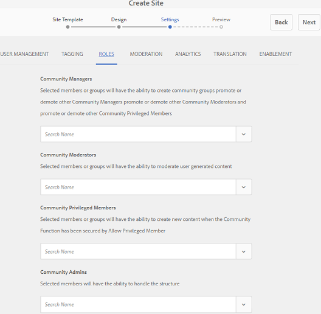
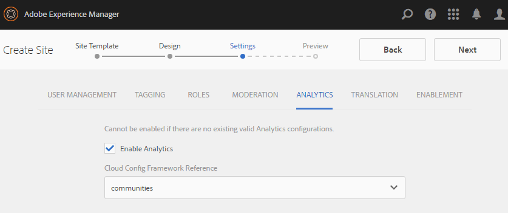
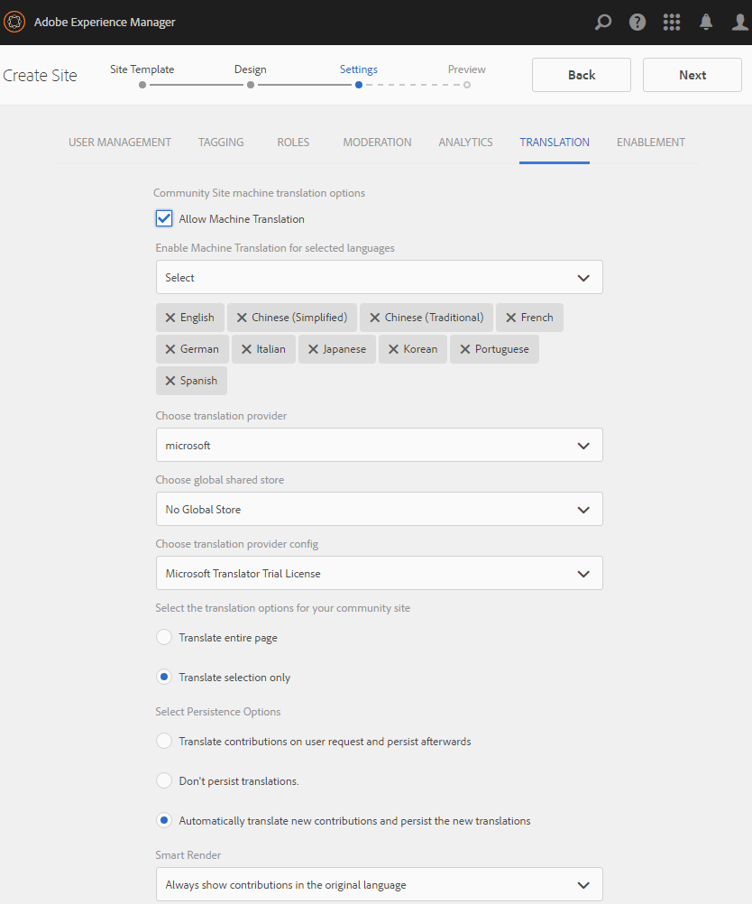

# Communities Sites Console {#communities-sites-console}

The Communities Sites console provides access to:

* Site creation
* Site editing
* Site management
* [Creating and editing nested groups](/help/communities/groups.md) (sub-communities)

See [Getting Started with AEM Communities](/help/communities/getting-started.md) to experience how quickly a community site can be created in the author environment, as well as how to create community groups from the author and publish environments.

>[!NOTE]
>
>The main Communities menus for the creation of [community sites](/help/communities/sites-console.md), [community site templates](/help/communities/sites.md), [community group templates](/help/communities/tools-groups.md) and [community functions](/help/communities/functions.md) are for use only in the author environment.

## Prerequisites {#prerequisites}

Before creating a community site, it is *required* to:

* Ensure one or more publish instances are running.
* Enable the [tunnel service](/help/communities/deploy-communities.md#tunnel-service-on-author) to manage members and member groups.
* Identify the [primary publisher](/help/communities/deploy-communities.md#primary-publisher).
* [Configure replication](/help/communities/deploy-communities.md#replication-agents-on-author) when primary publisher port is not the default (4503).

Best practice, to ensure the site is prepared to support many features, is to take the following steps:

* Install the [latest feature pack](/help/communities/deploy-communities.md#latestfeaturepack).
* Enable [Adobe Analytics](/help/communities/analytics.md) for AEM Communities.
* Configure [email](/help/communities/email.md)
* Identify [Community Administrators](/help/communities/users.md#creating-community-members).
* [Enable OAuth handler](/help/communities/social-login.md#adobe-granite-oauth-authentication-handler) for social login.

## Accessing Communities Sites Console {#accessing-communities-sites-console}

In the author environment, to reach the Communities Sites console:

* From global navigation: **[!UICONTROL Communities]** > **[!UICONTROL Sites]**

The Communities Sites console displays any existing community sites. From this console, community sites may be created, edited, managed and deleted.

To create a new community site, select the **Create** icon.

To access an existing community site, for the purpose of authoring, modifying, publishing, exporting, or adding a nested group, select the site's folder icon.

## Site Creation {#site-creation}

The site creation console provides a step-by-step approach to assemble features of the site based on a selected [community site template](/help/communities/sites.md) and settings.

Every site created includes a login feature as site visitors are required to sign in before being able to post content, send messages, or participate in a group. Other included features are user profiles, messaging, notifications, site menu, search, theming, and branding.

The process is launched by selecting the `Create` button located at the top of the Communities Sites console.

The creation process is a series of steps presented as panels containing a set of features to be configured (presented as sub-panels). It is possible to move forward to the **Next** step or **Back** to the previous step before committing the site in the final step.

### Step 1 : Site Template {#step-site-template}

On the Site Template panel, the Title, Description, Site Root, Base Language, Name and Site Template are specified:

* **Community Site Title** 

  A display title for the site.
  
  The title appears on the published site as well as in the site admin UI.

* **Community Site Description** 
  
  A description of the site.
  
  The description does not appear on the published site.

* **Community Site Root**

  The root path to the site.
  
  The default root is `/content/sites`, but the root may be moved to any location within the web site.

* **Community Site Base Language** 

  (Leave untouched for single language: English) Use the pull down menu to choose one *or more* base languages from the available languages- German, Italian, French, Japanese, Spanish, Portuguese (Brazil), Chinese (Traditional), and Chinese (Simplified). One community site will be created for each language added, and will exist within the same site folder following the best practice described in [Translating Content for Multilingual Sites](/help/sites-administering/translation.md). The root page of each site will contain a child page named by the language code of one of the languages selected, such as 'en' for English or 'fr' for French.

* **Community Site Name**: 

  The name of the site's root page which appears in the URL.

    * Double-check the name as it is not easily changed after the site is created.
    * The base URL ( `https://server:port/site root/site name)` will be displayed underneath the `Community Site Name`.

    * For a valid URL, append a base language code + ".html"
      
      *For example*, `https://localhost:4502/content/sites/mysight/en.html`

* **Community Site Template** menu

  Use the pull down menu to choose an available [community site template](/help/communities/tools.md).

* Select **Next**.

### Step 2 : Design {#step-design}

The Design panel contains 2 sub-panels for selecing the theme and branding banner:

#### COMMUNITY SITE THEME {#community-site-theme}

The framework uses `Twitter Bootstrap` to bring a responsive, flexible design to the site. One of the many preloaded Bootstrap themes may be selected to style the selected community site template, or a Bootstrap theme may be uploaded.

When selected, the theme will be overlayed with an opaque blue checkmark.

After the community site is published, it is possible to [edit the properties](#modifying-site-properties) and select a different theme.

#### COMMUNITY SITE BRANDING {#community-site-branding}

Community site branding is an image displayed as a header across the top of each page.

The image should be sized to be as wide as the expected display of the page in the browser and 120 pixels in height.

When creating or selecting an image, keep in mind:

* The image height will be cropped to 120 pixels measured from the top edge of the image.
* The image is pinned to the left edge of the browser window.
* There is no resizing of the image, such that when the image width is...

  * Less than the browser's width, the image will repeat horizontally.
  * Greater than the browser's width, the image will appear to be cropped.

* Select **Next**.

### Step 3 : Settings {#step-settings}

The Settings panel contains several sub-panels presenting features to configure before moving to the last step to create the site.

* [USER MANAGEMENT](#user-management)
* [TAGGING](#tagging)
* [ROLES](#roles)
* [MODERATION](#moderation)
* [ANALYTICS](#analytics)
* [TRANSLATION](#translation)

>[!NOTE]
>
>**Enable Tunnel Service**
>
>Several of the Settings sub-panels allow assignment of a trusted member to moderate UGC, manage groups, or be contacts for enablement resources in the publish environment.
>
>The convention is for publish-side [users and user groups](/help/communities/users.md) (members and member groups) to not be duplicated in the author environment.
>
>Thus, when creating the community site in the author environment and assigning trusted members to various roles, it is necessary to retrieve member data from the publish environment.
>
>This is accomplished by enabling the ` [AEM Communities Publish Tunnel Service](/help/communities/deploy-communities.md#tunnel-service-on-author)` for the author environment.

#### USER MANAGEMENT {#user-management}

* **Allow User Registration**
  
  If checked, site visitors may become community members by self-registration.
  If unchecked, the community site is *restricted* and site visitors must be assigned to the community site's members group, make a request or be sent an invitation by email. If unchecked, anonymous access should not be allowed.
  Uncheck for a *private* community site. Default is checked.

* **Allow Anonymous Access**
  
  If checked, the community site is *open *and any site visitor may access the site.
  If unchecked, only signed-in members may access the site.
  Uncheck for a *private *community site. Default is checked.

* **Allow Messaging**
  
  If checked, members may send messages to one another and to the group within the community site.
  If unchecked, messaging is not setup for the community.
  Default is unchecked.

* **Allow Social Logins: Facebook**

  If checked, allow site visitors to sign in with their Facebook account credentials. The selected [Facebook cloud configuration](/help/communities/social-login.md#create-a-facebook-connect-cloud-service) should be configured to add users to the community site's members group once the community site is created.
  If unchecked, no Facebook login is presented.
  Leave unchecked for a *private* community site. Default is unchecked.

* **Allow Social Logins: Twitter**
  
  If checked, allow site visitors to sign in with their Twitter account credentials. The selected [Twitter cloud configuration](/help/communities/social-login.md#create-a-twitter-connect-cloud-service) should be configured to add users to the community site's members group once the community site is created.
  If unchecked, no Twitter login is presented.
  Leave unchecked for a *private* community site. Default is unchecked.

>[!NOTE]
>
>**Allowing Social Logins**
>
>While sample Facebook and Twitter configurations may exist and be selectable, for a [production environment](/help/sites-administering/production-ready.md), it is necessary to create custom Facebook and Twitter applications. See [Social Login with Facebook and Twitter](/help/communities/social-login.md).

#### TAGGING {#tagging}

The tags which may be applied to community content are controlled by selecting Tag Namespaces previously defined through the [Tagging Console](/help/sites-administering/tags.md#tagging-console).

In addition, selecting tag namespaces for the community site limits the selection presented when defining catalogs and resources.

* text search box : Start typing to identify tags allowed to be used on the site.

#### ROLES {#roles}

The [roles of community members](/help/communities/users.md) are assigned with these settings.

Finding community members is easy using type-ahead search.

* **Community Managers**
  
  Start typing to select one or more community members or member groups who may manage community members and member groups.

* **Community Moderators**
  
  Start typing to select one or more community members or member groups who are to be trusted as moderators of user generated content.

* **Community Privileged Members**
  
  Start typing to select one or more community members or member groups to be given the ability to create new content when `Allow Privileged Member` has been selected for a [community function](/help/communities/functions.md).

* **Community Admins**
  
  Start typing to select one or more site administrators who can handle the site structure independent of other site administrators and default community administrator. They can create group at any level of the hierarchy, and become the default administrator of the nested groups (but they can later be removed from the admin role of nested groups).

#### MODERATION {#moderation}

The global setting for moderating user generated content (UGC) is controlled by these settings. Individual components have additional settings to control moderation.

* **Content is Premoderated**
  
  If checked, posted community content will not appear until approved by a moderator. Default is unchecked. For more information, see [Moderating Community Content](/help/communities/moderate-ugc.md#premoderation).

* **Flagging threshold before content is hidden**
  
  If greater than 0, the number of times a topic or post has to be flagged before it is hidden from public view. If set to -1, the flagged topic or post is never hidden from public view. Default is 5.

#### ANALYTICS {#analytics}

* **Enable Analytics**
  
  Only available when Adobe Analytics has been [configured](/help/communities/analytics.md) for Communities features.
  Default is unchecked. When checked, an additional selection menu appears:

* **Cloud Config Framework Reference**
  
  From the pull-down menu, select the Analytics cloud service framework configured for this community site.
  `Communities` is the framework example from [Analytics Configuration for Communities Features](/help/communities/analytics.md#aem-analytics-framework-configuration) documentation.

#### TRANSLATION {#translation}

* **Allow Machine Translation**
  
  When checked (default is unchecked), machine translation is enabled for UGC within the site. This does not affect any other content, such as page content, even if the site is setup as a multilingual site. See [Translating User Generated Content](/help/communities/translate-ugc.md) for information on configuring a licensed translation service for AEM Communities. See [Translating Content for Multilingual Sites](/help/sites-administering/translation.md) for a complete overview.

* **Enable Machine Translation for selected languages**
  
  The languages enabled for machine translation default to the system setting specified by the [translation integration configuration](/help/communities/translate-ugc.md#translation-integration-configuration). These default settings may be overridden for this site by deleting defaults and/or selecting other languages from the pull-down menu.

* **Choose translation provider**
  
  By default, the service provider is a trial service using `microsoft` for demonstration only. If no translation service provider is licensed, **Allow Machine Translation** should be unchecked.

* **Choose global shared store**
  
  For a website with multiple language copies, a global shared store provides a single thread of conversation, visible from each langauge copy. This is achieved by selecting one of the languages included as a language copy. Default is *No Global Shared Store*.

* **Choose translation provider config**
  
  Choose a [translation integration framework](/help/sites-administering/tc-tic.md) created for the licensed translation provider.

* **Select the translation options for your community site**
  
  * **Translate entire page**
    
    If selected, all UGC on a page is translated into the base language of the page.
    
    Default is *not selected*.

  * **Translate selection only**
    
    If selected, a translate option appears next to each post allowing individual posts to be translated into the base language of the page.
    Default is *selected*.

* **Select Persistence Options**

  * **Translate contributions on user request and persist afterwards**
    If selected, content is not translated until a request is made. Once translated, the translation is stored in the repository.
  
    Default is *not selected*.

  * **Don't persist translations**
  
    If selected, translations are not stored in the repository.
  
    If not selected, translations are persisted.
  
    Default is *not selected*.

* **Smart Render**
  
  Select one of:

  * `Always show contributions in the original language` (default)
  * `Always show contributions in user preferred language`
  * `Show contributions in user preferred language for only logged-in users`

### Step 4 : Create Communities Site {#step-create-communities-site}

If any adjustments are needed, use the **Back** button to make them.

Once **Create** is selected and started, the process of creating the site cannot be interrupted.

Once the site is created:

* Changing the url (node name) is not supported.
* Future changes to the community site template will not affect the created community site.
* Disabling the community site template will not affect the created community site.
* It is possible to edit the [STRUCTURE](#modify-structure) of a community site by modifying its properties.

When the process completes, the folder for the new site is displayed in the Communities Sites console, from where authors may add page content or administrators may modify the properties of the site.

In order to modify a community site, select its project folder to open it:

When hovering over a site with a mouse, or touching a site card, icons appear which allow for [editing the site in author mode](#authoring-site-content), [opening the site properties for modification](#modifying-site-properties), [publishing the site](#publishing-the-site), [exporting the site](#exporting-the-site), and [deleting the site](#deleting-the-site).

## Authoring Site Content {#authoring-site-content}

The content of a site may be authored with the same tools as any other AEM website. To open the site for authoring, select the `Open Site` icon that appears on hovering the site with mouse. The site will open in a new tab such that the Communities Sites console remains accessible.

>[!NOTE]
>
>If not familiar with AEM, view the documentation on [basic handling](/help/sites-authoring/basic-handling.md) and a [quick guide to authoring pages](/help/sites-authoring/qg-page-authoring.md).

## Modifying Site Properties {#modifying-site-properties}

The properties of an exisitng site, specified during the site creation process, can be modified by selecting the `Edit Site`icon that appears on hovering the site with mouse.

`Details of the following properties match the descriptions provided in the` [Site Creation](#site-creation) section.

### Modify Basic {#modify-basic}

The BASIC panel allows the modification of:

* Community Site Title
* Community Site Description

The Community Site Name may not be modified.

Choosing a different community site template would have no affect on an existing community site as no connection remains between templates and sites.

Instead, the [STRUCTURE](#modify-structure) of the community site may be modified.

### Modify Structure {#modify-structure}

The STRUCTURE panel allows the modification of the structure initially created from the selected community site template. From the panel, it is possible to:

* Drag-and-drop additional [community functions](/help/communities/functions.md) into the site structure.
* On an instance of a community function in the site structure:

  * **`gear icon`**
  
    Edit settings, including the display title and URL name* as well as [privileged members groups](/help/communities/users.md#privilegedmembersgroups).

  * **`trashcan icon`**
    
    Remove (delete) functions from the site structure.

  * **`grid icon`**
    
    Modifiy the order of functions as displayed in the site's top level navigation bar.

>[!NOTE]
>
>You can change the order of all the functions in the Site Structure except for the function at the top. Therefore, the home page of communities site cannot be changed.

>[!CAUTION]
>
>* While the display title may be changed without side-effects, it is not recommended to edit the URL name of a community function belonging to a community site.
>
>For example, renaming the URL will not move existing UGC, thus having the effect of 'losing' UGC.

>[!CAUTION]
>
>The groups function must *not* be the *first nor the only* function in the site structure.
>
>Any other function, such as the [page function](/help/communities/functions.md#page-function), must be included and listed first.

#### Example : Adding a Catalog Function to a Community Site Structure {#example-adding-a-catalog-function-to-a-community-site-structure}

### Modify Design {#modify-design}

The DESIGN panel allows a new theme to be applied:

* [Community Site Theme](#community-site-theme)
* [Community Site Branding](#community-site-branding)

  * Scroll to the bottom of the panel to change the brand image.

### Modify Settings {#modify-settings}

The SETTINGS panel allows access to most of the settings under the sub-panels of for Step 3 of community site creation:

* [User Management](#user-management)
* [Tags](#tagging)
* [Moderation](#moderation)
* [Member Roles](#roles)
* [Analytics](#analytics)
* [Translation](#translation)

### Modify Thumbnail {#modify-thumbnail}

The THUMBNAIL panel allows for an image to be uploaded to represent the site in the Communities Sites console.

## Publishing the Site {#publishing-the-site}

After a community site has been newly created or modified, it is possible to publish (activate) the site by selecting the `Publish Site` icon, that appears on mouse hover over the site.

There will be an indication after site is successfully published.

### Publishing with Nested Groups {#publishing-with-nested-groups}

After publishing a community site, it is necessary to individually publish each sub-community (nested group) created using the [Groups console](/help/communities/groups.md).

## Exporting the Site {#exporting-the-site}

Select the export icon, on mouse hover over the site, to create a package of the community site that is both stored in [package manager](/help/sites-administering/package-manager.md) and downloaded.

Note that UGC is not included in the site package.

## Deleting the Site {#deleting-the-site}

To delete the community site, select the Delete Site icon that appears on hovering the mouse over the site in Communities Site Console. This action removes all the items associated with the site, such as UGC, user groups, assets and database records.

## Created Community User Groups {#created-community-user-groups}

Once the new community site is published, new member groups (user groups are created in the publish environment) which have the appropriate permissions set for various administrative and member roles.

The name created for the member groups includes the *site-name* given the site in [Step 1](#step13asitetemplate) (the name which appears in the URL) as well as an unique ID to avoid conflicts with community sites and groups having the same site-name for different community site roots.

For example, if the name were "engage" for a site titled "Getting Started Tutorial", then the user group for moderators would be :

* title: Community Engage Moderators
* name: community-*engage-uid*-moderators

Notice that any members assigned roles as moderators or group administrators while creating the site, will be assigned to the appropriate group as well as assigned to the members group. These groups and member assignments are created on publish when the new site is published.

For details, see [Managing Users and User Groups](/help/communities/users.md).

>[!NOTE]
>
>If [Allow Social Login: Facebook](#user-management) is enabled, once the user group
>
>* `community-<site-name>-<uid>-members`
>
>is created, the applied [Facebook cloud service](/help/communities/social-login.md#createafacebookcloudservice) should be configured to add users to this group.

## Configure for Authentication Error {#configure-for-authentication-error}

By default, a community site will redirect to a sample login page when the user enters the wrong credentials and fails to login. This sample login will not be present on a [production server](/help/sites-administering/production-ready.md).

To correctly redirect, once a site has been configured and pushed to publish, complete these steps to get authentication failure to redirect to the community site:

* On each AEM publish instance.
* Sign in with administrator privileges.
* Access the [Web Console](/help/sites-deploying/configuring-osgi.md).

  * For example, [https://localhost:4503/system/console/configMgr](https://localhost:4503/system/console/configMgr).

* Locate `Adobe Granite Login Selector Authentication Handler`.
* Select the `pencil` icon to open the configuration for edit.
* Enter a **Login Page Mappings** as follows:
  
  `/content/sites/<site-name>/path/to/login/page:/content/sites/<site-name>`

  For example:
  `/content/sites/engage/en/signin:/content/sites/engage/en`

* Select **Save**.

### Test Authentication Redirection {#test-authentication-redirection}

On the same AEM publish instance configured with a login page mapping for the community site:

* Browse to the community site home page.

  * For example, [https://localhost:4503/content/sites/engage/en.html](https://localhost:4503/content/sites/engage/en.html)

* Select Log Out.
* Select Log In.
* Enter obviously incorrect credentials, such as username "x" and password "x".
* The login page should be displayed with an "invalid login" error.

## Accessing Community Sites from Main Sites Console {#accessing-community-sites-from-main-sites-console}

From the global navigation Sites console, community sites are located in the `Community Sites` folder.

While it is possible to access a community site in this manner, for administrative tasks, the community site should be accessed from the Communities Sites console.

