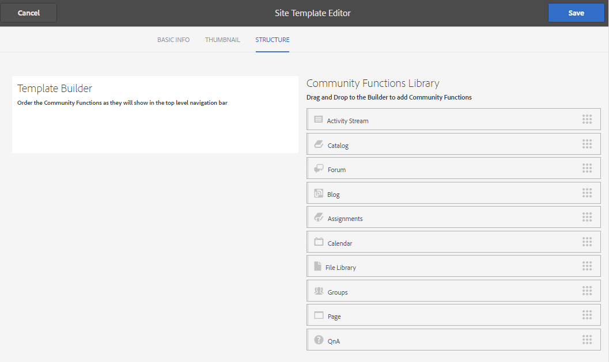
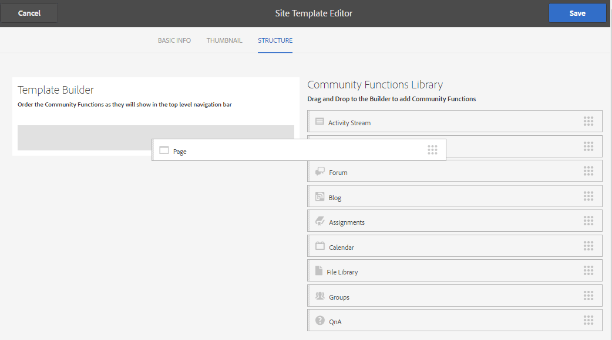
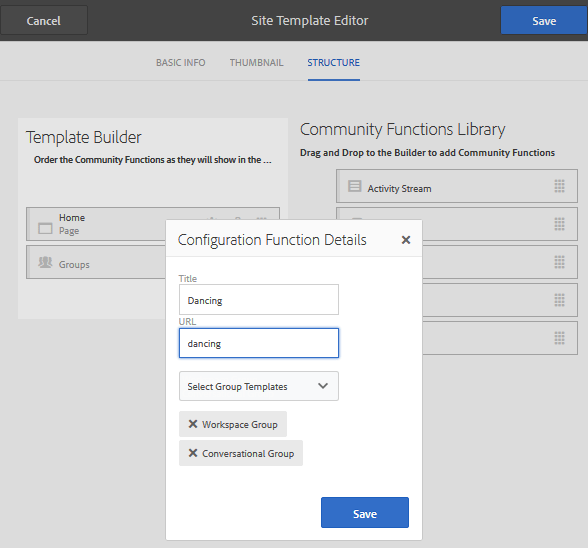

# Site Templates {#site-templates}

The Site Templates console is similar to the [Group Templates](tools-groups.md) console, which is focused on functions of interest to Community groups.

>[!NOTE]
>
>The consoles for the creation of [community sites](sites-console.md), [community site templates](sites.md), [community group templates](tools-groups.md), and [community functions](functions.md) are for use only in the author environment.

## Site Templates Console {#site-templates-console}

In the author environment, to reach the community sites console:

* From global navigation: **[!UICONTROL Tools > Communities > Site Templates]**

This console displays the templates from which a [community site](sites-console.md) can be created and allows new site templates to be created.

## Create Site Template {#create-site-template}

To get started creating a site template, select `Create`.

This opens the Site Editor panel that contains three sub-panels:

### Basic info {#basic-info}

On the Basic Info panel, a name, description and whether the template is enabled or disabled are configured:

* **[!UICONTROL Community Site Template Name]**
  
  The template name id.

* **[!UICONTROL Community Site Template Description]**
  
  The template description.

* **[!UICONTROL Disabled/Enabled]**
  
  A toggle switch controlling whether the template is referenceable.

### Thumbnail {#thumbnail}

(Optional) Select the Upload Image icon to display a thumbnail along with the name and description to creators of community sites.

### Structure {#structure}

To add community functions, drag from the right side to the left in the order the site menu links should appear. Styles are applied to the template during creation of the site.

For example, if you want a home page, drag the Page function from the library and drop under the template builder. This results in the page configuration dialog opening. See the [functions console](functions.md) for information about the configuration dialogs.

Continue dragging and dropping any other community functions desired for a community site based on this template.

The page function provides an empty page. The Groups function lets you create a group site (sub-community) within the community site.

>[!CAUTION]
>
>The Groups function must *not be the first nor the only* function in the site structure.
>
>Any other function, such as the [page function](functions.md#page-function), must be included and listed first.

### Group Templates for Groups Function {#group-templates-for-groups-function}

When including a Groups function in the site template, the configuration requires the specification of the group template choices allowed when a new group is created in the publish environment.

>[!CAUTION]
>
>The Groups function must *not be the first nor the only* function in the site structure.

By selecting two or more community group templates, a choice is provided to the group administrator when actually creating a group in the community.

## Edit Site Template {#edit-site-template}

When viewing site templates in the main [Site Templates console](#site-templates-console), it is possible to select an existing site template for edit.

This process provides the same panels as [creating a site template](#create-site-template).
