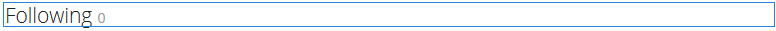

# Using Social Graph {#using-social-graph}

## Introduction {#introduction}

The ability for a community member to follow [activities](activities.md) as well as be followed is established through two components: `Follow`and `Following`.

The `Follow`component must be associated with another resource, and this association is already established for community members and features.

The `Following`component simply lists the members that are either following the current member or are being followed by the current member. This social graph of the relationships between members is included in the user profile established for a [community site](overview.md#communitiessites).

## Adding Following to a Page {#adding-following-to-a-page}

If it is desired to add a `Following`component to a page in author mode, locate the component `Communities / Following` and drag it into place on a page where the social graph should appear.

For necessary information, visit [Communities Components Basics](basics.md).

When the [required client-side libraries](essentials-socialgraph.md#essentials-for-client-side) are included, this is how the `Following` component will appear:

## Configuring Following {#configuring-following}

Currently, it is necessary to set the property to determine whether the component displays the `follows`relationship, or the `following`relationship.

## Additional Information {#additional-information}

More information may be found on the [Social Graph Essentials](essentials-socialgraph.md) page for developers.
