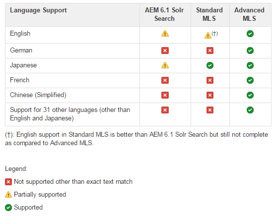

# Solr Configuration for SRP {#solr-configuration-for-srp}

## Solr for AEM Platform {#solr-for-aem-platform}

An [Apache Solr](https://solr.apache.org/) installation may be shared between the [node store](../../help/sites-deploying/data-store-config.md) (Oak) and [common store](working-with-srp.md) (SRP) by using different collections.

If both the Oak and SRP collections are used intensively, a second Solr may be installed for performance reasons.

For production environments, [SolrCloud mode](#solrcloud-mode) provides improved performance over standalone mode (a single, local Solr setup).

### Requirements {#requirements}

Download and install Apache Solr:

* [Version 7.0](https://archive.apache.org/dist/lucene/solr/7.0.0/)

* Solr requires Java&trade; 1.7 or greater
* No service is needed
* Choice of run modes:

  * Standalone mode
  * [SolrCloud mode](#solrcloud-mode) (recommended for production environments)

* Choice of Multilingual Search (MLS)

  * [Installing Standard MLS](#installing-standard-mls)
  * [Installing Advanced MLS](#installing-advanced-mls)

## SolrCloud Mode {#solrcloud-mode}

[SolrCloud](https://solr.apache.org/guide/6_6/solrcloud.html) mode is recommended for production environments. When running in SolrCloud mode, SolrCloud must be installed and configured before installing Multilingual Search (MLS).

The recommendation is to follow the SolrCloud instructions to install:

* 3 SolrCloud nodes on same server.
* An external Apache ZooKeeper.

It is also recommended to configure JVM to tune memory usage and garbage collection.

### JVM Configuration Example {#jvm-configuration-example}

```shell
JVM_OPTS="-server -Xmx2048m -XX:MaxPermSize=768M -XX:+UseConcMarkSweepGC -XX:+CMSClassUnloadingEnabled -Xloggc:../logs/gc.log -XX:+PrintGCDetails -XX:+PrintGCDateStamps -Djava.awt.headless=true"
```

### SolrCloud Set up Commands {#solrcloud-setup-commands}

When running in SolrCloud mode, before MLS installation, use, and knowledge of the following SolrCloud set-up commands is necessary.

#### 1. Upload a configuration to ZooKeeper {#upload-a-configuration-to-zookeeper}

Reference:
[https://solr.apache.org/guide/6_6/command-line-utilities.html](https://solr.apache.org/guide/6_6/command-line-utilities.html)

Usage:
sh ./scripts/cloud-scripts/zkcli.sh \
-cmd upconfig \
-zkhost *server:port* \
-confname *myconfig-name *\
-solrhome *solr-home-path* \
-confdir *config-dir*

#### 2. Create a collection {#create-a-collection}

Reference:
[https://solr.apache.org/guide/6_6/solr-control-script-reference.html#SolrControlScriptReference-Create](https://solr.apache.org/guide/6_6/solr-control-script-reference.html#SolrControlScriptReference-Create)

Usage:
./bin/solr create \
-c *mycollection-name*\
-d *config-dir* \
-n *myconfig-name* \
-p *port*\
-s *number-of-shards* \
-rf *number-of-replicas*

#### 3. Link a collection to a configuration set {#link-a-collection-to-a-configuration-set}

Link a collection to a configuration already uploaded to ZooKeeper.

Reference:
[https://solr.apache.org/guide/6_6/command-line-utilities.html](https://solr.apache.org/guide/6_6/command-line-utilities.html)

Usage:
sh ./scripts/cloud-scripts/zkcli.sh \
-cmd linkconfig \
-zkhost *server:port* \
-collection *mycollection-name* \
-confname *myconfig-name*

### Comparison of Standard and Advanced MLS {#comparison-of-standard-and-advanced-mls}

Multilingual Search (MLS) for AEM Communities is built for the Solr platform to provide improved search across all supported languages, including English.

MLS for AEM Communities is available as either Standard MLS or Advanced MLS. Standard MLS only includes Solr configuration settings, and excludes any plugins or resource files. Advanced MLS is the more comprehensive solution and includes Solr configuration settings as well as plugins and related resources

Standard MLS includes enhancements for content search for the following languages:

* English: Improved stemmer for attempting to match word derivations.
* Japanese: Improved Japanese tokenization for half-width characters.

Advanced MLS includes enhancements for content search for the following languages:

* English: Replaced stemmer with lemmatizer.
* German: Added decompounder.
* French: Added elision handling.
* Chinese (Simplified): Added a smarter tokenizer.
* Various languages: Added a stemmer, stop word list, and a normalizer.

In all, the following 33 languages are supported in Advanced MLS.

| Arabic |German |Norwegian |
|---|---|---|
| Bulgarian |Greek |Polish |
| Chinese (Simplified) |Haitian Creole |Portuguese |
| Chinese (Traditional) |Hebrew |Romanian |
| Czech |Hungarian |Russian |
| Danish |Indonesian |Slovak |
| Dutch |Italian |Slovenian |
| English |Japanese |Spanish |
| Estonian |Korean |Swedish |
| Finnish |Latvian |Thai |
| French |Lithuanian |Turkish |

#### Comparison of AEM 6.1 Solr search, Standard MLS, and Advanced MLS {#comparison-of-aem-solr-search-standard-mls-and-advanced-mls}

**Note**: AEM 6.1 refers to AEM 6.1 Communities FP3 and earlier.



### Installing Standard MLS {#installing-standard-mls}

For the SRP collection (either MSRP or DSRP), to support Standard Multilingual Search (MLS) it is necessary to modify two of Solr's configuration files:

* **schema.xml**
* **solrconfig.xml**

Standard MLS files (schema.xml, solrconfig.xml) for Solr 4.10.

Standard MLS files (schema.xml, solrconfig.xml) for Solr 5.x.

The Standard MLS files are stored in the AEM repository.

**Note**: While the Solr files are stored in the msrp/ folder, they are also for DSRP (no changes necessary).

**Download instructions**: Replace `solrX` with `solr4` or `solr5` as appropriate.

1. Using CRXDE|Lite, locate:

   * `/libs/social/config/datastore/msrp/solrX/schema.xml`
   * `/libs/social/config/datastore/msrp/solrX/solrconfig.xml`

1. Download to local server on which Solr is deployed.

   * Locate the `jcr:content` node's `jcr:data` property.
   * To start the download, select `view`.
   * Ensure that the files are saved with the appropriate names and encoding (UTF8).

1. Follow the installation instructions for either standalone or SolrCloud mode.

#### SolrCloud Mode - Standard MLS {#solrcloud-mode-standard-mls}

1. Install and configure Solr in SolrCloud mode.
1. Prepare a new configuration:

   1. Create new-config-dir* such as `solr-install-dir*/myconfig/`

   1. Copy the contents of the existing Solr configuration directory to *new-config-dir*

      * For Solr4: copy `solr-install-dir/example/solr/collection1/conf/`
      * For Solr5: copy `solr-install-dir/server/solr/configsets/data_driven_schema_configs/`

   1. Copy the downloaded **schema.xml** and **solrconfig.xml** to *new-config-dir* to overwrite existing files.

1. [Upload the new configuration](#upload-a-configuration-to-zookeeper) to ZooKeeper.
1. [Create a collection](#create-a-collection) specifying the necessary parameters, such as number of shards, number of replicas, and configuration name.
1. If the configuration name was *not *provided during creation of the collection, [link this newly created collection](#link-a-collection-to-a-configuration-set) with the configuration uploaded to ZooKeeper.

1. For MSRP, run [MSRP Reindex Tool](msrp.md#msrp-reindex-tool), unless this installation is new.

#### Standalone Mode - Standard MLS {#standalone-mode-standard-mls}

1. Install Solr in standalone mode.
1. If running Solr5, create a collection1 (similar to Solr4):

   * `./bin/solr start`
   * `./bin/solr create_core -c collection1 -d sample_techproducts_configs`

1. Backup **schema.xml** and **solrconfig.xml** in the Solr config dir, such as:

   * For Solr4: `solr-install-dir/example/solr/collection1/conf/`
   * Created for Solr5: `solr-install-dir/server/solr/collection1/conf/`

1. Copy the downloaded **schema.xml** and **solrconfig.xml** to that same directory.

1. Restart Solr.
1. For MSRP, run [MSRP Reindex Tool](#msrpreindextool), unless this installation is new.

### Installing Advanced MLS {#installing-advanced-mls}

For the SRP collection (MSRP or DSRP) to support advanced MLS, new Solr plug-ins are required in addition to a custom schema and Solr configuration. All required items are packaged into a downloadable zip file. In addition, an install script is included for use when Solr is deployed in standalone mode.

To obtain the Advanced MLS package, see [AEM Advanced MLS](deploy-communities.md#aem-advanced-mls) in the deploy section of the documentation.

To get started with the install for either SolrCloud or standalone mode:

* Download AEM-SOLR-MLS zip archive to server hosting Solr.
* Unpack the archive.

#### SolrCloud Mode - Advanced MLS {#solrcloud-mode-advanced-mls}

Installation instructions - note the few differences for Solr4 and Solr5:

1. Install and configure Solr in SolrCloud mode.
1. Extract the contents of the Advanced MLS package to disk. The contents should include:

   * **schema.xml**
   * **solrconfig.xml**
   * **stopwords/** folder
   * **profiles/** folder
   * **extra-libs/** folder

1. Prepare a new configuration:

   1. Create a *new-config-dir*

      * Such as `solr-install-dir/myconfig/`
      * Create subfolders `stopwords/` and `lang/`

   1. Copy the contents of the existing Solr config dir to *new-config-dir*

      * For Solr4: Copy `solr-install-dir/example/solr/collection1/conf/`
      * For Solr5: Copy `solr-install-dir/server/solr/configsets/data_driven_schema_configs/`

   1. Copy the extracted **schema.xml** and **solrconfig.xml** to *new-config-dir* to overwrite existing files.
   1. For Solr5: Copy `solr_install_dir/server/solr/configsets/sample_techproducts_configs/conf/lang/*.txt` to `new-config-dir/lang/`
   1. Copy the extracted **stopwords/** folder to *new-config-dir* resulting in `new-config-dir/stopwords/*.txt`

1. [Upload the new configuration](#upload-a-configuration-to-zookeeper) to ZooKeeper
1. Copy the new **profiles/** folder ...

   * For Solr4: Copy to each node's resources/ folder
   * For Solr5: Copy to each Solr installation's server/resources/ folder. If all nodes are in the same Solr install directory, then this step is performed only once.

1. Create a **lib/** folder in the solr-home directory (contains solr.xml) of each node in SolrCloud. Copy jars from the following locations to the new lib/ folder on each node:

   * **extra-libs/** extracted from the advanced MLS package
   * *solr-install-dir/contrib/extraction/lib/*.jar
   * *solr-install-dir/dist/solr-cell*.jar
   * *solr-install-dir/contrib/clustering/lib/*.jar
   * *solr-install-dir/dist/solr-clustering*.jar
   * *solr-install-dir/contrib/langid/lib/*.jar
   * *solr-install-dir/dist/solr-langid*.jar
   * *solr-install-dir/contrib/velocity/lib/*.jar
   * *solr-install-dir/dist/solr-velocity*.jar
   * *solr-install-dir/contrib/analysis-extras/lib/*.jar
   * *solr-install-dir/contrib/analysis-extras/lucene-libs/*.jar

1. [Create a collection](#create-a-collection) specifying the necessary parameters, such as number of shards, number of replicas, and configuration name.
1. If the configuration name was *not* provided during creation of the collection, [link this newly created collection](#link-a-collection-to-a-configuration-set) with the configuration uploaded to ZooKeeper.

1. For MSRP, run [MSRP Reindex Tool](#msrpreindextool), unless this installation is new.

#### Standalone Mode - Advanced MLS {#standalone-mode-advanced-mls}

An install script is included in the Advanced MLS package.

After the contents of the package are extracted to the server hosting the standalone Solr server, run the install script to install the necessary resources and configuration files.

* Install Solr in standalone mode.
* If running Solr5, create a collection1 (similar to Solr4):

  * `./bin/solr start`
  * `./bin/solr create_core -c collection1 -d sample_techproducts_configs`

* Run the install script: Install [-v 4|5] [-d solrhome] [-c collectionpath]
  where:

  * -d solrhome

    Solr installation directory

  * -c collectionpath

    Collection path in solr

  * --help

    Print command line options

  * -v [4|5]

    Set version for solr

* Example for Solr 4.10.4:

  * Install.bat -v 4 -d c:/solr-4.10.4 -c c:/solr-4.10.4/example/solr/collection1

* Example for Solr 5.4.0:

  * Install.sh -v 5 -d /tmp/solr-5.4.0 -c /tmp/solr-5.4.0/server/solr/collection1

**Note**:

* The install script backs up schema.xml and solrconfig.xml before installing new versions by appending ".orig"

### About solrconfig.xml {#about-solrconfig-xml}

The **solrconfig.xml** file controls the auto commit interval and search visibility and requires testing and tuning.

`<autoCommit>`: By default, the AutoCommit interval, which is a hard commit to stable storage, is set to 15 seconds. The search visibility defaults to using the pre-commit index.

To change search to use an index updated to reflect changes due to the commit, change the contained `openSearcher` to true.

`autoSoftCommit`: A 'soft' commit ensures that changes are visible (the index is updated), but does not ensure that changes are synced to stable storage (hard commit). The result is an improvement in performance. By default, `autoSoftCommit` is disabled with the contained `maxTime` set to -1.
