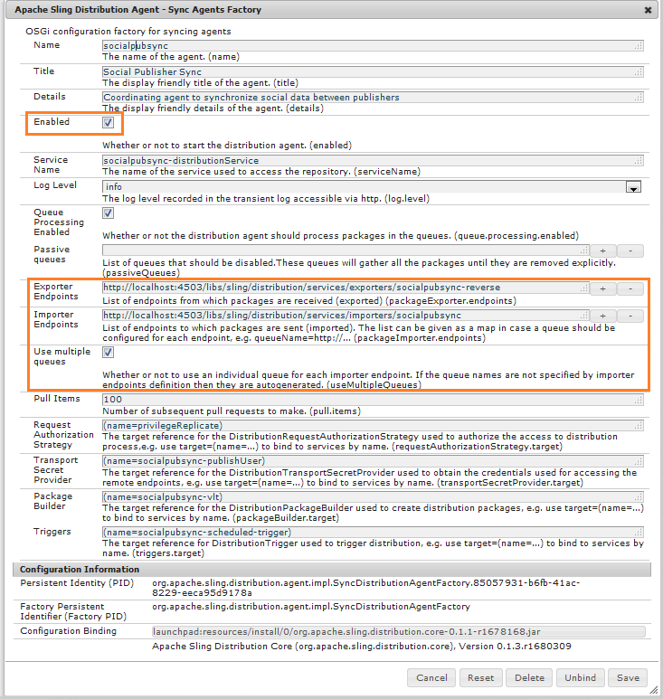
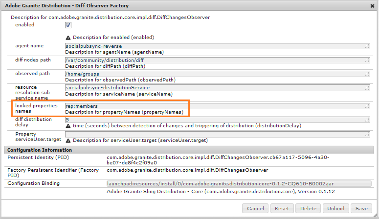
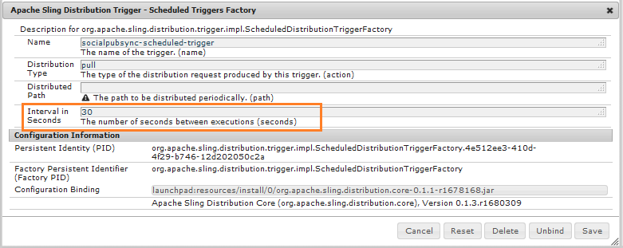
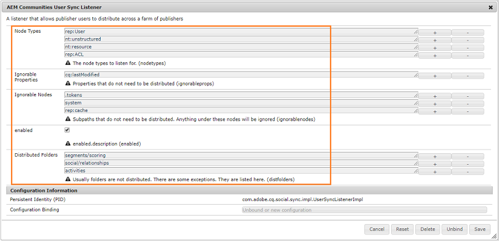
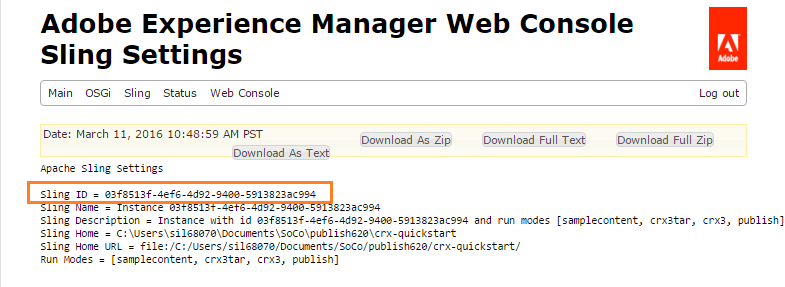
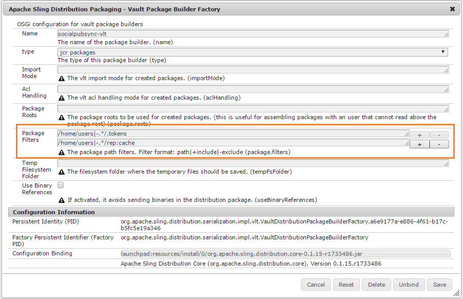

# Communities User Synchronization {#communities-user-synchronization}

## Introduction {#introduction}

In AEM Communities, from the publish environment (depending on permissions configured), *site visitors* may become *members*, create *user groups*, and edit their *member profile* .

*User data* is a term used to refer to *users*, *user profiles* and *user groups*.

*Members* is a term used to refer to *users* registered in the publish environment, as opposed to users registered in the author environment.

For more information regarding user data, visit [Managing Users and User Groups](/help/communities/users.md).

## Synchronizing Users Across a Publish Farm {#synchronizing-users-across-a-publish-farm}

By design, user data created in the publish environment does not appear in the author environment.

Most user data created in the author environment is intended to remain in the author environment and is not synchronized nor replicated to publish instances.

When the [topology](/help/communities/topologies.md) is a [publish farm](/help/sites-deploying/recommended-deploys.md#tarmk-farm), registration  and  modifications made on one publish instance need to be synchronized with other publish instances. Members need to be able to log in and see their data on any publish node.

When user synchronization is enabled, user data is automatically synchronized across the publish instances in the farm.

### User Sync Setup Instructions {#user-sync-setup-instructions}

For detailed, step-by-step instructions, on how to enable synchronization across a publish farm, see:

* [User Synchronization](/help/sites-administering/sync.md)

## User sync in the background  {#user-sync-in-the-background}


* **vlt  package** 

  It is a zip file of all the changes done on a publisher, which need to be distributed across publishers. Changes on a publisher generate events that are picked by the change event listener. This creates a vlt package that contains all the changes.

* **distribution package** 

  It contains distribution information for Sling. That is information about where the content needs to be distributed, and when was it distributed last.

## What Happens When ... {#what-happens-when}

### Publish Site from Communities Sites Console {#publish-site-from-communities-sites-console}

On author, when a community site is published from the [Communities Sites console](/help/communities/sites-console.md), the effect is to [replicate](/help/sites-deploying/configuring.md#replication-reverse-replication-and-replication-agents) the associated pages, and Sling distribute the dynamically created community user groups, including their membership.

### User is Created or Edits Profile on Publish {#user-is-created-or-edits-profile-on-publish}

By design, users and profiles created in the publish environment (such as by self-registration, social-login, LDAP authentication) do not appear in the author environment.

When the topology is a [publish farm](/help/communities/topologies.md) and user sync has been correctly configured, the *user* and *user profile* is synchronized across the publish farm using Sling distribution.

### New Community Group is created on Publish {#new-community-group-is-created-on-publish}

Although initiated from a publish instance, the community group creation, which results in new site pages and a new user group, actually occurs on the author instance.

As part of the process, the new site pages are replicated to all publish instances. The dynamically created community user group and its membership are Sling distributed to all publish instances.

### Users or User Groups are Created Using Security Console {#users-or-user-groups-are-created-using-security-console}

By design, user data created in the publish environment does not appear in the author environment and vice versa.

When the [User Administration and Security](/help/sites-administering/security.md) console is used to add new users in the publish environment, user sync will synchronize the new users and their group membership to other publish instances, if necessary. User sync will also synchronize user groups created through the security console.

### User Posts Content on Publish {#user-posts-content-on-publish}

For user generated content (UGC), the data entered on a publish instance is accessed through the [configured SRP](/help/communities/srp-config.md).

## Best practices {#bestpractices}

By default, user sync is **disabled**. Enabling user sync involves modifying *existing* OSGi configurations. No new configurations should be added as a result of enabling user sync.

User sync relies on the  author  environment to manage the user data distributions, even though the user data is not created on  author .

**Prerequisites**

1. If users and user groups have already been created on one publisher, it is recommended to [manually sync](/help/sites-administering/sync.md#manually-syncing-users-and-user-groups) the user data to all publishers prior to configuring and enabling user sync.
   
   Once user sync is enabled, only newly created users and groups are  syncrhonized .

1. Ensure the latest code has been installed:

   * [AEM platform updates](https://helpx.adobe.com/experience-manager/kb/aem62-available-hotfixes.html)
   * [AEM Communities updates](/help/communities/deploy-communities.md#latestfeaturepack)

Following configurations are necessary to enable user synchronization on AEM Communities. Ensure that these configurations are correct to prevent sling content distribution from failing.

### Apache Sling Distribution Agent - Sync Agents Factory {#apache-sling-distribution-agent-sync-agents-factory}

This configuration fetches the content to be synced across the publishers. The configuration is on Author instance. The Author has to keep track of all the publishers which are there and where to sync all the information.

The default values in the configuration are for a single publish instance. As user sync is useful to synchronize multiple publish instances, such as for a publish farm, additional publish instances need to be added to the configuration.

**How is the content synced?**

Author instance pings the exporter endpoint of publishers. Whenever a user is created or updated on specific publishers (n), the Author gets the content from their exporter endpoints and [pushes the content](/help/communities/sync.md#main-pars-image-1413756164) to other publishers (n-1, that is apart from the publishers from which the content is fetched).

To configure Apache Sling Sync Agents configuration:

1. Sign in with administrator privileges on your AEM author instance.
1. Access the [Web Console](https://helpx.adobe.com/experience-manager/6-4/help/sites-deploying/configuring-osgi.html). For example, [https://localhost:4502/system/console/configMgr](https://localhost:4502/system/console/configMgr).
1. Locate **Apache Sling Distribution Agent - Sync Agents Factory**.

   * Select the existing configuration to open for edit (pencil icon).

     Verify name: **socialpubsync.**

   * Select the **Enabled** checkbox.
   * Select **Use Multiple queues.**
   * Specify **Exporter Endpoints** and **Importer Endpoints** (you can add more exporter and importer endpoints).

     These endpoints define where you want to get the content from and where you want to push the content. Author fetches the content from the specified exporter endpoint and pushes the content to the publishers (other than the publisher from which it fetched the content).

   

### Adobe Granite Distribution - Encrypted Password Transport Secret Provider {#adobe-granite-distribution-encrypted-password-transport-secret-provider}

It enables the author to identify the authorized user, as having permission to sync user data from  author  to publish.

The [authorized user created](/help/sites-administering/sync.md#createauthuser) on all the publish instances helps the publishers to connect with  author  and configure Sling distribution on the author. This authorized user has all the requisite [ACLs](/help/sites-administering/sync.md#howtoaddacl).

Whenever data is to be installed on or fetched from publishers, then the author connects with the publishers using the credentials (user name and password) set in this configuration.

To connect author with publishers using authorized user:

1. Sign in with administrator privileges on your AEM author instance.
1. Access the [Web Console](/help/sites-deploying/configuring-osgi.md).

   For example, [https://localhost:4502/system/console/configMgr](https://localhost:4502/system/console/configMgr).
1. Locate **Adobe Granite Distribution - Encrypted Password Transport Secret Provider.**
1. Select the existing configuration to open for edit (pencil icon).

   Verify property **socialpubsync** - **publishUser.**

1. Set the username and password to the [authorized user](/help/sites-administering/sync.md#createauthorizeduser).

   For example, **usersync - admin**


### Apache Sling Distribution Agent - Queue Agents Factory {#apache-sling-distribution-agent-queue-agents-factory}

This configuration is used to configure the data you want to sync across publishers. When data is created/ updated in paths specified in **Allowed Roots**, the "var/community/distribution/diff" gets activated and the created replicator fetches the data from a publisher and installs it on other publishers.

To configure the data (node paths) to synchronize:

1. Sign in with administrator privileges on your publish instance.
1. Access the [Web Console](https://helpx.adobe.com/experience-manager/6-4/help/sites-deploying/configuring-osgi.html).

   For example, [https://localhost:4503/system/console/configMgr](https://localhost:4503/system/console/configMgr).

1. Locate **Apache Sling Distribution Agent - Queue Agents Factory**.
1. Select the existing configuration to open for edit (pencil icon).

   Verify Name: **socialpubsync -reverse**

1. Select the **Enabled** check box and save.
1. Specify the node paths that are to be replicated in **Allowed roots**.
1. Repeat for each **publish** instance.

   

### Adobe Granite Distribution - Diff Observer Factory {#adobe-granite-distribution-diff-observer-factory}

This configuration syncs group membership across publishers.
If changing the membership of a group in one publisher does not update its membership on other publishers, then ensure that **ref :members** is added to **looked properties names**.

To ensure member synchronization:

1. Sign in with administrator privileges on your publish instance.
1. Access the [Web Console](https://helpx.adobe.com/experience-manager/6-4/help/sites-deploying/configuring-osgi.html).

   For example, [https://localhost:4503/system/console/configMgr](https://localhost:4503/system/console/configMgr).

1. Locate **Adobe Granite Distribution - Diff Observer Factory**.
1. Select the existing configuration to open for edit (pencil icon).

   Verify **agent name: socialpubsync -reverse**.

1. Select the **Enabled** checkbox.
1. Specify **rep:members** as description for propertyName in **looked properties names**, and Save.

   

### Apache Sling Distribution Trigger - Scheduled Triggers Factory {#apache-sling-distribution-trigger-scheduled-triggers-factory}

This configuration allows you to configure the polling interval (after which publishers are pinged and changes are pulled by author) to sync the changes across publishers.

The author polls publishers every 30 seconds (default). If any packages are present at the folder `/var/sling/distribution/packages/  socialpubsync -  vlt /shared`, then it will fetch those packages and install them on other publishers.

To alter the polling interval:

1. Sign in with administrator privileges on your AEM author instance.
1. Access the [Web Console](/help/sites-deploying/configuring-osgi.md), for example, [https://localhost:4502/system/console/configMgr](https://localhost:4502/system/console/configMgr)
1. Locate **Apache Sling Distribution Trigger - Scheduled Triggers Factory**

   * Select the existing configuration to open for edit (pencil icon).

     Verify **socialpubsync -scheduled-trigger**

   * Set the Interval in Seconds to the desired interval, and save.

   

### AEM Communities User Sync Listener {#aem-communities-user-sync-listener}

For issues in Sling distribution where there is a discrepancy in subscriptions and follows, check whether the following properties in **AEM Communities User Sync Listener** configurations are set:

* NodeTypes
* IgnorableProperties
* IgnorableNodes
* DistributedFolders

To sync subscriptions, follows, and notifications

On each AEM publish instance:

1. Sign in with administrator privileges.
1. Access the [Web Console](/help/sites-deploying/configuring-osgi.md). For example, [https://localhost:4503/system/console/configMgr](https://localhost:4503/system/console/configMgr).
1. Locate **AEM Communities User Sync Listener**.
1. Select the existing configuration to open for edit (pencil icon)

   Verify Name: **socialpubsync -scheduled-trigger**

1. Set the following **NodeTypes**:

   `rep:User`

   `nt:unstructured`

   `nt:resource`

   `rep:ACL`

   `sling:Folder`

   `sling:OrderedFolder`

   The node types specified in this property will synchronize, and the notifications info (blogs and configurations followed) are synced between different publishers.

1. Add all the folders to synchronize in **DistributedFolders**. For example,

   `segments/scoring`

   `social/relationships`

   `activities`

1. Set the **ignorablenodes** to:

   `.tokens`

   `system`

   `rep:cache` (since we use sticky sessions, we need not sync this node to different publishers).

   

### Unique Sling ID {#unique-sling-id}

AEM author instance uses Sling ID to identify from where the data is coming and to which publishers it needs to (or need not) send the package back to.

Make sure all the publishers in a publish farm have a unique Sling ID. If the Sling ID is the same for multiple publish instances in a publish farm, then user synchronization will fail. As the author won't know where to fetch the package from and where to install the package.

To ensure unique Sling ID of publishers in the publish farm, on each publish instance:

1. Browse to [https://_host:port_/system/console/status-slingsettings](https://localhost:4503/system/console/status-slingsettings).
1. Check the value of **Sling ID**.

   

   If the Sling ID of a publish instance matches the Sling ID of any other publish instance, then:

1. Stop one of the publish instances that has a matching Sling ID.
1. In the `crx-quickstart/launchpad/felix` directory, search for and delete the file named *sling.id.file.*

   For example, on a Linux system:

   `rm -i $(find . -type f -name sling.id.file)`

   For example, on a Windows system:

   Use windows explorer and search for `sling.id.file`

1. Start the publish instance. On startup it will be assigned a new Sling ID.
1. Validate that the **Sling ID** is now unique.

Repeat these steps until all publish instances have an unique Sling ID.

### Vault Package Builder Factory {#vault-package-builder-factory}

For updates to sync properly, it is necessary to modify the vault package builder for user sync.
In `/home/users`, a `*/rep:cache` node is created. It is a cache which is used to find that if we query on the principal name of a node then this cache can be used directly.

User synchronization can stop if `rep :cache` nodes are synced across publishers.

To ensure that updates are synced properly across publishers, on each AEM publish instance:

1. Access the [Web Console](/help/sites-deploying/configuring-osgi.md)

   For example, [https://localhost:4503/system/console/configMgr](https://localhost:4503/system/console/configMgr).
1. Locate the **Apache Sling Distribution Packaging - Vault Package Builder Factory**

   Builder name: socialpubsync-vlt.

1. Select the edit icon.
1. Add two Package Node Filters:
   * `/home/users|-.*/.tokens`
   * `/home/users|-.*/rep:cache`
1. Policy handling
   * To overwrite existing rep :policy nodes with new ones, add a third Package Filter: `/home/users|+.*/rep:policy`
   * To prevent policies from being distributed, set: `Acl Handling: IGNORE`

   

## Troubleshoot Sling distribution in AEM Communities {#troubleshoot-sling-distribution-in-aem-communities}

If Sling distribution fails, try the following debugging steps:

1. **Check for [improperly added configurations](/help/sites-administering/sync.md#improperconfig)** 

   Ensure that multiple configurations are not added or edited, instead, the existing default configurations should be edited.
1. **Check configurations**

   Ensure that all the [configurations](/help/communities/sync.md#bestpractices) are appropriately set in your AEM Author instance, as mentioned in the [Best Practices](/help/communities/sync.md#main-pars-header-863110628).

1. **Check authorized user permissions** 

   If the packages are not installed properly, then check that the [authorized user](/help/sites-administering/sync.md#createauthuser) created in the first Publish instance has the correct ACLs.

   To validate this, instead of the [created authorized user](/help/sites-administering/sync.md#createauthuser) change the [Adobe Granite Distribution - Encrypted Password Transport Secret Provider](/help/sites-administering/sync.md#adobegraniteencpasswrd) configuration on Author instance to use Admin user credentials. Now try installing the packages again. If the user sync works fine with administrator credentials, then it means that the created publish user did not have appropriate ACLs.

1. **Check Diff Observer Factory configuration**

   If only specific nodes are not synced across the publish farm- for example, group members are not synchronized- then ensure that the [Adobe Granite Distribution - Diff Observer Factory](/help/sites-administering/sync.md#diffobserver) configuration is enabled and **rep: members** are set in **looked properties names**.

1. **Check AEM Communities User Sync Listener configuration.** If the created users are synced but subscriptions and follows are not working, then ensure that AEM Communities User Sync Listener configuration has:

   * Node types- set to **rep:User,  nt :unstructured**, **nt :resource**, **rep:ACL**, **sling:Folder**, and **sling:OrderedFolder**.
   * Ignorable nodes- set to **.tokens**, **system**, and **rep  :cache**.
   * Distributed Folders- set to the folders which you want to be distributed.

1. **Check logs generated on user creation on Publish instance**

   If the above configurations are appropriately set yet user sync is not working, then check the logs generated on user creation.

   Check whether the order of logs is the same, as follows:

   ```shell
   15.05.2016 18:33:01.523 *INFO* [sling-oak-observation-7422] com.adobe.cq.social.sync.impl.PublisherSyncServiceImpl Handing these paths to the distribution subsystem: [/home/users/C, /home/users/C/Cw-5avWqilmqsNn5hCvK]
   15.05.2016 18:33:01.523 *INFO* [sling-oak-observation-7422] org.apache.sling.distribution.agent.impl.SimpleDistributionAgent [agent][socialpubsync-reverse] REQUEST-START DSTRQ2: ADD paths=[/home/users/C, /home/users/C/Cw-5avWqilmqsNn5hCvK], user=communities-user-admin
   15.05.2016 18:33:01.523 *INFO* [sling-oak-observation-7431] com.adobe.cq.social.sync.impl.PublisherSyncServiceImpl Handing these paths to the distribution subsystem: [/home/users/C/Cw-5avWqilmqsNn5hCvK, /home/users/C/Cw-5avWqilmqsNn5hCvK/profile, /home/users/C/Cw-5avWqilmqsNn5hCvK/rep:policy]
   15.05.2016 18:33:01.523 *INFO* [sling-oak-observation-7431] org.apache.sling.distribution.agent.impl.SimpleDistributionAgent [agent][socialpubsync-reverse] REQUEST-START DSTRQ3: ADD paths=[/home/users/C/Cw-5avWqilmqsNn5hCvK, /home/users/C/Cw-5avWqilmqsNn5hCvK/profile, /home/users/C/Cw-5avWqilmqsNn5hCvK/rep:policy], user=communities-user-admin
   15.05.2016 18:33:01.757 *INFO* [sling-oak-observation-7431] org.apache.jackrabbit.vault.packaging.impl.JcrPackageDefinitionImpl unwrapping package sling/distribution:socialpubsync-vlt_1463337181554_ebb27ad9-a861-4405-9342-d64c916654e2:0.0.1
   15.05.2016 18:33:01.820 *INFO* [sling-oak-observation-7422] org.apache.jackrabbit.vault.packaging.impl.JcrPackageDefinitionImpl unwrapping package sling/distribution:socialpubsync-vlt_1463337181554_58811273-5861-48fe-95d2-4aff367b99c3:0.0.1
   15.05.2016 18:33:02.023 *INFO* [sling-oak-observation-7430] com.adobe.cq.social.sync.impl.PublisherSyncServiceImpl Handing these paths to the distribution subsystem: [/home/users/C/Cw-5avWqilmqsNn5hCvK/profile]
   15.05.2016 18:33:02.023 *INFO* [sling-oak-observation-7430] org.apache.sling.distribution.agent.impl.SimpleDistributionAgent [agent][socialpubsync-reverse] REQUEST-START DSTRQ4: ADD paths=[/home/users/C/Cw-5avWqilmqsNn5hCvK/profile], user=communities-user-admin
   15.05.2016 18:33:02.273 *INFO* [sling-oak-observation-7430] org.apache.jackrabbit.vault.packaging.impl.JcrPackageDefinitionImpl unwrapping package sling/distribution:socialpubsync-vlt_1463337182039_f34f4fa6-10b9-42eb-8740-4da9d4d38f99:0.0.1
   ```

To debug:

1. Disable the user synchronization:
1. On AEM author instance, sign in with administrator privileges.

   1. Access the [Web Console](/help/sites-deploying/configuring-osgi.md). For example, [https://localhost:4502/system/console/configMgr](https://localhost:4502/system/console/configMgr).
   1. Locate the configuration **Apache Sling Distribution Agent - Sync Agents Factory**.
   1. Deselect the **Enabled** check box. 
      
      On disabling the user synchronization on author instance, (exporter and importer) endpoints are disabled and the author instance is static. The **vlt** packages are not pinged or fetched by the author.
       
      Now if a user is created on publish instance, the **vlt** package is created in */var/sling/distribution/packages/  socialpubsync -  vlt /data* node. And if these packages are pushed by the author to another service. You can download and extract this data to check what all properties are pushed to other services.

1. Go to a publisher, and create a user on the publisher. As a result, events are created.
1. Check the [order of logs](/help/communities/sync.md#troubleshoot-sling-distribution-in-aem-communities), created on user creation.
1. Check whether a **vlt** package is created on **/var/sling/distribution/packages/socialpubsync-vlt/data**.
1. Now, enable the user synchronization on AEM author instance.
1. On publisher, change the exporter or importer endpoints in **Apache Sling Distribution Agent - Sync Agents Factory**.
   We can download and extract package data to check what all properties are pushed to other publishers, and which data is lost.
