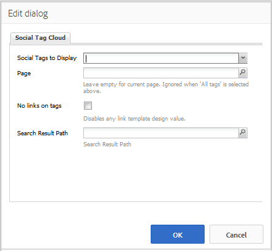

# Using Social Tag Cloud {#using-social-tag-cloud}

## Introduction {#introduction}

The `Social Tag Cloud` component highlights tags applied by community members when posting content. It is a means of identifying trending topics and allowing site visitors to quickly locate tagged content.

For another means of identifying current trends, visit [Activity Trends](trends.md).

This page documents the `Social Tag Cloud` component dialog settings and describes the user experience.

For detailed information for developers see [Tag Essentials](tag.md).

See [Administering Tags](../../help/sites-administering/tags.md) for information about creating and managing tags, as well as to which content tags have been applied.

## Adding a Social Tag Cloud {#adding-a-social-tag-cloud}

To add a `Social Tag Cloud` component to a page in author mode, use the component browser to locate `Communities / Social Tag Cloud` and drag it into place on a page where the tag cloud should appear.

For necessary information, visit [Communities Components Basics](basics.md).

When the [required client-side libraries](tag.md#essentials-for-client-side) are included, this is how the `Social Tag Cloud` component will appear:

## Configuring Social Tag Cloud {#configuring-social-tag-cloud}

Select the placed `Social Tag Cloud` component to access and select the `Configure` icon which opens the edit dialog.

Under the **[!UICONTROL Social Tag Cloud]** tab, specify which tags to display and, if the tags are active links, the location of the page for search results:

* **[!UICONTROL Social Tags to Display]**
  Identify which UGC tags to display. The pull-down options are:

  * `From page and child pages`
  * `All tags`

  The default is `From page and child pages`, where "page" refers to the **Page** setting below.

* **[!UICONTROL Page]**
  
  (Required if not `All tags)` The path to the UGC for a page. Default is the current page if left blank.

* **[!UICONTROL No links on tags]**
  
  If checked, the tags are displayed in the tag cloud as plain text. If unchecked, the tags are displayed as active links which search on all content to which that tag is applied. Default is unchecked and requires the **[!UICONTROL Search Result Path]** to be set.

* **[!UICONTROL Search Result Path]**
  
  The path to a page on which a `Search Result` component has been placed, configured to reference UGC which includes the UGC path specified by the **Page** setting.

## Change Display of Social Tag Cloud {#change-display-of-social-tag-cloud}

To edit the display of the **Social Tag Cloud**, enter [Design Mode](../../help/sites-authoring/default-components-designmode.md) and double-click on the placed `Social Tag Cloud` component to open a dialog with an additional tab.

Using the **[!UICONTROL Social Tag Cloud (Design)]** tab, specify how tags are displayed. A tag may be a simple tag, a single word in the default namespace, or a hierarchical taxonomy:

* **[!UICONTROL Show full title paths]**
  
  If checked, shows the titles for the parent tags and namespace for each applied tag.

  For example:

  * Checked: `Geometrixx Media: Gadgets / Cars`
  * Unchecked: `Cars`

  There is no difference for a simple tag.

  Default is unchecked.

* **[!UICONTROL Show only leaf tags]**
  
  If checked, shows only applied tags which contain no other tags.

  For example, given the TagID of:

  `Geometrixx Media: Gadgets / Cars`

  There are 3 tags which can be applied: 
  
  `Geometrixx Media (the namespace)`, `Gadgets`, and `Cars`

  * Checked: Only `Cars` will display, if applied.
  * Unchecked: `Geometrixx Media` and `Gadgets`as well as `Cars` will display, if applied.

  A simple tag is a leaf tag.

  Default is unchecked.

* **[!UICONTROL Link Template]**
  
  A template, other than a default, used to display the links in a tag cloud, when links are enabled through the component edit dialog.

* **[!UICONTROL Same size for all tags]**
  
  If checked, all words in the tag cloud are styled the same. If unchecked, words are styled differently according to their usage. Default is unchecked.

## Additional Information {#additional-information}

More information may be found on the [Tag Essentials](tag.md) page for developers.

See [Tagging User Generated Content](tag-ugc.md) (UGC) for information about creating and managing tags.
