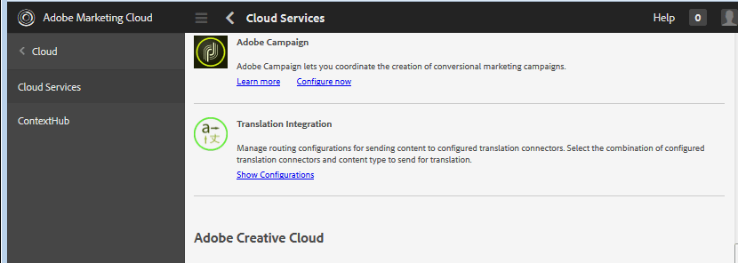
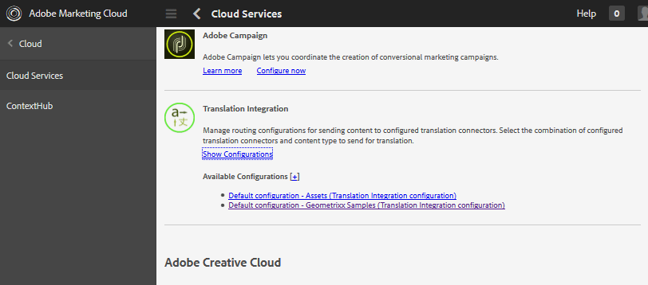
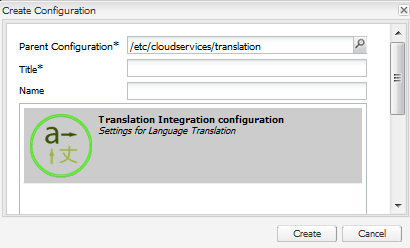
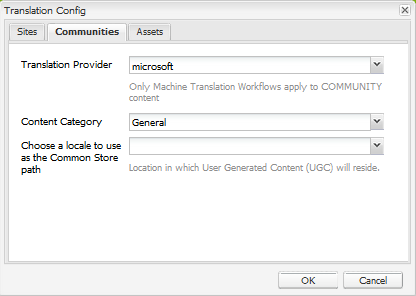
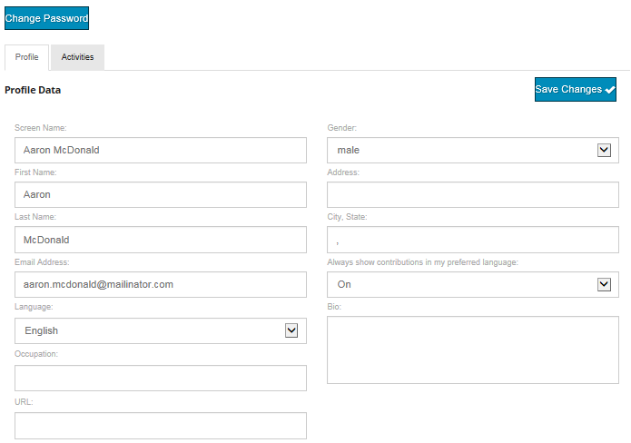

# Translating User-Generated Content {#translating-user-generated-content}

The translation feature for Adobe Experience Manager (AEM) Communities extends the concept of [translating page content](../../help/sites-administering/translation.md) to the user-generated content (UGC) posted to community sites using [social component framework (SCF) components](scf.md).

The translation of UGC enables site visitors and members to experience a global community by removing language barriers.

As an example, suppose:

* A member from France posts a recipe in French to the community forum of a multinational cooking website.
* Another member from Japan uses the translation feature to trigger the translation of the recipe from French into Japanese.
* After reading the recipe in Japanese, the member from Japan then posts a comment in Japanese.
* The member from France uses the translation feature to translate the Japanese comment into French.
* Global communication.

## Overview {#overview}

This section specifically discusses how the translation service works with UGC. It also assumes that you have an understanding of how to connect AEM to a [translation service provider](../../help/sites-administering/translation.md#connectingtoatranslationserviceprovider) and integrate that service into a website by configuring a [translation integration framework](../../help/sites-administering/tc-tic.md).

When a translation service provider is associated with the site, each language copy of the site maintains its own threads of UGC posted through SCF components such as comments.

When a translation integration is configured in addition to the translation service provider, it is possible for each language copy of the site to share a single thread of UGC, providing global communication across language copies. Instead of a discussion thread segregated by language, the configured [global shared store](#global-translation-of-ugc) enables the entire thread to be visible regardless from which language copy it is being viewed. Further, multiple translation integration configurations can be configured specifying different global shared stores for a logical grouping of global participants, such as by regions.

## The Default Translation Service {#the-default-translation-service}

AEM Communities includes a [trial license](../../help/sites-administering/tc-msconf.md#microsoft-translator-trial-license) for a [default translation service](../../help/sites-administering/tc-msconf.md) enabled for several languages.

When [creating a community site](sites-console.md), the default translation service is enabled when `Allow Machine Translation` is checked from the [TRANSLATION](sites-console.md#translation) subpanel.

>[!CAUTION]
>
>The default translation service is for demonstration only.
>
>For a production system, a licensed translation service is required. If not licensed, the default translation service should be [turned off](../../help/sites-administering/tc-msconf.md#microsoft-translator-trial-license-geometrixx-outdoors).

## Global Translation of UGC {#global-translation-of-ugc}

When a website has multiple [language copies](../../help/sites-administering/tc-prep.md), the default translation service does not recognize that UGC entered on one site may be related to UGC entered on another. This is true when the UGC is generated by the same component (the language copy of the page containing the component).

It is similar to groups of people discussing a topic. They are unaware of comments that are made in groups other than their own, as compared to everyone in a large group participating in one conversation.

If "one group conversation" is desired, it is possible to enable global translation across a website with multiple language copies, such that the entire thread is visible regardless from which language copy it is being viewed.

For example, if a forum was established on the base site, language copies created, and global translation was enabled, a topic posted to the forum made in one language copy would appear in all language copies. The same would be true for any replies, regardless of from which language copy the reply was entered. The result would be that the topic and its entire thread of replies would be visible regardless of from which language copy the topic is being viewed.

>[!CAUTION]
>
>Any UGC that existed before global translation is no longer visible.
>
>While the UGC is still in the [common store](working-with-srp.md), it is located under the language-specific UGC location, while new content, added after global translation was configured, is being retrieved from the global shared store location.
>
>There is no migration tool for moving or merging language-specific content into the global shared store.

### Translation Integration Configuration {#translation-integration-configuration}

To create a Translation Integration, which integrates a Translation Service connector with the web site on the author instance:

* Sign in as an administrator
* From the [main menu](http://localhost:4502/)
* Select **[!UICONTROL Tools]**
* Select **[!UICONTROL Operations]**
* Select **[!UICONTROL Cloud]**
* Select **[!UICONTROL Cloud Services]**
* Scroll down to **[!UICONTROL Translation Integration]**

  

* Select **[!UICONTROL Show Configurations]**

  

* Select `[+]` icon next to **[!UICONTROL Available Configurations]** so you can create a configuration.

#### Create Configuration Dialog {#create-configuration-dialog}

* **[!UICONTROL Parent Configuration]**
  
  (Required) Typically leave as default. Default is `/etc/cloudservices/translation`.

* **[!UICONTROL Title]**
  
  (Required) Enter a display title of your choosing. No default value.

* **[!UICONTROL Name]**
  
  (Optional) Enter a name for the configuration. Default is a node name based on the Title.

* Select **[!UICONTROL Create]**

#### Translation Config Dialog {#translation-config-dialog}

For detailed instructions, see [Creating a Translation Integration Configuration](../../help/sites-administering/tc-tic.md#creating-a-translation-integration-configuration).

* **[!UICONTROL Sites]** tab: can leave as defaults.

* **[!UICONTROL Communities]** tab:
  * **[!UICONTROL Translation Provider]**
    Select the translation provider from the drop-down list. Default is `microsoft`, the trial service.

  * **[!UICONTROL Content Category]**
    Select a category that describes the content being translated. Default is `General.`

  * **[!UICONTROL Choose A Locale...]**
    (Optional) By selecting a locale for storing UGC, posts from all language copies appear in one global conversation. By convention, choose the locale for the [base language](sites-console.md#translation) for the website. Choosing `No Common Store` disables global translation. By default, global translation is disabled.

* **[!UICONTROL Assets]** tab: can leave as defaults.
* Select **[!UICONTROL OK]**

#### Activation {#activation}

The new translation integration cloud service must be activated to the Publish environment. When associated with a web site, if not yet activated, the activation workflow prompts to publish this cloud service configuration when the page with which it is associated is published.

## Managing Translation Settings {#managing-translation-settings}

>[!NOTE]
>
>**Preferred Language**
>
>When detecting whether the post is in a language different from the preferred language, the preferred language of the site visitor must be established.
>
>The preferred language is the language preference set in a user's profile, when the site visitor is signed in and has specified a language preference.
>
>When the site visitor is anonymous or has not specified a language preference in their profile, the preferred language is the base language of the page template.

### User Preference {#user-preference}

#### User Profile {#user-profile}

All Communities Sites provide a user profile that signed-in members can edit to identify themselves to the community and to set their preferences.

One such setting is whether to always display community content in their preferred language. By default, the setting is not set and defaults to the system setting. The user can change the setting to either On or Off to override the system setting.

When pages are automatically translated into the user's preferred language, the UI for showing the original text and improving the translation are still made available.

### Community Site Setting {#community-site-setting}

When a Community Site is created, the translation option can be enabled and configured. The translation setting is in effect for content anonymous site visitors may view, but is overridden by the user's profile setting.
