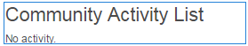

# Activity Trends {#activity-trends}

## Introduction {#introduction}

The `Community Activity List` component lets you add trending information regarding posts and views by members and posts and views of content.

The document describes:

* Adding the `Community Activity List` component to a [community site](/help/communities/overview.md#community-sites).

* Configuration settings for the `Community Activity List` component.

### Requirement {#requirement}

Data for the `Community Activity List` is only available when Adobe Analytics is licensed and configured for the community site.

See [Analytics Configuration for Communities Features](/help/communities/analytics.md).

### Adding a Community Activity List to a Page {#adding-a-community-activity-list-to-a-page}

To add a `Community Activity List` component to a page in author mode, locate the component `Communities / Community Activity List` and drag it into place on a page.

For necessary information, visit [Communities Components Basics](/help/communities/basics.md).

When first placed on a page of a community site, this is how the component appears:

### Configuring Community Activity List  {#configuring-community-activity-list}

Select the placed `Community Activity List` component, then select the `Configure` icon so you can open the edit dialog box.

Under the **Comments** tab, specify if and how comments for uploaded files appear:

* **Type**

  Specify whether to display data regarding community members or user-generated content (UGC).

  Select from:

    * `Members`
    * `Content`

  Default is `Members`.

* **Display title**

  A descriptive title to display above the data, such as `Trending Content`.
  Default is no title.

* **Display count**

  The number of items to list.
  The default is 10.

* **Activity type**

  Select one of:

    * `Views`(page visits)
    * `Posts`(creating UGC)
    * `Follows`
    * `Likes`

  The default is Views.

* **Time period**

  Select one of:

    * `Last 24 hours`
    * `Last 7 days`
    * `Last 30 days`
    * `Last 90 days`
    * `This year (since Jan 1)`
    * `Total`

  Default is `Total`.

* **Context path**

  This lets you scope the activity to a subset of the site, such as a specific Blog.
  Default is the entire community site.

* **Member count aggregation**

  When deselected (turned off), only top-level posts are counted. For example, if the context is the root page (the default), then an `Activity Type` of `Posts` never shows any activity as there is no ability to post content to the root page. When checked, the counts on all descendant pages are included.
  Default is checked.

### Example Page with four Components {#example-page-with-components}

**Top Visitors** config: Type = Members, Activity type = Views

**Top Contributors** config: Type = Members, Activity type = Posts

**Top Content** config: Type = Content, Activity type = Views,

**Trending Content** config: Type = Content, Activity type = Posts

